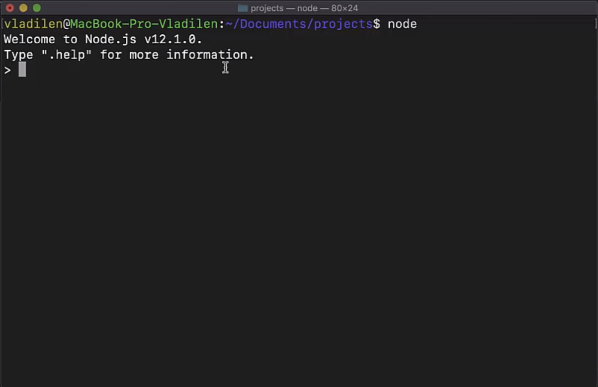
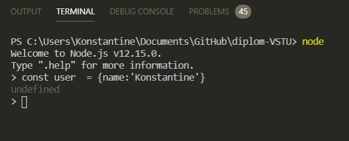
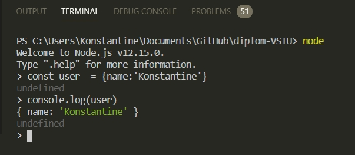
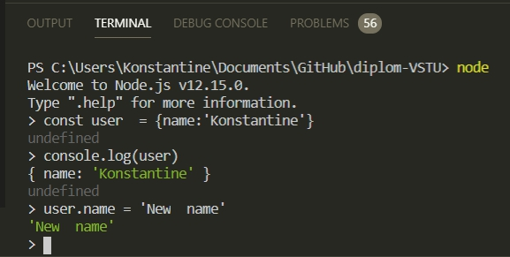
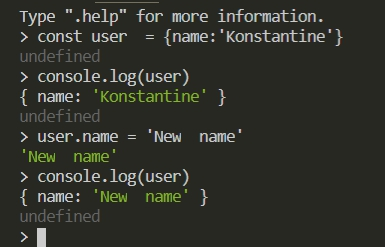
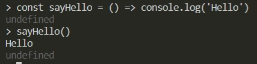

# Первый скрипт

Теперь посмотрим на возможности NodeJS. 

В консоле я могу написать 

```
node
```

После меня приветствует конструктор NodeJS в котором я могу написать help



Я могу вписывать в консоль что -то и NodeJS будет как -то реагировать. Самый класический пример 


В консоле я сейчас нахожусь в режиме разработки на NodeJS. И если в JS написать 1 + 2 то я получу 3.

Если написать такую конструкцию

```js
const user  = {name:'Konstantine'}
```

яполучаю undefined



но если я выведу это в консоль 

```js
console.log(user)
```


а если я задам 

```js
user.name = 'New  name'
```



В консоле я пишу на языке JS.

и если выведу в консоль то получу совсе другое значение

```js
console.log(user)
```



По сути в этом и есть весь NodeJS. Я делаю все тоже сомое однако работаю немного в другом пространстве.

Т.к. NodeJS работает не в браузере, а на отдельной платформе, причем платформа всегда одинаковая, мне не нужно думать о различных Bable который будет транспилить JS в старый формат. Я могу смело использовать самые последние фишки JS и ни как их не транслировать. 
Проблема в том что у всех разные браузеры. Не все браузеры понимают ES6 синтаксис. В NodeJS такой проблемы нет. Я могу сразу использовать все последние фишки и он все будет понимать т.к. это не браузер, а платформа которая ничего не транспилит.
Создаю и вызываю стрелочную функцию в консоли. 

```js
const sayHello = () => console.log('Hello')

sayHello() // вызываю функцию
```


B для того что бы перейти в обчную консоль ввожу

```js
.exit
```

