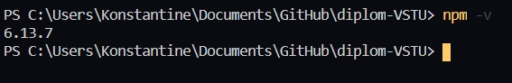
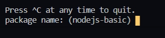
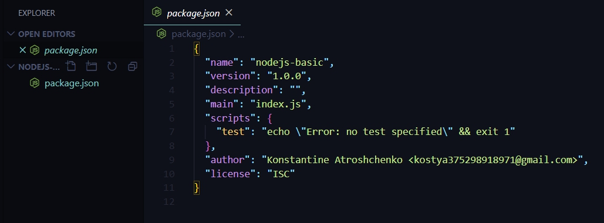
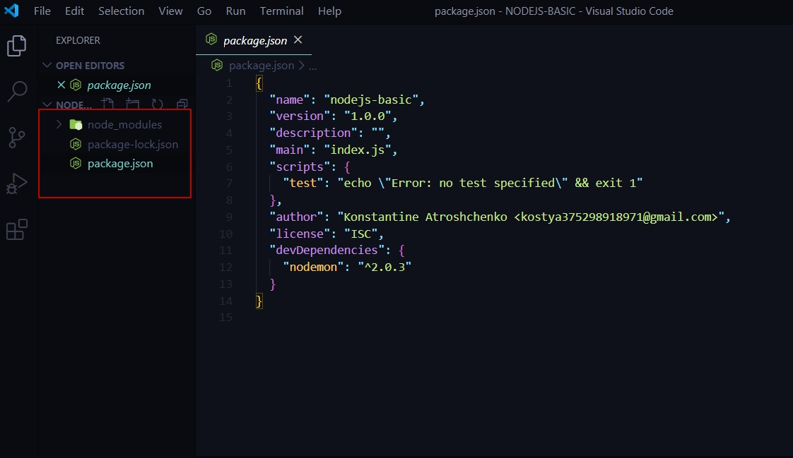

# NPM 

Для начала потребуется выучить один очень важный концепт **npm**. **NPM** это дополнительный инстумент который идет в комплекте с NodeJS и который служит для менеджмента различных модулей в наших программах. Приложения **NodeJS** начинаются с данного инструмента.

Разберем с как выглядит проект. С чего мы начинаем? создаю папку **NODEJS-BASICS**.

Любое приложение на NodeJS начинается с инициализации. Что можно сделать с помощью пакетного менеджера **npm**.

Сначала убеждаюсь что данный пакет у меня стоит

```
npm -v
```


Если же ничего не выдает то нужно заново поставить **NodeJS** и убедиться что стоит галочка которая указывает на то что нужно установить менеджер пакетов **npm**.


Для того что бы проинициализировать приложение нужно создать некоторый файл в котором я буду вести записи.

Для этого ввожу команду

```js
npm init
```

После нажатия Enter терминал мне предлагает некоторый интерактив где я должен выбрать некоторые названия. 

В первую очередь необходимо прописать название пакета. По умолчанию npm берет название пакета от названия папки где храниться приложение.



вводим свое название или оставляем по умолчанию.

Следующим шагом нужно указать версию пакета Просто нажимаю Enter.

Далее Предлагается ввести **description** данного приложения.

Следующий пункт, **entry point**, спрашивает какой у нас входной файл в приложение. По умолчанию это **index.js**. По -сути это нужно для каких либо библиотек т.е. если мы допустим делаем приложение на **NodeJS** которая является библиотекой. Там очень важно писать главное название. По - сути я оставляю как есть.

Далее предлагается ввести тестовую команду **test comand**. Чуть позже мы разберем что это такое. Пока оставляю по умолчанию.

Далее предлагается ввесть **git repository**.

В поле **keywords** я могу ввести какие - то ключевые слова которые относятся к пакету.

После **npm** спрашивает кто является **author** данного пакета. Обычно это выглядит  так.

```
author: Konstantine Atroshchenko <kostya375298918971@gmail.com>

```

Далее лицензию обычно оставляют по умолчанию **"license":"ISC"**

B далее у меня спрашивают. Все ли хорошо. Если да то жму enter.

В приложении появляется файл **package.json**. Этот файл хранит информацию о том приложении которое я разрабатываю.



Теперь этот файл я могу использовать для того что бы вести список зависимостей моего приложения.
И для этого я устанавливаю дополнительный пакет который в последствии я буду использовать.

для того что бы установить дополнительный пакет я так же обращаюсь к консоли

```
npm install nodemon -D

```

через npm обращаюсь к пакетному менеджеру. Командой **install** указываю что нужно установить.** nodemon** пакет который нужно установить. Флаг **-D** указывает в какую зависимость нужно установить.

После происходит определенный процесс загрузки пакета т.е. за кулисами происходит следующее: пакетный менеджер **npm **видит название nodemon, после этого он идет на определенный сайт [npmjs.com](https://www.npmjs.com/). Находит zip архив который ему потребуется. После он его скачивает. Внутри приложения он его расскрывает и после этого получаю определенный результат.

Теперь в приложении есть три сущности.



Появился файл **package-lock.json** и появилась папка **node_modules**.

В файле **package.json** появилась новое поле которое называется **devDepenencies**. **Depenencies** - переводится как зависимости. В данном объекте храняться те зависимости которые я импользую для разработки приложения. Одна из зависимостей это пакет **nodemon** и версия пакета описана как значение данного объекта.

Структура файлов и папок.

**package-lock.json** данный файл является системным. Мы его не модифицируем ни как. Он служит для определенной оптимизации и для корректной работы различных пакетов. Потому что если мы расскроем папку **node-modules** то в ней мы увидим огромное количество пакетов котоые в свою очередь являются зависимостями для тех пакетов которые мы ставим. и **package-lock.json** как раз ведет список разных зависимостей где он описывает их версии, с чем они совместимы и т.д.

Папка **node_modules**. Здесь храняться библиотеки которые мы ставим для приложения. Но я же установил только одну библиотеку. 

Если посмотреть внимательнее. Раскроем папку **nodemon**. Здесь так же есть файл **package.json**. Если мы его расскроем. Этот **package.json** относится уже к **nodemon**. В нем есть два поля **devDependencies** и  **dependencies**. Т.е. здесь обозначены списки тех зависимостей от которых зависит пакет **nodemon**. И возможно у этих зависимостей есть свои зависимости. Так вот npm помимо того что он установил nodemon он еще установил еще и ве зависимости для данного пакета.

Каждый раз таскать с собой **node_modules** это не очень удобно. 

У нас есть **package.json** который говорит какие приложения нужны для нашего приложения. И если мы возьмем папку **node_modules** и просто ее удаляем. Естественно наше приложение не запустится.

Но если мы передадим наши файлы заказчику. Он набирает в консоли 

```
npm install
```

после этого **package.json** будет расспарсен пакетным менеджером, который в свою очередь скачает все необходимые зависимости.
