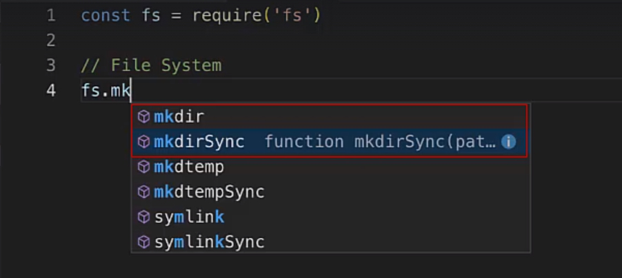
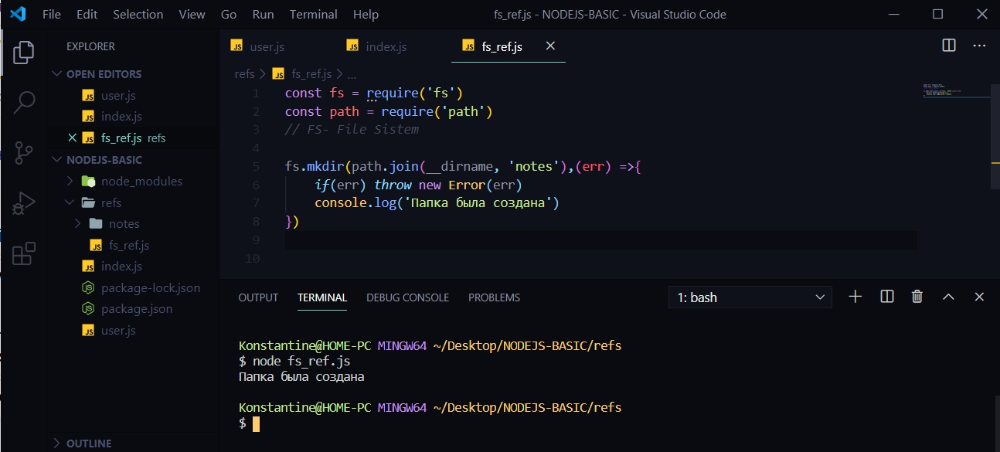
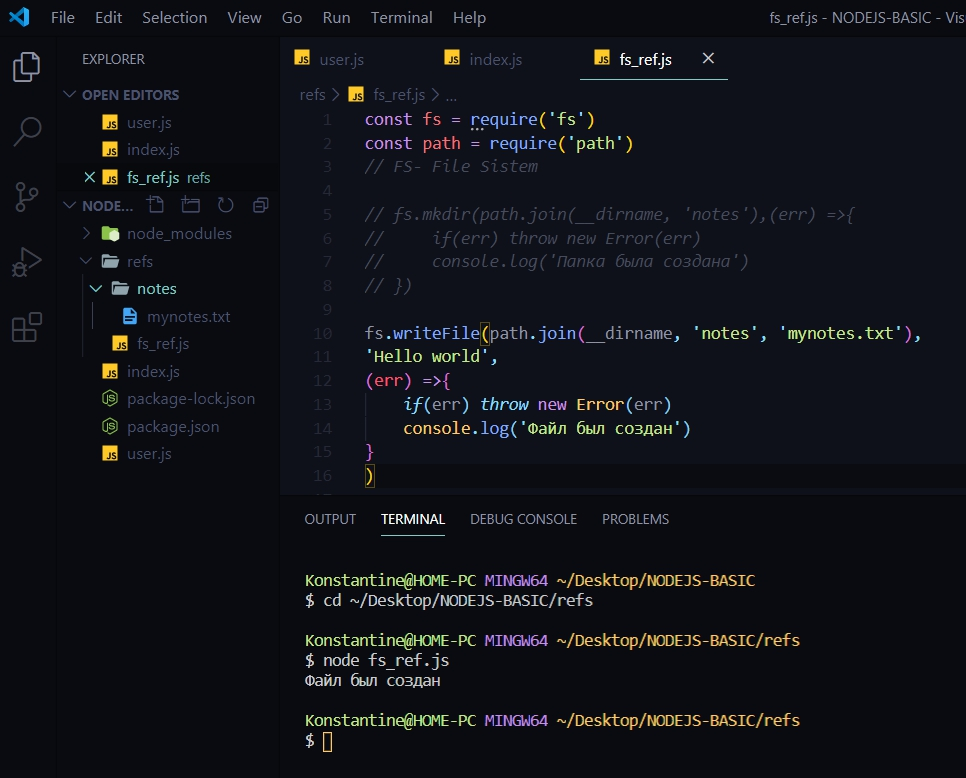
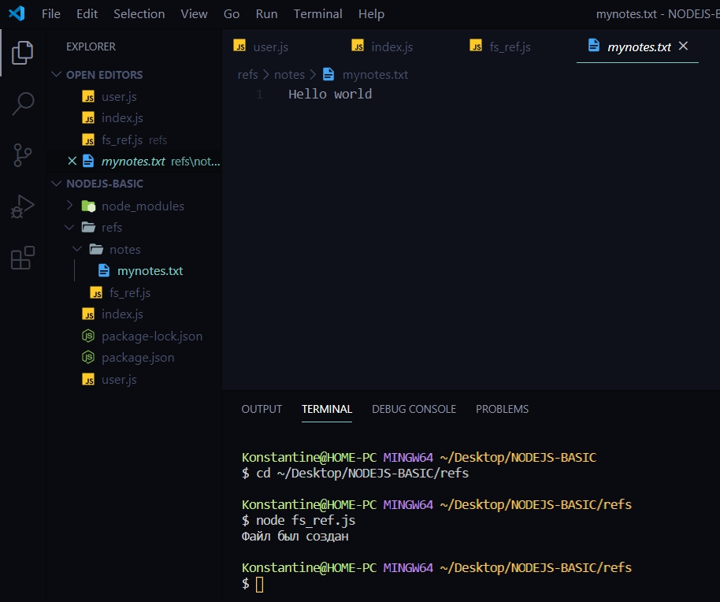
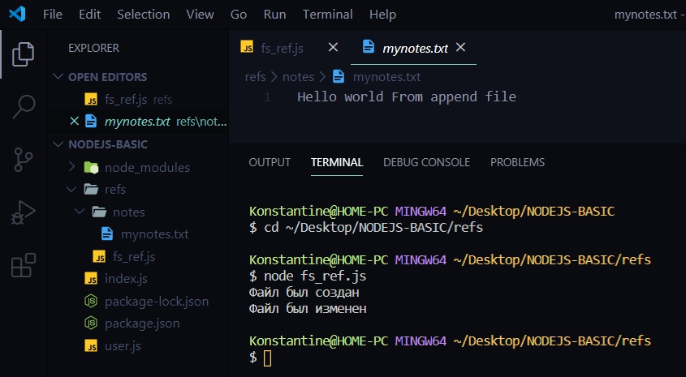
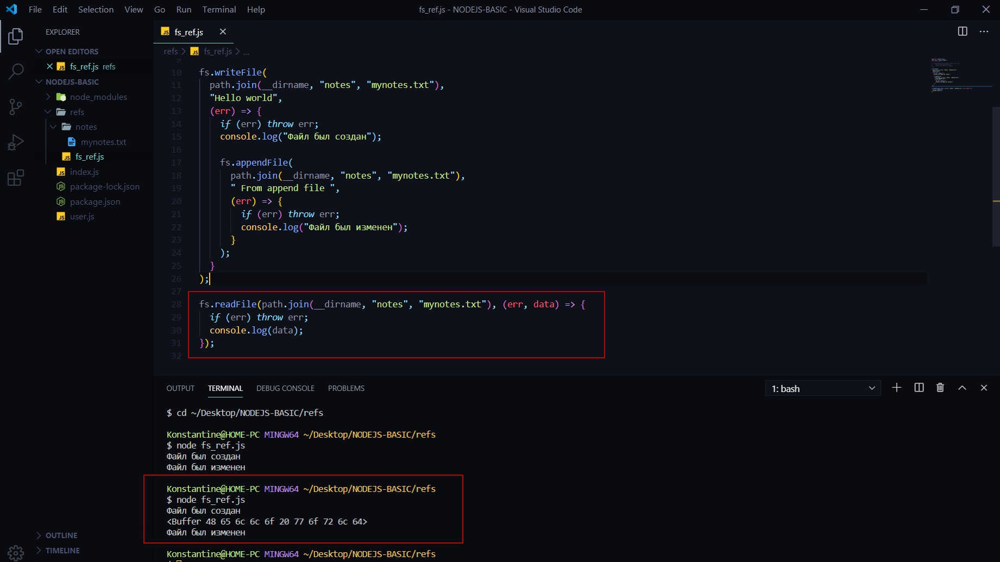
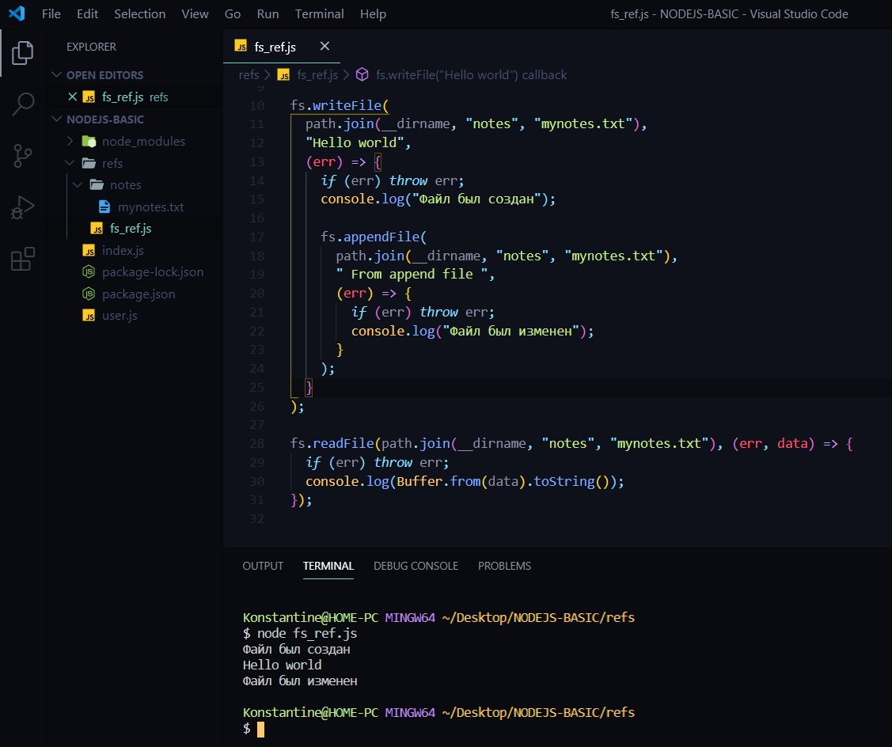
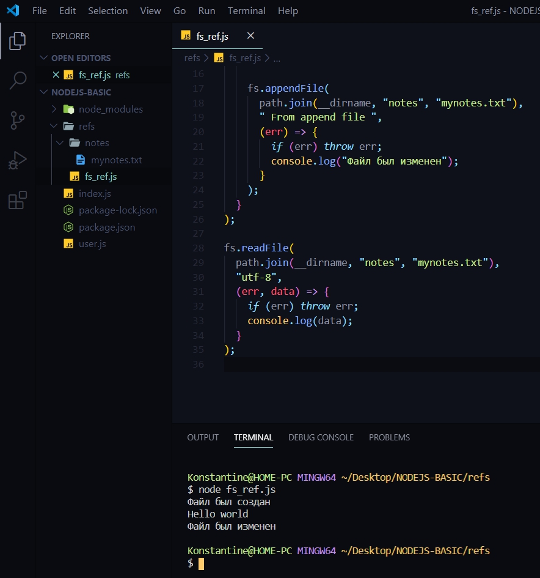
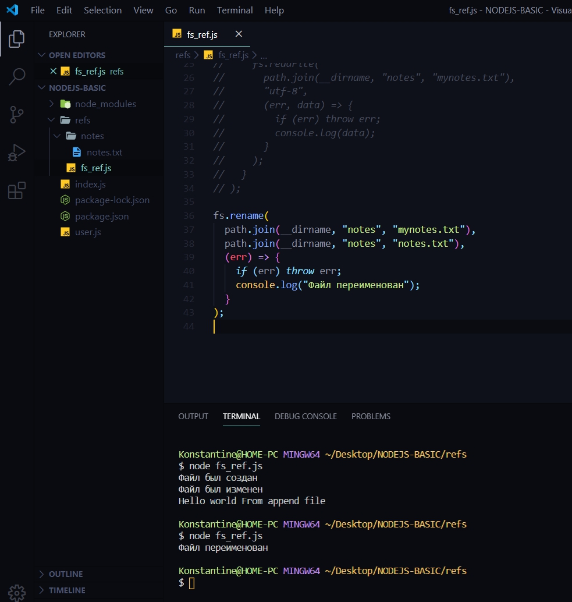

# Модуль FS

[Документация](https://nodejs.org/docs/latest-v12.x/api/)

Этот модуль служит для того что бы работать с файлами и папками. 
Создаю папку **refs** и в ней создаю файл  **fs_ref.js** 
Дале подключаю модуль 

```js
const fs = require('fs')
//FS-File Sistem

````

Для начало необходимо понять тот концепт по которому работает **fs**.
Есть **синхронные** методы и есть **асинхронные** методы.

Рассмотрим на примере создания папки. Для того что бы создать папку я пишу **fs**. и выбираю метод 



И как видно VS Code подсказывает два метода. **mkdir** и **mkdirSync**. 
Если же я хочу создать файл то я делаю это с помошью метода **writeFile** иди **writeFileSync**.

На самом деле рекомендуется всегда вызывать асинхронные методы т.е. **mkdir**. Все дело в том что асинхронные методы не блокируют поток. И допустим если создается большой файл, и если он создается асинхронно то тогда NodeJS просто остановит свое выполнение и будет ждать пока запишеться этот огромный файл. А если файл будет **100mb**? То NodeJS будет **100 mb** записывать и при этом ничего не делать.
Так вот для того что бы такого не происходило я буду пользоваться асинхронными методами. Это все хорошо работает благодаря **EventLoop** (цикл событий).

В функцию  **mkdir** я передаю следующие параметры. Мы работаем с путями т.е. сначала я прописываю определенный путь который я хочу определить. И для того что бы работать с путями есть другой модуль который называется **path**(путь).

```js
const fs = require('fs')
const path = require('path')
// FS- File Sistem

fs.mkdir(path.join(__dirname, 'notes'),(err) =>{
    if(err) throw new Error(err)
    console.log('Папка была создана')
})


```
В параметрах **mkdir** указываю path. его метод **join**(присоеденяться) в параметрах join указываю что я обращаюсь к текущей папке **__dirname**.И предположим что я в папке **refs** хочу создать новую папку которую назову **notes**. Вторым параметром в данный метод я принимаю **callback**(обратный вызов) функцию и определяю ее как стрелочную функцию.
В NodeJS есть определенная конвенция. Всегда первый параметр это ошибка в функции **err** и если у нас один параметр то я могу не заключать его в скобки.
В теле **callback** функции пишу цикл. Проверяю если есть какая - то ошибка то с помощью **throw** я выкидываю эту ошибку **if(err) throw new Error(err)**.
Но если ни какой ошибки не будет и функция будет выполнена корректно то тогда ошибка просто будет равняться **null** и тогда этот **if** не пройдет. 
Ошибки в NodeJs обрабатываются именно таким образом.

И в случае если нет ни какой ошибки то например в консоли можем написать **console.log('Папка была создана')**. В консоли перехожу в папку **refs** и с помощью команды **node fs_refs.js.**



Таким образом я создаю папки. При этом если я сейчас заново попробую запустить данный файл то увидим ошибку. Проблема в том что такая папка уже существует.

Помимо создания папок я могу создавать файлы. Для этого так же обращаюсь к модулю **fs** и его методу **writeFile()** В параметрах как обычно обращаюсь к модулю **path** его  методу **join** где первым параметром указываю путь до папки **__dirname**, далее меня интересует папка **notes** и файл называю **mynoyts.txt**. 

Вторым параметром в данную функцию я передаю определенный контент который я хочу записать в данный файл.

```js
const fs = require('fs')
const path = require('path')

fs.writeFile(path.join(__dirname, 'notes', 'mynotes.txt'),
'Hello world',
(err) =>{
    if(err) throw new Error(err)
    console.log('Файл был создан')
}
)
```
Третьим параметром передею **callback** функцию в которой так же первым параметром принимаю некоторую ошибку. Вслучае если у нас есть какая - то ошибка то  с помощью оператора **throw** выведется ошибка. А если ошибки нет то можно написать в консоли что -то.





При повторном запуске ошибку не выдаст. Контент как был так и остался.

По аналогии метода**writeFile** присутствует и другой файл позволяющий не просто затереть все содержимое данного файла **mynotes.txt**, но и добавить новый контент.
Для этого в **callback** функции создаю еще одну функцию файловой системы **fs** и обращаюсь к его методу **appendFile**(добавить файл) где так же указываю путь к файлу который я хочу проапдейтить
**fs.writeFile(path.join(__dirname, 'notes', 'mynotes.txt')**. Вторым параметром указываю строковый формат в ктором указываю новый контент который я хочу добавить к уже существующему **'From append file'**. и третьим параметром так же создаю **callback** функцию в которой получаю некоторую ошибку которую можно обработать.

```js
const fs = require("fs");
const path = require("path");
// FS- File Sistem

// fs.mkdir(path.join(__dirname, 'notes'),(err) =>{
//     if(err) throw new Error(err)
//     console.log('Папка была создана')
// })

fs.writeFile(
  path.join(__dirname, "notes", "mynotes.txt"),
  "Hello world",
  (err) => {
    if (err) throw err;
    console.log("Файл был создан");

    fs.appendFile(
      path.join(__dirname, "notes", "mynotes.txt"),
      " From append file ",
      (err) => {
        if (err) throw err;
        console.log("Файл был изменен");
      }
    );
  }
);


```

Запускаю скрипт **node fs_ref.js**.




Считывание файлов.

Для ютого так же присутствует два метода fs -это readFile и readFileSync. но безусловно я буду использовать метод readFile.

Первым параметром я передаю путь к файлу который я хочу считать **path.join(__dirname, "notes", "mynotes.txt")**. Далее передаю **callback** функцию и первым параметром принимаю ошибку если она есть, и есть второй параметр **data** т.е. ту **data**  которую я получу при чтении файлов. Далее как обычно обрабатываю ошибку. И в консоль вывожу **data**.

```js

const fs = require("fs");
const path = require("path");
// FS- File Sistem

// fs.mkdir(path.join(__dirname, 'notes'),(err) =>{
//     if(err) throw new Error(err)
//     console.log('Папка была создана')
// })

fs.writeFile(
  path.join(__dirname, "notes", "mynotes.txt"),
  "Hello world",
  (err) => {
    if (err) throw err;
    console.log("Файл был создан");

    fs.appendFile(
      path.join(__dirname, "notes", "mynotes.txt"),
      " From append file ",
      (err) => {
        if (err) throw err;
        console.log("Файл был изменен");
      }
    );
  }
);

fs.readFile(path.join(__dirname, "notes", "mynotes.txt"), (err, data) => {
  if (err) throw err;
  console.log(data);
});


```

После запуска скрипта можно увидеть интересную картиную



Все дело в том что сначало файл был создан. После появляется сообщение **Buffer** и только после этого файл был изменен.

Мы видим что методы у нас работаю асинхронно т.е. метод **append** выполнился после того как файл был прочитан. Поэтому скорее всего получим сообщение **Hello world** т.к. все работает асинхронно.

Т.е. Если мы хотим что бы это все работало синхронно и мы прочитали файл то **readFile**  я должен вызвать в **callback** **appendFile**.

**Что же такое Buffer?**

На самом деле все логично. Для того что бы оптимизировать чтение разичных файлов NodeJS он использует концепт**Buffer**. Т.е. Предположим что у нас есть какой-то очень большой файл то мы будем считывать его по кусочкам для того что бы у нас программа работала более быстро. И поэтому мы некоторые части складываем вот в такие буферы

> <Buffer 48 65 6c 6c 6f 20 77 6f 72 6c 64>

Но что же делать Для того что бы получить определенный результат а не **Buffer**?

Есть два варианта.
1. Формировать данный буффер самостоятельно т.е. переводить его к строке. Для этого я могу обратиться к глобальному классу **Buffer** в NodeJS и далее вызвать у него метод который называется from и в параметре указать то что считываем т.е. из поля **data**. Далее данный буффер c помощью метода **toString** привожу данный метод к строке.

```js
fs.readFile(path.join(__dirname, "notes", "mynotes.txt"), (err, data) => {
  if (err) throw err;
  console.log(Buffer.from(data).toString());
});
```




Однако есть более элегантный способ. В **console.log** я погу **оставить data**. B вторым параметром в метод **readFile** передать кодировку которую хотим считать.

```js
fs.readFile(
  path.join(__dirname, "notes", "mynotes.txt"),
  "utf-8",
  (err, data) => {
    if (err) throw err;
    console.log(data);
  }
);

```




И разберем как получить весь контент.

Подставляю метод **readFile** после выполнения **appendFile**.

```js
const fs = require("fs");
const path = require("path");
// FS- File Sistem

// fs.mkdir(path.join(__dirname, 'notes'),(err) =>{
//     if(err) throw new Error(err)
//     console.log('Папка была создана')
// })

fs.writeFile(
  path.join(__dirname, "notes", "mynotes.txt"),
  "Hello world",
  (err) => {
    if (err) throw err;
    console.log("Файл был создан");

    fs.appendFile(
      path.join(__dirname, "notes", "mynotes.txt"),
      " From append file ",
      (err) => {
        if (err) throw err;
        console.log("Файл был изменен");
      }
    );
    fs.readFile(
      path.join(__dirname, "notes", "mynotes.txt"),
      "utf-8",
      (err, data) => {
        if (err) throw err;
        console.log(data);
      }
    );
  }
);

```


Помимо этого присутствуют и другие методы. Допустим переименовывоть файлы с помощью функции **rename**. Весь прошлый скрипт комментирую во избежании ошибок.

Для того что бы переименовать так же обращаюсь к модуль **fs**. и вызываю метод **rename**. Далее передаю параметры. 
Первый параметр это путь до файла который я хочу изменить **path.join(__dirname, 'notes', 'mynotes.txt')**. 

Вторым параметром я передаю так же путь но уже с новым названием **path.join(__dirname, 'notes', 'notes.txt')**.
Ну и третьим параметром передаю **callback** которая будет вызвана когда функционал выполнится и в ней как обычно проверяю что если есть какая - то ошибка  то тогда с помощью оператора **throw** мы ее просто обработаем. Ну а если же все прошло хорошо то тогда в консоли выведу сообщение.

```js
fs.rename(
  path.join(__dirname, "notes", "mynotes.txt"),
  path.join(__dirname, "notes", "notes.txt"),
  (err) => {
    if (err) throw err;
    console.log("Файл переименован");
  }
);

```

