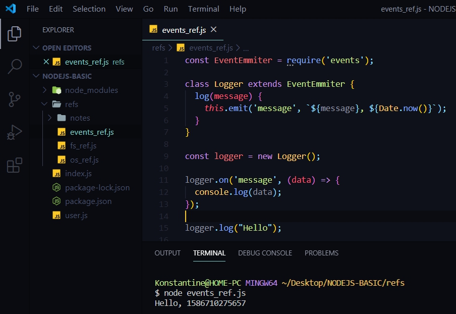
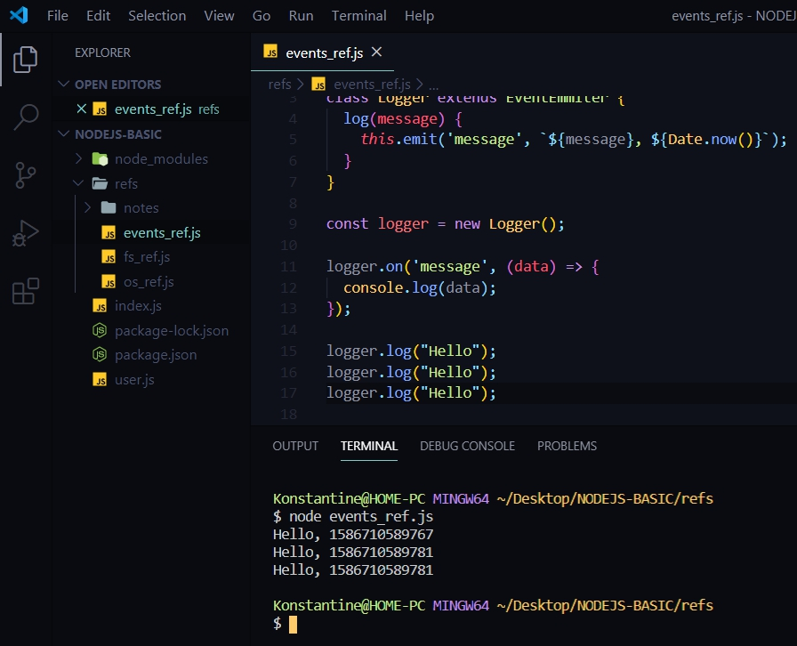

# Модуль EVENTS

Этот модуль очень важно понимать. Он позволяет работать и добавлять **Event emit-еры** к приложению. Когда будем работать с сервером очень важен будет данный концепт.

Создаю файл **events_ref.js**. Создаю переменную **EventEmmiter** и с помощью функции **require** я подключу стандартный модуль **events**.

```js
const EventEmmiter = require('events')

```

**_Что такое EventEmmiter в JS?_**  Потому что на самом деле этот концепт относится в принципе к JS а не только к NodeJS.

По сути мы можем наследоваться от данного класс **EventEmmiter**, который нам добавляет функционал эмитить или прослушивать определенные события в асинхронном естественно режиме.

Пример.

```js
const EventEmmiter = require('events');

class Logger extends EventEmmiter{
    
}

```

Созданный класс **Logger** наследуется от **EventEmmiter**. Поле этого в классе **Logger** доступны два метода это метод **on** и метод **emit** (излучать).

т.е. допустим если я создам экземпляр класса **logger** c помощью ключевого слова **new Logger()** и у него есть метод который называется **emit** и  метод **on**.

```js
const EventEmmiter = require('events');

class Logger extends EventEmmiter{
    
}

const logger = new Logger()

logger.on()

```

Пока удаляю **logger.on()**.

Реализую **Logger**

Допустим у него есть метод **Log(){}**, И здесь я хочу принимать некоторое сообщение пишу в параметре **massege**. B в теле функции к **messege** добавляю текущую дату и после этого уже ее эмитить. 
В теле функции **Long** я обращаюсь к ключевому слову **this.** И так как наследование идет от класса **EventEmmiter** то нам доступен медод **emit** у ключевого слова **this.**

Первым параметром в **emit** передаю название того события которое хочу заэмитить. В данном случае **message**.
вторым параметром передаю данные которые хочу передать 

>**`${mesage}, ${Date.now()}`.**

```js
const EventEmmiter = require('events');

class Logger extends EventEmmiter {
  log(message) {
      this.emit('message', `${message}, ${Date.now()}`)
  }
}

const logger = new Logger();
```
Теперь есть экземпляр класса **logger** у которого реализован метод **log**. Помимо этого доступны так же методы **emit** и метод **on**.

Дальше для того что бы поставить прослушку события мы просто обращаемся к **logger** вызываю метод **on** и в параметрах указываю какое именно событие хочу слушать. В моем случае это событие **message**.
Вторым параметром принимаю **callback** функцию **data**. И в теле функции прописываю вывод в консоль **data**.

После обращаюсь к **logger** и вызываю у него метод **log** в параметры которого передаю сообщение **Hello**.

```js
const EventEmmiter = require('events');

class Logger extends EventEmmiter {
  log(message) {
    this.emit('message', `${message}, ${Date.now()}`);
  }
}

const logger = new Logger();

logger.on('message', (data) => {
  console.log("data");
});

logger.log("Hello");


```

Очень важно что бы прослушка событий была добавлена раньше

```js
// прослушка
logger.on('message', (data) => {
  console.log(data);
});

```

Чем  мы имитим определенные события
```js
// имитим
logger.log("Hello");
```

Потому что тогда мы не сможем их принять.

Полный файл

```js
const EventEmmiter = require('events');

class Logger extends EventEmmiter {
  log(message) {
    this.emit('message', `${message}, ${Date.now()}`);
  }
}

const logger = new Logger();

logger.on('message', (data) => {
  console.log(data);
});

logger.log("Hello");

```

**Запускаю файл node events_ref.js**




Если я выведу несколько раз в консоль, то сколько раз я выведу столько и получу сообщений



Это логично потому что каждый раз вызываю метод **log** мы вызываем метод **emit** куда добавляем
> `${message}, ${Date.now()}` 

эти данные. Ну а так как добавляется метод **emit**, то мы с помощью метода on сразуже принимаем это сообщение

```js
logger.on('message', (data) => {
  console.log(data);
});
```
И на самом деле это и есть тот базовый концепт **Event Emit-теров**. Посути здесь больше ничего не нужно знать, но нужно понимать что многие классы в **NodeJS** они являются наследниками от **Event Emit** и поэтому их можно эмитить и прослушивать определенные события.
