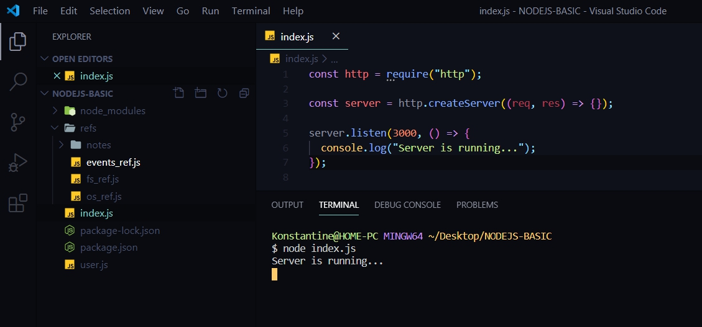
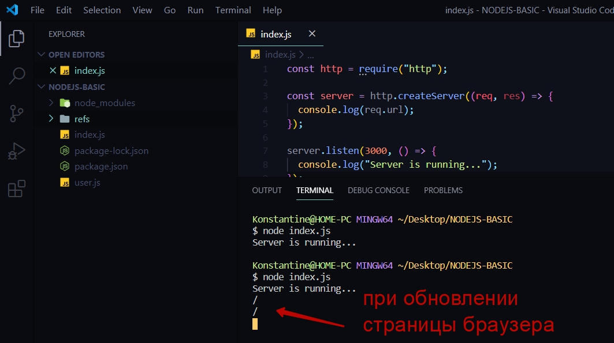
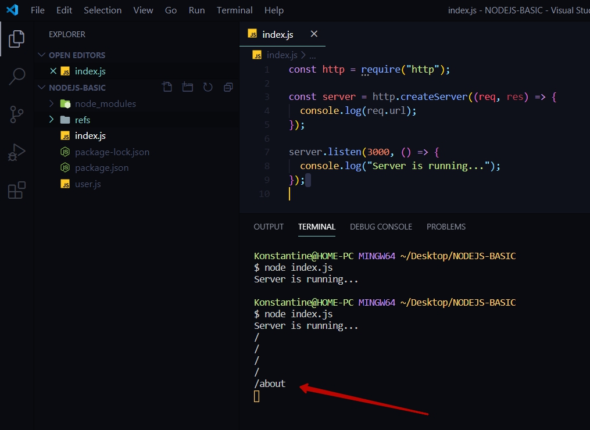
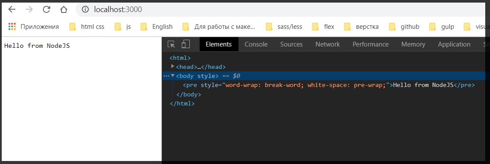
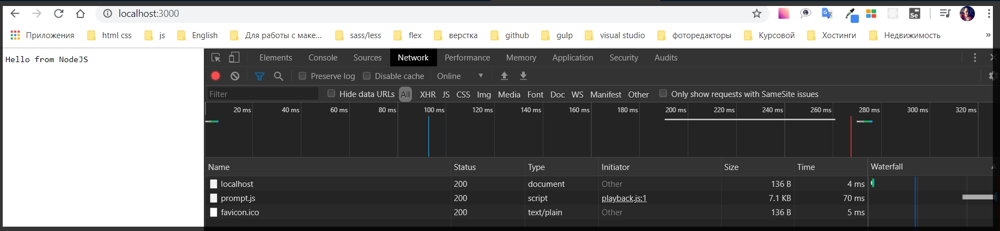
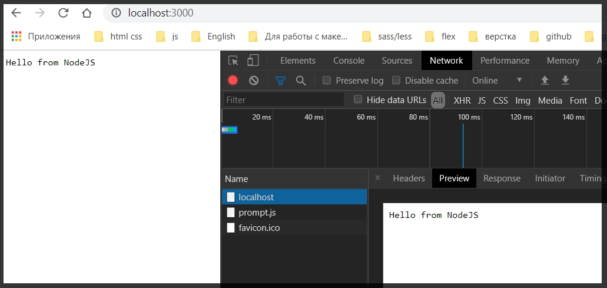
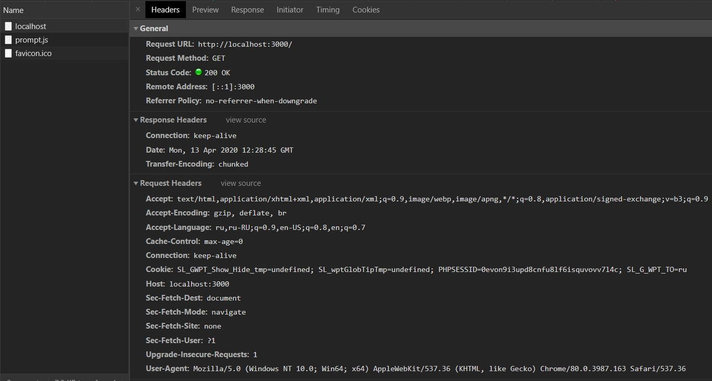
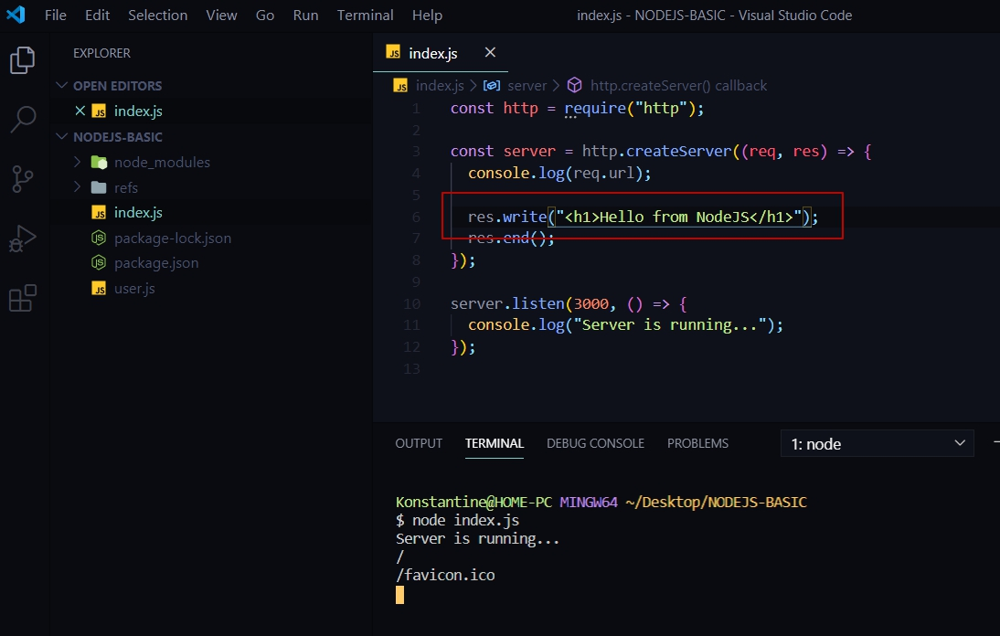
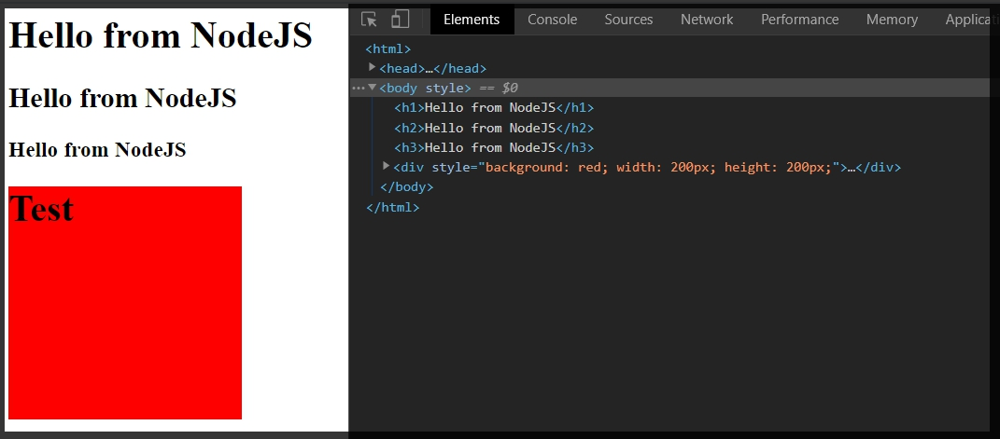

# Модуль HTTP

Этот модуль позволяет позволяет подключать свои **HTTP** сервера.

Разработку будем вести в корневом **index.js**. Я буду добовлять определенный функционал еще в нескольких следующих уроках.

**_Подключаю HTTP сервер._**

```js
const http = require("http");
// автоформатирование кода подставляет двойные кавычки если что  обращай на это внимание

```

>В php мы не создаем сервера. Мы просто писали какой - то серверный код и дальше с помощью Nginx или Apache запускали это все в браузере и все это работало.

В NodeJS происходит немного другая ситуация. Мы здесь сами должны создать и настроить определенные сервера для того что бы они работали. 
Как раз для этого и служит модуль **const http = require("http");**.

**Далее создаю сервер в переменную server**. И данная переменная она будет являться результатом работы функции **http** и у нее есть функция которая называется **createServer()**. В **createServer** я должен передать функцию  которая будет выполнена тогда когда будет происходить определенные запросы на сервер. Эта функция называется **handler**. Это **callback** функция принимает в себя два параметра это 
>**_request(запрос) сокращенно req, и responce(ответ) сокращенно res_**. Данные объекты отвечают за запрос на сервер и ответ с него.

```js
const http = require("http");

const server = http.createServer((req, res) =>{

})

```

Далее необходимо данный сервер запустить. 

Я обращаюсь к серверу и вызываю у него метод который называется **listen(слушать)**. Первым параметром я должен передать тот порт на котором я хочу запустить. **Порт 3000**. А вторым параметром я передаю **callback**  функцию которая будет выполнена тогда когда сервер будет запущен.

```js
const http = require("http");

const server = http.createServer((req, res) => {});

server.listen(3000, () => {
  console.log("Server is running...");
});

```

Теперь если я запущу данный файл с помощью команды **node index.js** то я увижу сообщение



Сервер запущен, но консоль как бы зависла. Консоль не завершила свое действие и при этом я в консоли ничего не могу делать. Но процесс который я запустил он висит и что - то ждет.

Если я в браузере попробую перейти на **localhost:3000** то у меня ничего не произойдет. Не происходит потому что в действительности я описал функцию **handler** а именно **(req, res) => {}**. Однако в теле этой функции ничего нет и по этому NodeJS просто не понимает что же ему делать. Но я могу убедиться что данная функция вызыватеся.** Например вывести в консоль запрос req и у него есть поле url**.

```js
const http = require("http");

const server = http.createServer((req, res) => {
  console.log(req.url);
});

server.listen(3000, () => {
  console.log("Server is running...");
});

```

Далее с помощью клавишь **Ctrl + C** Останавливаю процесс в консоли. И заново запускаю **index.js** и обновляю страницу **localhost** в браузере.



_После каждого обновления появляется слэш. Где слеш является тем url адресом на который мы запускаем._

Что интересно что если я введу в адресной строке переход на страницу

> http://localhost:3000/about

То в консоли отобразится 



_Это означает что данная функция действительно вызывается и мы можем обрабатывать тот url на который мы заходим._

**Теперь разберемся с тем как поступать с браузером. Как сделать так что бы браузер делал какой либо контент.**

Для этого в функции **handler** обращаююсь к **responce** и вызываю у него метод который называется **write** и в его параметрах можем написать **Hello from NodeJS**. И далее что очень важно!!! Необходимо закрыть данный ответ т.е. вызвать метод который называется **res.end()**

```js
const http = require("http");

const server = http.createServer((req, res) => {
  console.log(req.url);

  res.write("Hello from NodeJS");
  res.end();
});

server.listen(3000, () => {
  console.log("Server is running...");
});

```
Если я запущу еще раз **index.js** и обновлю браузер то увижу.



При этом если я посмотрю в консоль разработчика. То мы увидим что hrome  обернул это все в базовый html каркас.


И если посмотреть во вкладку **Network**(сеть). Увидим Два запроса 



На самом деле потому что браузер делает дополнительный хапрос на **favicon.io**. Это картинка но тем менее браузер делает на нее запрос.
И если кликнуть на **localhost** то увидим то что написали в скрипте



_В поле Headers мы можем посмотреть какие header-ры  есть у данного ответа._



Помимо того что сюда,**res.write("Hello from NodeJS");**, мы можем передавать простой текст, мы так же можем передавать **html** текст.




>Мы так же можем вызывать метод **write** сколько угодно раз.**Однако очень важно после добавления всего контента вызвать res.end().**

```js
const http = require("http");

const server = http.createServer((req, res) => {
  console.log(req.url);

  res.write("<h1>Hello from NodeJS</h1>");
  res.write("<h1>Hello from NodeJS</h1>");
  res.write("<h1>Hello from NodeJS</h1>");
  res.end();
});

server.listen(3000, () => {
  console.log("Server is running...");
});
```

Т.е. в принципе сейчас я уже могу формировать определенные web-сервера и отвечать html.

Что еще интересно это то что в метод **end** я могу передавать какую - то строку. Это может быть каким - то **div** 

```js
const http = require("http");

const server = http.createServer((req, res) => {
  console.log(req.url);

  res.write("<h1>Hello from NodeJS</h1>");
  res.write("<h2>Hello from NodeJS</h2>");
  res.write("<h3>Hello from NodeJS</h3>");
  res.end(`
  <div style="background: red; width: 200px; height: 200px;">
  <h1>Test</h1>
  </div>
  `);
});

server.listen(3000, () => {
  console.log("Server is running...");
});

```



На самом деле с помощью такого кода мы можем создавать простые web - сервера используя NodeJS.