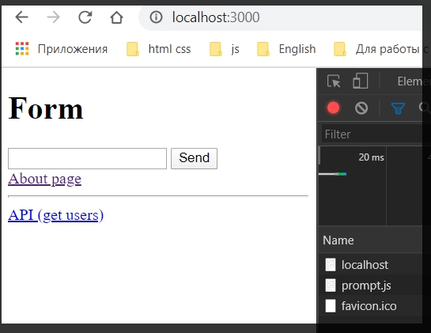
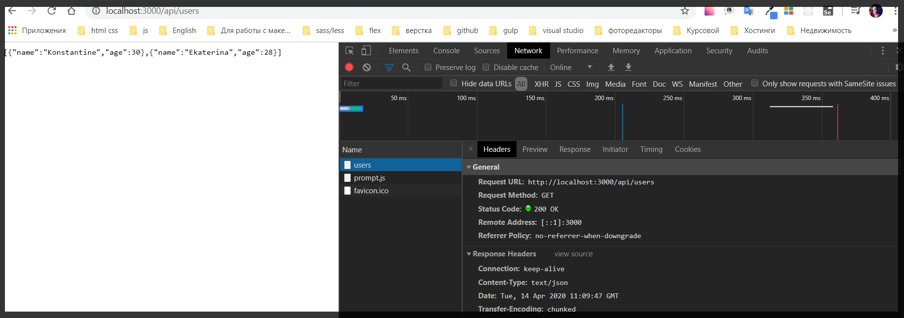

# Создание простого web - сервера

Как с помощью нативного **NodeJS** сервера мы можем создавать **API** сервер?

И сделаем мы это очень просто что бы продемострировать как это работает.

Перехожу в **index.html**.

```html
//index.html
<!DOCTYPE html>
<html lang="en">
  <head>
    <meta charset="UTF-8" />
    <meta name="viewport" content="width=device-width, initial-scale=1.0" />
    <title>Home page</title>
  </head>
  <body>
    <h1>Form</h1>
    <form method="post" action="/">
      <input name="title" type="text" />
      <button type="submit">Send</button>
    </form>

    <a href="/about">About page</a>

    <hr>

    <a href="/api/users">API (get users)</a>


  </body>
</html>
```

Теперь необходимо обработать данный роут по которому мы будем отдавать лишь данные а не **html**.

И на самом деле делается это очень просто. У меня уже есть все необходимые данные. В методе **GET** в зависимости req.url мы показываем нужную страницу. 
Добавляем еще один else if(){} Где так же в условии проверяю **req.url** и если он эквивалентен **/api/users**. В теле пишу объект **res.** c помощью метода **writeHead** задать статус **200**. Вторым параметром **writeHead** указываю объект **'Content-Type' : 'text.json'**.

И в объекте **res.end** передаем какое то значение.

Пока сформируем какой - то объект. Допустим сэмулируем что мы сходили в базу данных, получили **json** и отправили его обратно на клиента. **const users = []**. Допустим мы получили объект **users** у которого будет например два пользователя

```js

// изначально не правильно добавил блок кода Везде буду показывать уже рабочий код напрягись и разберись
const http = require("http");
const path = require("path");
const fs = require("fs");

const server = http.createServer((req, res) => {
  if (req.method === "GET") {
    res.writeHead(200, {
      "Content-type": "text/html charset=utf-8",
    });

    if (req.url === "/") {
      fs.readFile(
        path.join(__dirname, "views", "index.html"),
        "utf-8",
        (err, content) => {
          if (err) {
            throw err;
          }
          res.end(content);
        }
      );
    } else if (req.url === "/about") {
      fs.readFile(
        path.join(__dirname, "views", "about.html"),
        "utf-8",
        (err, content) => {
          if (err) {
            throw err;
          }
          res.end(content);
        }
      );
    } else if (req.url === "/api/users") {
      res.writeHead(200, {
        "Content-Type": "text/json",
      });

      const users = [
        { name: "Konstantine", age: 30 },
        { name: "Ekaterina", age: 28 },
      ];

      res.end(JSON.stringify(users));
    }
  } else if (req.method === "POST") {
    const body = [];

    res.writeHead(200, {
      "Content-Type": "text/html; charset=utf-8",
    });

    req.on("data", (data) => {
      body.push(Buffer.from(data));
    });

    req.on("data", () => {
      const message = body.toString().split("=")[1];

      res.end(`
    <h1>Ваше сообщение: ${message} </h1>
    `);
    });
  }
});

server.listen(3000, () => {
  console.log("Server is running...");
});

```

Далее в **res.end()** мы должны передать значение **JSON.stringify(users)**.

```js

// изначально не правильно добавил блок кода Везде буду показывать уже рабочий код напрягись и разберись
const http = require("http");
const path = require("path");
const fs = require("fs");

const server = http.createServer((req, res) => {
  if (req.method === "GET") {
    res.writeHead(200, {
      "Content-type": "text/html charset=utf-8",
    });

    if (req.url === "/") {
      fs.readFile(
        path.join(__dirname, "views", "index.html"),
        "utf-8",
        (err, content) => {
          if (err) {
            throw err;
          }
          res.end(content);
        }
      );
    } else if (req.url === "/about") {
      fs.readFile(
        path.join(__dirname, "views", "about.html"),
        "utf-8",
        (err, content) => {
          if (err) {
            throw err;
          }
          res.end(content);
        }
      );
    } else if (req.url === "/api/users") {
      res.writeHead(200, {
        "Content-Type": "text/json",
      });

      const users = [
        { name: "Konstantine", age: 30 },
        { name: "Ekaterina", age: 28 },
      ];

      res.end(JSON.stringify(users));
    }
  } else if (req.method === "POST") {
    const body = [];

    res.writeHead(200, {
      "Content-Type": "text/html; charset=utf-8",
    });

    req.on("data", (data) => {
      body.push(Buffer.from(data));
    });

    req.on("data", () => {
      const message = body.toString().split("=")[1];

      res.end(`
    <h1>Ваше сообщение: ${message} </h1>
    `);
    });
  }
});

server.listen(3000, () => {
  console.log("Server is running...");
});


```

Теперь если посмотреть в приложение то увидим ссылку на пользователей. И если перейти





Для того что бы было более удобное отображение есть плагин [jsonview](https://chrome.google.com/webstore/detail/jsonview/chklaanhfefbnpoihckbnefhakgolnmc?hl=en)

