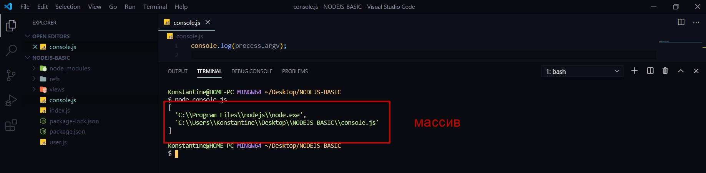
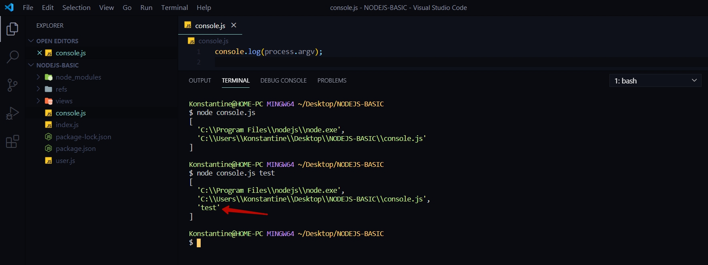
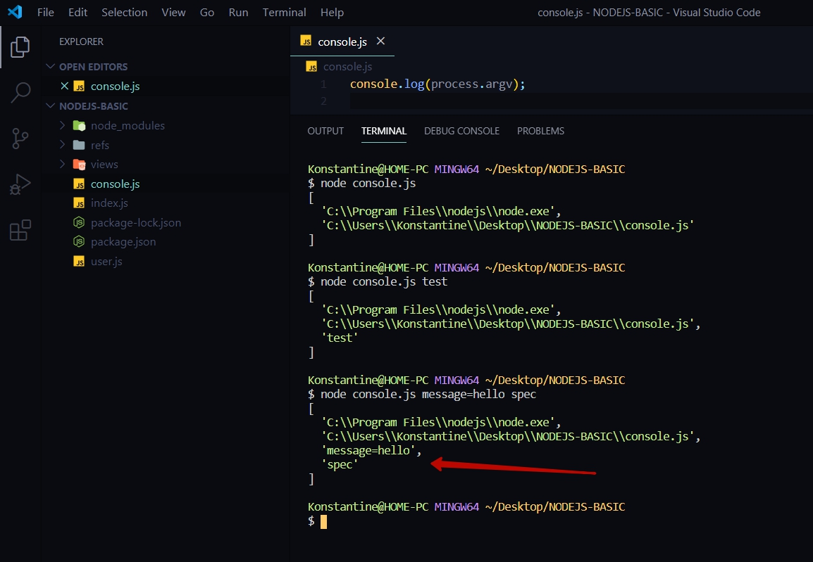
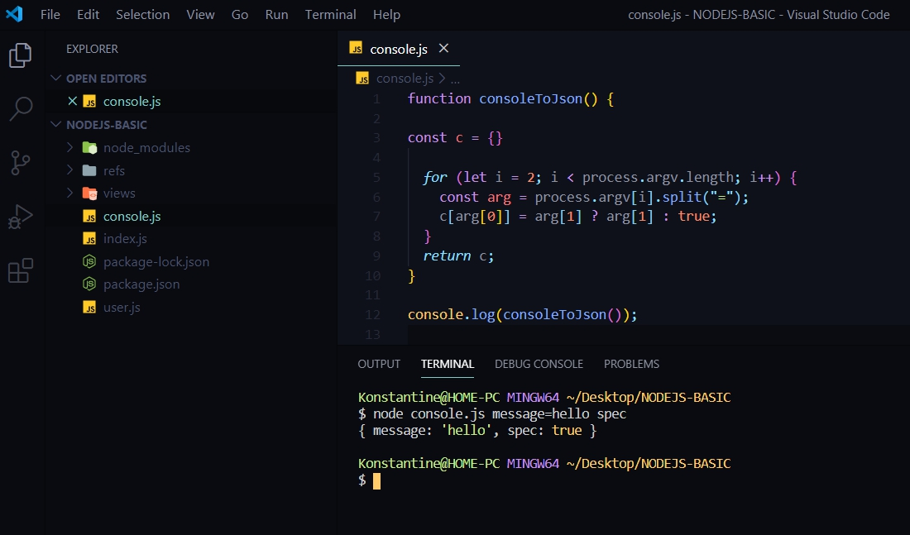

# Работа с консолью.

Еще один функционал в основах NodeJS. В корне создаю файл и называю его **console.js**.
Здесь будет показано как взаимодействовать с консолью в NodeJS.

```js
console.log(process.argv);

```

B если запустить этот файл node **console.js**



Выводится массив который содержит в себе несколько значений.
Изначально есть путь до самого NodeJS и далее есть объект **file name** название текущего файла.

Но вот что интересно. Если мы вызовем тот самый **node console.js** но при этом будет параметр **test**



То получаю в массиве данное значение **test**.

На самом деле мы можем взаимодействовать с теми параметрами которые передаем.

Если добавим node **console.js message=hello spec
**


В итоге мы получаем массив состоящий их 4-х элементов где последние два элемента являются параметрами которые мы передавали. 

Т.е. по сути обращаясь к данный параметрам, **process.argv**, мы можем взаимодействовать с консолью которую мы запускаем в приложении NodeJS.

И сейчас напишем функцию с помощью которой удобно доставать эти параметры.

В файле **сonsole.js** все удаляю и пишу функцию.

```js
function consoleToJson(){
    
}
```

Данная функция ничего не будет принимать. Описываю тело функции.
Первые два параметра я хочу проигнорировать а **'message=hello' и 'spec'** я хочу занести в **json**.

В теле функции создаю объект **сonst c = {}**  и по умолчанию это будет просто пустой объект. Далее обращаюсь к самому обычному циклу **for(){}**. В условии цикла пишу что будем делать итерацию со второго индекса, что итерация будет делаться дотех пор пока объект **process.argv.length** (до конца всех значений входящих в этот объект), и далее на каждой итерации **сounter** счетчик будет увеличиваться на **i++**.

```js
function consoleToJson() {

const c = {}

  for (let i = 2; i < process.argv.length; i++) {}
}
```

В теле функции создаю локальную переменную **const arg** в переменной обращаюсь к массива **process.argv** с которого необходимо достать **[i]** элемент. Или элемент у нас строка, поэтому вызываю метод **split**(разделить) по символу **('=')**. Потому что параметры различаются именно **=**.

```js
function consoleToJson() {
 
 const c = {}

  for (let i = 2; i < process.argv.length; i++) {
    const arg = process.argv[i].split("=");
  }
}

```

Далее все что нужно сделать это из массива **arg**, который на данный момент состоит из двух элементов, где первый элемент это **message** а второй **hello**, ну или первый элемент **spec**.
Дальше нам необходимо все это занести в консоль. По - этому просто обращаюсь к объекту **console**, но лучше назовем его **c[]** потому что есть глобальный объект **console**. Как ключ значения указываем **c[arg[0]]** и как значение указываем **arg[1]**

```js
function consoleToJson() {
  for (let i = 2; i < process.argv.length; i++) {

const c = {}

    const arg = process.argv[i].split("=");
    c[arg[0]] = arg[1];
  }
}
```

Так же присутствует конвенция что если мы просто передаем какой -то параметр без значений то это означает что это **булево** значение **true** или **false**. Но так как он передан то это соответственно значение **true**. Поэтому пишем проверку.
Если массив **arg[1]** то тогда мы будем его добавлять,  если же мы его не передавали то по умолчанию будет принимать значение **true**.

и после этого возвращаю объект **с**.

```js
function consoleToJson() {

const c = {}

  for (let i = 2; i < process.argv.length; i++) {
    const arg = process.argv[i].split("=");
    c[arg[0]] = arg[1] ? arg[1] : true;
  }
  return c;
}
```

 Теперь нужно просто вызвать функцию consoleToJson. Выведу ее в консоль.

 ```js
 function consoleToJson() {

const c = {}

  for (let i = 2; i < process.argv.length; i++) {
    const arg = process.argv[i].split("=");
    c[arg[0]] = arg[1] ? arg[1] : true;
  }
  return c;
}

console.log(consoleToJson());
```

запускаю **node console.js message=hello spec**



Если я **spec** укажу как значение **false** то 


То получаем значение **false**. Это так же можно при обработке приводить к булеву значению .... кароче еще можно улучшать. На выходе получаем полноценное консольное приложение.