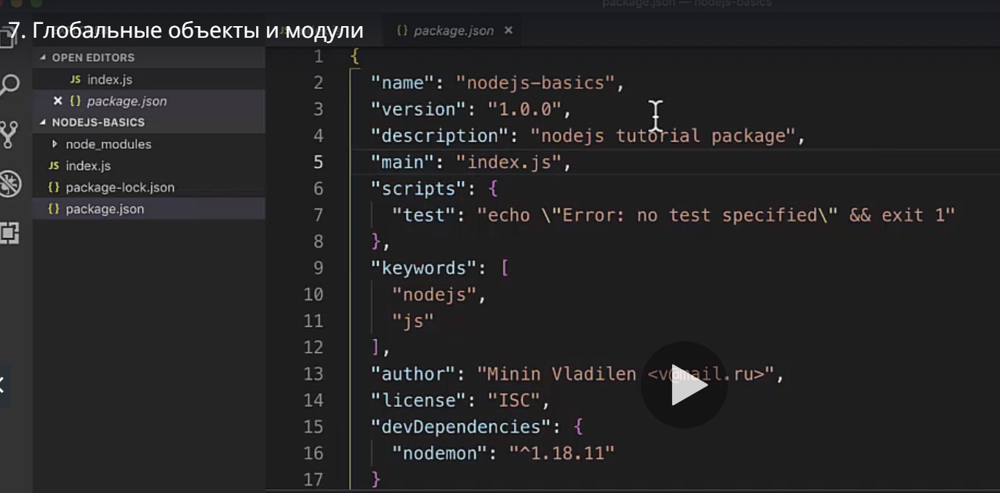
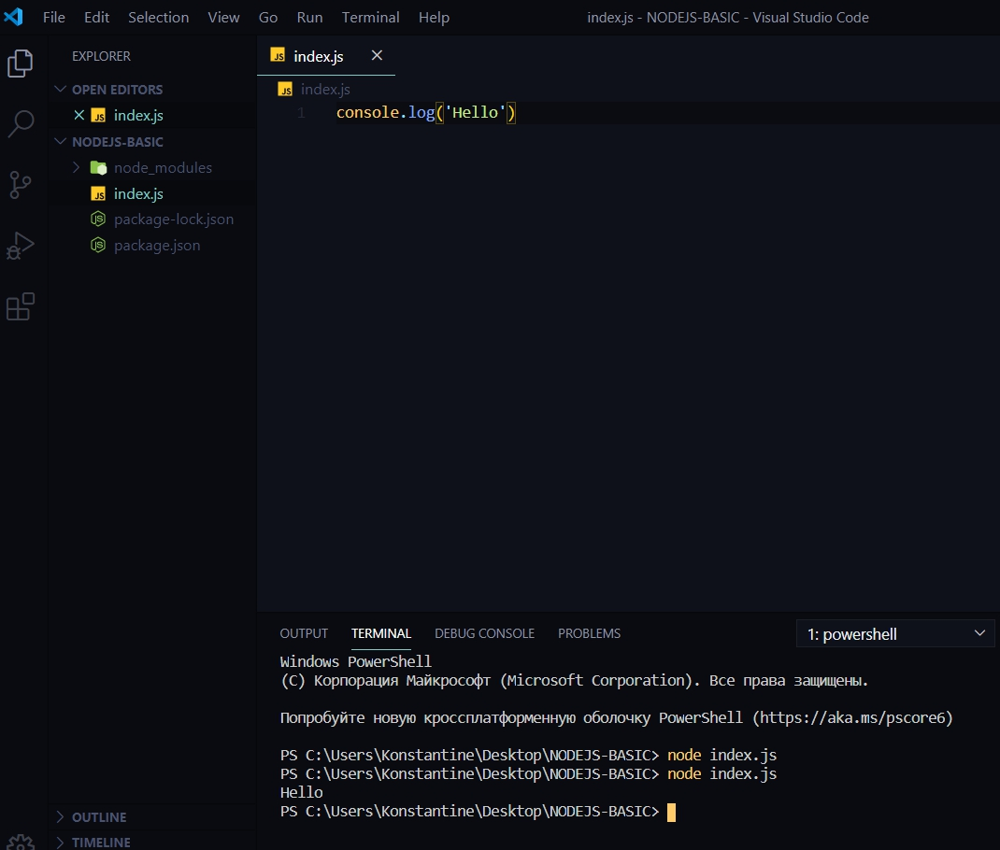
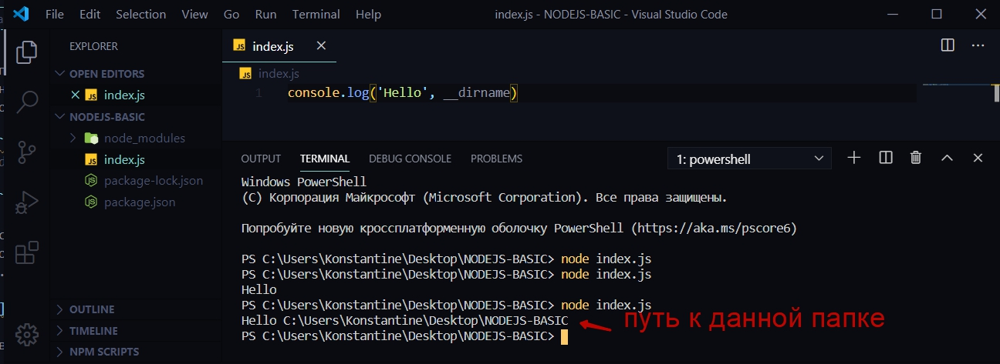
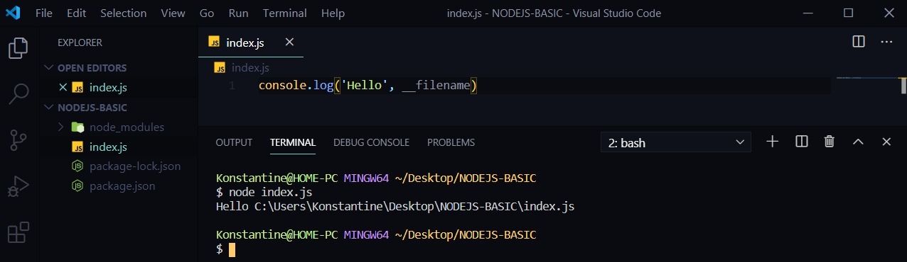
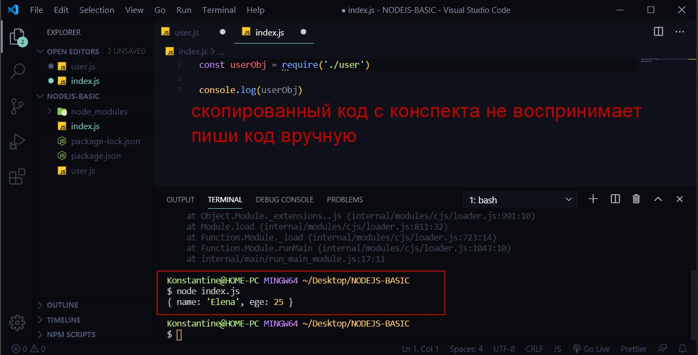
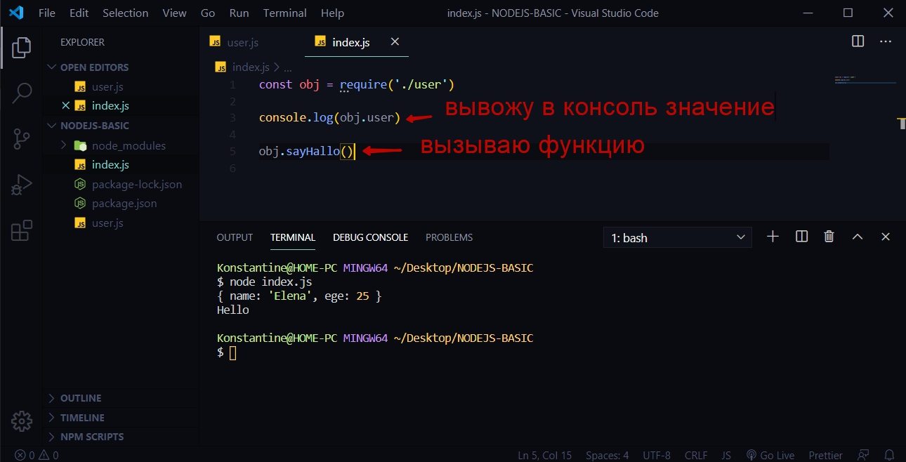
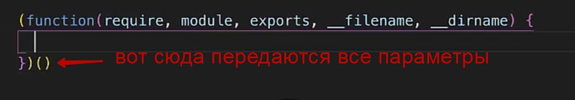

# Глобальные модули и объекты

Встроенные возможности **NodeJS**. 
Для этого в корне приложения создаю файл **index.js** в котором и буду вести разработку приложения. Называть его можно как угодно. Однако считается хорошей практикой называть главный файл так же как в поле **"main":"index.js"** в файле **package.json**.



B теперь пишу программу где посмотрю базовые возможности NodeJS.

Сначало научимся запускать программу.

```
console.log('Hello')
```

теперь для того что бы запустить данную программу на NodeJS в консоли необходимо обратиться к команде **node** и после этого указать название файла **index.js**

```
node index.js

```

> Расширение файла можно не писать и просто оставить index. По умолчанию NodeJS будет смотреть на файлы с расширением index.js.



И в консоли я вижу приветствие.


Разберем базовые сущности которые есть в NodeJS и которых нет в браузерном JS.

Первый глобальный объект **__dirname**. C помощью данного объекта я могу определить в какой папке я веду разработку.

```
console.log('Hello', __dirname)
```



Аналог этому есть **__filename**



<br><br><br><br>

# Теперь рассмотрим модули. Как они работают в NodeJS

Для этого в корне я создаю другой файл который я назову **user.js**

И в нем я определяю объект **user**

```js
const user ={
    name: 'Elena',
    age: 25
}

```

Теперь необходимо обратится к этому объекту в файле **index.js** т.е. связать два этих файла. 
На самом деле в NodeJS делается это очень просто, у нас есть глобальный объект **module** отвечающий соответственно за модуль, у данного объекта есть поле которое называется **exports** c помощью которого мы можем экспортировать наружу какие либо данные и в качестве результата я должен занести то что я хочу экспортировать т.е. например объект user.

```js
//user.js
const user ={
    name: 'Elena',
    age: 25
}

module.exports = user
```

теперь для того что бы в файле index.js подключить и обратиться к данному объекту мы воспользуемся глобальной функцией которая называется **require** и в ней указываю путь к файлу который я хочу подключить.

```js
reqire('./user')
```

Данная функция возвращает объект который я экспортирую из файла это то что я кладу в **module.exports = user**.

Поэтому это можно занести в отдельную переменную.

```js
    сonst userObj = reqire('./user')
```
B теперь если я в консоли обращусь к данному объекту 

```js
 сonst userObj = reqire('./user')

console.log(userObj)
```



Помимо этого мы можем немного иначе экспортировать объекты в NodeJS. Т.е. допустим мы можем в поле **exports** складывать не просто какой-то объект user. 
На самом деле лучше всего **module.exports** с помощью фигурных скобок сделать объектом в который поместить список. Список как и массив состоит из ключа и его значения. D объект я так же погу поместить функцию

```js
const user ={
    name:'Elena',
    ege: 25
}

module.exports = {
    user: user,
    sayHallo(){
        console.log('Hello')
    }
}

```

Затем в файле index.js я получаю некоторый объект **obj**.И при выводе в консоль указываю в объекте **obj** указываю метод, ключ который хочу получить.

И так же у данного объекта есть функция **sayHello** которую я могу вызвать.

```js
//index.js
const obj = require('./user')

console.log(obj.user)

obj.sayHallo()

```



Круто то что мы можем задавать определенные приватные поля в различных модулях и при этом они будут видны в рамках данного модуля.

т.е. если мы в этом же файле создаем переменную **user2**

```js
const user ={
    name:'Elena',
    ege: 25
}

const user2={
    name:'Igor'
}

module.exports = {
    user: user,
    sayHallo(){
        console.log('Hello')
    }
}

```

Если эту переменну не экспортировать то она остается в рамках данного файла. И за счет этого мы можем массштабировать приложение очень удобно и создавать большой функционал при этом в каждом модуле вести независимую разработку.

Как это работает за кулисами что бы было понимание откуда беруться переменные вроде **module.exports**. Ведь на самом деле это просто JS который обернули с помощь определенных функций.
В JS мы можем создавать определенные функции которые вызывают сами себя. Создаю анонимную функцию которая вызывает сама себя

```js
(function(){

})()

```

Примерно такая конструкция.
Так в JS создаются модули. Любой модуль в NodeJS, любой файл в NodeJS за кулисами оборачивает такой файл вот в такие анонимные функции, и после этого функция передает некоторые глобальные объекты

```js
(function(reqire, module, exports, __filename, __dirname){

})()

```

В теле функции мы ведем определенную разработку 



И по этому все это выглядит следующим образом.

```js
(function(reqire, module, exports, __filename, __dirname){
const obj = require('./user')

console.log(obj.user)

obj.sayHallo()
})()

```

Т.е. мы просто обращаемся к тем параметрам которые мы передали в данную функцию. Просто мы эту функцию не видим.

За счет этого мы можем пользоваться данными переменными. Они считаются глобальными и мы можем использовать данный функционал.