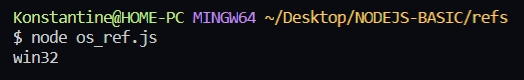
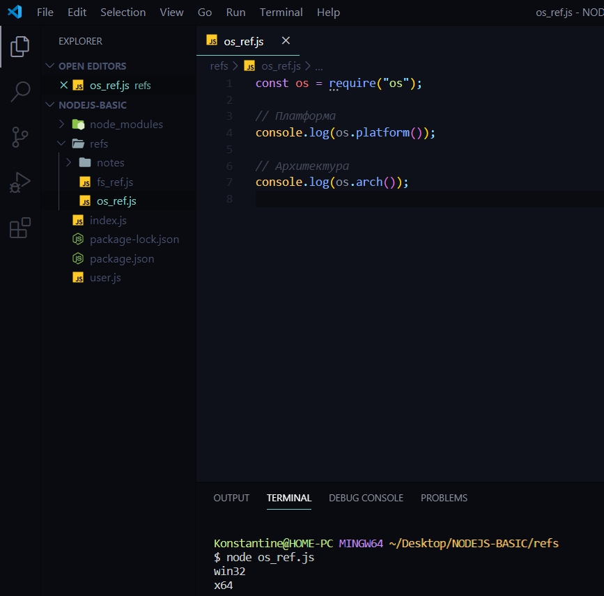
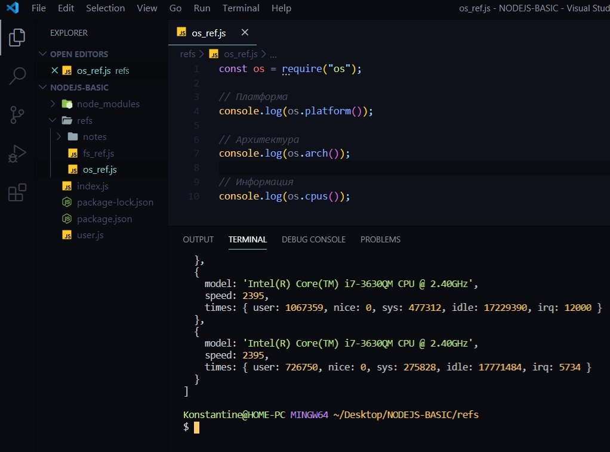
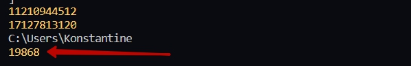

# Модуль OS

В папке refs  создаю новый файл который называю os_ref.js. Данный модуль помогает понять на какой операционной системе мы работаем и вообще понять то что у нас зашито внутри компьютера.
Обращаюсь к модулю os. B в консоли посмотрю какая же у меня операционная система.

```js
const os = require("os");

// Платформа
console.log(os.platform());

// Архитектура
console.log(os.arch());

// Информация
console.log(os.cpus());

// Свободная память
console.log(os.freemem());

// сколько всего памяти есть
console.log(os.totalmem());

// Корневая директория
console.log(os.homedir());

// Сколько система в рабочем состоянии
console.log(os.uptime());

```



 следующий метод я могу узнать архитектуру определенных процессоров.

 

 Общее состояние процессора

 

Я получаю объект который описывает ядра в данной машине.

Далее я могу узнать сколько есть свободной памяти.


Помимо этого я могу выяснить сколько всего памяти у меня есть.


Какая корневая дирректория на компьютере


Сколько система в рабочем состоянии




