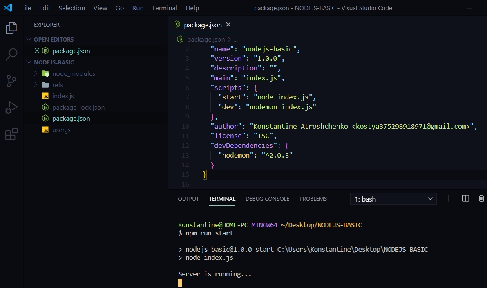
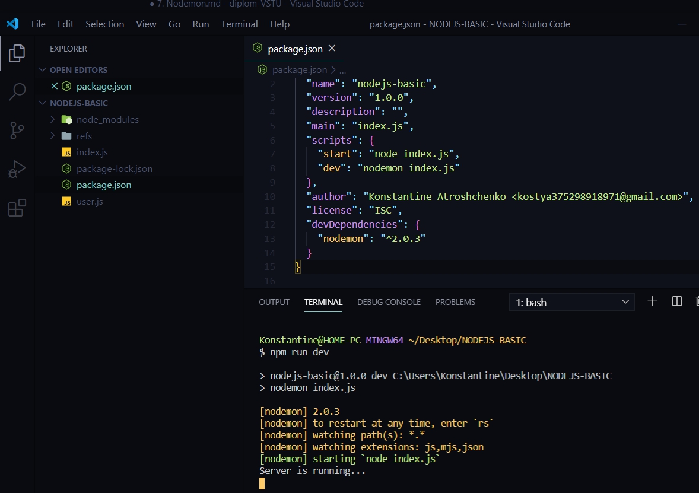

# Nodemon

Перед тем как продолжить изучать модуль HTTP изучим как улучшить процесс нашей разработки. Мы будем использовать ранее подключенный пакет nodemon. Cv сри файл package.json.
Даный пакет мы будем испольховать для того что бы уличшить процесс разработки  и каждый раз не перезагружать сервер. Т.е. для того что бы сейчас увидить определенные измениения нам каждый раз необходимо остановить процесс и после этого заново запустить скрипт.

Для этого в файле package.json создаю два скрипта. Первый скрипт будет называться start. Переименовываю test на start. он будет обращаться в node и запускать index.js.
Второй скрипт будет называться dev этот скрипт будет обращаться к пакету nodemon b запускать файл index.js

```json
{
  "name": "nodejs-basic",
  "version": "1.0.0",
  "description": "",
  "main": "index.js",
  "scripts": {
    "start": "node index.js", 
    "dev": "nodemon index.js"
  },
  "author": "Konstantine Atroshchenko <kostya375298918971@gmail.com>",
  "license": "ISC",
  "devDependencies": {
    "nodemon": "^2.0.3"
  }
}
```

Теперь если в консоли написать 

>npm run start



Если же я вызову скрипт

> npm run dev



То получаем сообщение от Nodemon которое гласит что он смотрит за изменениями в файлах проекта.