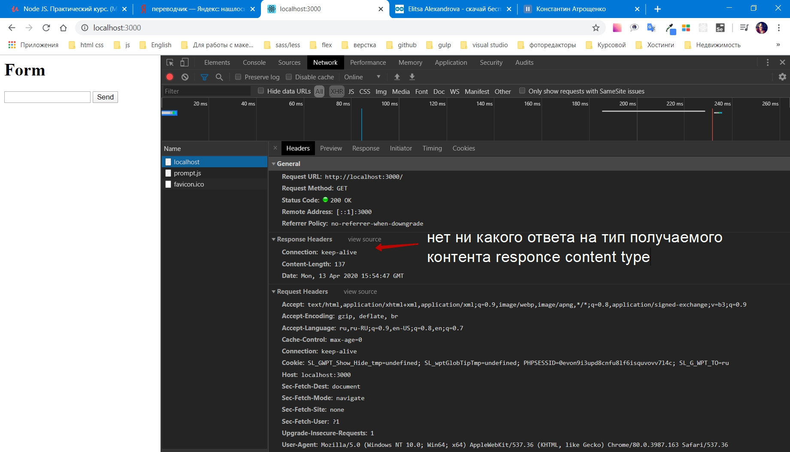
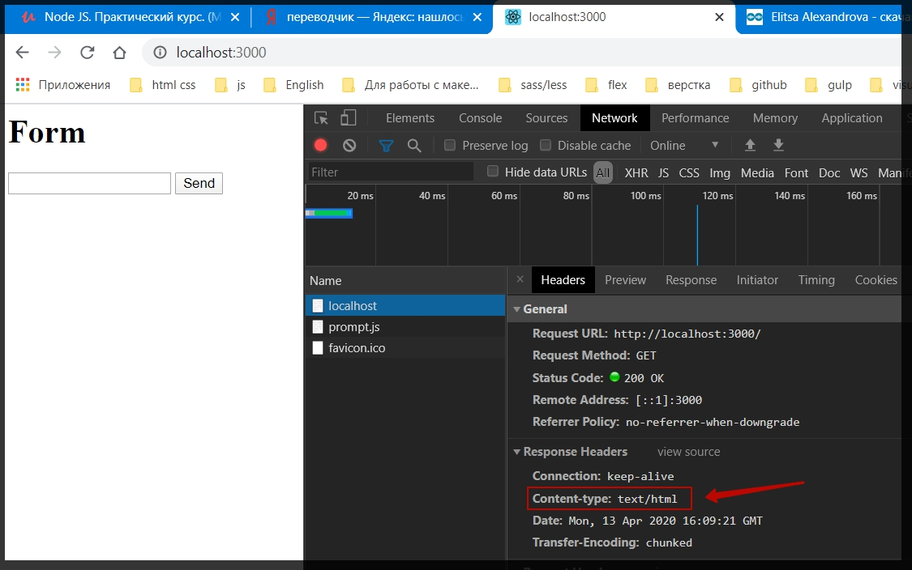
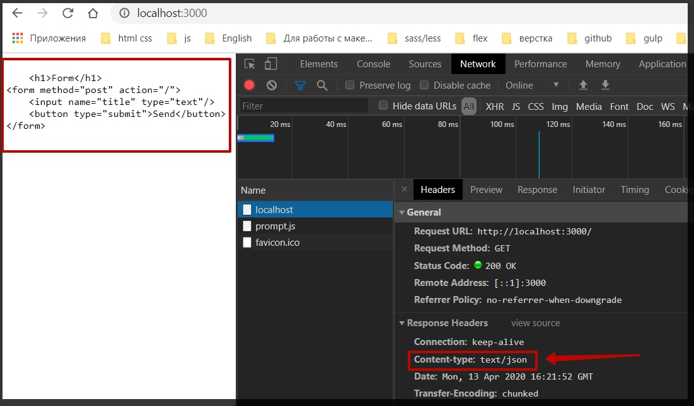
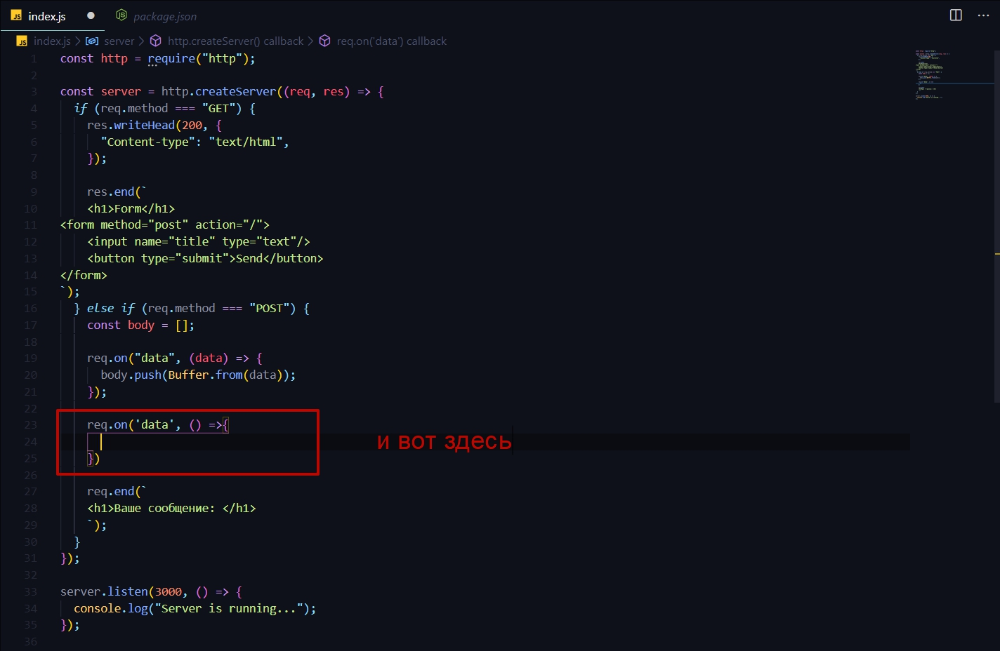
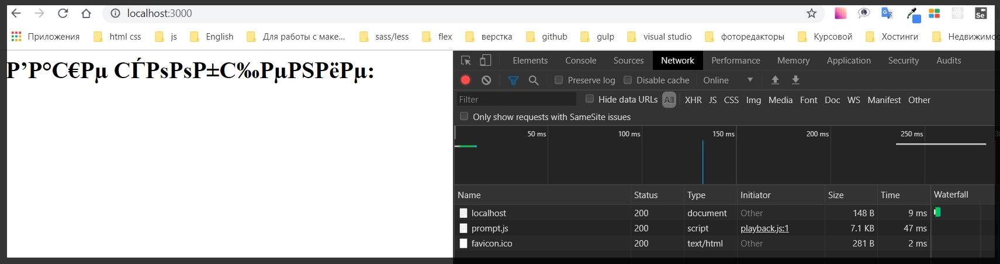
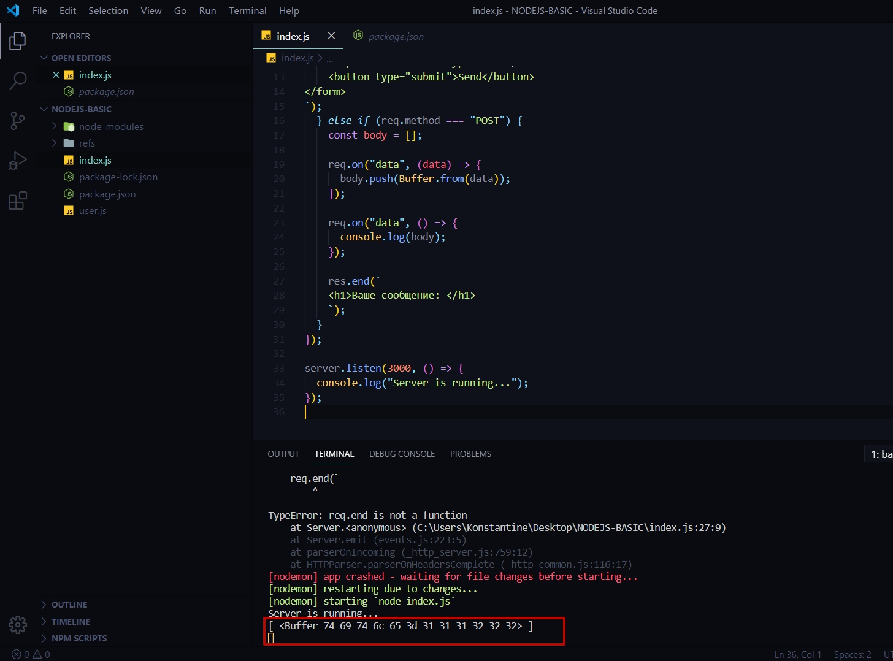
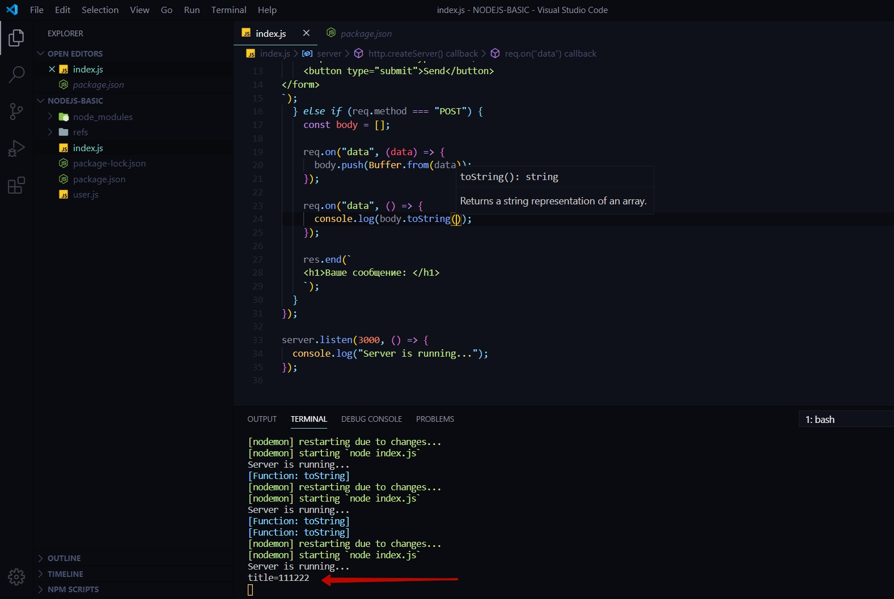
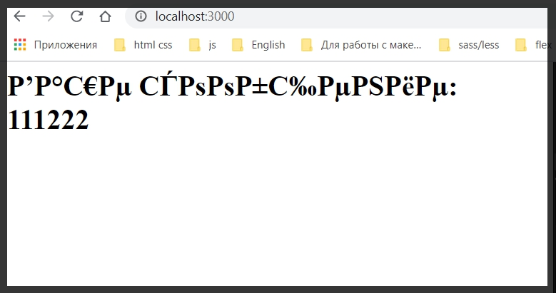

# Создание простого web - сервера

Продолжаю изучение модуля **http**. 
Напишу небольшое приложение с использованием роутинга с различными **header - ми** и посмотреть как вообще все это функционирует.

В Функции **createServer** все удаляю.

По сути для начало будет простое приложение которое в ответ на запрос пользователя будет отдавать например какую - нибудь форму.

Для начало пишу проверку. Если в объекте **request** который отправил пользователь когда загрузил страницу. У **request** есть поле которое называется **method** и если данный **method** совпадает со значением **GET**, то это означает что мы просто загружали страницу.

```js
const http = require("http");

const server = http.createServer((req, res) => {
   if(req.method === 'GET'){
     
   }
});

server.listen(3000, () => {
  console.log("Server is running...");
});

```

И мы здесь будем выполнять какую - то логику которую сейчас опишем.

Для начало с помощью команды **res.end()** создадим какой - то **html** который мы хотим пользователю в ответ отправить.

```js
const http = require("http");

const server = http.createServer((req, res) => {
  if (req.method === "GET") {
    res.end(`
    <h1>Form</h1>
<form method="post" action="/">
    <input name="title" type="text"/>
    <button type="submit">Send</button>
</form>
`);
  }
});

server.listen(3000, () => {
  console.log("Server is running...");
});
```
Форма отображается в браузере.

Теперь разберемся как работать с такими формами. Потому что сейчас если мы опять посмотрим в **Network** то мы не увидим ни какого **Responce Header** отвечающего за **content type**.




Некоторые браузеры могут не корректно обрабатывать данную информацию. 

По этому мы можем с помощью **NodeJS** это указать.

Есть два разных метода как это можно сделать. 
Т.е. допустим я могу обратиться к объекту **responce** т.е. **res**.  и далее вызвать метод который называется **writeHead()**. Данный метод принимает в себя два значения где первое значения является статусом ответа т.е. если все OK то тогда http статус **200**, и вторым параметром я передаю объект {} который содержит в себе ключ -> значение **header-ов**. И в этом Объекте нужно указать параметр **Content - type** который будет находится в значении **text/html** т.е. таким образом я напрямую указываю браузеру что буду передавать текст в формате **html**.

```js
const http = require("http");

const server = http.createServer((req, res) => {
  if (req.method === "GET") {
    
    res.writeHead(200, {
      'Content-type':'text/html'
    });

    res.end(`
    <h1>Form</h1>
<form method="post" action="/">
    <input name="title" type="text"/>
    <button type="submit">Send</button>
</form>
`);
  }
});

server.listen(3000, () => {
  console.log("Server is running...");
});
```

обновляю страницу




Если в краце то если записать вместо html **json**.

```js
const server = http.createServer((req, res) => {
  if (req.method === "GET") {
    
    res.writeHead(200, {
      'Content-type':'text/json'
    });

```



Это будет не корректно. Браузер перестает обрабатывать **html** как должен. А он понимает что это строка которую нужно вывести как строку, но не нужно ее парсить как **html**.
Поэтому все эти **content type** достаточно важны.

 Все возвращаю назад.

 И так идем дальше. Если сейчас я заполню форму и отправлю ее то браузер зависнет так как нет обработчика событий.
 Потому что сейчас когда мы отправдяем запрос на корневой **url** у нас нет обработчика событий потому что метод у данной формы является **post**.
 Поэтому добавляем еще один **else if(){}** и в условии пишем что если **req.method === 'POST'**, то тогда мы сделаем простое приложение echo. Где мы будем выводить то сообщение которое которое пользователь ввел в **input** но уже в заголовке **h1**.

 ```js
 const http = require("http");

const server = http.createServer((req, res) => {
  if (req.method === "GET") {
    res.writeHead(200, {
      "Content-type": "text/html",
    });

    res.end(`
    <h1>Form</h1>
<form method="post" action="/">
    <input name="title" type="text"/>
    <button type="submit">Send</button>
</form>
`);
  } else if (req.method === "POST") {
    req.end(`
    <h1>Ваше сообщение: </h1>
    `);
  }
});

server.listen(3000, () => {
  console.log("Server is running...");
});

```

Теперь необходимо понять как получить данное сообщение из формы потому что пока не понятно как это обрабатывать.
На самом деле есть небольшие сложности с этим.
И для начало необходимо создать с помощью **const** какой - то массив например **body**. и далее необходимо понять что те параметры которые улетают из формы они в действительности являются буферами. И делается это для того что бы так же оптимизировать размер входящих параметров. Т.е. например если мы отправляем какой - то файл, и допустим он весит 10 mb а может и 100 то безусловно процесс будет очень долгим. И поэтому что бы оптимизировать работу с подобными параметрами мы делим все на чанки и буферируем определенные параметры. Поэтому данные поступают порциями которые необходимо обработать. И для этого обращаемся к полю **req**  и так данное поле является наследником поля **EventEmiter** то обращаемся к методу on где мы должны прослушать событие **data**. Далее передаем **callback** функцию **data =>{}**. Необходимо сформировать Цельный ответ получаемый из формы в массив **body**.
В **callback** функции обращаюсь к массиву **body**, и так как это массив у него есть метод **push** куда нужно передать обработанный буфер. Т.е. я просто обращаюсь к **Buffer.from(data)**. Данное событие может быть вызвано несколько раз 

```js
const http = require("http");

const server = http.createServer((req, res) => {
  if (req.method === "GET") {
    res.writeHead(200, {
      "Content-type": "text/html",
    });

    res.end(`
    <h1>Form</h1>
<form method="post" action="/">
    <input name="title" type="text"/>
    <button type="submit">Send</button>
</form>
`);
  } else if (req.method === "POST") {
    const body = [];

    req.on("data", (data) => {
      body.push(Buffer.from(data));
    });

    res.end(`
    <h1>Ваше сообщение: </h1>
    `);
  }
});

server.listen(3000, () => {
  console.log("Server is running...");
});
```

И когда данные все завершаться, передача их завершится, у объекта **res** можно вызвать метод **on** с первым параметром **end**. Во втором параметре, в **callback**  функции мы точно будем знать что данные все пришли.



И здесь необходимо сформировать нормальную строку которую мы получали из формы.

Пока посмотрим что такое массив **body**. выведем его в консоль.

```js
const http = require("http");

const server = http.createServer((req, res) => {
  if (req.method === "GET") {
    res.writeHead(200, {
      "Content-type": "text/html",
    });

    res.end(`
    <h1>Form</h1>
<form method="post" action="/">
    <input name="title" type="text"/>
    <button type="submit">Send</button>
</form>
`);
  } else if (req.method === "POST") {
    const body = [];

    req.on("data", (data) => {
      body.push(Buffer.from(data));
    });

    req.on("data", () => {
      console.log(body);
    });

    res.end(`
    <h1>Ваше сообщение: </h1>
    `);
  }
});

server.listen(3000, () => {
  console.log("Server is running...");
});

// далее почему - то еще что то выводит это не копируй.


```

Если произвести отправку из формы то выводится какое то криптографическое значение.



Но что более интересно сейчас в **localhost** мы получаем **buffer** который является массивом.



И для того что бы преобразовать его к читаемому формату мы просто вызываем у body метод **toString**.

```js
const http = require("http");

const server = http.createServer((req, res) => {
  if (req.method === "GET") {
    res.writeHead(200, {
      "Content-type": "text/html",
    });

    res.end(`
    <h1>Form</h1>
<form method="post" action="/">
    <input name="title" type="text"/>
    <button type="submit">Send</button>
</form>
`);
  } else if (req.method === "POST") {
    const body = [];

    req.on("data", (data) => {
      body.push(Buffer.from(data));
    });

    req.on("data", () => {
      console.log(body.toString());
    });

    res.end(`
    <h1>Ваше сообщение: </h1>
    `);
  }
});

server.listen(3000, () => {
  console.log("Server is running...");
});
```

После обновления страницы криптографические значения не исчезают. Однако в консоли появляется



Теперь по сути необходимо забрать данное значение. **console.log** переименовывоем в **const massege** далее мы обращаемся к **body.tostring()**, у сроки вызываем метод **split**, разделяем эту строку по символу **('=')** и забираем второй элемент с помощью индекса **[1]**.

```js
// вырезаю
 res.end(`
    <h1>Ваше сообщение: </h1>
    `);
    ```

И только после этого мы можем обратиться к объекту **responce** и уже закончить наш запрос.

И в Заголовке **h1** Ваше сообщение вывожу объект** message**

```js
const http = require("http");

const server = http.createServer((req, res) => {
  if (req.method === "GET") {
    res.writeHead(200, {
      "Content-type": "text/html",
    });

    res.end(`
    <h1>Form</h1>
<form method="post" action="/">
    <input name="title" type="text"/>
    <button type="submit">Send</button>
</form>
`);
  } else if (req.method === "POST") {
    const body = [];

    req.on("data", (data) => {
      body.push(Buffer.from(data));
    });

    req.on("data", () => {
      const message = body.toString().split("=")[1];

      res.end(`
    <h1>Ваше сообщение: ${message} </h1>
    `);
    });
  }
});

server.listen(3000, () => {
  console.log("Server is running...");
});

```
И вот теперь при обновлении страницы я получаю то сообщение.



Однако теперь нужно разобраться с кодировкой.
Для этого нужно прописать нужные **header - ры**.

Мы можем обратиться там где мы обрабатываем метод POST.

Обращаюсь к объекту **res**.  вызываю у него метод **writeHead** в параметрах прописываю статус **200**, вторым параметром задаю **'Content - Type' : 'text/html charset=utf-8'**


```js
const http = require("http");

const server = http.createServer((req, res) => {
  if (req.method === "GET") {
    res.writeHead(200, {
      "Content-type": "text/html",
    });

    res.end(`
    <h1>Form</h1>
<form method="post" action="/">
    <input name="title" type="text"/>
    <button type="submit">Send</button>
</form>
`);
  } else if (req.method === "POST") {
    const body = [];

    res.writeHead(200, {
      "Content-Type": "text/html; charset=utf-8",
    });

    req.on("data", (data) => {
      body.push(Buffer.from(data));
    });

    req.on("data", () => {
      const message = body.toString().split("=")[1];

      res.end(`
    <h1>Ваше сообщение: ${message} </h1>
    `);
    });
  }
});

server.listen(3000, () => {
  console.log("Server is running...");
});
```


В Месте где обрабатывается **POST** запрос с помощью асинхронных функций формируем из **Buffer** из кусков один ответ Далее его просто выводим 

```js
req.on("data", () => {
      const message = body.toString().split("=")[1];

      res.end(`
    <h1>Ваше сообщение: ${message} </h1>
    `);
    ```

    Однако не очень удобно работать в одном файле. Потому что сейчас тут есть какие - то большие куски html которые было бы не плохо вынести и в html указать определенные мета теги.
