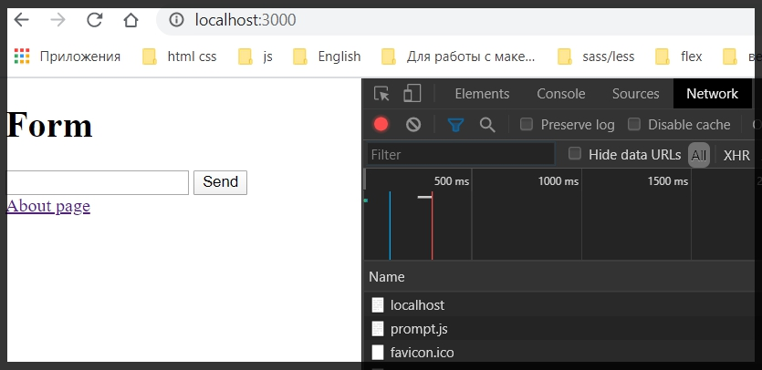
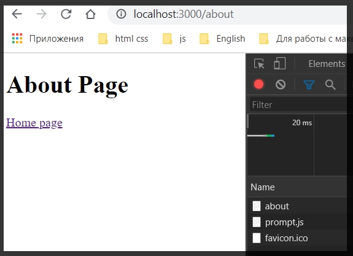

# Web - сервер с html страницами

В корне приложения создаю папку views(просмотры).

В данной папке я создам несколько html  файлов index.html и создаю базовую структуру в этом документе. Далее about.html и так же задаю базовую структуру.

```html
// about.html
<!DOCTYPE html>
<html lang="en">
  <head>
    <meta charset="UTF-8" />
    <meta name="viewport" content="width=device-width, initial-scale=1.0" />
    <title>About</title>
  </head>
  <body>
    <h1>About Page</h1>

    <a href="/">Home page</a>
  </body>
</html>
```

 Вырезаю HTML из res.end файла index.js и вставляю его в index.html.

 ```html
 <!DOCTYPE html>
<html lang="en">
  <head>
    <meta charset="UTF-8" />
    <meta name="viewport" content="width=device-width, initial-scale=1.0" />
    <title>Home page</title>
  </head>
  <body>
    <h1>Form</h1>
    <form method="post" action="/">
      <input name="title" type="text" />
      <button type="submit">Send</button>
    </form>

    <a href="/about">About page</a>
  </body>
</html>

```

Теперь вместо того что бы нам самим формировать определенные ответы для сервера мы можем воспользоваться готовыми html - ми.

Подклюяаю модуль fs в index.js

> const fs = require("fs");

Теперь я могу считывать файлы, забирать их контент и отдавать пользователю в ответ.

Пока res.end оставляю пустым.

И если у нас есть GET запрос обычный

```js
const server = http.createServer((req, res) => {
  if (req.method === "GET") {
    res.writeHead(200, {
      "Content-type": "text/html",
    });
```

То это означает что нам нужно отдать какую -то html страницу в ответ. C POST запросом разберемся чуть позже.

Сейчас если мы попадаем в GET то в начале мы задаем 'Content-type':'text/html; charset=utf-8'. Charset добавляю в index.js потому что небыло.

И теперь мы можем проверить какую страницу нам необходимо отдать.

После res.writeHead добавляем новый if(){}. Или же можем воспользоваться switch case и сделать определенный routing. но будем делать через if.

В условии пишу req.url ==='/' то необходимо загрузить главную страницу index.html. Идля этого в теле функции обращаюсь к модулю fs. вызываю метод readFile() где дальше нужно прописать путь к файлу. Для того что бы это сделать не забываем подключать модуль path.

> const path = require("path");

Далее в параметрах readFile обращаюсь к path. его методу join где в параметрах указываю __dirname, после этого захожу в папку views, и в нем интересует файл index.html.
Вторым параметром readFile указываю кодировку utf-8.

Третьим параметром является callback функция первым обязательным параметром которой идет err, вторым параметром callback функции указываю content. И в теле этой функции пишу что в случае ошибки trow err. 
А если ошибки нет то обращаемся к res.end в параметры которой передаем необходимы content.

старый res.end можем удалить.

```js
const http = require("http");
const path = require("path");
const fs = require("fs");

const server = http.createServer((req, res) => {
  if (req.method === "GET") {
    res.writeHead(200, {
      "Content-type": "text/html charset=utf-8",
    });

    if (req.url === "/") {
      fs.readFile(
        path.join(__dirname, "views", "index.html"),
        "utf-8",
        (err, content) => {
          if (err) {
            throw err;
          }
          res.end(content);
        }
      );
    }


    
  } else if (req.method === "POST") {
    const body = [];

    res.writeHead(200, {
      "Content-Type": "text/html; charset=utf-8",
    });

    req.on("data", (data) => {
      body.push(Buffer.from(data));
    });

    req.on("data", () => {
      const message = body.toString().split("=")[1];

      res.end(`
    <h1>Ваше сообщение: ${message} </h1>
    `);
    });
  }
});

server.listen(3000, () => {
  console.log("Server is running...");
});
```

Теперь делаю тоже самое для страницы about т.е. добавляю else if(){}. В условии пишу что если req.url === '/about' то тогда по сути делаю такую же какртину как и ранее только в path указываю about.html.

```js
const http = require("http");
const path = require("path");
const fs = require("fs");

const server = http.createServer((req, res) => {
  if (req.method === "GET") {
    res.writeHead(200, {
      "Content-type": "text/html charset=utf-8",
    });

    if (req.url === "/") {
      fs.readFile(
        path.join(__dirname, "views", "index.html"),
        "utf-8",
        (err, content) => {
          if (err) {
            throw err;
          }
        }
      );
    } else if (req.url === "/about") {
      fs.readFile(
        path.join(__dirname, "views", "about.html"),
        "utf-8",
        (err, content) => {
          if (err) {
            throw err;
          }
          res.end(content);
        }
      );
    }
  } else if (req.method === "POST") {
    const body = [];

    res.writeHead(200, {
      "Content-Type": "text/html; charset=utf-8",
    });

    req.on("data", (data) => {
      body.push(Buffer.from(data));
    });

    req.on("data", () => {
      const message = body.toString().split("=")[1];

      res.end(`
    <h1>Ваше сообщение: ${message} </h1>
    `);
    });
  }
});

server.listen(3000, () => {
  console.log("Server is running...");
});

```

Теперь смотрим как работает приложение.



И при переходе по ссылке осуществляется routing(машрутизация)



Теперь что касается формы. У нас осталась обработка данной формы. И допустим мы хотим что - то показать пользователю в ответ.