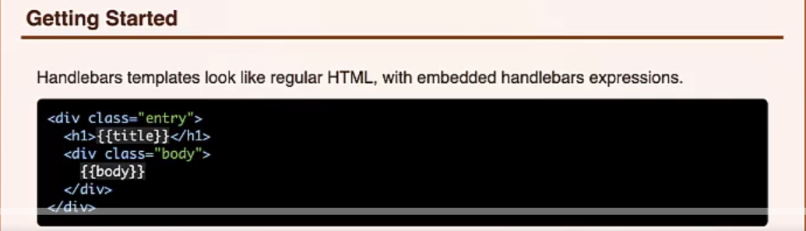
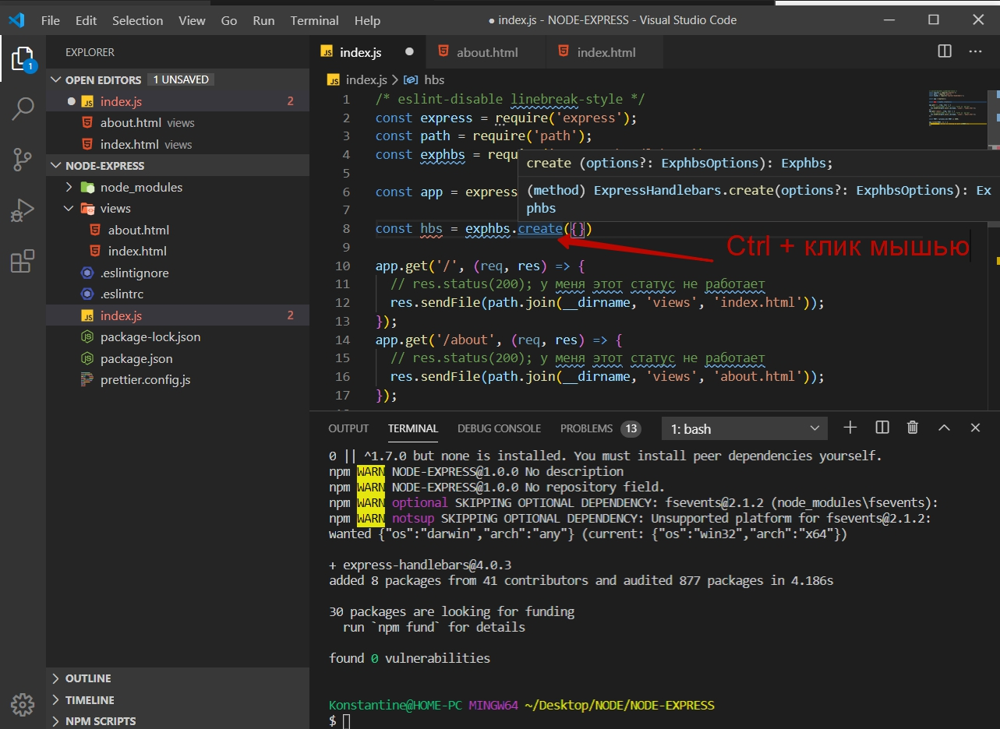
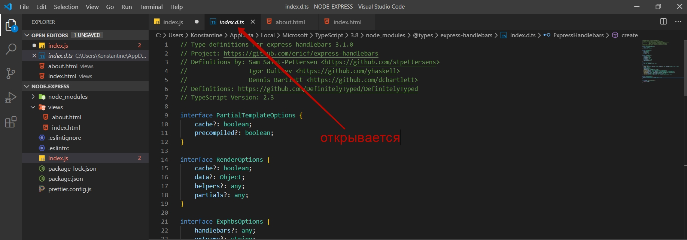
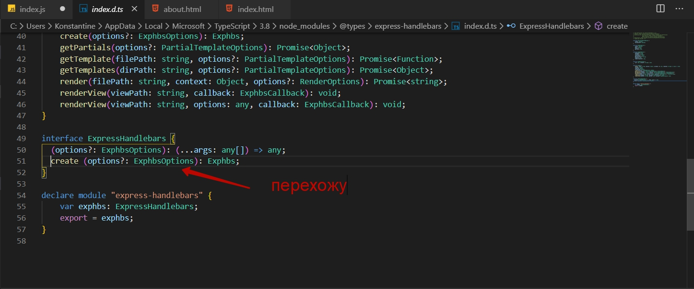
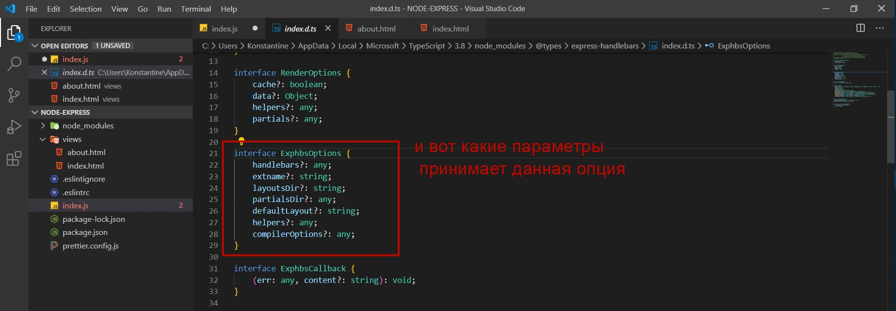
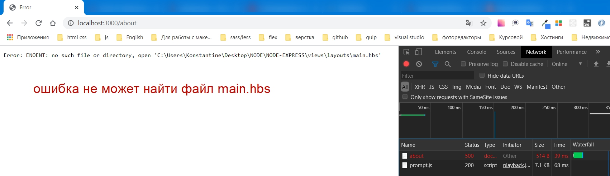
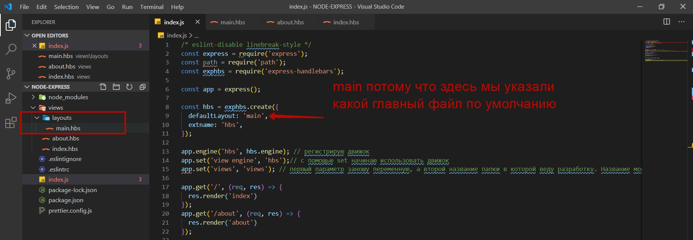
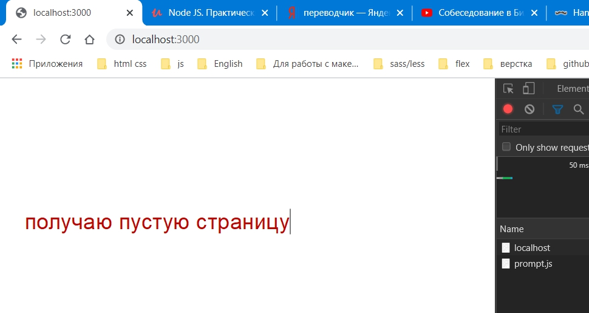
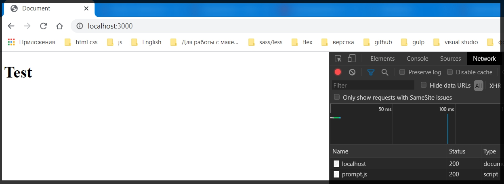

# Подключение Handlebars

Теперь рассмотрим какие есть движки что бы динамически составлять **html** файлы.
И насамом деле их существует большое количество. Мы же подчеркнем основные движки.

1. [pug.org](https://pugjs.org/api/getting-started.html)
2. [ejs.co](https://ejs.co/)
3. [handlebarsjs.com](http://handlebarsjs.com/)

Это основные движки которые позволяют достич большого количества функционала при создании и генерации **html** файлов.
В принципе они все очень похожи и в **Express** они крайне легко интегрируются. Единственное отличие у **pug** заключается в том что мы там вообще не пишем **html**, у него свой собственный синтаксис. Кому - то это нравится, кому - то нет.

Есть **EJS** он больше приближен к обычному **html** но при этом с помощью его конструкций мы можем выводить разные вещи, динамические какие - то состовляющие, переменные которые мы передаем и прочее.

И есть **Handlebars** который так же в себе содержит класический **html** но при этом благодаря вот таким конструкциям интерполяциям



мы можем выводить какую - то динамику.

В данном блоке мы будем разбирать **Handlebars** т.к. его подключать чуть сложнее. И по этому мы разберем как это все работает.

Например **EJS** встроен в ядро **Express** т.е. он по умолчанию там зарегистрирован. Нам только необходимо подключить пакет и не настраивать его на как.

C **Handlbars**  дела обстоят чуть сложнее но так как тут класический **html** мы будем рассматривать именно его.

Для того что бы подключить **handlebars** в проект в поиске браузера вбиваю **express-handlebars** и захожу на сайт [npm](https://www.npmjs.com/package/express-handlebars)

На данном сайте имеются настройки и тд.

я копирую команду установки

> npm i express-handlebars

Ни каких флагов не ставлю.

После установки подключаю. Создаю переменную **exphbs** и с помощью функцию **require** я подключаю пакет который называется **express-handlebars**.


Далее после объекта **app** создаю новый объект где буду конфигурировать **handlebars**. После чего я буду его использовать.

Для этого создаю переменную **hbs** сокращенно от **handlebars**. Далее я обращаюсь к константе **exphb** и вызываю метод который называется **create({})** Куда передаю объект который я буду конфигурировать.

Какие опции передавать смотрим на сайте [npm](https://www.npmjs.com/package/express-handlebars), или же можно зажать  _**Ctrl и кликнуть по методу create**_ 





В нем есть _**ExphbsOptions так же Ctrl + клик**_. 





Однако сейчас мы настроим две опции. 
1. **defaultLayout**. По умолчанию основной **layout**(расположение) который мы будем использовать называется **main**. Т.е. в нашем приложении будет несколько **layout**.
2. Далее для того что бы сократить код мы передадим параметр **extname** это название **extention**(расширение). И название расширения будет **hbs**. Просто что бы каждый раз не писать **handlebars** я буду писать **hbs**.

```js
/* eslint-disable linebreak-style */
const express = require('express');
const path = require('path');
const exphbs = require('express-handlebars');

const app = express();

const hbs = exphbs.create({
  defaultLayout: 'main',
  extname: 'hbs',
});

app.get('/', (req, res) => {
  // res.status(200); у меня этот статус не работает
  res.sendFile(path.join(__dirname, 'views', 'index.html'));
});
app.get('/about', (req, res) => {
  // res.status(200); у меня этот статус не работает
  res.sendFile(path.join(__dirname, 'views', 'about.html'));
});

const PORT = process.env.PORT || 3000;

app.listen(PORT, () => {
  console.log(`Server is running on port ${PORT}`);
});
```

Теперь для того что бы зарегистрировать данный модуль **hbs** как движок для рендеринга **html** страниц я обращаюсь к объекту **app** и вызываю у него метом **engine()**. Первым параметром указываю название данного движка **hbs** по названию **extention**.
Вторым параметром передаю объкт **hbs** и у него есть поле которое называется **engine**

```js
/* eslint-disable linebreak-style */
const express = require('express');
const path = require('path');
const exphbs = require('express-handlebars');

const app = express();

const hbs = exphbs.create({
  defaultLayout: 'main',
  extname: 'hbs',
});

app.engine('hbs', hbs.engine); // регистрирую движок


app.get('/', (req, res) => {
  // res.status(200); у меня этот статус не работает
  res.sendFile(path.join(__dirname, 'views', 'index.html'));
});
app.get('/about', (req, res) => {
  // res.status(200); у меня этот статус не работает
  res.sendFile(path.join(__dirname, 'views', 'about.html'));
});

const PORT = process.env.PORT || 3000;

app.listen(PORT, () => {
  console.log(`Server is running on port ${PORT}`);
});
```

После этого необходимо указать еще два параметра. Для этого я вызываю **app** и его метод **set()**. И далее У **Express** есть определенный набор опций которые мы можем конфигурировать т.е. здесь у нас идет какое - то фиксированное название строки. И для того что бы указать какой **engine**(движок) мы будем использовать мы в параметрах **app.set** обращаюсь к полю **'view engine'**. Вторым параметром указываю название того **engine**(движка). Название движка должно совпадать, у нас это **hbs**.

```js
/* eslint-disable linebreak-style */
const express = require('express');
const path = require('path');
const exphbs = require('express-handlebars');

const app = express();

const hbs = exphbs.create({
  defaultLayout: 'main',
  extname: 'hbs',
});

app.engine('hbs', hbs.engine); // регистрирую движок
app.set('view engine', 'hbs');// с помощью set начинаю использовать движок

app.get('/', (req, res) => {
  // res.status(200); у меня этот статус не работает
  res.sendFile(path.join(__dirname, 'views', 'index.html'));
});
app.get('/about', (req, res) => {
  // res.status(200); у меня этот статус не работает
  res.sendFile(path.join(__dirname, 'views', 'about.html'));
});

const PORT = process.env.PORT || 3000;

app.listen(PORT, () => {
  console.log(`Server is running on port ${PORT}`);
});
```
Дальше есть еще одна переменная. Пишем еще **app.set()**, заносим эту переменную в первый параметр. Называется она **views**. 
Вторым параметром мы указываем название папки где будут храниться все шаблоны это будет папка **views**, для того что бы это было понятно что это можно настраивать.

```js
/* eslint-disable linebreak-style */
const express = require('express');
const path = require('path');
const exphbs = require('express-handlebars');

const app = express();

const hbs = exphbs.create({
  defaultLayout: 'main',
  extname: 'hbs',
});

app.engine('hbs', hbs.engine); // регистрирую движок
app.set('view engine', 'hbs');// с помощью set начинаю использовать движок
app.set('views', 'views'); // первый параметр заношу переменную, а второй название папки в которой веду разработку. Название может быть любым

app.get('/', (req, res) => {
  // res.status(200); у меня этот статус не работает
  res.sendFile(path.join(__dirname, 'views', 'index.html'));
});
app.get('/about', (req, res) => {
  // res.status(200); у меня этот статус не работает
  res.sendFile(path.join(__dirname, 'views', 'about.html'));
});

const PORT = process.env.PORT || 3000;

app.listen(PORT, () => {
  console.log(`Server is running on port ${PORT}`);
});
```
По идее у нас все готово для того что бы работать с **Handlebars**.

Далее файл **index.html** переименовываю в **index.hbs** и **about.html** в **about.hbs**. Шаблоны готовы.

Далее удаляю функцию **res.sendFile(path.join(__dirname, 'views', 'about.html'))**; т.к. она нам больше не нужна.

И для того что бы рендерить определенные таблицы я обращаюсь к функции **res.** и вызываю метод **render()** и в параметрах указываю название страницы которую необходимо отрендерить.

```js
/* eslint-disable linebreak-style */
const express = require('express');
const path = require('path');
const exphbs = require('express-handlebars');

const app = express();

const hbs = exphbs.create({
  defaultLayout: 'main',
  extname: 'hbs',
});

app.engine('hbs', hbs.engine); // регистрирую движок
app.set('view engine', 'hbs');// с помощью set начинаю использовать движок
app.set('views', 'views'); // первый параметр заношу переменную, а второй название папки в которой веду разработку. Название может быть любым

app.get('/', (req, res) => {
  res.render('index')
});
app.get('/about', (req, res) => {
 res.render('about')
});

const PORT = process.env.PORT || 3000;

app.listen(PORT, () => {
  console.log(`Server is running on port ${PORT}`);
});
```

_**Мы не указываем расширение, мы не указываем папку views, потому что мы этим занялись выше в**_ 

```js
// в этом блоке кода
app.engine('hbs', hbs.engine); 
app.set('view engine', 'hbs');
app.set('views', 'views');
```
**_Мы просто говорим как называется страница и рендерим ее_**

```js
// в этом блоке кода
app.get('/', (req, res) => {
  res.render('index')
});
app.get('/about', (req, res) => {
 res.render('about')
});
```
Проверяем как это все работает



И в действительности это основной **Layout**(расположение) которое мы должны использовать.

Для того что бы все работало создаю в папке **views** папку **layouts**. Название данной папки зарезервировано, поэтому здесь мы должны хранить именно те **layout** которые есть у нас в приложении. И пока в ней создаю файл который называется **main.hbs**.



Если в **defaultsLayout** будет другое название, то в папке **layouts** я указываю это название.

Сохраняю и проверяю в браузере.




Все дело в том что нам сейчас действительно нужно отконфигурировать **layuot** для того что бы наши страницы работали. И поэтому как он пустой то мы и загружаем пустой **view**. 
Но если мы в **main.hbs** что - то занесем то он нам это отобразит.

