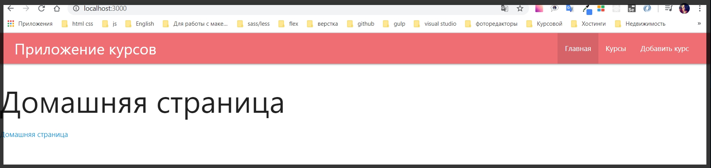
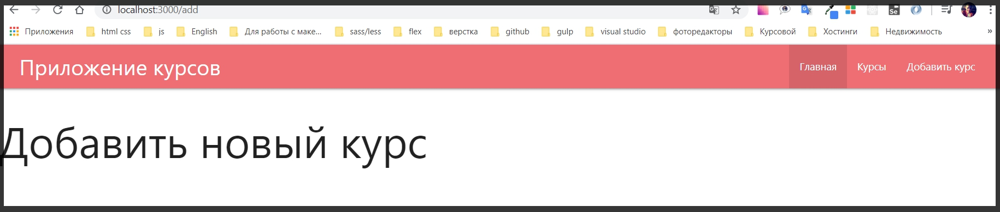
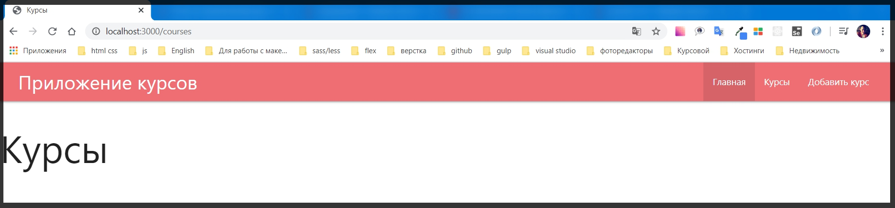
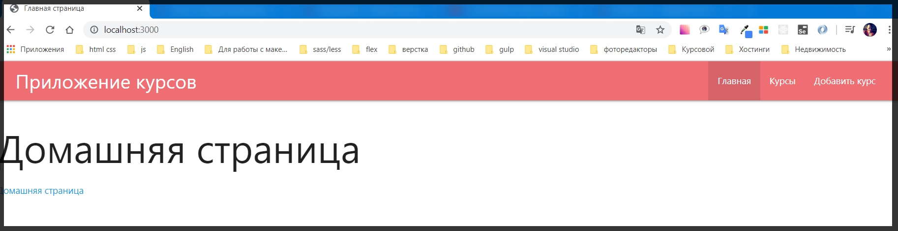
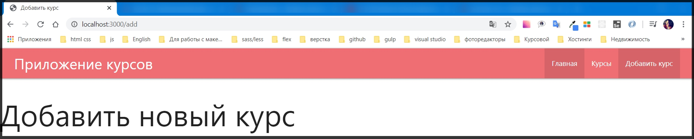
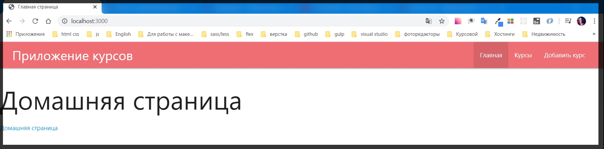
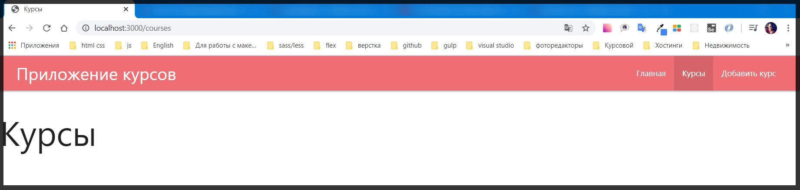
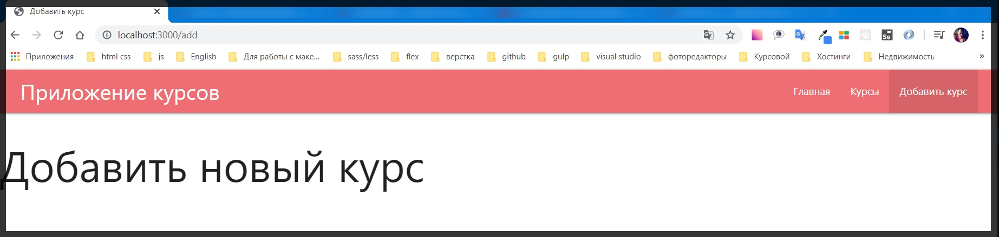

# Рендеринг данных

И так разбираемся как с помощью **Express handlebars** выводить динамические значения на странице.

На самом деле это делается крайне просто. 

К каждой странице которая есть у нас в приложении, пока их всего две **index.hbs** и **about**.hbs, мы создадим какой -нибудь динамический **title**.

Для начало удаляю страницу **about.hbs** она нам больше не потребуется.
И создаю две страницы **courses** и **add**. В папке **views** я создаю новый файл **courses.hbs** и в файле в заголовке **h1** указываю **Курсы**. И создаю файл **add.hbs**. Где также в заголовке указываю **Добавить новый курс**.

Далее необходимо добавить роуты для этих двух страниц. Поэтому в файле **index.js** 

```js
//index.js
/* eslint-disable linebreak-style */
const express = require('express');
const path = require('path');
const exphbs = require('express-handlebars');

const app = express();

const hbs = exphbs.create({
  defaultLayout: 'main',
  extname: 'hbs',
});

app.engine('hbs', hbs.engine); // регистрирую движок
app.set('view engine', 'hbs');// с помощью set начинаю использовать движок
app.set('views', 'views'); // первый параметр заношу переменную, а второй название папки в которой веду разработку. Название может быть любым

app.use(express.static('public')); // делаю папку public публичной а не динамической для того что бы express ее не обрабатывал

app.get('/', (req, res) => {
  res.render('index')
});
app.get('/about', (req, res) => {
  res.render('about')
});
app.get('/add', (req, res) => {
  res.render('add')
});
app.get('/courses', (req, res) => {
  res.render('courses')
});
const PORT = process.env.PORT || 3000;

app.listen(PORT, () => {
  console.log(`Server is running on port ${PORT}`);
});
```

И проверяю как это все работает.






Роутинг работает и я переключаюсь между страницами.

Теперь что  касается **title**. На самом деле все просто. 
Метод **render** вторым параметром принимает в себя объект, куда мы можем передавать различные опции и параметры для наших страниц. И Ключем данного объекта является переменная **title**, а его значением будет то что мы укажем, к примеру **Главная страница**. Главное запомнить как мы ее назвали для того что бы потом обратиться к ней в шаблоне.

```js
//index.js
/* eslint-disable linebreak-style */
const express = require('express');
const path = require('path');
const exphbs = require('express-handlebars');

const app = express();

const hbs = exphbs.create({
  defaultLayout: 'main',
  extname: 'hbs',
});

app.engine('hbs', hbs.engine); // регистрирую движок
app.set('view engine', 'hbs');// с помощью set начинаю использовать движок
app.set('views', 'views'); // первый параметр заношу переменную, а второй название папки в которой веду разработку. Название может быть любым

app.use(express.static('public')); // делаю папку public публичной а не динамической для того что бы express ее не обрабатывал

app.get('/', (req, res) => {
  res.render('index', {
    title: 'Главная страница',
  })
});

app.get('/add', (req, res) => {
  res.render('add', {
    title: 'Добавить курс',
  })
});
app.get('/courses', (req, res) => {
  res.render('courses', {
    title: 'Курсы',
  })
});
const PORT = process.env.PORT || 3000;

app.listen(PORT, () => {
  console.log(`Сервер запущен на порту ${PORT}`);
});
```
И дальше в каждой странице нам необходимо вывести эту переменную **title**. Но так как **title** у нас вынесен в отдельный файл **head.hbs** изменить **title** придется только там. Для этого в теге **title** просто указываю переменную **title** которая будет распаршена. И при роутинге на ту или иную страницу, данные будут распаршены и переданы в соответствии с маршрутом указанным в адресной строке.

```js
//head.hbs
<!DOCTYPE html>
<html lang="en">

<head>
    <meta charset="UTF-8">
    <meta name="viewport" content="width=device-width, initial-scale=1.0">
    <link rel="stylesheet" href="https://cdnjs.cloudflare.com/ajax/libs/materialize/1.0.0/css/materialize.min.css">
    <link rel="stylesheet" href="/index.css">
    <title>{{title}}</title>
</head>
```







Далее разберемся с активной ссылкой. С ней ситуация конечно немного сложнее. 

И для начало необъходимо создать еще один параметр для наших страниц. И в объект метода **render**, вторым ключ значением будем передавать булево значение, создаю ключ **isHome** и по умолчанию для главной страницы это будет true.

Для страницы добавления курса в объекте **render** мы допустим зададим переменную **isAdd** и по умолчанию она будет так же **true**.
И тоже самое сделаем для курсов. Во второй параметр метода **render**, где у нас объект, передам переменную **isCourses** со значением **true**. 


```js
//index.js
/* eslint-disable linebreak-style */
const express = require('express');
const path = require('path');
const exphbs = require('express-handlebars');

const app = express();

const hbs = exphbs.create({
  defaultLayout: 'main',
  extname: 'hbs',
});

app.engine('hbs', hbs.engine); // регистрирую движок
app.set('view engine', 'hbs');// с помощью set начинаю использовать движок
app.set('views', 'views'); // первый параметр заношу переменную, а второй название папки в которой веду разработку. Название может быть любым

app.use(express.static('public')); // делаю папку public публичной а не динамической для того что бы express ее не обрабатывал

app.get('/', (req, res) => {
  res.render('index', {
    title: 'Главная страница',
    isHome: true,
  })
});

app.get('/add', (req, res) => {
  res.render('add', {
    title: 'Добавить курс',
    isAdd: true,
  })
});
app.get('/courses', (req, res) => {
  res.render('courses', {
    title: 'Курсы',
    isCourses: true,
  })
});
const PORT = process.env.PORT || 3000;

app.listen(PORT, () => {
  console.log(`Сервер запущен на порту ${PORT}`);
});
```

Т.е. теперь для каждой страницы у нас есть уникальная переменная которую мы каким - то образом должны обработать.
И в **navbars.hbs**  мы поступаем следующим образом.
И в этом файле я должен воспользоваться циклом **if else**. Пишем мы его так же в двойных фигурных скобках. Для того что бы обратиться к **if** мы должны указать знак **#** и после его указываем к чему обращаемся, в данном случае **if**. После **if** сразу указываю переменную к которой хочу обратиться. Из - за того что мы указываем данное условие в фигурных скобках, переменная из условия распарсивается и выводит значение **true** которое я указал. Под условием я прописываю ссылку, т.е. указываю как в теле цикла **if** то что будет являться истиной, а именно ссылка с классом **active**.
А если же данное значение не соответствует истене то в блоке **else** прописываю ту же ссылку только без класса **active**.
Для того что бы закончить цикл я в двойных фигурных скобках указываю **/if**.

И данную конструкцию повторяю для каждой страницы.

```js
//navbar.hbs
<nav>
    <div class="nav-wrapper">
        <a href="#" class="brand-logo">Приложение курсов</a>
        <ul id="nav-mobile" class="right hide-on-med-and-down">

            {{#if isHome}}
            <li class="active"><a href="/">Главная</a></li>
            {{else}}
            <li><a href="/">Главная</a></li>
            {{/if}}

            {{#if isCourses}}
            <li class="active"><a href="/courses">Курсы</a></li>
            {{else}}
            <li><a href="/courses">Курсы</a></li>
            {{/if}}

            {{#if isAdd}}
            <li class="active"><a href="/add">Добавить курс</a></li>
            {{else}}
            <li><a href="/add">Добавить курс</a></li>
            {{/if}}
        </ul>
    </div>
</nav>
```

Теперь если я обновлю приложение то теперь при переходе по ссылке мы подсвечиваем активную ссылку.








> Про различные конструкции циклов и не только можно почитать на официальном сайте [handlebarse](https://handlebarsjs.com/guide/#what-is-handlebars).