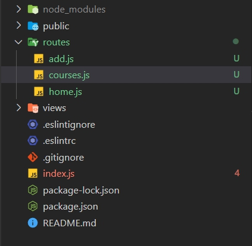

# Регистрация роутов

Сейчас если посмотрим на приложение, а конкретно на файл **index.js**, то мы увидим небольшую проблему.
Связана она с тем что мы прописывам логику для каждой страницы прямо внутри этого файла.
И безусловно понятно что логиги у нас почти нет, но при этом файл занимает достаточно много место и будет сложно в нем ориентироваться. 
Поэтому мы можем декомпозировать данную логику использую **Router**.

Для этого я в корне приложения создаю папку **routes**. И в этой папке я создаю еще три файла, **home.js, add.js, courses.js**.



И в этих файлах я воспользуюсь роутом для того что бы описывать каждый роут. И после этого вынести логику из файла и использовать в данном **index.js** один объект.

К каждому файлу подключаю роутер.

```js
//home.js,add.js,courses.js
const { Router } = require('express');
```
После этого необходимо создать объект роутера. И создаю его с помощью функции Router().

```js
const { Router } = require('express');

const router = Router();
```

И после этого нужно экспортировать наружу объект роутер

```js
const { Router } = require('express');

const router = Router();

module.exports = router;
```

Теперь я могу у **router** вызывать различные методы например **get**.

```js
//home.js
const { Router } = require('express');

const router = Router();


router.get('/', (req, res) => {

});

module.exports = router;
```
Передаю **callback** функцию в параметры которой передаю **request** и **responce**. У уже в теле **callback** функции описывать конкретный **route**. Вырезаю из **index.js** и вставляю в **home.js**. 

Пример главной страницы.

```js
//home.js
const { Router } = require('express');

const router = Router();


router.get('/', (req, res) => {
    res.render('index', {
        title: 'Главная страница',
        isHome: true,
    })
});

module.exports = router;
```

```js
// courses.js
const { Router } = require('express');

const router = Router();

router.get('/courses', (req, res) => {
    res.render('courses', {
        title: 'Курсы',
        isCourses: true,
    })
})

module.exports = router;
```

```js
//add.js
const { Router } = require('express');

const router = Router();

router.get('/add', (req, res) => {
    res.render('add', {
        title: 'Добавить курс',
        isAdd: true,
    })
})

module.exports = router;
```

Теперь для того что бы приложение работало. Все функции **app.get** из **index.js** я удаляю.

И после необходимо импортировать все роуты в **index.js**

```js
//index.js
/* eslint-disable linebreak-style */
const express = require('express');
const path = require('path');
const exphbs = require('express-handlebars');

const homeRoutes = require('./routes/home');
const addRouters = require('./routes/add');
const coursesRotes = require('./routes/courses');

const app = express();

const hbs = exphbs.create({
  defaultLayout: 'main',
  extname: 'hbs',
});

app.engine('hbs', hbs.engine); // регистрирую движок
app.set('view engine', 'hbs');// с помощью set начинаю использовать движок
app.set('views', 'views'); // первый параметр заношу переменную, а второй название папки в которой веду разработку. Название может быть любым

app.use(express.static('public')); // делаю папку public публичной а не динамической для того что бы express ее не обрабатывал


const PORT = process.env.PORT || 3000;

app.listen(PORT, () => {
  console.log(`Сервер запущен на порту ${PORT}`);
});

```

И теперь для того что бы использовать данные роуты просто обращаюсь к **app** его методу **use** и в его параметры передаю импортированную костанту.

```js
//index.js
/* eslint-disable linebreak-style */
const express = require('express');
const path = require('path');
const exphbs = require('express-handlebars');

const homeRoutes = require('./routes/home');
const addRouters = require('./routes/add');
const coursesRotes = require('./routes/courses');

const app = express();

const hbs = exphbs.create({
  defaultLayout: 'main',
  extname: 'hbs',
});

app.engine('hbs', hbs.engine); // регистрирую движок
app.set('view engine', 'hbs');// с помощью set начинаю использовать движок
app.set('views', 'views'); // первый параметр заношу переменную, а второй название папки в которой веду разработку. Название может быть любым


app.use(express.static('public')); // делаю папку public публичной а не динамической для того что бы express ее не обрабатывал
app.use(homeRoutes); // использую импортированный роут
app.use(addRouters); // использую импортированный роут
app.use(coursesRotes); // использую импортированный роут

const PORT = process.env.PORT || 3000;

app.listen(PORT, () => {
  console.log(`Сервер запущен на порту ${PORT}`);
});

```


Это первый вариант как мы можем это сделать.

Сейчас что бы узнать какой путь у каждого роута мне придется переходить из **index.js** в каждый из этих роутов. Однако и у этой проблемы есть решение.

Это можно исправить с пропощью префикса. 

Для этого в **app.use**, где я вывожу роуты, первым параметром я могу указать путь, который будет являться префиксом пути для этих роутов.

```js
//index.js
/* eslint-disable linebreak-style */
const express = require('express');
const path = require('path');
const exphbs = require('express-handlebars');

const homeRoutes = require('./routes/home');
const addRouters = require('./routes/add');
const coursesRotes = require('./routes/courses');

const app = express();

const hbs = exphbs.create({
  defaultLayout: 'main',
  extname: 'hbs',
});

app.engine('hbs', hbs.engine); // регистрирую движок
app.set('view engine', 'hbs');// с помощью set начинаю использовать движок
app.set('views', 'views'); // первый параметр заношу переменную, а второй название папки в которой веду разработку. Название может быть любым


app.use(express.static('public')); // делаю папку public публичной а не динамической для того что бы express ее не обрабатывал
app.use('/', homeRoutes); // использую импортированный роут
app.use('/add', addRouters); // использую импортированный роут
app.use('/courses', coursesRotes); // использую импортированный роут

const PORT = process.env.PORT || 3000;

app.listen(PORT, () => {
  console.log(`Сервер запущен на порту ${PORT}`);
});
```

И теперь мне нужно поправить роуты потому что если сейчас я попробую зайти на любую страницу, то у меня это не получится так как для удачного перехода мне придется прописывать двойной путь.

>http://localhost:3000/courses/courses

Такие пути меня не устраивают. В **index.js** я задаю префиксы, В файлах **home.js, courses.js, add.js**  так же остаются префиксы. Во всех этих файлах оставляю просто **/**

```js
//add.js
const { Router } = require('express');

const router = Router();

router.get('/', (req, res) => {
    res.render('add', {
        title: 'Добавить курс',
        isAdd: true,
    })
})

module.exports = router;
```

```js
//courses.js
const { Router } = require('express');

const router = Router();

router.get('/', (req, res) => {
    res.render('courses', {
        title: 'Курсы',
        isCourses: true,
    })
})

module.exports = router;
```

```js
//home.js
const { Router } = require('express');

const router = Router();


router.get('/', (req, res) => {
    res.render('index', {
        title: 'Главная страница',
        isHome: true,
    })
});

module.exports = router;
```

И приложение не поломалось, все работает.
