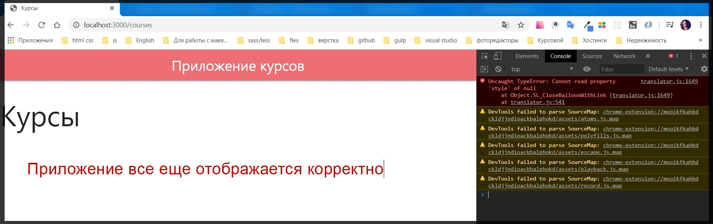
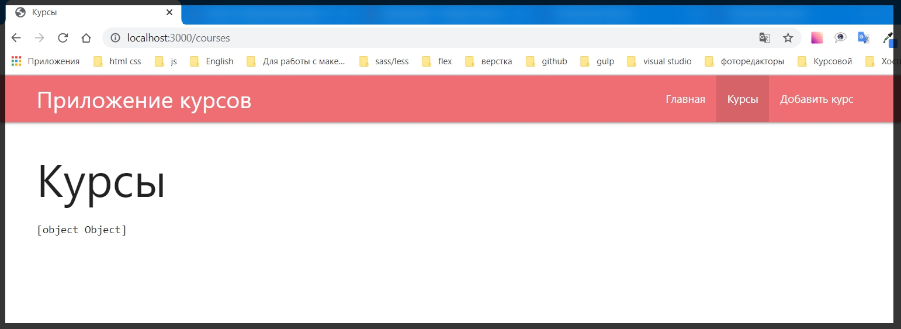
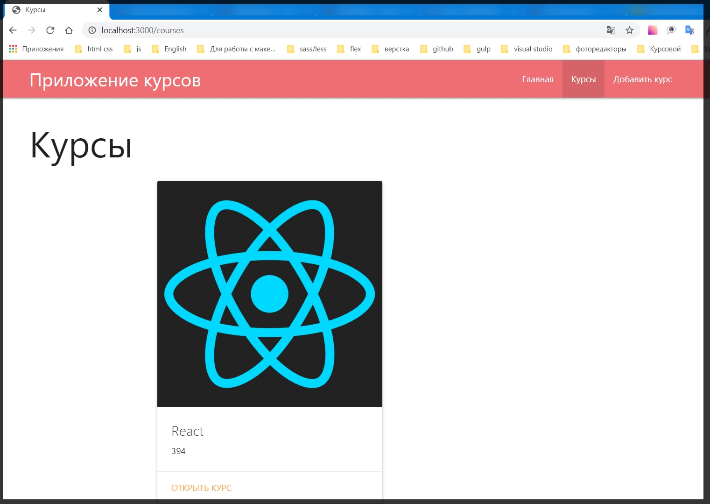

# Вывод списка курсов.

Вывожу список курсов которые есть в имитируемом файле базы курсов **course.js**.

Для этого захожу в папку **routes** и в файл **courses.js**.

```js
//courses.js
const { Router } = require('express')
const router = Router()

router.get('/', (req, res) => {
    res.render('courses', {
        title: 'Курсы',
        isCourses: true
    })
})

module.exports = router
```

И у нас есть метод **get** который выдает  страницу **courses**.

Для начало для того что бы отрендерить данную страницу корректно, нам необходимо получить список этих курсов из файла. Поэтому подключаю этот файл **const Course = require('../models/course')**. Далее делаю асинхронным данный метод.

```js
//courses.js
const { Router } = require('express')
const Course = require('../models/course')
const router = Router()

router.get('/', async (req, res) => {
    res.render('courses', {
        title: 'Курсы',
        isCourses: true
    })
})

module.exports = router
```

C помощью этого создаю объект **courses**, с помощью оператора **await** обращаюсь к модели **Course** и достаю курс с помощью метода **getAll()**. **const courses = await Course.getAll()**

```js
// courses.js
const { Router } = require('express')
const Course = require('../models/course')
const router = Router()

router.get('/', async (req, res) => {
    const courses = await Course.getAll()
    res.render('courses', {
        title: 'Курсы',
        isCourses: true
    })
})

module.exports = router
```

После этого по сути я просто передаю данный объект на страницу

```js
// courses.js
const { Router } = require('express')
const Course = require('../models/course')
const router = Router()

router.get('/', async (req, res) => {
    const courses = await Course.getAll()// создаю объект курсов и вытаскиваю их все
    res.render('courses', {
        title: 'Курсы',
        isCourses: true,
        courses // добавляю данный объект на страницу
    })
})

module.exports = router
```

Обновляем страницу и смотрим есть ли ошибки.



Далее нужно придумать какой - нибудь шаблон который будет отвечать за вывод всех курсов. Который должен содержать в себе еще и картинку.

Пока выведу без шаблона, просто какие - то данные.

Перехожу в **courses.hbs**.

Для начало нужно проверить есть ли какие - то курсы, а если нет то ничего не выводить.

```js
{{!-- courses.hbs --}}
<h1>Курсы</h1>

{{#if courses.length}}
<pre>{{courses}}</pre> // pre сохраняет форматирование
{{else}}
<p>Курсы пока не добавлены</p>
{{/if}}
```

И посмотрим что он выведет.



И получаем некоторый объект. И на самом деле это замечательно потому что у меня есть один курс, поэтому он представлен ввиде объекта и я могу им воспользоваться.

Перехожу к **materialize** и нахожу компонент [Cards](https://materializecss.com/cards.html)

И нахожу подходящий под себя **card** с картинкой. И далее вместо тега **pre** я просто вставляю скопированный шаблон.

Со вставленным шаблоном

```js
{{!-- courses.hbs --}}
<h1>Курсы</h1>

{{#if courses.length}}
<div class="row">
    <div class="col s12 m7">
        <div class="card">
            <div class="card-image">
                
                <span class="card-title">Card Title</span>
            </div>
            <div class="card-content">
                <p>I am a very simple card. I am good at containing small bits of information.
                    I am convenient because I require little markup to use effectively.</p>
            </div>
            <div class="card-action">
                <a href="#">This is a link</a>
            </div>
        </div>
    </div>
</div>
{{else}}
<p>Курсы пока не добавлены</p>
{{/if}}
```
Редактирую его под себя

```js
{{!-- courses.hbs --}}
<h1>Курсы</h1>

{{#if courses.length}}
<div class="row">
    <div class="col s12 m7">
        <div class="card">
            <div class="card-image">
                
            </div>
            <div class="card-content">
                <span class="card-title">Card Title</span>
                <p class="price"></p>
            </div>
            <div class="card-action">
                <a href="#">Открыть курс</a>
            </div>
        </div>
    </div>
</div>
{{else}}
<p>Курсы пока не добавлены</p>
{{/if}}
```

Теперь по сути мне нужно проитерировать массив курсов и для каждого элемента задать такой шаблон.

C помощью цикла **each** в **handlebars** указываю название массива который хочу проитерировать. И когда цикл заканчивается просто закрываю его **{{/each}}**.

```js
{{!-- courses.hbs --}}
<h1>Курсы</h1>

{{#if courses.length}}
{{#each courses}}
<div class="row">
    <div class="col s12 m7">
        <div class="card">
            <div class="card-image">
                
            </div>
            <div class="card-content">
                <span class="card-title">Card Title</span>
                <p class="price"></p>
            </div>
            <div class="card-action">
                <a href="#">Открыть курс</a>
            </div>
        </div>
    </div>
</div>
{{/each}}
{{else}}
<p>Курсы пока не добавлены</p>
{{/if}}
```

Теперь в рамках данного блока мне доступен объект который относится к **courses**. И теперь я обращаюсь к его определенному полю. В **img** его атрибуте **src** вывожу значение **{{img}}** и так же задаю значение атрибута **alt = {{title}}** который будет относиться к каждому курсу. 
В классе  **card-title** я вывожу **{{title}}**, в классе **price**  вывожу **{{prise}}**. И дальше сформирую ссылку которую будет открывать курс, пока что такого роута нет **href="/courses/{{id}}"**.

```js
{{!-- courses.hbs --}}
<h1>Курсы</h1>

{{#if courses.length}}
{{#each courses}}
<div class="row">
    <div class="col s12 m7">
        <div class="card">
            <div class="card-image">
                
            </div>
            <div class="card-content">
                <span class="card-title">{{title}}</span>
                <p class="price">{{price}}</p>
            </div>
            <div class="card-action">
                <a href="/courses/{{id}}">Открыть курс</a>
            </div>
        </div>
    </div>
</div>
{{/each}}
{{else}}
<p>Курсы пока не добавлены</p>
{{/if}}
```

Курс добавлен и корректно отображается



Для эксперемента добавлю еще один курс.

И второй курс так же добавляется. Это хорошо, я получаю данные из файла который для приложения является базой данных.

Далее необходимо реализовать кнопку Открыть Курс. В цене необходимо задать название валюты и форматировать ее именно как валюту.