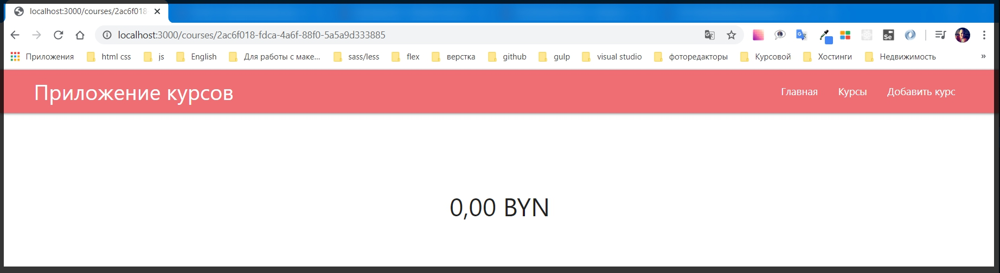
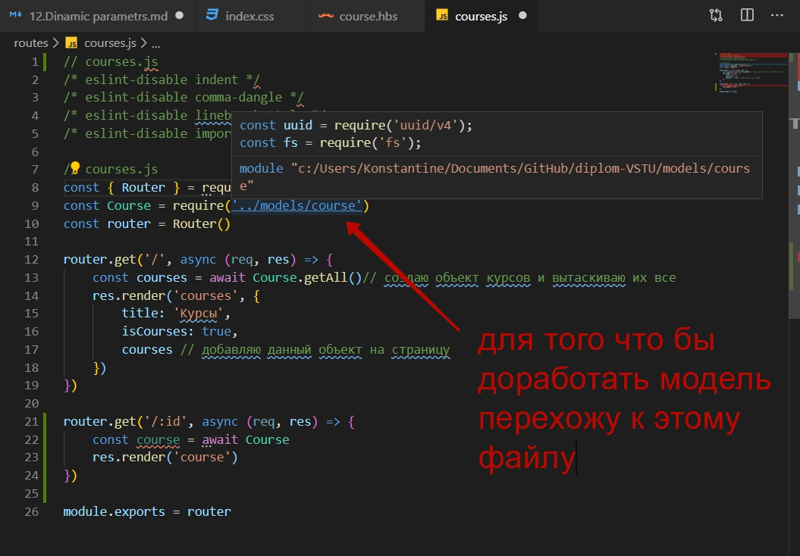
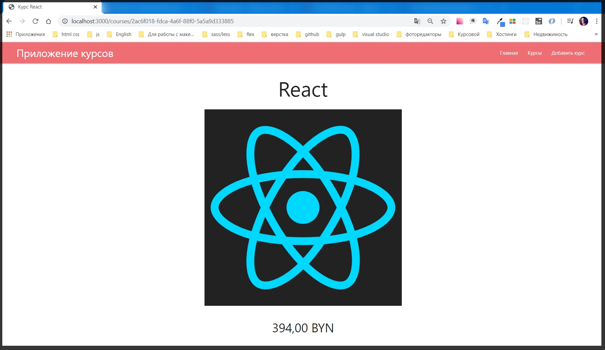
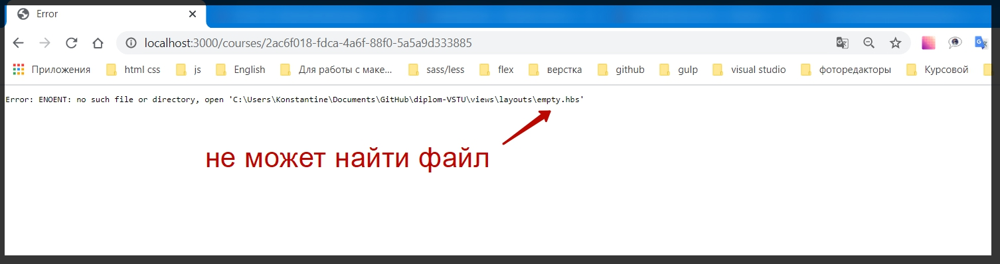

# Динамические параметры

В приложении до сих пор не работает кнопка открыть курс. Если попробовать перейти то мы получим ошибку от **Express** что нет такого роута. И причем в ошибке содержится **id** того курса на который нажали.


Если открою другой курс то там будет абсолютно другой роут.


 По этому нужно каким - то образом обрабатывать динамические параметры.

 И для этого в **Express** есть очень удобный синтаксис.
 Перехожу в папку **route** в файл **сourses.js**. И в нем обрабатываю новый **GET** запрос.

 Обращаюсь к **route** его методу **get()**. В параметры передаю адрес который я хочу обработать т.е. слэш **/** , напоминаю что у нас есть префикс ввиде **courses**, и для того что бы обработать какую - то динамику мы ставим просто **:** и после него передаю название того парамета который будет являться динамичным. 
 Следующим параметром как обычно передаю **callback** функцию принимающая в себя **request** и **responce**. И далее в **res** необходимо отрендерить данную страницу. После **res** прописываю его метод **render()** и в параметры прописываю название страницы **course** 

 ```js
// courses.js
const { Router } = require('express')
const Course = require('../models/course')
const router = Router()

router.get('/', async (req, res) => {
    const courses = await Course.getAll()// создаю объект курсов и вытаскиваю их все
    res.render('courses', {
        title: 'Курсы',
        isCourses: true,
        courses // добавляю данный объект на страницу
    })
})

router.get('/:id', (req, res) => {
    res.render('course')
})

module.exports = router
```

И теперь нужно создать нужную страницу. В папке **views** создаю новый файл **course.hbs**.

И в нем зададим какую - то простую разметку.

```js
{{!-- course.hbs --}}
<div class="course">
    <h1>{{course.title}}</h1>
    

    <p class="price big">{{course.price}}</p>
</div>
```

Теперь пропишу стили для данной страницы. Потому что я здесь буду использовать обсалютно другой **Layout** без нужных стилизаций.
Для этого перехожу в папку **public** в **index.css**.

```css
.course{
    width: 100%;
    display: flex;
    flex-direction: column;
    align-items: center;
}

.course h1{
    margin-bottom: 2rem;
}

.course img{
    max-width: 600px;
    height: auto;
}

.course .price.big{
    font-size: 2.5em;
}
```
Шаблон готов, стили тоже готовы. В ответе мы рендерим страницу. 
И при переходе на Посмотреть курс мы действительно получаем какой - то шаблон.



Пока цены ни какой нет потому что мы не достаем из БД тот курс который нужен. Поэтому для начала необходимо получить тот объект который мы должны отрендерить на основе **id** который получаем.
Для этого с колбэком нужно работать асинхронно. После этого в теле **callback** создаю объект **course =** и курсы получаю с помощью оператора **await** и обращения к модели **Course**. 

```js
// courses.js
const { Router } = require('express')
const Course = require('../models/course')
const router = Router()

router.get('/', async (req, res) => {
    const courses = await Course.getAll()// создаю объект курсов и вытаскиваю их все
    res.render('courses', {
        title: 'Курсы',
        isCourses: true,
        courses // добавляю данный объект на страницу
    })
})

router.get('/:id', async (req, res) => {
    const course = await Course
    res.render('course')
})

module.exports = router
```


И здесь необходимо получить тот единственный курс по **id**. Для этого необходимо доработать немного модель.



В этом файле уже есть статический метод **getAll**. И теперь так же по аналогии реализую метод **getById(){}**. В параметр передаю **id**.  В теле функции обращаюсь к модели **Course** и вызываю метод **getAll()** для того что бы получить все курсы. Но не забываем что с помощью оператора **await** мы будем ждать и оборачиваем функцию **assync**. И **await Course.getAll()** присваиваю константе **courses**.
После этого нужно вернуть тот единственный курс который я хочу получить. Т.е. я обращаюсь к **return** далее обращаюсь к массиву курсов **courses**. и спомощью метода **find()**, в параметрах которого провожу итерацию где сравниваю если курс **id** эквивалентен **id** то тогда возвращаем **id (c => c.id === id)**.

```js 
// кусок
 static async getById(id) {
        const courses = await Course.getAll()
        return courses.find((c) => c.id === id)
    }
```

Полный код

```js
// course.js

const uuid = require('uuid/v4');
const fs = require('fs');
const path = require('path');

class Course {
    constructor(title, price, img) {
        this.title = title
        this.price = price
        this.img = img
        this.id = uuid()
    }

    toJSON() {
        return {
            title: this.title,
            price: this.price,
            img: this.img,
            id: this.id,
        }
    }

    async save() {
        const courses = await Course.getAll()
        courses.push(this.toJSON())

        return new Promise((resolve, reject) => {
            fs.writeFile(
                path.join(__dirname, '..', 'data', 'courses.json'),
                JSON.stringify(courses),
                (err) => {
                    if (err) {
                        reject(err)
                    } else {
                        resolve()
                    }
                },
            )
        })
    }

    static getAll() {
        return new Promise((resolve, reject) => {
            fs.readFile(
                path.join(__dirname, '..', 'data', 'courses.json'),
                'utf-8',
                (err, content) => {
                    if (err) {
                        reject(err)
                    } else {
                        resolve(JSON.parse(content))
                    }
                },
            )
        })
    }

    static async getById(id) {
        const courses = await Course.getAll()
        return courses.find((c) => c.id === id)
    }
}

module.exports = Course
```
После этого в файле **course.js**  в костанте **сourse** в методе **Сourse** вызываю метод **getById()** и в его параметр передаю динамический **id**, а хранится он в объекте **req.params.id**

```js
// кусок
router.get('/:id', async (req, res) => {
    const course = await Course.(req.param.id)
    res.render('course')
})
```

Полный файл

```js
// courses.js
const { Router } = require('express')
const Course = require('../models/course')
const router = Router()

router.get('/', async (req, res) => {
    const courses = await Course.getAll()// создаю объект курсов и вытаскиваю их все
    res.render('courses', {
        title: 'Курсы',
        isCourses: true,
        courses // добавляю данный объект на страницу
    })
})

router.get('/:id', async (req, res) => {
    const course = await Course.getById(req.params.id)
    res.render('course')
})

module.exports = router
```

Далее в **res.render** вторым параметром передаю объект с полями **title: `Курс ${course.title}`**, И далее не забываем передать сам **course**. 

И вот я получаю нужный мне курс



и так **title** сформирован правильно и все данные которые относятся к курсу отображаются корректно.

Но было бы не плохо вынести все в отдельный **Layout** для того что бы вообще показать как создаются отдельные **Layout** - ты и вообще что бы курс открывался в отдельной странице. 

Для этого достаточно передать еще одно свойство в объект метода **render** который называется **layout** и допустим **layout** назовем **empty** 

```js
// courses.js
const { Router } = require('express')
const Course = require('../models/course')
const router = Router()

router.get('/', async (req, res) => {
    const courses = await Course.getAll()// создаю объект курсов и вытаскиваю их все
    res.render('courses', {
        title: 'Курсы',
        isCourses: true,
        courses // добавляю данный объект на страницу
    })
})

router.get('/:id', async (req, res) => {
    const course = await Course.getById(req.params.id)
    res.render('course', {
        layout: 'empty',
        title: `Курс ${course.title}`,
        course
    })
})

module.exports = router
```

И теперь если я обновлю страницу то получу ошибку.



**handlebars** не может найти файл с названием **empty.hbs**. Для этого в папке **layot** создаю данный файл

```js
{{!-- empty.hbs --}}
{{>head}}

<body>
    {{{body}}}
    {{>footer}}
</body>

</html>
```

И в файле **сourses.hbs** в ссылке _**Открыть курс**_ я добавляю новый атрибут **target="_blank"**.


И вот теперь курс отображается на новой странице. 

_**Мы здесь рендерим обсалютно новый layout при этом мы находимся в том же приложении. Т.е. допустим мы можем убирать navbar задавать sidebar и т.д.**_

