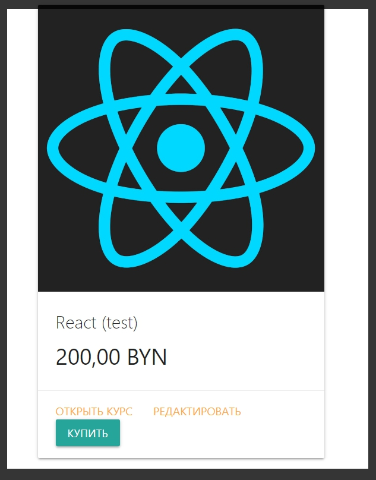

# Вывод данных в корзину

Реализую шаблон который будет выводить данные внутри корзины.

Перехожу в файл **card.hbs** где буду прописывать данную логику.

По сути для начало нужно проверить есть ли что - то внутри корзины. Если у объекта **courses**. который я передаю в данный файл, **length** не равняется **0**, то тогда мы будем выводить контент.

А иначе **else** мы покажем сообщение что **Корзина пуста**.

```js
{{!  views card.hbs }}
<h1>
  Корзина
</h1>

{{#if courses.length}}
<table>
  <thead>
    
  </thead>
</table>
{{else}}
<p>Корзина пуста</p>
{{/if}}
```

И предположим в строчке **tr** будет три столбика

```js
{{!  views card.hbs }}
<h1>
  Корзина
</h1>

{{#if courses.length}}
<table>
  <thead>
    <tr>
      <th>Название курса</th>
      <th>Количество</th>
      <th>Действия</th>
    </tr>
  </thead>
</table>
{{else}}
<p>Корзина пуста</p>
{{/if}}
```
После этого реализовываю тег **body**. Далее потребуется строка **tr** где будет три тега **td**.

```js
{{!  views card.hbs }}
<h1>
  Корзина
</h1>

{{#if courses.length}}
<table>
  <thead>
    <tr>
      <th>Название курса</th>
      <th>Количество</th>
      <th>Действия</th>
    </tr>
  </thead>
  <body>
    <tr>
    <td></td>
    <td></td>
    <td></td>
   </tr>
  </body>
</table>
{{else}}
<p>Корзина пуста</p>
{{/if}}
```

Далее мы будем с помощью **handlebarse** итерировать массив курсов. Обращаюсь к циклу **each** и массиву **courses**.

```js
{{!  views card.hbs }}
{{!-- card.hbs --}}
<h1>
  Корзина
</h1>

{{#if courses.length}}
<table>
  <thead>
    <tr>
      <th>Название курса</th>
      <th>Количество</th>
      <th>Действия</th>
    </tr>
  </thead>
  <body>
    {{#each courses}}
   <tr>
    <td></td>
    <td></td>
    <td></td>
   </tr>
   {{/each}}
  </body>
</table>
{{else}}
<p>Корзина пуста</p>
{{/if}}
```
Теперь на каждой итерации я получаю поля данного массива. Ну и посути просто их вывожу.


```js
{{!  views card.hbs }}
{{!-- card.hbs --}}
<h1>
  Корзина
</h1>

{{#if courses.length}}
<table>
  <thead>
    <tr>
      <th>Название курса</th>
      <th>Количество</th>
      <th>Действия</th>
    </tr>
  </thead>
  <body>
    {{#each courses}}
   <tr>
    <td>{{title}}</td>
    <td>{{count}}</td>
    <td>
      <button class="btn btn-small">Удалить</button>
    </td>
   </tr>
   {{/each}}
  </body>
</table>
{{else}}
<p>Корзина пуста</p>
{{/if}}
```

Пока что удаление я не буду реализовывать. 

После табилцы в параграфе вывожу цену 

```js
{{!  views card.hbs }}
{{!-- card.hbs --}}
<h1>
  Корзина
</h1>

{{#if courses.length}}
<table>
  <thead>
    <tr>
      <th>Название курса</th>
      <th>Количество</th>
      <th>Действия</th>
    </tr>
  </thead>
  <body>
    {{#each courses}}
   <tr>
    <td>{{title}}</td>
    <td>{{count}}</td>
    <td>
      <button class="btn btn-small">Удалить</button>
    </td>
   </tr>
   {{/each}}
  </body>
</table>
<p><strong>Цена:</strong> <span class="price">{{price}}</span></p>
{{else}}
<p>Корзина пуста</p>
{{/if}}
```



Количество курсов увеличивается. Цена суммируется.

На примере кнопки удалить посмотрим как работать с асинхронными событиями. Т.е. создадим функционал который будет динамически удалять элементы из корзины.