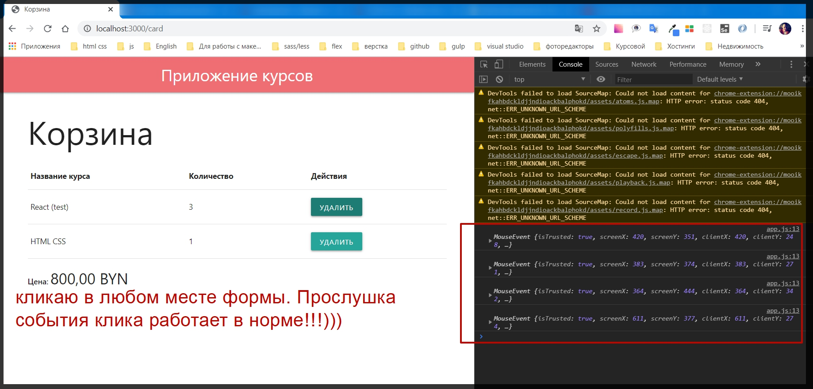
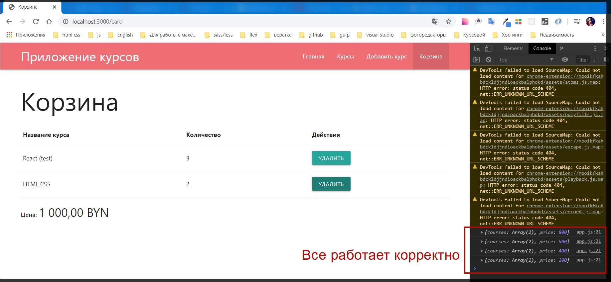

# Обработка асинхронных запросов.

На примере кнопки удалить посмотрим как работать с асинхронными событиями. Т.е. создадим функционал который будет динамически удалять элементы из корзины.

Для этого потребуется реализовывать клиентский скрипт который будет отправлять [AJAX](https://habr.com/ru/post/14246/) запросы.

Для начало необходимо добавить обработчик событий на данную кнопку

```js
<button class="btn btn-small">Удалить</button>
```

Для этого я могу добавить класс js-remove

```js
<button class="btn btn-small js-remove">Удалить</button>
```

Cледующий атрибут который я добавлю будет **data-id** что бы определить какой именно курс необходимо удалить.

```js
<button class="btn btn-small js-remove" data-id="{{id}}">
  Удалить
</button>
```

Дальше для того что бы не добавлять обработчик событий на каждую кнопку отдельно, весь код в **card.hbs** я оборачиваю в

```js
<div id="card"></div>
```

кроме заголовка **h1**

```js
{{!  views card.hbs }}
{{! card.hbs }}
<h1>
  Корзина
</h1>

<div id="card">
{{#if courses.length}}
  <table>
    <thead>
      <tr>
        <th>
          Название курса
        </th>
        <th>
          Количество
        </th>
        <th>
          Действия
        </th>
      </tr>
    </thead>
    <body>
      {{#each courses}}
        <tr>
          <td>
            {{title}}
          </td>
          <td>
            {{count}}
          </td>
          <td>
            <button class="btn btn-small js-remove" data-id="{{id}}">
              Удалить
            </button>
          </td>
        </tr>
      {{/each}}
    </body>
  </table>
  <p>
    <strong>
      Цена:
    </strong>
    <span class="price">
      {{price}}
    </span>
  </p>
{{else}}
  <p>
    Корзина пуста
  </p>
{{/if}}
</div>
```

Это будет корневой родительский **div** по которому мы будем добавлять обработчик событий.

Далее захожу в папку **public**.

> Точнее сначало исправляю ошибку котору допустил ранее в **index.js**. В нем я указываю что папка **public** является статической, но на самом деле правильнее будет обратиться через модуль **path** к данной папке что бы избежать некоторых ошибок.

```js
app.use(express.static(path.join(__dirname, 'public'))); // делаю папку public публичной а не динамической для того что бы express ее не обрабатывал
```

Полный

```js
// index.js

const express = require('express');
const path = require('path');
const exphbs = require('express-handlebars');

const homeRoutes = require('./routes/home');
const cardRoutes = require('./routes/card');
const addRouters = require('./routes/add');
const coursesRotes = require('./routes/courses');

const app = express();

const hbs = exphbs.create({
  defaultLayout: 'main',
  extname: 'hbs',
});

app.engine('hbs', hbs.engine); // регистрирую движок
app.set('view engine', 'hbs'); // с помощью set начинаю использовать движок
app.set('views', 'views'); // первый параметр заношу переменную, а второй название папки в которой веду разработку. Название может быть любым
app.use(express.static(path.join(__dirname, 'public'))); // делаю папку public публичной а не динамической для того что бы express ее не обрабатывал
app.use(express.urlencoded({ extended: true })); // данный метод использую при обработке POST запроса формы добавления курса
app.use('/', homeRoutes); // использую импортированный роут
app.use('/add', addRouters); // использую импортированный роут
app.use('/courses', coursesRotes); // использую импортированный роут
app.use('/card', cardRoutes); // регистрирую корзину

const PORT = process.env.PORT || 3000;

app.listen(PORT, () => {
  console.log(`Сервер запущен на порту ${PORT}`);
});
```

Теперь переходим в клиентский скрипт **public app.js**.

Теперь необходимо выяснить есть ли такой элемент с **id ="сard"**.

Допустим я создам переменную **const $card**, обычно долларом обозначают что это **JQuery** объект или **HTML** элемен, поэтому что бы было понятнее я добавляю доллар. И присваиваю **document.querySelector('#card')**.

```js
// public app.js
document.querySelectorAll('.price').forEach((node) => {
  node.textContent = new Intl.NumberFormat('ru-RU', {
    currency: 'BYN',
    style: 'currency',
  }).format(node.textContent);
});

const $card = document.querySelector('#card');
```

Далее проверяю если **if** существует такой объект

> $card


, то в теле функции обращаюсь к данному элементу

> $card.

 с помощью метода **addEventListener** в его первый параметр добавляем событие клика, а вторым где мы будем получать **callback event**(событие)

```js
// public app.js
document.querySelectorAll('.price').forEach((node) => {
  node.textContent = new Intl.NumberFormat('ru-RU', {
    currency: 'BYN',
    style: 'currency',
  }).format(node.textContent);
});

const $card = document.querySelector('#card');

if ($card) {
  $card.addEventListener('click', (event) => {
    console.log(event); // проверяю
  });
}
```

Работоспособность **callback** необходимо проверить. Вывожу данный **event** в консоль.



Кликаю куда угодно, и это событие отрабатыват везде.
Но мне необходимо отработать данное событие только по кнопке удалить.

И для этого у нас есть определенный класс который я могу проверить. Если **if**, в условии **event.target** т.е. тот элемент по которому будет произведен клик, у него есть поле **classList** и у данного объекта есть метод который называется **conteins()** который проверяет есть ли такой класс. В параметры **conteins()** указываю искомый класс **'js-remove'**.
И если он есть, то тогда в теле цикла, могу вывести тот **id** по которому мы кликнули. А **id** мы можем получить из переменной **event.target.dataset.id**.

```js
// public app.js
document.querySelectorAll('.price').forEach((node) => {
  node.textContent = new Intl.NumberFormat('ru-RU', {
    currency: 'BYN',
    style: 'currency',
  }).format(node.textContent);
});

const $card = document.querySelector('#card');

if ($card) {
  $card.addEventListener('click', (event) => {
    // console.log(event);
    if (event.target.classList.contains('js-remove')) {
      const id = event.target.dataset.id;
      console.log(id);
    }
  });
}
```



Теперь кликая по кнопке я получаю уникальный **id** того курса который нужно обработать.

Теперь необходимо вызвать **AJAX** запрос с клиента и отправить его на сервер.

Для этого у нас есть метод который называется **fetch()**. И здесь мы в начале указываем путь по которому хотим совершить запрос. Допустим будет путь **'/card/remove'**. Далее добавляю **+id** что бы его считать, т.е. будем понимать какой именно **id** нужно удалить.
Вторым параметром метод **fetch** принимает объект **{}** который необходимо сконфигурировать. Где по сути указываю параметр **method: 'delete'**. Это специальный **HTTP** метод который как раз таки говорит что нам необходимо удалять определенные элементы.

```js
// public app.js
document.querySelectorAll('.price').forEach((node) => {
  node.textContent = new Intl.NumberFormat('ru-RU', {
    currency: 'BYN',
    style: 'currency',
  }).format(node.textContent);
});

const $card = document.querySelector('#card');

if ($card) {
  $card.addEventListener('click', (event) => {
    if (event.target.classList.contains('js-remove')) {
      const id = event.target.dataset.id;

      fetch('/card/remove/' + id, {
        method: 'delete',
      });
    }
  });
}
```

Метод **fetch** возвращает **promise**. Здесь мы не можем использовать **async await** потому что здесь мы работаем в браузере **.then(res => res.json())** распарсеный результат ответа в **json**. Поэтому воспользуемся именно **promise** и в методе **then** получим объект **card** который пока что выведу в консоли.

```js
// public app.js
document.querySelectorAll('.price').forEach((node) => {
  node.textContent = new Intl.NumberFormat('ru-RU', {
    currency: 'BYN',
    style: 'currency',
  }).format(node.textContent);
});

const $card = document.querySelector('#card');

if ($card) {
  $card.addEventListener('click', (event) => {
    if (event.target.classList.contains('js-remove')) {
      const id = event.target.dataset.id;

      fetch('/card/remove/' + id, {
        method: 'delete',
      })
        .then((res) => res.json())
        .then((card) => {
          console.log(card);
        });
    }
  });
}
```

Пока что данная конструкция работать не будет потому что у нас нет такого **end point**(конечной точки).
Для этого его добавим.

Добавим мы его в папке **routes** в файле **card.js**. И в этом файле реализовываю метод **delete**. Порядок в этом файле не важен. **router.delete()** который по сути будет считывать метод **'/remove/:id'** и какой то динамический **id**.
Вторым параметром реализую асинхронную функцию **async(req,res) =>{}**.

```js
// routes card.js

const { Router } = require('express');
const Card = require('../models/card');
const Course = require('../models/course');
const router = Router();

router.post('/add', async (req, res) => {
  const course = await Course.getById(req.body.id);
  await Card.add(course);
  res.redirect('/card');
});

router.get('/', async (req, res) => {
  const card = await Card.fetch(); // здесь получаем всю корзину
  res.render('card', {
    title: 'Корзина',
    isCard: true, // Для того что бы навигация отображалась корректно
    courses: card.courses, // курсы выносим в отдельную переменную
    price: card.price, // цену выношу в отдельную переменную
  });
});

router.delete('/remove/:id', async (req, res) => {});

module.exports = router;
```

И посути в теле функции необходимо передать тот **id** который мы хотим удалить в карточку. Обращаюсь к оператору **await** далее к **Card**. вызываю **remove(req.params.id)**, **params** потому что **id** у нас хранится именно в адресной строке. Как результат данная функция будет возвращать новый объект обновленной карты.

```js
// routes card.js

const { Router } = require('express');
const Card = require('../models/card');
const Course = require('../models/course');
const router = Router();

router.post('/add', async (req, res) => {
  const course = await Course.getById(req.body.id);
  await Card.add(course);
  res.redirect('/card');
});

router.get('/', async (req, res) => {
  const card = await Card.fetch(); // здесь получаем всю корзину
  res.render('card', {
    title: 'Корзина',
    isCard: true, // Для того что бы навигация отображалась корректно
    courses: card.courses, // курсы выносим в отдельную переменную
    price: card.price, // цену выношу в отдельную переменную
  });
});

router.delete('/remove/:id', async (req, res) => {
  const card = await Card.remove(req.params.id);
});

module.exports = router;
```

И для того что бы нам ответить клиенту с новыми данными мы должны отправить эту карточку обратно, причем так же в асинхронном режиме.
И на самом деле в **Express** это делается крайне просто. Мы просто обращаемся к объекту **res**. его методу **status(200)**, 200 означает что все прошло успешно, но его можно не указывать так как он идет по умолчанию. Далее указываю метод **json(card)** в который передаю карту.

```js
// routes card.js

const { Router } = require('express');
const Card = require('../models/card');
const Course = require('../models/course');
const router = Router();

router.post('/add', async (req, res) => {
  const course = await Course.getById(req.body.id);
  await Card.add(course);
  res.redirect('/card');
});

router.get('/', async (req, res) => {
  const card = await Card.fetch(); // здесь получаем всю корзину
  res.render('card', {
    title: 'Корзина',
    isCard: true, // Для того что бы навигация отображалась корректно
    courses: card.courses, // курсы выносим в отдельную переменную
    price: card.price, // цену выношу в отдельную переменную
  });
});

router.delete('/remove/:id', async (req, res) => {
  const card = await Card.remove(req.params.id);
  res.status(200).json(card);
});

module.exports = router;
```

Однако логика у нас находится в модели **Card**.

Перехожу в папку **models** файл **card.js** и в нем раелизую статический асинхронный метод **remove(id)** который будет получать **id** который необходимо удалить.
В теле функции обращаюсь к модели **const card =** и получим ее данные из базы данных, т.е. из нашего файла **await Card.fetch()**.

```js
// models card.js

const path = require('path');
const fs = require('fs');

const p = path.join(
  path.dirname(process.mainModule.filename),
  'data',
  'card.json'
);

class Card {
  static async add(course) {
    const card = await Card.fetch();

    const idx = card.courses.findIndex((c) => c.id === course.id);
    const candidate = card.courses[idx];

    if (candidate) {
      // курс уже есть
      candidate.count++;
      card.courses[idx] = candidate;
    } else {
      // нужно добавить курс
      course.count = 1;
      card.courses.push(course);
    }

    card.price += +course.price;

    return new Promise((resolve, reject) => {
      fs.writeFile(p, JSON.stringify(card), (err) => {
        if (err) {
          reject(err);
        } else {
          resolve();
        }
      });
    });
  }

  static async remove(id) {
    const card = await Card.fetch();
  }

  static async fetch() {
    return new Promise((resolve, reject) => {
      fs.readFile(p, 'utf-8', (err, content) => {
        if (err) {
          reject(err);
        } else {
          resolve(JSON.parse(content));
        }
      });
    });
  }
}

module.exports = Card;
```

Дальше посути нужно определить что необходимо делать с **id** прописанным в параметрах **remove**. Т.е. если количество курсов **= 1** т.е. у нас всего один курс в карточке, то нам его нужно совсем удалить. Если же их несколько то нам нужно уменьшить их количество и пересчитать цену.

Далее по аналогии как мы делали с добавлением.

Мы получим некоторый **idx =** для данного курса. Т.к. данный курс у нас присутствует я не буду делать проверку на его наличие. Обращаюсь к **card.courses.findIndex(c => c.id === id)**

```js
// models card.js

const path = require('path');
const fs = require('fs');

const p = path.join(
  path.dirname(process.mainModule.filename),
  'data',
  'card.json'
);

class Card {
  static async add(course) {
    const card = await Card.fetch();

    const idx = card.courses.findIndex((c) => c.id === course.id);
    const candidate = card.courses[idx];

    if (candidate) {
      // курс уже есть
      candidate.count++;
      card.courses[idx] = candidate;
    } else {
      // нужно добавить курс
      course.count = 1;
      card.courses.push(course);
    }

    card.price += +course.price;

    return new Promise((resolve, reject) => {
      fs.writeFile(p, JSON.stringify(card), (err) => {
        if (err) {
          reject(err);
        } else {
          resolve();
        }
      });
    });
  }

  static async remove(id) {
    const card = await Card.fetch();

    const idx = card.courses.findIndex((с) => c.id === id);
  }

  static async fetch() {
    return new Promise((resolve, reject) => {
      fs.readFile(p, 'utf-8', (err, content) => {
        if (err) {
          reject(err);
        } else {
          resolve(JSON.parse(content));
        }
      });
    });
  }
}

module.exports = Card;
```

После этого положим в отдельную переменную **сonst course = card.course[idx].**

```js
// models card.js

const path = require('path');
const fs = require('fs');

const p = path.join(
  path.dirname(process.mainModule.filename),
  'data',
  'card.json'
);

class Card {
  static async add(course) {
    const card = await Card.fetch();

    const idx = card.courses.findIndex((c) => c.id === course.id);
    const candidate = card.courses[idx];

    if (candidate) {
      // курс уже есть
      candidate.count++;
      card.courses[idx] = candidate;
    } else {
      // нужно добавить курс
      course.count = 1;
      card.courses.push(course);
    }

    card.price += +course.price;

    return new Promise((resolve, reject) => {
      fs.writeFile(p, JSON.stringify(card), (err) => {
        if (err) {
          reject(err);
        } else {
          resolve();
        }
      });
    });
  }

  static async remove(id) {
    const card = await Card.fetch();

    const idx = card.courses.findIndex((с) => c.id === id);
    const course = card.courses[idx];
  }

  static async fetch() {
    return new Promise((resolve, reject) => {
      fs.readFile(p, 'utf-8', (err, content) => {
        if (err) {
          reject(err);
        } else {
          resolve(JSON.parse(content));
        }
      });
    });
  }
}

module.exports = Card;
```

**idx** в будущем мне еще пригодится. Если бы он был не нужен, то я бы мог просто воспользоваться методом **find** и избавится от строчки **const course = card.courses[idx];**.

Дальше проверяю. Если **if(course.count === 1)**, то это означает что его нужно удалить. Пишу комментарий удалить. А иначе **else** изменить количество.

```js
// models card.js

const path = require('path');
const fs = require('fs');

const p = path.join(
  path.dirname(process.mainModule.filename),
  'data',
  'card.json'
);

class Card {
  static async add(course) {
    const card = await Card.fetch();

    const idx = card.courses.findIndex((c) => c.id === course.id);
    const candidate = card.courses[idx];

    if (candidate) {
      // курс уже есть
      candidate.count++;
      card.courses[idx] = candidate;
    } else {
      // нужно добавить курс
      course.count = 1;
      card.courses.push(course);
    }

    card.price += +course.price;

    return new Promise((resolve, reject) => {
      fs.writeFile(p, JSON.stringify(card), (err) => {
        if (err) {
          reject(err);
        } else {
          resolve();
        }
      });
    });
  }

  static async remove(id) {
    const card = await Card.fetch();

    const idx = card.courses.findIndex((с) => c.id === id);
    const course = card.courses[idx];

    if (course.count === 1) {
      // удалить курс
    } else {
      // изменить количество
    }
  }

  static async fetch() {
    return new Promise((resolve, reject) => {
      fs.readFile(p, 'utf-8', (err, content) => {
        if (err) {
          reject(err);
        } else {
          resolve(JSON.parse(content));
        }
      });
    });
  }
}

module.exports = Card;
```

Для удаления курса я могу воспользоваться встроенным методом в массив который называется **filter**. Поэтому обновим массив курсов вызвав этот метод. **card.courses = card.courses.filter(c => c.id !== id)** здесь по сути мы проверяем если **course.id** не равняется **id**, который мы передавали, то тогда мы кладем его в результирующий массив **courses**. Если же равняется то мы его пропускаем.

Если же нужно изменить количество, то здесь тоже все очень просто. Мы просто обращаемся к массиву **card.courses[idx]** по индексу, далее обращаюсь к **count** и прописываю значение **--**.

```js
// models card.js

const path = require('path');
const fs = require('fs');

const p = path.join(
  path.dirname(process.mainModule.filename),
  'data',
  'card.json'
);

class Card {
  static async add(course) {
    const card = await Card.fetch();

    const idx = card.courses.findIndex((c) => c.id === course.id);
    const candidate = card.courses[idx];

    if (candidate) {
      // курс уже есть
      candidate.count++;
      card.courses[idx] = candidate;
    } else {
      // нужно добавить курс
      course.count = 1;
      card.courses.push(course);
    }

    card.price += +course.price;

    return new Promise((resolve, reject) => {
      fs.writeFile(p, JSON.stringify(card), (err) => {
        if (err) {
          reject(err);
        } else {
          resolve();
        }
      });
    });
  }

  static async remove(id) {
    const card = await Card.fetch();

    const idx = card.courses.findIndex((с) => c.id === id);
    const course = card.courses[idx];

    if (course.count === 1) {
      // удалить курс
      card.courses = card.courses.filter((с) => c.id !== id);
    } else {
      // изменить количество
      card.courses[idx].count--;
    }
  }

  static async fetch() {
    return new Promise((resolve, reject) => {
      fs.readFile(p, 'utf-8', (err, content) => {
        if (err) {
          reject(err);
        } else {
          resolve(JSON.parse(content));
        }
      });
    });
  }
}

module.exports = Card;
```

После этого необходимо перечислять цену. Т.е. обратится **card.price** выщвать оператор **-=** со значением **course.price**

```js
// models card.js

const path = require('path');
const fs = require('fs');

const p = path.join(
  path.dirname(process.mainModule.filename),
  'data',
  'card.json'
);

class Card {
  static async add(course) {
    const card = await Card.fetch();

    const idx = card.courses.findIndex((c) => c.id === course.id);
    const candidate = card.courses[idx];

    if (candidate) {
      // курс уже есть
      candidate.count++;
      card.courses[idx] = candidate;
    } else {
      // нужно добавить курс
      course.count = 1;
      card.courses.push(course);
    }

    card.price += +course.price;

    return new Promise((resolve, reject) => {
      fs.writeFile(p, JSON.stringify(card), (err) => {
        if (err) {
          reject(err);
        } else {
          resolve();
        }
      });
    });
  }

  static async remove(id) {
    const card = await Card.fetch();

    const idx = card.courses.findIndex((с) => c.id === id);
    const course = card.courses[idx];

    if (course.count === 1) {
      // удалить курс
      card.courses = card.courses.filter((с) => c.id !== id);
    } else {
      // изменить количество
      card.courses[idx].count--;
    }
    card.price -= course.price;
  }

  static async fetch() {
    return new Promise((resolve, reject) => {
      fs.readFile(p, 'utf-8', (err, content) => {
        if (err) {
          reject(err);
        } else {
          resolve(JSON.parse(content));
        }
      });
    });
  }
}

module.exports = Card;
```

Курс мы получили. Мы знаем цену того курса который мы хотим удалить. И просто ее вычитаем из общего количества **card.price -= course.price**.

И после мы можем просто перезаписать все что у нас получилось в корзину. На самом деле это у нас уже реализовано, копирую логику.

```js
return new Promise((resolve, reject) => {
  fs.writeFile(p, JSON.stringify(card), (err) => {
    if (err) {
      reject(err);
    } else {
      resolve();
    }
  });
});
```

Полный код

```js
// models card.js

const path = require('path');
const fs = require('fs');

const p = path.join(
  path.dirname(process.mainModule.filename),
  'data',
  'card.json'
);

class Card {
  static async add(course) {
    const card = await Card.fetch();

    const idx = card.courses.findIndex((c) => c.id === course.id);
    const candidate = card.courses[idx];

    if (candidate) {
      // курс уже есть
      candidate.count++;
      card.courses[idx] = candidate;
    } else {
      // нужно добавить курс
      course.count = 1;
      card.courses.push(course);
    }

    card.price += +course.price;

    return new Promise((resolve, reject) => {
      fs.writeFile(p, JSON.stringify(card), (err) => {
        if (err) {
          reject(err);
        } else {
          resolve();
        }
      });
    });
  }

  static async remove(id) {
    const card = await Card.fetch();

    const idx = card.courses.findIndex((с) => c.id === id);
    const course = card.courses[idx];

    if (course.count === 1) {
      // удалить курс
      card.courses = card.courses.filter((с) => c.id !== id);
    } else {
      // изменить количество
      card.courses[idx].count--;
    }
    card.price -= course.price;

    return new Promise((resolve, reject) => {
      fs.writeFile(p, JSON.stringify(card), (err) => {
        if (err) {
          reject(err);
        } else {
          resolve();
        }
      });
    });
  }

  static async fetch() {
    return new Promise((resolve, reject) => {
      fs.readFile(p, 'utf-8', (err, content) => {
        if (err) {
          reject(err);
        } else {
          resolve(JSON.parse(content));
        }
      });
    });
  }
}

module.exports = Card;
```

Проверяем как работает. Получаю ошибку.

В **models card.js** в параметры **resolve** так же необходимо

```js
return new Promise((resolve, reject) => {
  fs.writeFile(p, JSON.stringify(card), (err) => {
    if (err) {
      reject(err);
    } else {
      resolve(card);
    }
  });
});
```

Полный файл

```js
// models card.js

const path = require('path');
const fs = require('fs');

const p = path.join(
  path.dirname(process.mainModule.filename),
  'data',
  'card.json'
);

class Card {
  static async add(course) {
    const card = await Card.fetch();

    const idx = card.courses.findIndex((c) => c.id === course.id);
    const candidate = card.courses[idx];

    if (candidate) {
      // курс уже есть
      candidate.count++;
      card.courses[idx] = candidate;
    } else {
      // нужно добавить курс
      course.count = 1;
      card.courses.push(course);
    }

    card.price += +course.price;

    return new Promise((resolve, reject) => {
      fs.writeFile(p, JSON.stringify(card), (err) => {
        if (err) {
          reject(err);
        } else {
          resolve();
        }
      });
    });
  }

  static async remove(id) {
    const card = await Card.fetch();

    const idx = card.courses.findIndex((c) => c.id === id);
    const course = card.courses[idx];

    if (course.count === 1) {
      // удалить курс
      card.courses = card.courses.filter((c) => c.id !== id);
    } else {
      // изменить количество
      card.courses[idx].count--;
    }
    card.price -= course.price;

    return new Promise((resolve, reject) => {
      fs.writeFile(p, JSON.stringify(card), (err) => {
        if (err) {
          reject(err);
        } else {
          resolve(card);
        }
      });
    });
  }

  static async fetch() {
    return new Promise((resolve, reject) => {
      fs.readFile(p, 'utf-8', (err, content) => {
        if (err) {
          reject(err);
        } else {
          resolve(JSON.parse(content));
        }
      });
    });
  }
}

module.exports = Card;
```

В файле **routes card.js** мы ее получаем

```js
// routes card.js
router.delete('/remove/:id', async (req, res) => {
  const card = await Card.remove(req.params.id);
  res.status(200).json(card);
});
```

И как раз таки подобную модель передаем в метод **resolve** файла

```js
// models card.js
return new Promise((resolve, reject) => {
      fs.writeFile(p, JSON.stringify(card), (err) => {
        if (err) {
          reject(err);
        } else {
          resolve(card);
        }
      });
    });
  }
```


В консоли я получаю новую карточку которую дальше необходимо динамически вывести в **HTML**.
