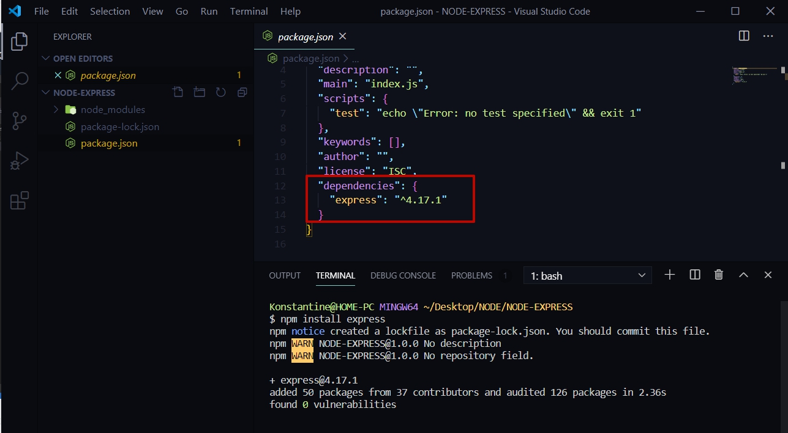
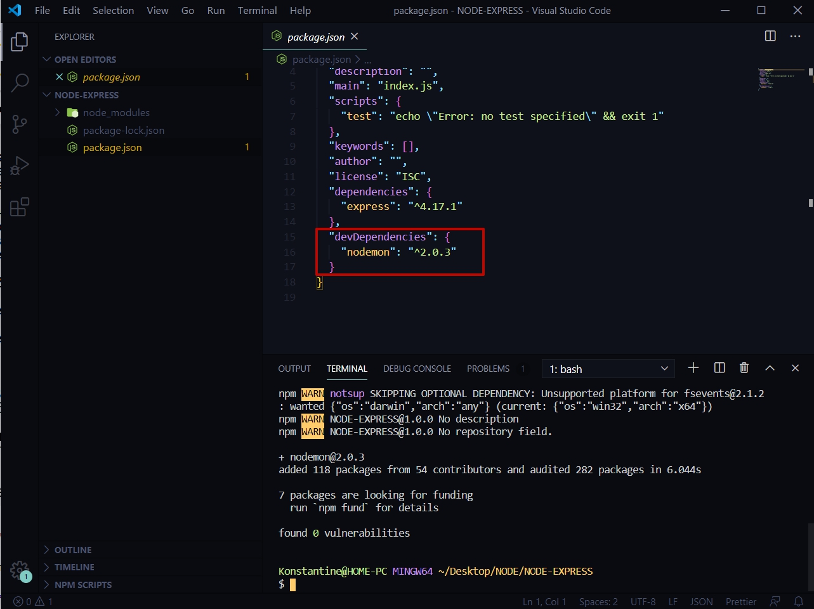
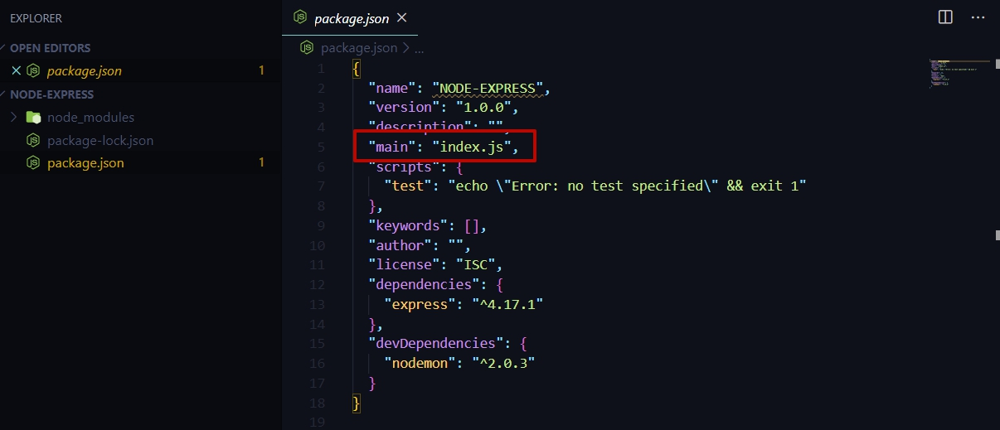
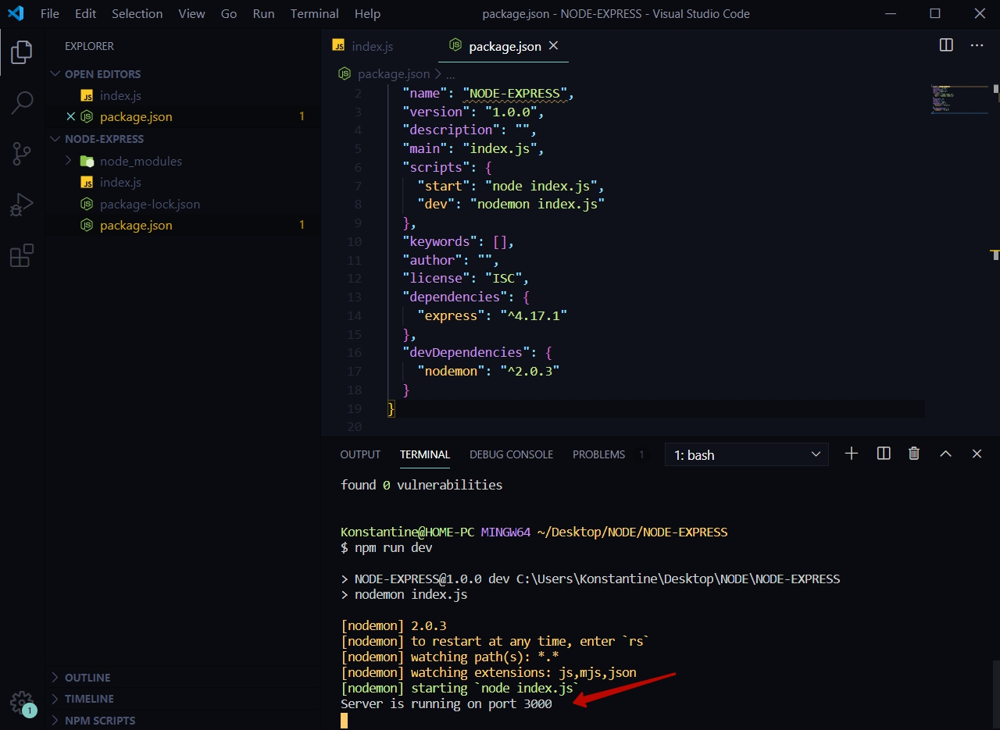
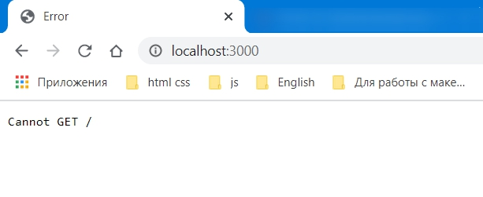

# Настройка приложения

В этом блоке поговорим о том как мы можем использовать Framework **Express.js**  для того что бы создавать более сложные и более интересные web - приложения. 
В прошлом блоке мы познакомились с основами NodeJS мы создали простейшее приложение где мы подняли свой web - сервер и отдавали какие - то html  страницы. Там было весьма много сложностей, например обработка различных параметров. И все это выглядело не очень красиво.

По этому блок посвящен практике где мы с вами познакомимся с framework, очень простым при этом который позволяет создавать более гибкие и более сложные и более крутые приложения.

Начинаю с пустого проекта **NODE-EXPRESS** в котором я буду создавать данное приложение.
И для начало проинициализирую проект.

> npm init -y

**-y** для того что бы немного упростить себе процесс разработки. Таким образом я просто соглашаюсь со всеми полями которые мне предлагают.


Далее устанавливаю необходимые пакеты которые мне понадобяться для разработки.

> npm install express

И пока я просто нажму Enter для того что бы данный пакет просто занести именно в список зависимостей для нашего приложения.



Появляется поле объект **dependencies**(завиимости). И здесь храняться те зависимости которые нужны для работы приложения.
Однако нам нужно поле **devDependencies** куда я буду складывать те зависимости которые мне нужны именно для разработки.

> npm i -D nodemon



И так мы установили два пакета. И мы должны начать с какого - то индексного файла. В **package.json** главный файл считается **index.js**



И в **index.js** для того что бы начать работу с **Express** подключаю его.

```js
// index.js
const express = require("express");
```

>В прошлом блоке использую нативный модуль **http** с помощью функции **createServer** мы создавали новый сервер.


В **Express** происходит все намного проще. Мы просто создаем какую - то переменную например **app** и она у нас является результатом функции **express** 

```js
const express = require("express");

const app = express();
```
Теперь у меня есть объект **app** и на самом деле он является аналогом объекта сервер.

У данного объекта я могу вызывать метод который называется **listen**. В его параметры передаю порт на котором я хочу слушать приложение **3000**, вторым параметром по аналогии передаю **callback** функцию где в **сonsole.log** буду выводить сообщение которое будет говорить что **server** был запущен.

```js
const express = require("express");

const app = express();

app.listen(3000, () => {
  console.log("");
});
```

Но перед этим давайте сделаем одну манипуляцию которое позволит быть приложению более гибким.

Для этого я создаю переменную **PORT** и по умолчанию мы будем заносить в данную переменную значение **process.env.PORT**. Данные параметры мы можем брать из **env** переменных и чуть позже разберем как их можно передавать. Но если мы ничего не передавали то по умолчанию мы будем передавать значение **3000**. 

```js
const express = require("express");
const app = express();

const PORT = process.env.PORT || 3000;

app.listen(3000, () => {
  console.log("");
});
```
Идея в том что если данное значение, **process.env.PORT**, не определено то с помощью оператора или **||** мы можем задать любое из этих значений т.е. если порт определен в **process.env.PORT** то мы создаем порт, если же не определен то по умолчанию выставляется **3000** порт.

Теперь в **app.listen** первым параметром передаю значение порта **PORT**. И в консоли выведем название порта.

```js
const express = require("express");
const app = express();

const PORT = process.env.PORT || 3000;

app.listen(PORT, () => {
  console.log(`Server is running on port ${PORT}`);
});

```
На этом здесь закончено.

Далее в **package.json** прописываю скрипты на которых будет запускаться **server**.

Как обычно **test** переименовываю на **start**. **Start** будет запускать наше приложение в **production** режиме для этого в его параметре обращаемся к **node** и запускаем **index.js**.

И так же будет поле, ключ **dev** который будет обращаться к **nodemon** и запускать так же **index.js**.

```json
{
  "name": "NODE-EXPRESS",
  "version": "1.0.0",
  "description": "",
  "main": "index.js",
  "scripts": {
    "start": "node index.js",
    "dev": "nodemon index.js"
  },
  "keywords": [],
  "author": "",
  "license": "ISC",
  "dependencies": {
    "express": "^4.17.1"
  },
  "devDependencies": {
    "nodemon": "^2.0.3"
  }
}
```
и теперь если в консоли пропишем 

> npm run dev



То сервер запускается на **3000** порту.

И если мы откроем браузер на этом порту **localhost:3000**  то сразу увидим отличия от класического** http** модуля. 



**Express** понял что мы загружаем **web** - браузер и он выдал ошибку потому у него нет ни какого зарегистрированниго роута.
