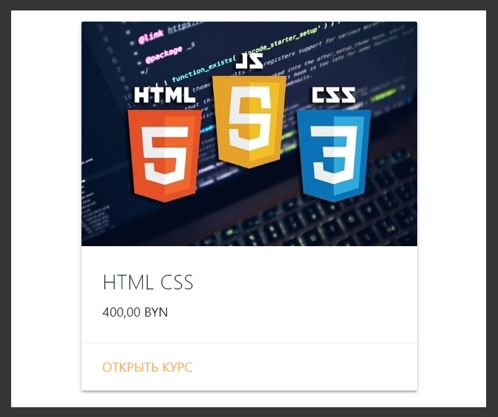

# Подключение клиентских скриптов.

На самом деле это не отличается от того что делал для **css**. 
В парке **public** создаю новый файл **app.js** и в нем будет клиентский скрипт.

Его я подключаю в **footer.hbs**.

```js
//footer.hbs
<script src="https://cdnjs.cloudflare.com/ajax/libs/materialize/1.0.0/js/materialize.min.js"></script>
<script src="/app.js"></script>
```

Слэш потому что он находится в папке **public**.

Теперь посмотрим что можно сделать для каждого курса. Захожу в **courses.hbs**. 

По сути цена обернута в класс **price** где находится ее значение **{{price}}**.

В **app.js** пишу простецкий скрипт. С помощью **document.querySelectorAll('.price')** я получаю все элементы с классов **price** и далее с помощью **forEach** я буду обрабатывать каждый элемент. В его параметрах пишу **callback**. Каждый элемент будет являтся **node**.

```js
// applicationCache.js
document.querySelectorAll('.price').forEach(node =>{

})
```

Посути далее мне необходимо забрать текстовый контент данной node и заменить его. Поэтому я обращаюсь к **node.texContent =** и задаю новое значение. Формотировать цену я буду с помощью глобального класса **Intl.NumberFormat**. Поэтому вызываю оператор **new** и подставляю данный глобальный класс.

```js
// applicationCache.js
document.querySelectorAll('.price').forEach((node) => {
node.textContent = new Intl.NumberFormat()
})
```

После этого первым параметром указываю локаль, пока пробую в Русских рублях. **'ru-RU'**. Вторым параметром передаю определенный набор опций **currency:'rub'**, и следующим полем указываю что это именно какая - валюта **style:'currency'**

```js
// applicationCache.js
document.querySelectorAll('.price').forEach((node) => {
    node.textContent = new Intl.NumberFormat('ru-RU', {
        currency: 'rub',
        style: 'currency',
    })
})
```

После **callback** вызываю метод **format** в который передаю тот текстовый контент который просто содержит в себе какое - то число а он у нас хранится в **node.textContent**. Т.е. мы сначало его помещаем в .**format(node.textContent)**, а уже после заносим в 

> node.textContent = new Intl.NumberFormat('ru-RU', {
        currency: 'rub',
        style: 'currency',
    })

И сейчас если обновим страницу то получим красивый результат. B пример с беларусской валютой

```js
// applicationCache.js
document.querySelectorAll('.price').forEach((node) => {
	node.textContent = new Intl.NumberFormat('ru-RU', {
		currency: 'BYN',
		style: 'currency',
	}).format(node.textContent)
})
```

В объекте **Intl.NumberFormat**

если указывать 

**ru** - это русский язык без уточнений
**RU** - Указываю где язык используется
**currency: 'BYN'** указываю валюту
**style: 'currency'** применяемые стили к определенной валюте

 И вот теперь все норм отображается



И теперь застилизуем цену для того что бы она выглядела более красиво. Кароче просто увеличиваю шрифт.
