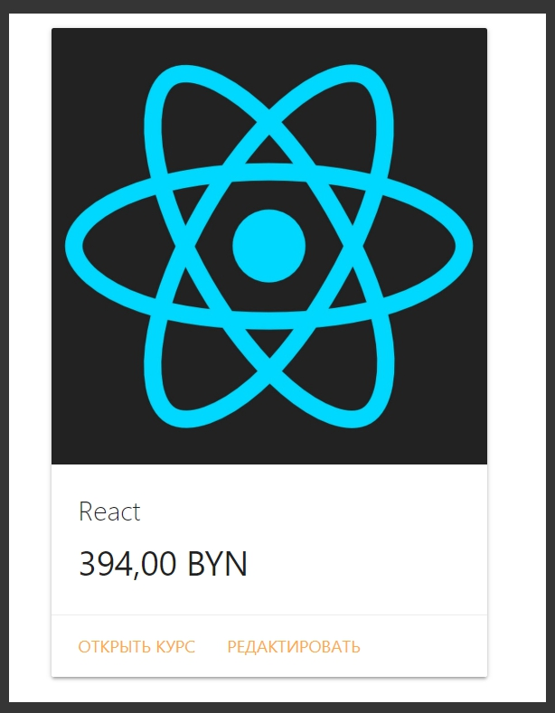
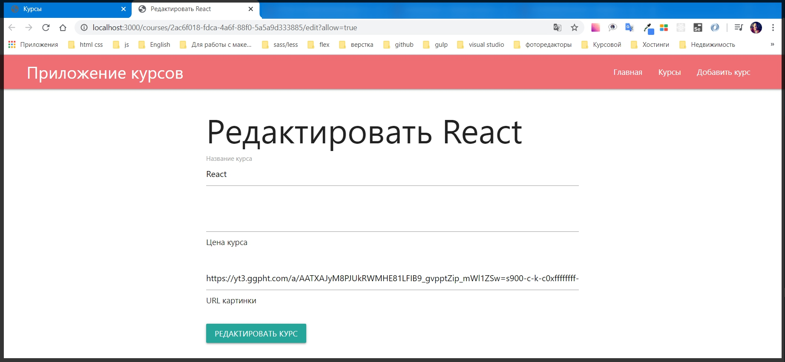
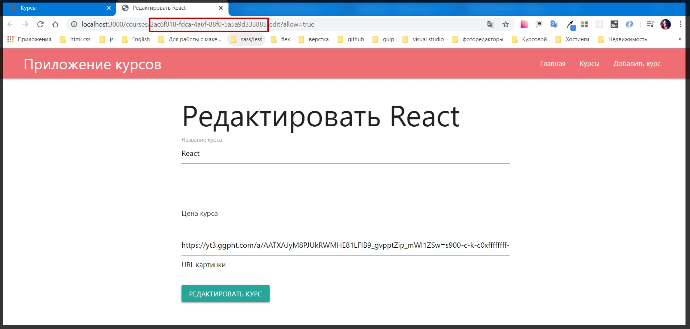

# Редактирование курса

Уже мы освоили все необходимые навыки для того что бы создавать приложения, но при этом еще осталось еще несколько моментов. Поэтому добавим функционала для данного приложения.

Начнем с главной страницы. 

Добавим функционал который позволит редакторовать каждый курс. Для этого перехожу в папку routes в файл courses.js.

Для начало нам понадобится страница которая будет отвечать за редактирование. Обращаюсь к router и его методу get(''). В параметры прописываю обрабатываемы роут.  Мы так же будем обрабатывать некоторый '/:id/edit' и по роуту edit будем его редактировать.
После этого как обычно добавляю async функцию которая принимает параметры request и responce.

 

 ```js
//  кусок
router.get('/:id/edit', async (req, res) => { // редактирование курса

})
```
```js
// courses.js
const { Router } = require('express')
const Course = require('../models/course')
const router = Router()

router.get('/', async (req, res) => {
    const courses = await Course.getAll()// создаю объект курсов и вытаскиваю их все
    res.render('courses', {
        title: 'Курсы',
        isCourses: true,
        courses // добавляю данный объект на страницу
    })
})


router.get('/:id/edit', async (req, res) => { // редактирование курса

})

router.get('/:id', async (req, res) => {
    const course = await Course.getById(req.params.id)
    res.render('course', {
        layout: 'empty',
        title: `Курс ${course.title}`,
        course
    })
})

module.exports = router
```

И в теле callback я проверяю. Будет некоторый query параметр который будет отвечать за то что мы можем редактировать данный курс.

И поэтому вначале проверим есть ли такой query параметр. С помощью цикла if else. В параметрах if обращаюсь к объекту req. и у него есть поле которое называется query. и если у этого объекта query не будет поле allow, применяю оператор not !, то в теле функции я буду делать res. его метода redirect на главную страницу например, и для того что бы функция не продолжала свое выполнение возвращаю redirect c помощью return.

```js
router.get('/:id/edit', async (req, res) => { // редактирование курса
if(!req.query.allow){
    return res.redirect('/')
}
})
```
Теперь необходимо проверить как это работает. Необходимо добавить query параметр к ссылке. На самом деле это будет очень просто, на странице курсов courses.hbs гда мы описывам card-action мы добавим новую ссылку, такую же как и раньше, но добавляем в путь /edit и для того что бы добавить query параметр добавляю ? b er зываю какой параметр я хоче обработать, например allow=true. target="_blank" удаляю. И текст ссылки  Редактировать.

```js
{{!-- courses.hbs --}}
<h1>Курсы</h1>

{{#if courses.length}}
{{#each courses}}
<div class="row">
    <div class="col s12 m7">
        <div class="card">
            <div class="card-image">
                
            </div>
            <div class="card-content">
                <span class="card-title">{{title}}</span>
                <p class="price">{{price}}</p>
            </div>
            <div class="card-action">
                <a href="/courses/{{id}}" target="_blank">Открыть курс</a>
                <a href="/courses/{{id}}/edit?allow=true">Редактировать</a>
            </div>
        </div>
    </div>
</div>
{{/each}}
{{else}}
<p>Курсы пока не добавлены</p>
{{/if}}
```

И теперь если мы посмотрим в браузер то увидим ссылку при нажатии на которую мы будем попадать пока никуда.



Это потому что у нас нет GET обработчика на данную страницу.

Для этого давайте ее добавим. В папке views добавляю новый файл course-edit.hbs. Из файла add.hbs копирую весь контент и редактирую его под себя.

```js
{{!-- course-edit.hbs  --}}
<div class="row">
    <h1>Редактировать{{course.title}}</h1>

    <form class="form" action="/courses/edit" method="POST">

        <div class="input-field">
            <input id="title" name="title" type="text" class="validate" required value="{{course.title}}">
            <label for="title">Название курса</label>
            <span class="helper-text" data-error="Введите название курса"></span>
        </div>

        <div class="input-field">
            <input id="price" name="price" type="number" class="validate" required min="1" value="{{course.price}}>
            <label for=" price">Цена курса</label>
            <span class="helper-text" data-error="Введите цену"></span>
        </div>

        <div class="input-field">
            <input id="img" name="img" type="text" class="validate" required value="{{course.img}}>
            <label for=" img">URL картинки</label>
            <span class="helper-text" data-error="Введите url картинки"></span>
        </div>
        <button class="btn btn-primary">Редактировать курс</button>
    </form>
</div>
```
И далее мне необходимо вернуть данную страницу т.е. в routes обработать get запрос.

Продолжаю писать в теле функции. Вызываю res. его метод render(). Первым параметром указываю какую страницу рендерить 'course-edit', и вторым параметром передаю объект с полями title: `Редактировать ${course.title}`, и после этого передаю сам course. Однако course необходимо получить, потому что сейчас у нас нет этого объекта.

Для этого воспользуюсь моделью Course который мы создали и создаю объект course. Так же применяю оператор await обращаюсь к модели Course и у нас есть метод getById() в параметры которого передаю объект req.params.id.

```js
// кусок
router.get('/:id/edit', async (req, res) => { // редактирование курса
    if (!req.query.allow) {
        return res.redirect('/')
    }
    const course = await Course.getById(req.params.id)
    res.render('course-edit', {
        title: `Редактировать ${course.title}`,
        course
    })
})
```

целый

```js
// courses.js
const { Router } = require('express')
const Course = require('../models/course')
const router = Router()

router.get('/', async (req, res) => {
    const courses = await Course.getAll()// создаю объект курсов и вытаскиваю их все
    res.render('courses', {
        title: 'Курсы',
        isCourses: true,
        courses // добавляю данный объект на страницу
    })
})


router.get('/:id/edit', async (req, res) => { // редактирование курса
    if (!req.query.allow) {
        return res.redirect('/')
    }
    const course = await Course.getById(req.params.id)
    res.render('course-edit', {
        title: `Редактировать ${course.title}`,
        course
    })
})

router.get('/:id', async (req, res) => {
    const course = await Course.getById(req.params.id)
    res.render('course', {
        layout: 'empty',
        title: `Курс ${course.title}`,
        course
    })
})

module.exports = router
```



Дальше при нажатии кнопки Редактировать курс необходимо обработать POST запрос, но сейчас так как мы уже не создаем какой - то курс, то у него есть определенный id который мы можем наблюдать в адресной строке.



И с этой формой, которая отображается на странице, мне необходимо передать какой - то id. Поэтому на странице course-edit.hbs мы можем добавить еще один input у которого будет type="hidden" name="id" value="{{course.id}}".

```js
{{!-- course-edit.hbs  --}}
<div class="row">
    <h1>Редактировать {{course.title}}</h1>

    <form class="form" action="/courses/edit" method="POST">

        <div class="input-field">
            <input id="title" name="title" type="text" class="validate" required value="{{course.title}}">
            <label for="title">Название курса</label>
            <span class="helper-text" data-error="Введите название курса"></span>
        </div>

        <div class="input-field">
            <input id="price" name="price" type="number" class="validate" required min="1" value="{{course.price}}>
            <label for=" price">Цена курса</label>
            <span class="helper-text" data-error="Введите цену"></span>
        </div>

        <div class="input-field">
            <input id="img" name="img" type="text" class="validate" required value="{{course.img}}>
            <label for=" img">URL картинки</label>
            <span class="helper-text" data-error="Введите url картинки"></span>
        </div>

        <input type="hidden" name="id" value="{{course.id}}">

        <button class="btn btn-primary">Редактировать курс</button>
    </form>
</div>
```
Теперь у нас есть ссылка по которой мы будем редактировать нужный курс. 

И для этого в папке routes необходимо обработать данный post запрос. Пишу router.post() первым параметром пишу '/edit', далее применяю оператор async к callback функции ()=>{}. В параметры callback как обыно req и res.
В теле функции в объекте req есть все необходимые данные в объекте req.body которые нужно обновить у модели курсов. Обращаюсь к оператору await обращаюсь к модели Course. и у него вызываю метод update() куда передаю req.body.
И после того как данная синхронная операция будет выполнена с помощью объекта res. делаю redirect('/courses') на страницу courses.

```js
// кусок
router.post('/edit', async (req, res) => {
    await Course.update(req.body)
    res.redirect('/courses')
})
```

полный

```js
// courses.js
const { Router } = require('express')
const Course = require('../models/course')
const router = Router()

router.get('/', async (req, res) => {
    const courses = await Course.getAll()// создаю объект курсов и вытаскиваю их все
    res.render('courses', {
        title: 'Курсы',
        isCourses: true,
        courses // добавляю данный объект на страницу
    })
})


router.get('/:id/edit', async (req, res) => { // редактирование курса
    if (!req.query.allow) {
        return res.redirect('/')
    }
    const course = await Course.getById(req.params.id)
    res.render('course-edit', {
        title: `Редактировать ${course.title}`,
        course
    })
})

router.post('/edit', async (req, res) => {
    await Course.update(req.body)
    res.redirect('/courses')
})

router.get('/:id', async (req, res) => {
    const course = await Course.getById(req.params.id)
    res.render('course', {
        layout: 'empty',
        title: `Курс ${course.title}`,
        course
    })
})

module.exports = router
```
Теперь у модели необходимо сформировать статический метод update. Перехожу в папку models файл сourse.

И в этом файле создаю нову асинхронную функцию которая называется static async update(){}. В параметр получаю некоторый сourse. 
В теле функции обращаюсь т.е. получаю все курсы  const courses = await Course.getAll(). Далее необходимо найти id токо курса который мы хотим обновить. Создаю переменную индекс const ind = и далее с помощью массива courses.findIndex() гда на каждой итерации я получаю объект c и далее проверяю (с => c.id === course.id) то тогда это id который нас интересует.
После этого я обращаюсь к массиву курсов courses[idx] говорим что у этого индекса необходимо заменить объект на объект course. B далее по сути нам необходимо его сохранить.

```js
// кусок
  static async update(course) {
        const courses = await Course.getAll()
        const idx = courses.findIndex((c) => c.id === course.id)
        courses[idx] = course
    }
```

И далее нам необходимо сохранить. Грубо говоря копирую логику promice

```js
return new Promise((resolve, reject) => {
            fs.writeFile(
                path.join(__dirname, '..', 'data', 'courses.json'),
                JSON.stringify(courses),
                (err) => {
                    if (err) {
                        reject(err)
                    } else {
                        resolve()
                    }
                },
            )
        })
```

B вставляю его 

```js
 static async update(course) {
        const courses = await Course.getAll()
        const idx = courses.findIndex((c) => c.id === course.id)
        courses[idx] = course

        return new Promise((resolve, reject) => {
            fs.writeFile(
                path.join(__dirname, '..', 'data', 'courses.json'),
                JSON.stringify(courses),
                (err) => {
                    if (err) {
                        reject(err)
                    } else {
                        resolve()
                    }
                },
            )
        })
    }
```

Полный файл

```js
// course.js
/* eslint-disable class-methods-use-this */
/* eslint-disable indent */
/* eslint-disable linebreak-style */

const uuid = require('uuid/v4');
const fs = require('fs');
const path = require('path');

class Course {
    constructor(title, price, img) {
        this.title = title
        this.price = price
        this.img = img
        this.id = uuid()
    }

    toJSON() {
        return {
            title: this.title,
            price: this.price,
            img: this.img,
            id: this.id,
        }
    }

    static async update(course) {
        const courses = await Course.getAll()
        const idx = courses.findIndex((c) => c.id === course.id)
        courses[idx] = course

        return new Promise((resolve, reject) => {
            fs.writeFile(
                path.join(__dirname, '..', 'data', 'courses.json'),
                JSON.stringify(courses),
                (err) => {
                    if (err) {
                        reject(err)
                    } else {
                        resolve()
                    }
                },
            )
        })
    }

    async save() {
        const courses = await Course.getAll()
        courses.push(this.toJSON())

        return new Promise((resolve, reject) => {
            fs.writeFile(
                path.join(__dirname, '..', 'data', 'courses.json'),
                JSON.stringify(courses),
                (err) => {
                    if (err) {
                        reject(err)
                    } else {
                        resolve()
                    }
                },
            )
        })
    }

    static getAll() {
        return new Promise((resolve, reject) => {
            fs.readFile(
                path.join(__dirname, '..', 'data', 'courses.json'),
                'utf-8',
                (err, content) => {
                    if (err) {
                        reject(err)
                    } else {
                        resolve(JSON.parse(content))
                    }
                },
            )
        })
    }

    static async getById(id) {
        const courses = await Course.getAll()
        return courses.find((c) => c.id === id)
    }
}

module.exports = Course
```
Проверяю работоспособность

