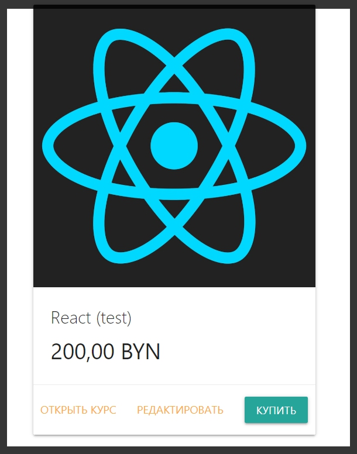

# Подготовка корзины

Для начало необходимо добавить кнопку которая позволит купить какой либо курс.
Для этого переходим в **courses.hbs**. В нем необходимо добавить кнопку которая будет добавлять курс в корзину.
В **class="card-action"** добавляю форму.

```js
<form action="/card/add" method="POST"></form>
```

И в этой форме нужно добавить кнопку

```js
<form action="/card/add" method="POST">
  <button type="submit" class="btn btn-primary">
    Купить
  </button>
</form>
```

И здесь необходимо будет передавать **id** того курса который мы хотим купить. Для этого реализую **input**

```js
<form action="/card/add" method="POST">
  <input type="hidden" name="id" value="{{id}}" />
  <button type="submit" class="btn btn-primary">
    Купить
  </button>
</form>
```

**value="{{id}}"** указываю так как у нас идет поиск за счет цикала **each**.

Полный файл

```js
{{! courses.hbs }}
<h1>
  Курсы
</h1>
{{#if courses.length}}
  {{#each courses}}
    <div class="row">
      <div class="col s12 m7">
        <div class="card">
          <div class="card-image">
            
          </div>
          <div class="card-content">
            <span class="card-title">
              {{title}}
            </span>
            <p class="price">
              {{price}}
            </p>
          </div>
          <div class="card-action">
            <a href="/courses/{{id}}" target="_blank" target="_blank">
              Открыть курс
            </a>
            <a href="/courses/{{id}}/edit?allow=true">
              Редактировать
            </a>
            <form action="/card/add" method="POST">
              <input type="hidden" name="id" value="{{id}}" />
              <button type="submit" class="btn btn-primary">
                Купить
              </button>
            </form>
          </div>
        </div>
      </div>
    </div>
  {{/each}}
{{else}}
  <p>
    Курсы пока не добавлены
  </p>
{{/if}}
```

Далее как обычно нужно создать роут который будет отвечать за корзину. В папке **routes** создаю файл **card.js**.
В этом файле я буду получать объект **Router** из библиотеки **express**.

```js
// card.js

const { Router } = require('express');
```

Далее создаю роутер

```js
// card.js

const { Router } = require('express');
const router = Router();
```

После этого с помощью **module.exports** мы его экспортирую.

```js
// card.js

const { Router } = require('express');
const router = Router();

module.exports = router;
```

И теперь добавляю **post** запрос с префиксом **'/add'**, и дальше буду делать какое - то асинхронное событие.

```js
// card.js

const { Router } = require('express');
const router = Router();

router.post('/add', async (req, res) => {});

module.exports = router;
```

Теперь в **index.js** зарегистрирую данный роут

```js
// index.js

const express = require('express');
const path = require('path');
const exphbs = require('express-handlebars');

const homeRoutes = require('./routes/home');
const cardRoutes = require('./routes/card');
const addRouters = require('./routes/add');
const coursesRotes = require('./routes/courses');
```

И где регистрирую роуты пишу

```js
//index.js

app.engine('hbs', hbs.engine); // регистрирую движок
app.set('view engine', 'hbs'); // с помощью set начинаю использовать движок
app.set('views', 'views'); // первый параметр заношу переменную, а второй название папки в которой веду разработку. Название может быть любым
app.use(express.static('public')); // делаю папку public публичной а не динамической для того что бы express ее не обрабатывал
app.use(express.urlencoded({ extended: true })); // данный метод использую при обработке POST запроса формы добавления курса
app.use('/', homeRoutes); // использую импортированный роут
app.use('/add', addRouters); // использую импортированный роут
app.use('/courses', coursesRotes); // использую импортированный роут
app.use('/card', cardRoutes); // регистрирую корзину
```

Полный файл

```js
// index.js

const express = require('express');
const path = require('path');
const exphbs = require('express-handlebars');

const homeRoutes = require('./routes/home');
const cardRoutes = require('./routes/card');
const addRouters = require('./routes/add');
const coursesRotes = require('./routes/courses');

const app = express();

const hbs = exphbs.create({
  defaultLayout: 'main',
  extname: 'hbs',
});

app.engine('hbs', hbs.engine); // регистрирую движок
app.set('view engine', 'hbs'); // с помощью set начинаю использовать движок
app.set('views', 'views'); // первый параметр заношу переменную, а второй название папки в которой веду разработку. Название может быть любым
app.use(express.static('public')); // делаю папку public публичной а не динамической для того что бы express ее не обрабатывал
app.use(express.urlencoded({ extended: true })); // данный метод использую при обработке POST запроса формы добавления курса
app.use('/', homeRoutes); // использую импортированный роут
app.use('/add', addRouters); // использую импортированный роут
app.use('/courses', coursesRotes); // использую импортированный роут
app.use('/card', cardRoutes); // регистрирую корзину

const PORT = process.env.PORT || 3000;

app.listen(PORT, () => {
  console.log(`Сервер запущен на порту ${PORT}`);
});
```

Теперь в файле **card.js** подумаем как мы будем добавлять что - то в корзину. Для начала по сути нужно создать модель которая будет отвечать за данную корзину.

Поэтому перехожу в папку **models** и создаю файл **card.js**. Модель буду реализовывать через **class Card{}**. Который я экспортирую наружу **module.exports = Card** потому что дальше мы будем его подключать.

```js
// models card.js

class Card {}

module.exports = Card;
```

Теперь в **routes card.js** я подключаю модель **const Card = require('../models/card');** И далее еще понадобится модель курсов **const Courses = ('../models/course');**

```js
// routes card.js

const { Router } = require('express');
const Card = require('../models/card');
const Course = require('../models/course');
const router = Router();

router.post('/add', async (req, res) => {});

module.exports = router;
```

В метод **add**, первый параметр **router.post**, мы принимаем в объекте **req.body id** того курса который нам необходимо добавить в корзину.
Поэтому для начало в теле асинхронной функции необходимо получить данный объект **const course = await Course.getById(req.body.id);**

```js
// routes card.js

const { Router } = require('express');
const Card = require('../models/card');
const Course = require('../models/course');
const router = Router();

router.post('/add', async (req, res) => {
  const course = await Course.getById(req.body.id);
});

module.exports = router;
```

После этого необходимо обратиться к модели корзины **Card** и вызывать у нее метод, который мы еще не сделали **add(course)** в параметры которого передаю сам курс.
**await Card.add(course);**

```js
// routes card.js

const { Router } = require('express');
const Card = require('../models/card');
const Course = require('../models/course');
const router = Router();

router.post('/add', async (req, res) => {
  const course = await Course.getById(req.body.id);
  await Card.add(course);
});

module.exports = router;
```

После того как мы что - то добавили в карту мы можем делать с помощью объекта **res.redirect('/card')** перенаправление на страницу корзины.

```js
// routes card.js

const { Router } = require('express');
const Card = require('../models/card');
const Course = require('../models/course');
const router = Router();

router.post('/add', async (req, res) => {
  const course = await Course.getById(req.body.id);
  await Card.add(course);
  res.redirect('/card');
});

module.exports = router;
```

Добавляю обработчик **get.** Така понадобятся данные из корзины **callback** будет асинхронной.

```js
// routes card.js

const { Router } = require('express');
const Card = require('../models/card');
const Course = require('../models/course');
const router = Router();

router.post('/add', async (req, res) => {
  const course = await Course.getById(req.body.id);
  await Card.add(course);
  res.redirect('/card');
});

router.get('/', async (req, res) => {});

module.exports = router;
```

В теле получаю объект **const card = await Card.fetch();** Далее с помощью объекта **res.render('card', )** где буду рендерить страницу **card**. Вторым параметром передаю объект с полем, параметрами **title:'Корзина'**, и объект **card**.

```js
// routes card.js

const { Router } = require('express');
const Card = require('../models/card');
const Course = require('../models/course');
const router = Router();

router.post('/add', async (req, res) => {
  const course = await Course.getById(req.body.id);
  await Card.add(course);
  res.redirect('/card');
});

router.get('/', async (req, res) => {
  const card = await Card.fetch();
  res.render('card', {
    title: 'Корзина',
    card,
  });
});

module.exports = router;
```

Третий параметр **res.render** объект **card** просто будет пока находится здесь, позже я подумаю что с ним делать.

Теперь в **views** создаю файл **card.hbs** и пока в нем будет заголовок **Корзина**.

```js
{{!  views card.hbs }}
<h1>
  Корзина
</h1>
```

Далее я здесь буду выводить таблицу. Но пока что у нас нет данных, то с форматом мы подумаем чуть позже.

Теперь в папке **partials** в файле **navbar.hbs** необходимо добавить ссылку на Корзину.

```js

{{!-- partials navbar.hbs --}}
<nav>
    <div class="nav-wrapper">
        <a href="#" class="brand-logo">Приложение курсов</a>
        <ul id="nav-mobile" class="right hide-on-med-and-down">

            {{#if isHome}}
            <li class="active"><a href="/">Главная</a></li>
            {{else}}
            <li><a href="/">Главная</a></li>
            {{/if}}

            {{#if isCourses}}
            <li class="active"><a href="/courses">Курсы</a></li>
            {{else}}
            <li><a href="/courses">Курсы</a></li>
            {{/if}}

            {{#if isAdd}}
            <li class="active"><a href="/add">Добавить курс</a></li>
            {{else}}
            <li><a href="/add">Добавить курс</a></li>
            {{/if}}

            {{#if isCard}}
            <li class="active"><a href="/card">Корзина</a></li>
            {{else}}
            <li><a href="/card">Корзина</a></li>
            {{/if}}
        </ul>
    </div>
</nav>
```


Поправляю верстку. Добавляю свой класс **actions** в **сourses.hbs**

```js
 <div class="card-action actions">
```

И в index.css

```css
.card-action.actions {
  display: flex;
  align-items: center;
  justify-content: space-between;
  padding: 16px 10px;
}
```



Если мы нажимаем на купить, то пока ничего не грузится. А не грузится потому что у нас у модели **models card.js** пока ничего не реализовано.
Здесь нам необходимо написать функцию **add(){}** и функцию **fetch(){}**

```js
// models card.js

class Card {
  add() {}
  fetch() {}
}

module.exports = Card;
```