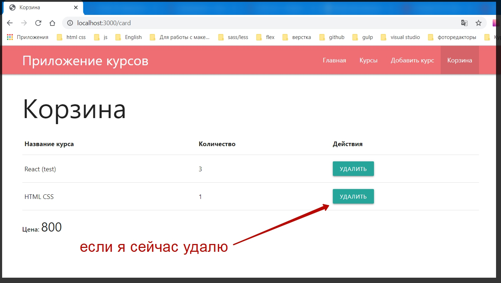
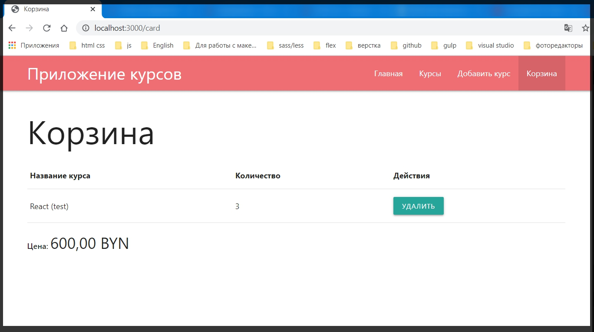
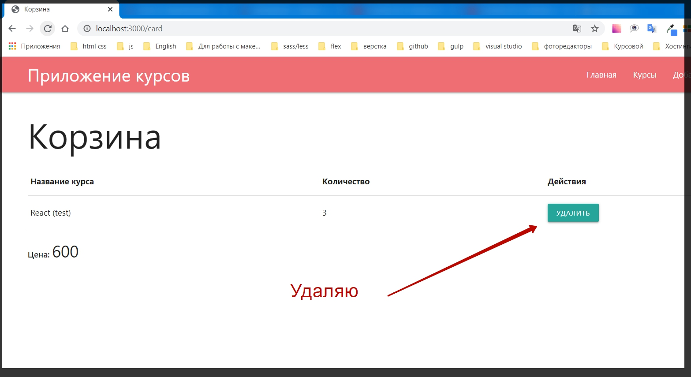
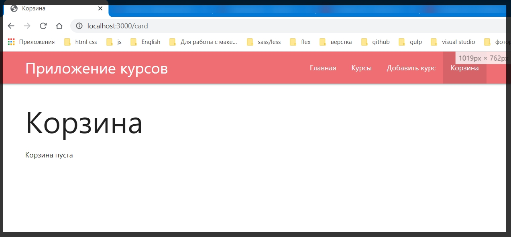
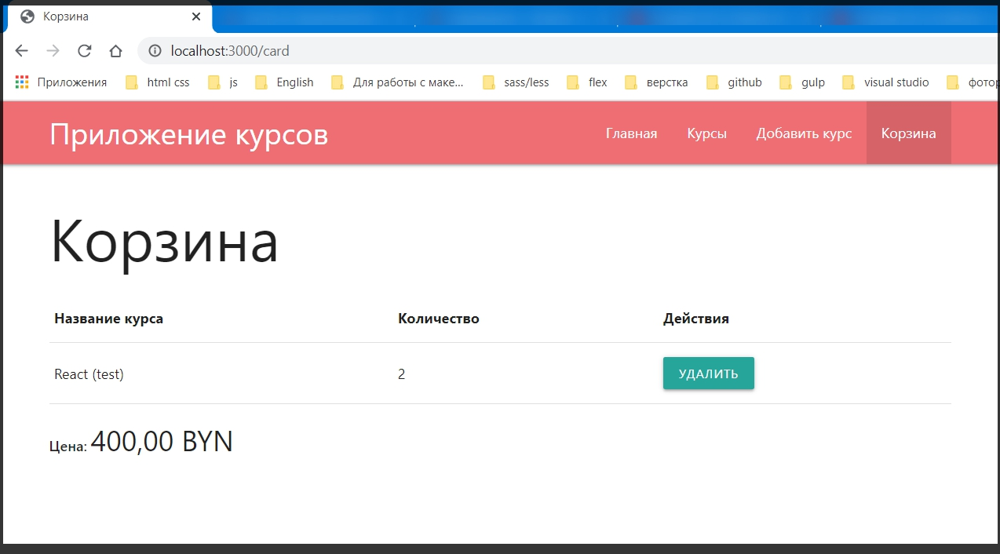

# Динамическое изменение корзины.

Сейчас необходимо с помощью клиентского **JS** динамически обновить контент данной страницы. И здесь есть определенные сложности. Допустим если я удалю кокой -то из курсов который по счетчику является первым, то данную строчку с этим курсом нужно удалить.
Если же удалить курс где по счетчику их больше чем один, т.е. два и больше, то необходимо уменьшить счетчик и пересчитать цену.
Если же вообще удалить все курсы, то нужно убать все курсы и показывать сообщение что **Корзина пуста**.

И для этого мы будем заново перерисовывать всю страницу используя нативный **JS**.

Для этого перехожу в файл **public app.js**. И здесь в методе **then.** я получаю объект корзины **card**.

```js
// public app.js
document.querySelectorAll('.price').forEach((node) => {
  node.textContent = new Intl.NumberFormat('ru-RU', {
    currency: 'BYN',
    style: 'currency',
  }).format(node.textContent);
});

const $card = document.querySelector('#card');

if ($card) {
  $card.addEventListener('click', (event) => {
    if (event.target.classList.contains('js-remove')) {
      const id = event.target.dataset.id;

      fetch('/card/remove/' + id, {
        method: 'delete',
      })
        .then((res) => res.json())
        .then((card) => {
          console.log(card);
        });
    }
  });
}
```

И дальше повторю логику шаблона, только уже через **JS**.

Проверяю если **if(card.courses.lenght){}**. А иначе **else** необходимо обратится к корневому элементу

```js
$card.и просто ему задать innerHTML = '<p>Корзина пуста</p>'
```

```js
p; // public app.js
document.querySelectorAll('.price').forEach((node) => {
  node.textContent = new Intl.NumberFormat('ru-RU', {
    currency: 'BYN',
    style: 'currency',
  }).format(node.textContent);
});

const $card = document.querySelector('#card');

if ($card) {
  $card.addEventListener('click', (event) => {
    if (event.target.classList.contains('js-remove')) {
      const id = event.target.dataset.id;

      fetch('/card/remove/' + id, {
        method: 'delete',
      })
        .then((res) => res.json())
        .then((card) => {
          if (card.courses.lenght) {
          } else {
            $card.innerHTML = '<p>Корзина пуста</p>';
          }
        });
    }
  });
}
```

Если же у нас есть какой - то контент, то тогда обращаюсь к таблице и это все пересчитываю. Но сначало необходимо в цикле сформировать все строчки **tr**.
Для этого в теле **if** создаю переменную **const html =** куда я буду заносить результат работы массива **card.courses.** у него вызываю оператор **map()** в параметры которого прописываю что буду получать на каждой итерации. А именно **callback** объекта **c**. В теле которого буду возвращать **return``** где в обратных апострофах сформирую шаблон.

```js
p; // public app.js
document.querySelectorAll('.price').forEach((node) => {
  node.textContent = new Intl.NumberFormat('ru-RU', {
    currency: 'BYN',
    style: 'currency',
  }).format(node.textContent);
});

const $card = document.querySelector('#card');

if ($card) {
  $card.addEventListener('click', (event) => {
    if (event.target.classList.contains('js-remove')) {
      const id = event.target.dataset.id;

      fetch('/card/remove/' + id, {
        method: 'delete',
      })
        .then((res) => res.json())
        .then((card) => {
          if (card.courses.lenght) {
            const html = card.courses.map((c) => {
              return `
              
              `;
            });
          } else {
            $card.innerHTML = '<p>Корзина пуста</p>';
          }
        });
    }
  });
}
```

Этот шаблон я могу забрать прямо из **handlebarse card.hbs** т.е. вот такой шаблон необходимо повторить

```js
<tr>
  <td>{{ title }}</td>
  <td>{{ count }}</td>
  <td>
    <button class="btn btn-small js-remove" data-id="{{id}}">
      Удалить
    </button>
  </td>
</tr>
```

При вставке в **app.js** меняем синтаксис. Нам необходимо выводить какие -то данные. Ко всем полям помимо доллара дописываю **c**. тот объект который получаю.

```js
p; // public app.js
document.querySelectorAll('.price').forEach((node) => {
  node.textContent = new Intl.NumberFormat('ru-RU', {
    currency: 'BYN',
    style: 'currency',
  }).format(node.textContent);
});

const $card = document.querySelector('#card');

if ($card) {
  $card.addEventListener('click', (event) => {
    if (event.target.classList.contains('js-remove')) {
      const id = event.target.dataset.id;

      fetch('/card/remove/' + id, {
        method: 'delete',
      })
        .then((res) => res.json())
        .then((card) => {
          if (card.courses.lenght) {
            const html = card.courses
              .map((c) => {
                return `
              <tr>
              <td>${c.title}</td>
              <td>${c.count}</td>
              <td>
                <button class="btn btn-small js-remove" data-id="${c.id}">Удалить</button>
              </td>
            </tr>
              `;
              })
              .join('');
          } else {
            $card.innerHTML = '<p>Корзина пуста</p>';
          }
        });
    }
  });
}
```

Сейчас в **const html** хранится массив и этот массив что бы привести к строке я вызываю метод **join()**.

После этого я обращаюсь к

> **\$card**

Далее необходимо найти элемент **tbody**. Для этого обращаюсь к

> **\$card.querySelector('tbody').innerHTML = html**

```js
p; // public app.js
document.querySelectorAll('.price').forEach((node) => {
  node.textContent = new Intl.NumberFormat('ru-RU', {
    currency: 'BYN',
    style: 'currency',
  }).format(node.textContent);
});

const $card = document.querySelector('#card');

if ($card) {
  $card.addEventListener('click', (event) => {
    if (event.target.classList.contains('js-remove')) {
      const id = event.target.dataset.id;

      fetch('/card/remove/' + id, {
        method: 'delete',
      })
        .then((res) => res.json())
        .then((card) => {
          if (card.courses.lenght) {
            const html = card.courses
              .map((c) => {
                return `
              <tr>
              <td>${c.title}</td>
              <td>${c.count}</td>
              <td>
                <button class="btn btn-small js-remove" data-id="${c.id}">Удалить</button>
              </td>
            </tr>
              `;
              })
              .join('');
            $card.querySelector('tbody').innerHTML = html;
          } else {
            $card.innerHTML = '<p>Корзина пуста</p>';
          }
        });
    }
  });
}
```

Но после этого так же необходимо пересчитать цену. **querySelector** для того что бы найти **price** и тоже сомое сделаем только с текстовым контентом **.textContent = card.price**

> **\$card.querySelector('.price').textContent = card.price**

```js
p; // public app.js
document.querySelectorAll('.price').forEach((node) => {
  node.textContent = new Intl.NumberFormat('ru-RU', {
    currency: 'BYN',
    style: 'currency',
  }).format(node.textContent);
});

const $card = document.querySelector('#card');

if ($card) {
  $card.addEventListener('click', (event) => {
    if (event.target.classList.contains('js-remove')) {
      const id = event.target.dataset.id;

      fetch('/card/remove/' + id, {
        method: 'delete',
      })
        .then((res) => res.json())
        .then((card) => {
          if (card.courses.lenght) {
            const html = card.courses
              .map((c) => {
                return `
              <tr>
              <td>${c.title}</td>
              <td>${c.count}</td>
              <td>
                <button class="btn btn-small js-remove" data-id="${c.id}">Удалить</button>
              </td>
            </tr>
              `;
              })
              .join('');
            $card.querySelector('tbody').innerHTML = html;
            $card.querySelector('.price').textContent = card.price;
          } else {
            $card.innerHTML = '<p>Корзина пуста</p>';
          }
        });
    }
  });
}
```





Мы получаем динамическое отображение таблицы. Но что не очень хорошо форматирование цены ушло, потому что она у нас форматируется при начальной загрузке. Если мы обновим то она возвратится.

И этот баг нужно исправить. В **app.js** с помощью класса **Int.NumberFormat** привожу к формату рублей. И мы можем вынести это в отдельную функцию.

Создаю функцию **const toCurrency =** где я буду получать **price =>{}**. Из

```js
document.querySelectorAll('.price').forEach((node) => {
  node.textContent = new Intl.NumberFormat('ru-RU', {
    currency: 'BYN',
    style: 'currency',
  }).format(node.textContent);
});
```

Вырезаю

```js
new Intl.NumberFormat('ru-RU', {
  currency: 'BYN',
  style: 'currency',
}).format(prise); // только вместо node.textContent получаю price
```

И вставляю в. Где я по сути возвращаю данное значение

```js
const toCurrency = (price) => {
  return new Intl.NumberFormat('ru-RU', {
    currency: 'BYN',
    style: 'currency',
  }).format(price); // только вместо node.textContent получаю price
};
```

И в **node.textContent** вызываю **toCurrency(node.textContent)**

```js
document.querySelectorAll('.price').forEach((node) => {
  node.textContent = toCurrency(node.textContent);
});
```

Весь файл

```js
// public app.js

const toCurrency = (price) => {
  return new Intl.NumberFormat('ru-RU', {
    currency: 'BYN',
    style: 'currency',
  }).format(price);
};

document.querySelectorAll('.price').forEach((node) => {
  node.textContent = toCurrency(node.textContent);
});

const $card = document.querySelector('#card');

if ($card) {
  $card.addEventListener('click', (event) => {
    if (event.target.classList.contains('js-remove')) {
      const id = event.target.dataset.id;

      fetch('/card/remove/' + id, {
        method: 'delete',
      })
        .then((res) => res.json())
        .then((card) => {
          if (card.courses.lenght) {
            const html = card.courses
              .map((c) => {
                return `
              <tr>
              <td>${c.title}</td>
              <td>${c.count}</td>
              <td>
                <button class="btn btn-small js-remove" data-id="${c.id}">Удалить</button>
              </td>
            </tr>
              `;
              })
              .join('');
            $card.querySelector('tbody').innerHTML = html;
            $card.querySelector('.price').textContent = card.price;
          } else {
            $card.innerHTML = '<p>Корзина пуста</p>';
          }
        });
    }
  });
}
```

Далее воспользуюсь этой функцией для того что бы отформатировать цену.

Этот блок кода

```js
$card.querySelector('tbody').innerHTML = html;
$card.querySelector('.price').textContent = card.price;
```

Заменяю на

```js
$card.querySelector('tbody').innerHTML = html;
$card.querySelector('.price').textContent = toCurrency(card.price);
```





Странно в массиве лежит два курса. А отображается что корзина пуста!! Вот массив

```json
{
  "courses": [
    {
      "title": "React (test)",
      "price": "200",
      "img": "https://yt3.ggpht.com/a/AATXAJxuqoKrobSnt6Hff47FmQ9rBiTX0pC59PMc7Q=s900-c-k-c0xffffffff-no-rj-mo",
      "id": "2ac6f018-fdca-4a6f-88f0-5a5a9d333885",
      "count": 2
    }
  ],
  "price": 400
}
```

Но при обновлении страницы



Все отображается и пересчитано. Скопировал и всавил собственный код несколько раз. Перезапустил проект несколько раз. Обновлял много раз страницу в браузере. Что повлияло я фиг знает. Но теперь при удалении корректно перересовывает страницу.

Полный рабочий **app.js**

```js
// public app.js

const toCurrency = (price) => {
  return new Intl.NumberFormat('ru-RU', {
    currency: 'BYN',
    style: 'currency',
  }).format(price);
};

document.querySelectorAll('.price').forEach((node) => {
  node.textContent = toCurrency(node.textContent);
});

const $card = document.querySelector('#card');

if ($card) {
  $card.addEventListener('click', (event) => {
    if (event.target.classList.contains('js-remove')) {
      const id = event.target.dataset.id;

      fetch('/card/remove/' + id, {
        method: 'delete',
      })
        .then((res) => res.json())
        .then((card) => {
          if (card.courses.length) {
            const html = card.courses
              .map((c) => {
                return `
                <tr>
                  <td>${c.title}</td>
                  <td>${c.count}</td>
                  <td>
                    <button class="btn btm-small js-remove" data-id="${c.id}">Удалить</button>
                  </td>
                </tr>
                `;
              })
              .join('');
            $card.querySelector('tbody').innerHTML = html;
            $card.querySelector('.price').textContent = toCurrency(card.price);
          } else {
            $card.innerHTML = '<p>Корзина пуста</p>';
          }
        });
    }
  });
}
```

Теперь у меня есть полностью рабочее приложение которое я написал с помощью чистого **JS**, **NodeJS**, клиентским **JS**. Научился обрабатывать различные **GET** запросы, **POST** запросы. Научился редактировать. Научился отправлять асинхронные запросы. Добавлять различные **Layout - ты**, обрабатывать формы. Уже с таким набором знаний можно реализовывать большие приложения.

Проблемы в приложении:

1. Работа осуществляется без БД. Я работаю с файлами. Основная проблема с файлами заключается в том что они медленные. Поэтому мы придумываем и применяем различные базы данных для того что бы ускорить работу с ними. Если будет 20000 курсов и каждый раз будем считывать этот файл, обновлять. Работа будет колосальная и при этом не оправданная.
