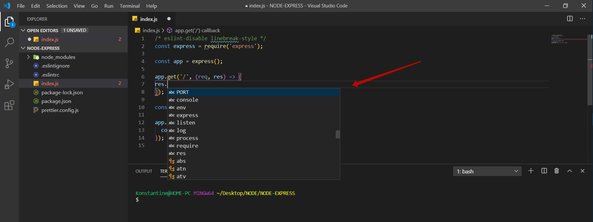
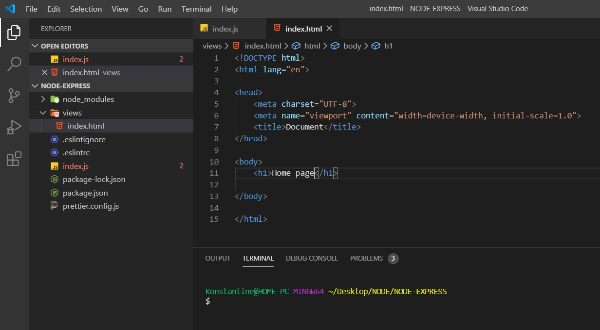
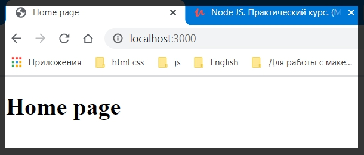
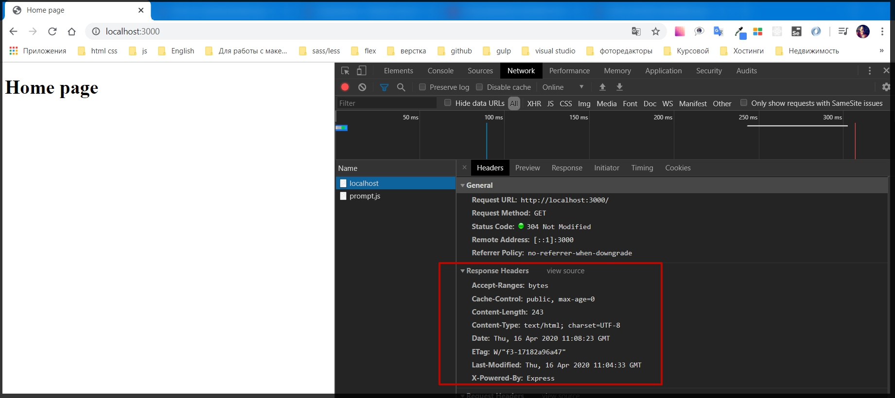
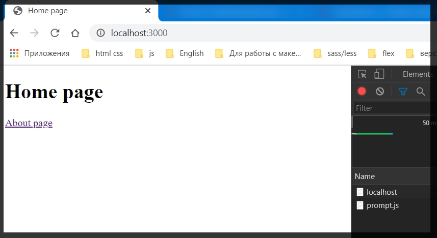
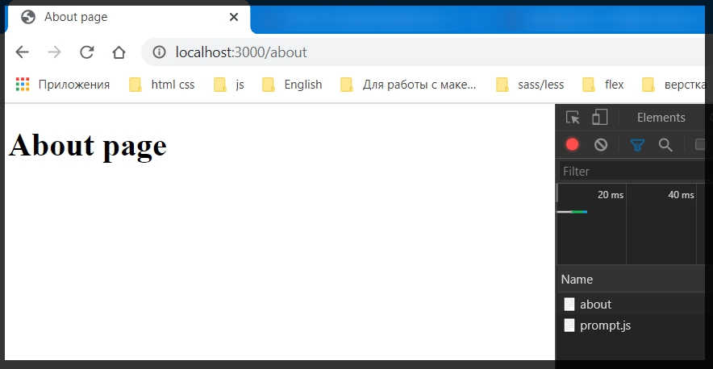

# Работа с html файлами

После настройки **Express** настоло время отдавать пользователям какие - то **html** страницы для того что бы они видили интерфейс всего приложения.

В **Express** делается это все намного проще чем в класическом **http** модуле.

Для этого **const PORT = process.env.PORT || 3000;** опускаю вниз. Он будет запускаться прям перед стартом приложения.

Ну а чуть выше я пишу логику.

Для начало мне необходимо обратиться к объекту приложения т.е. к константе **app** и далее у нее есть большое количество методов, но пока разберем базовый метод который позволяет обрабатывать различные запросы. И допустим если я захочу обработать **GET** запрос т.е. когда мы заходим в браузер и делаем обновление страниц мы делаем именно **GET** запрос. 
На данный момент **Express** пишет что не может получить корневой роут.


Так вот для того что бы обработать **GET** запрос мы просто вызываем метод **app.get()**. По аналогии мы так же можем вызвать метод **post**  и т.д. 
Первым параметром в строковом формате мы указываем какой **url** мы обрабатываем. И в нашем случае это будет просто **/** , т.е. это будет какая - то корневая страница. 

Второй параметр это **callback** функция, которая в себя принимает три параметра. Это **req**, второй **res**, и третий параметр **next**. C ним мы разберемся чуть позже пока оставляю 2 параметра.
Функция **next** просто продолжает выполнение других midlewere т.е. других методов. Это потребуется для реализации задач.

```js
/* eslint-disable linebreak-style */
const express = require('express');

const app = express();

app.get('/', (req, res ) =>{
   
});

const PORT = process.env.PORT || 3000;

app.listen(PORT, () => {
  console.log(`Server is running on port ${PORT}`);
});
```

Теперь метод **get** обработан и мы можем что - то ответить пользователю.
Например мы можем обратиться к объекту **res**. Теперь у него намного больше методов, чем это было в нативном объекте **responce**. **VS** достаточно не плохо подсказывает.



Т.е. мы можем указать **status(200)**  отдельной функцией. И дальше, например если мы хотим отправить какой - то **html** файл то для начало нам нужно его создать.
В корне приложения создаю папку** views**. Файл пока назову **index.html**.



Теперь для того что бы достать данный **html** файл по запросу на главный роут т.е. **'/'**.

Для того что бы работать с путями подключаю модуль **path**.
И дальше у объекта **res**. вызываю метод **sendFile** куда просто передаю путь до данного файла.**res.sendFile(path.join(__dirname, 'views', 'index.html'));**

```js

/* eslint-disable linebreak-style */
const express = require('express');
const path = require('path');

const app = express();

app.get('/', (req, res) => {
  res.sendFile(path.join(__dirname, 'views', 'index.html'));
});

const PORT = process.env.PORT || 3000;

app.listen(PORT, () => {
  console.log(`Server is running on port ${PORT}`);
});
```


И что класно, если мы посмотрим в **network** то увидим различные **Responce Headers** которые **Express** сам добавляет



Двухсотый статус идет по умолчанию. Он удаляет.у меня же идет статус 304. По этому я статус 200 просто коментирую.

**Express** делает очень много за нас, за кулисами. И при этом предоставляет крайне удобный интерфейс для работы с такими вещами.

Но безусловно работать с **html** не так интересно.

Тем не менее добавляем еще одну страницу и рассмотрим что с этим делать. В **views** добавляю еще один файл **about.html**.

```html
// index.html
<!DOCTYPE html>
<html lang="en">

<head>
    <meta charset="UTF-8">
    <meta name="viewport" content="width=device-width, initial-scale=1.0">
    <title>Home page</title>
</head>

<body>
    <h1>Home page </h1>

    <a href="/about">About page</a>

</body>

</html>
```

```html
//about.html
<!DOCTYPE html>
<html lang="en">

<head>
    <meta charset="UTF-8">
    <meta name="viewport" content="width=device-width, initial-scale=1.0">
    <title>About page</title>
</head>


<body>
    <h1>About page</h1>
</body>

</html>
```
**_Теперь в index.js обработаю новую страницу_**

```js
/* eslint-disable linebreak-style */
const express = require('express');
const path = require('path');

const app = express();

app.get('/', (req, res) => {
  // res.status(200); у меня этот статус не работает
  res.sendFile(path.join(__dirname, 'views', 'index.html'));
});
app.get('/about', (req, res) => {
  // res.status(200); у меня этот статус не работает
  res.sendFile(path.join(__dirname, 'views', 'about.html'));
});

const PORT = process.env.PORT || 3000;

app.listen(PORT, () => {
  console.log(`Server is running on port ${PORT}`);
});
```





Мы написали крайне мало кода и при этом это все выглядит хорошо.
 
<p style ="color:red">Теперь возвращаемся к редыдущей теме которую хотели осветить. 
Конечно работать с html файлами мы можем и получать не плохую статику которая работает. Однако мы не можем управлять данными находясь внутри html. Там все не динамически и поэтому сложные сайты мы делать не можем.
По этому было бы не плохо придумать движок который позволяет в динамическом формате рендерить html страницы. И безусловно с Express это сделать крайне просто.</p>
