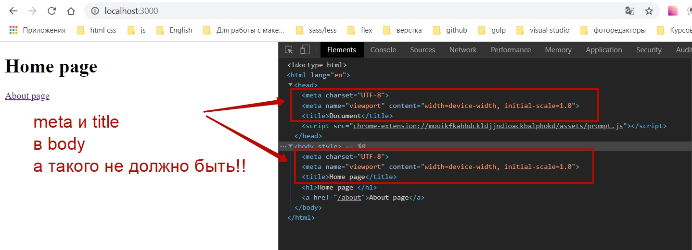
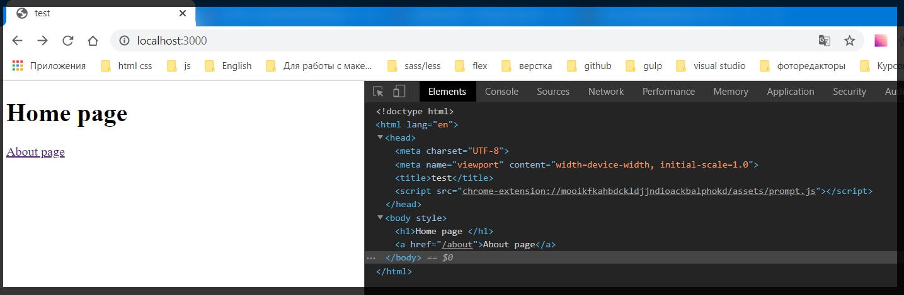
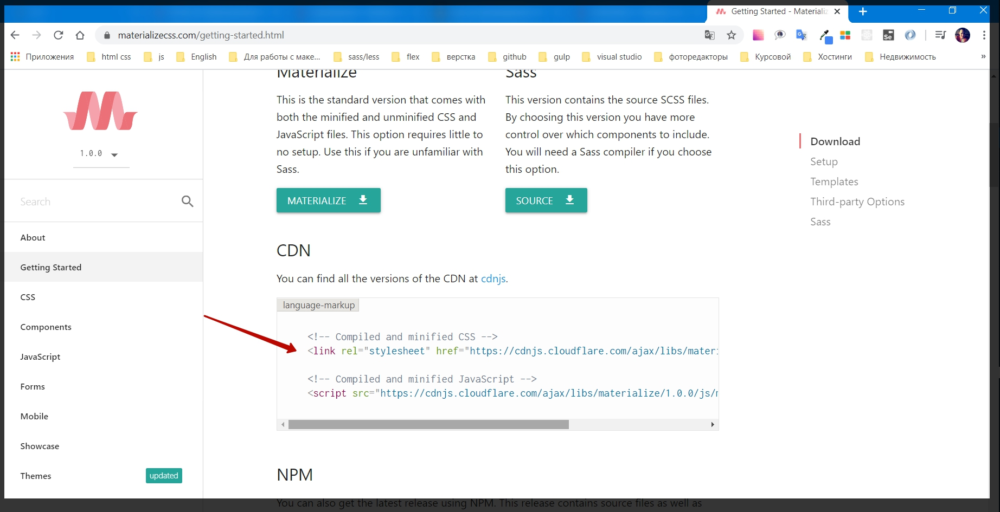
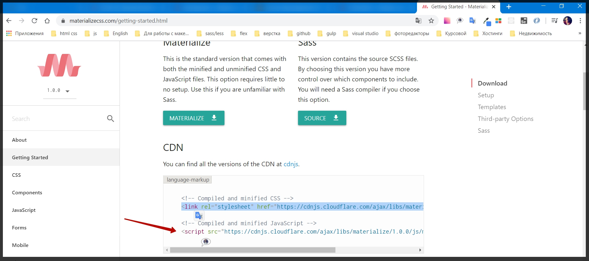
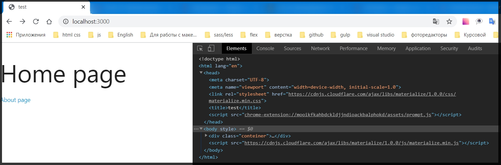

# Setting Layout(Настройки макета).

В прошлом уроке практически настроили **handlebars**. Однако сейчас у нас не загружаются ни какие страницы. Потому что **Layout** который мы создали в действительности он статический и он не принимает ни каких параметров. Он не знает куда нам необходимо рендерить ту или иную  страницу.
И теперь для того что бы указать куда нам нужно рендерить **body** каких - то элементов мы просто убираем здесь статику, элемент **h1** в файле **main. hbs**, и прописываю три фигурные скобки внутри друг друга.

Внутри которых я указываю специальное слово body

```html
// main.hbs
<!DOCTYPE html>
<html lang="en">

<head>
    <meta charset="UTF-8">
    <meta name="viewport" content="width=device-width, initial-scale=1.0">
    <title>Document</title>
</head>

<body>
    {{{body}}}
</body>

</html>
```
Сейчас если мы сохраним все в таком виде и посмотрим в браузере. Наши страницы прогружаются. Но если посмотреть на исходный код то мы увидим некоторые не состыковки. 



И в принципе это логично потому что в **index.hbs** у нас есть полная **html** страница. Однако нам это не интересно. В **index.hbs** нужно отрендерить только контентную часть.
Поэтому я удаляю все лишнее и оставляю только контент в **index.hbs**.

```html
// вот так оставляю
<h1>Home page </h1>

<a href="/about">About page</a>
```
И тоже самое делаю и для страницы **about.hbs**.

```html
//about.hbs
<h1>About page</h1>
```
И теперь каждую страницу менеджерить крайне просто. Основную структуру нам задает **Layout** а именно файл **main.hbs**.

Далее еще улучшаем **layout** и знакомимся еще с таким понятием как **partials**.
Для этого в папке **views** я создаю новую папку, которая имеет так же специальное название **partials**.

И в этой папке я могу создавать какие - то отдельные куски которые мы можем использовать в приложении, из которых мы будем составлять структуру страницы.

Предположим что в **partials** у нас пока будет один файл который будет называться **head.hbs**.

И из **layout** вырезаю верхнюю составляющую

```html 
// вырезаю из main.hbs
<!DOCTYPE html>
<html lang="en">

<head>
    <meta charset="UTF-8">
    <meta name="viewport" content="width=device-width, initial-scale=1.0">
    <title>Document</title>
</head>
```

И вставляю это в **head.hbs**. Это сделано для того что бы было проще данную часть кода конфигурировать отдельно.

В **main.hbs** Подключаю данную часть кода. Прописываю двойные фигурные скобки и спомощью знака больше, ну или стрелочки, кому как удобно, прописываю название **partial - са** который хотим вставить.

```html
// main.hbs
{{> head }}

<body>
    {{{body}}}
</body>

</html>
```
Если проверим в браузере то увидим что функционал остается темже.

Но при этом менеджерить **Head** стало куда удобнее. И если я пропишу в **title** файла **head.hbs**, то это изменится на каждой странице.




Далее создадим еще один **partials** который будет отвечать именно за **footer**.

Сразу подключаю его в **main.hbs**

```html
{{> head }}

<body>
    {{{body}}}


    {{>footer}}
</body>

</html>
```

Пока что footer будет пустым, но в будущем мы тоже будем хранить там какие - то скрипты, что бы было проще этим управлять.

Теперь давайте подключим какой - нибудь css fraemwork с помощью которого мы будем создавать структуру нашего приложения.

И для этого я предлагаю использовать [materialize.css](https://materializecss.com/)

На сайте жму** GET STARTED** и в **CDN**копирую подключение **min.css**



И в **head.hbs** я его подключаю

```html
<!DOCTYPE html>
<html lang="en">

<head>
    <meta charset="UTF-8">
    <meta name="viewport" content="width=device-width, initial-scale=1.0">
    <link rel="stylesheet" href="https://cdnjs.cloudflare.com/ajax/libs/materialize/1.0.0/css/materialize.min.css">
    <title>test</title>
</head>
```
И так же понадобится **js**



И уже его я занесу в **footer.hbs**

```html
// footer.hbs
<script src="https://cdnjs.cloudflare.com/ajax/libs/materialize/1.0.0/js/materialize.min.js"></script>
```
Т.е. скрипты мы будем складывать прямо перед закрывающимся тегом **body** для того что бы когда мы инициализировали скрипты, там уже был доступен весь набор html тегов который есть у нас на странице и по этому мы не будем получать ни каких ошибок.

И после этого последнее что мы сделаем в **layout**. Давайте обернем контент каждой страницы в класс conteiner.

```html
//main.hbs
{{> head }}

<body>
    <div class="conteiner">
        {{{body}}}
    </div>

    {{>footer}}
</body>

</html>
```
И проверяю работоспособность.



css framework подключен.
