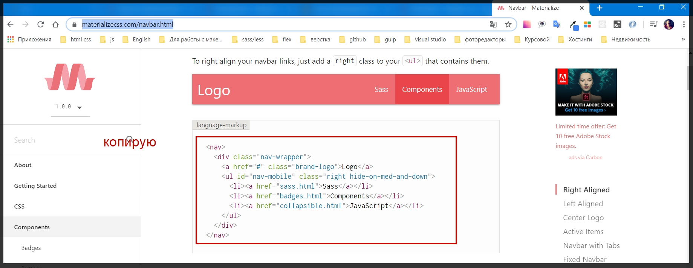
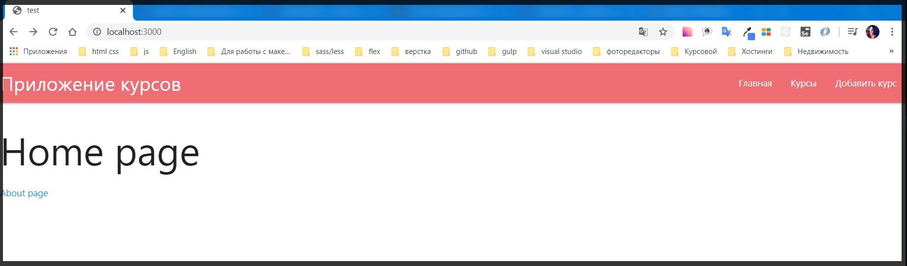
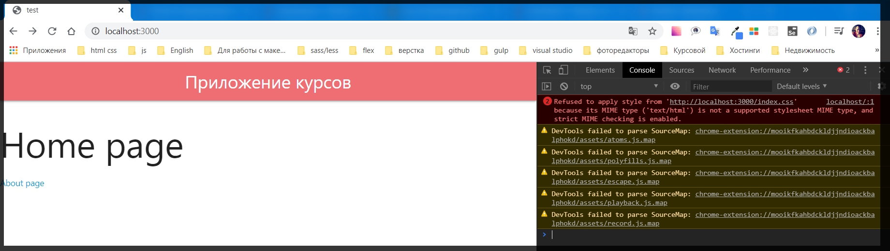
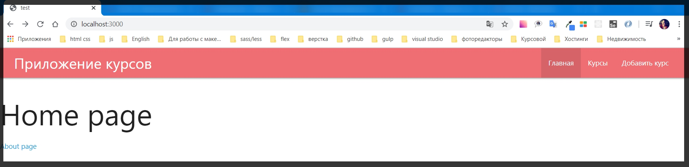

# Добавление навигации.

Создадим удобный **navbar** который будет позволять нам делать навигацию между всеми страницами которые есть у нас в web - приложении.

Для этого в **materialize.css** перехожу в поле [Components](https://materializecss.com/) и ищу компонете [Navbar](https://materializecss.com/navbar.html)

Далее просто копирую html код



В папке** partials** создаю новый файл который называю **navbar.hbs** куда и вставляю данный html код.

```html
//navbar.hbs
<nav>
    <div class="nav-wrapper">
        <a href="#" class="brand-logo">Logo</a>
        <ul id="nav-mobile" class="right hide-on-med-and-down">
            <li><a href="sass.html">Sass</a></li>
            <li><a href="badges.html">Components</a></li>
            <li><a href="collapsible.html">JavaScript</a></li>
        </ul>
    </div>
</nav>
```

Теперь его немного отконфигурируем.

В первой ссылке даю название своего приложения Courses App где я буду показывать список курсов которые есть в интернет магазине и будем их продавать.

Далее настраиваю ссылки элемента списка которые будут помогать делать навигацию между страницами.

```html
navbar.hbs
<nav>
    <div class="nav-wrapper">
        <a href="#" class="brand-logo">Приложение курсов</a>
        <ul id="nav-mobile" class="right hide-on-med-and-down">
            <li>
                <a href="/">Главная</a>
            </li>
            <li>
                <a href="/courses">Курсы</a>
            </li>
            <li>
                <a href="/add">Добавить курс</a>
            </li>
        </ul>
    </div>
</nav>
```

Далее в **main.hbs** перед классом **conteiner** подключаю данный **partials**.

```html
main.hbs
{{> head }}

<body>

    {{>navbar}}

    <div class="conteiner">
        {{{body}}}
    </div>

    {{>footer}}
</body>

</html>
```

Смотрим в браузере.



Здесь нет отступов которые были бы кстати.

Для этого я могу написать свой кастомный **html** код в корне приложения в папке **public** которую сейчас и создам.
В ней создаю файл **index.css**

```css
.nav-wrapper{
    padding: 0 2rem;
}
```

И для того что бы стили применились в **head.hbs** подключаю файл стилей.

```html
// head.hbs
<!DOCTYPE html>
<html lang="en">

<head>
    <meta charset="UTF-8">
    <meta name="viewport" content="width=device-width, initial-scale=1.0">
    <link rel="stylesheet" href="https://cdnjs.cloudflare.com/ajax/libs/materialize/1.0.0/css/materialize.min.css">
    <link rel="stylesheet" href="/public/index.css">
    <title>test</title>
</head>
```

Однако получим ошибку.



Эта ошибка говорит нам о том что **Express** не смог найти такой файл. 

На самом деле исправить данную ошибку просто. У нас есть папка **public** которая хранит клиентские скрипты, css файлы. _**И для того что бы указать что папка public будет являться статической нам необходимо зарегистрировать ее как публичную.**_

И для этого в файле **index.js** 
Мы можем обратиться в объекту **app** и вызвать метод который называется **use()**. Этот метод позволяет нам добавлять какие - то новые middle - wire дополнительную функциональность для нашего приложения.
первым параметром передаю **express** и у него вызываем метод который называется **static()** в параметры которого передаю название папки **public**.

```js
//index.js
/* eslint-disable linebreak-style */
const express = require('express');
const path = require('path');
const exphbs = require('express-handlebars');

const app = express();

const hbs = exphbs.create({
  defaultLayout: 'main',
  extname: 'hbs',
});

app.engine('hbs', hbs.engine); // регистрирую движок
app.set('view engine', 'hbs');// с помощью set начинаю использовать движок
app.set('views', 'views'); // первый параметр заношу переменную, а второй название папки в которой веду разработку. Название может быть любым

app.use(express.static('public')); // делаю папку public публичной а не динамической для того что бы express ее не обрабатывал

app.get('/', (req, res) => {
  res.render('index')
});
app.get('/about', (req, res) => {
  res.render('about')
});

const PORT = process.env.PORT || 3000;

app.listen(PORT, () => {
  console.log(`Server is running on port ${PORT}`);
});
```

Все получилось. Теперь я могу добавлять свои файлы стилей.

Если мы взглянем на приложение то оно выглядит еще совершенно сломанным кроме главной страницы.
Здесь недостает несколько вещей.
1. _Было бы неплохо создавать какой - то  динамический title. Потому что сейчас он для всех страниц одинаковый._
2. _Ну и былобы неплохо добавить страницы Главная, Курсы и Добавить курс_. 
3. _И подсвечивать активность ссылки т.е. какая ссылка сейчас загружена._

Однако если главной странице задать класс **active** то она будет подсвечиваться.

```html
//navbar.hbs
<nav>
    <div class="nav-wrapper">
        <a href="#" class="brand-logo">Приложение курсов</a>
        <ul id="nav-mobile" class="right hide-on-med-and-down">
            <li class="active">
                <a href="/">Главная</a>
            </li>
            <li>
                <a href="/courses">Курсы</a>
            </li>
            <li>
                <a href="/add">Добавить курс</a>
            </li>
        </ul>
    </div>
</nav>
```


