# Обработка формы

Теперь научимся обрабатывать **POST** запросы. И реализуем страницу **Добавить новый курс**.

Перехожу в **materialize** и нахожу секцию **forms** где есть поле [Text inputs](https://materializecss.com/text-inputs.html) т.е. просто скопируем данные инпуты с помощью которых я буду добавлять новые данные.

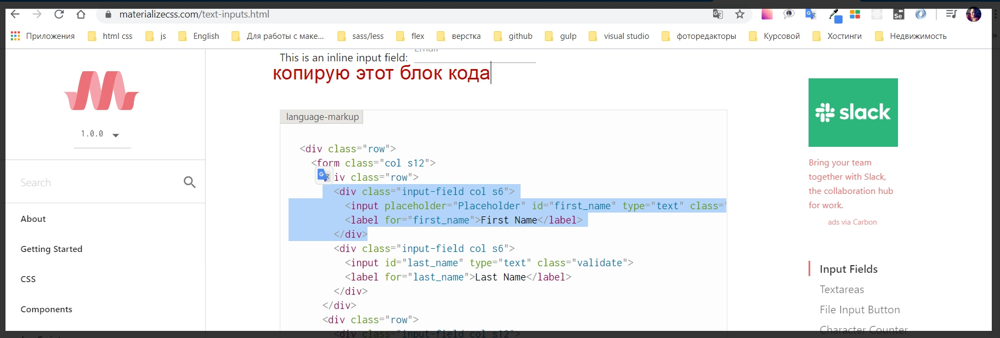

Перехожу во **views** и в файл **add.hbs**.

```js
//add.hbs
<h1>Добавить новый курс</h1>

<form action="/add" method="POST">
    <div class="input-field">
        <input  id="title" type="text" class="validate">
        <label for="title">Название курса</label>
    </div>
</form>
```

После этого необходимо будет записать блок с ценой данного курса, и блок с картинкой.

```js
//add.hbs
<h1>Добавить новый курс</h1>

<form action="/add" method="POST">
    <div class="input-field">
        <input id="title" type="text" class="validate">
        <label for="title">Название курса</label>
    </div>
    <div class="input-field">
        <input id="price" type="number" class="validate">
        <label for="price">Цена курса</label>
    </div>

    <div class="input-field">
        <input id="img" type="text" class="validate">
        <label for="img">URL картинки</label>
    </div>
</form>
```

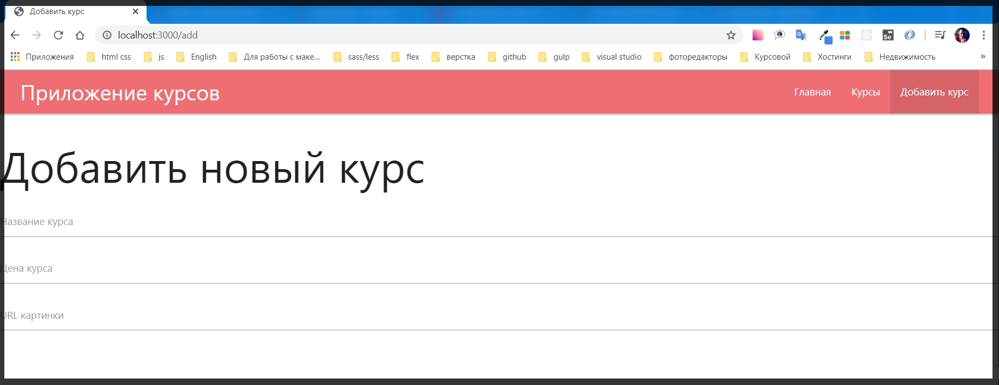

Со стилями разберусть позже.

Теперь так же нужно добавить кнопку которая будет сабмитить форму.

```js
//add.hbs
<div class="row">
    <h1>Добавить новый курс</h1>

    <form class="form" action="/add" method="POST">

        <div class="input-field">
            <input id="title" type="text" class="validate">
            <label for="title">Название курса</label>
        </div>
        <div class="input-field">
            <input id="price" type="number" class="validate">
            <label for="price">Цена курса</label>
        </div>

        <div class="input-field">
            <input id="img" type="text" class="validate">
            <label for="img">URL картинки</label>
        </div>
    </form>

    <button class="btn btn-primary">Добавить курс</button>
</div>
```

Так же добавляю валидацию для каждого из **input**.

Для этого мы можем посмотреть в **materialize**. Для этого у него есть специальное поле которое позволяет это делать 

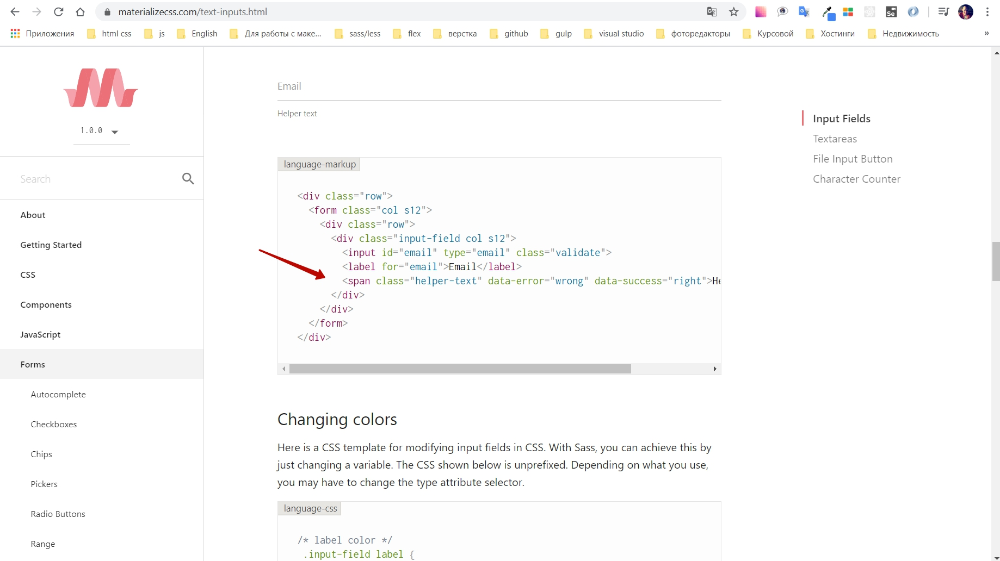

Копирую этот **span**. И для каждого поля его добавить. Класс должен быть **helper-text**. В атрибуте **data-error** мы прописывам название ошибки.
Должно получиться вот так.

```js
//add.hbs
<div class="row">
    <h1>Добавить новый курс</h1>

    <form class="form" action="/add" method="POST">

        <div class="input-field">
            <input id="title" type="text" class="validate" required>
            <label for="title">Название курса</label>
            <span class="helper-text" data-error="Введите название курса"></span>
        </div>

        <div class="input-field">
            <input id="price" type="number" class="validate" required min="1">
            <label for="price">Цена курса</label>
            <span class="helper-text" data-error="Введите цену"></span>
        </div>

        <div class="input-field">
            <input id="img" type="text" class="validate" required>
            <label for="img">URL картинки</label>
            <span class="helper-text" data-error="Введите url картинки"></span>
        </div>
        <button class="btn btn-primary">Добавить курс</button>
    </form>
</div>
```

Теперь для каждого **inputa** мы должны добавить валидаторы. Допустим пока что они будут очень простые. Для каждого **input** я напишу **required** и этого будет достаточно. И для цены я могу поставить минимальное значение **min="1"**.

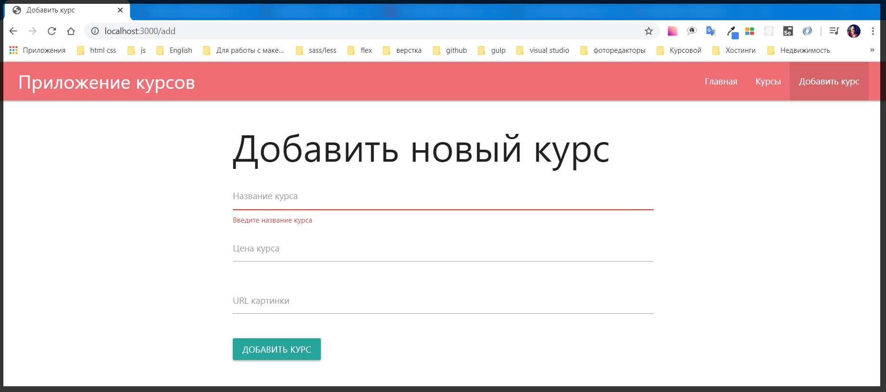

Если попробую отправить без заполнения появляются **default** валидаторы

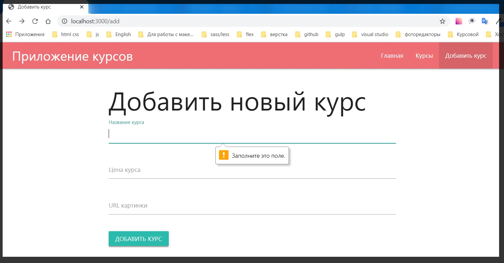

Если я попробую заполнить форму и отправить то получу ошибку.

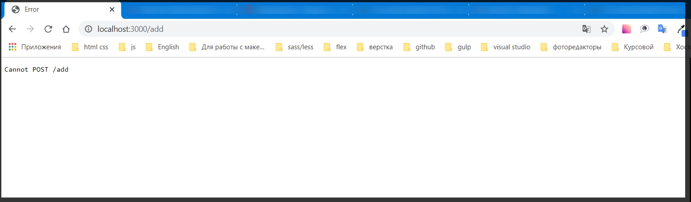

Ошибка говорит о том что **Express** не может найти роут метода **POST**.

И для этого мы можем перейти в папку **router** и файл **add.js**.
В этом файле обращаюсь к **router** и его методу **post()** т.е. обработаем **post** запрос который будет за обработчик формы.
Первым параметром прописываю **'/'**, второй параметр **callback** функция в параметры которой прописываю **request** и **responce**, и в теле функции пока просто выводим в консоль то что получаем. Те данные которые мы отправляем хранятся в **req.body**.

```js
//add.js
router.post('/', (req, res) =>{
    console.log(req.body);
});

module.exports = router;
```

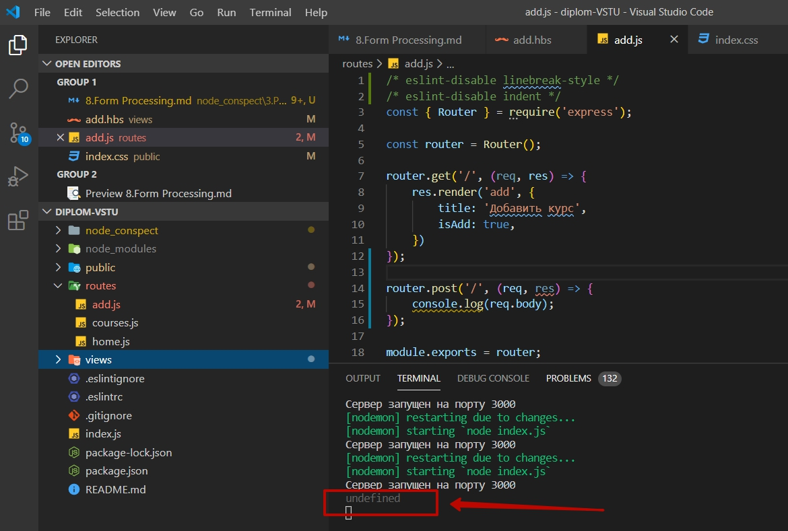

**indefined**(неопределено).

Данная ошибка выводится потому что данные параметры в форме необходимо обрабатывать. А так как они не обработались у нас и вывелось сообщение что данный параметр не определен.

В **Express** это делается очень просто, т.е. нам не надо будет добавлять функционал по прослушке события буфера и т.д.

Все что  необходимо сделать это перейти в файл **index.js** . И например после того как мы задаем статическую папку **app.use(express.static('public'));**.
Обращаюсь к объекту **app**  медод **use()**, мы будем добавлять midle were т.е. добавлять новый функционал с помощью метода **use**. В параметрах я обращаюсь к **express** и вызываю у него метод который называется urlencoded(). В параметры которого я должен передать объект, указываю ключ **extended** в значении **false** позже исправил на **true**.

> Ищи строчку **app.use(express.urlencoded({ extended: true }));** // данный метод использую при обработке **POST** запроса формы добавления курса

```js
//index.js
/* eslint-disable linebreak-style */
const express = require('express');
const path = require('path');
const exphbs = require('express-handlebars');

const homeRoutes = require('./routes/home');
const addRouters = require('./routes/add');
const coursesRotes = require('./routes/courses');

const app = express();

const hbs = exphbs.create({
  defaultLayout: 'main',
  extname: 'hbs',
});

app.engine('hbs', hbs.engine); // регистрирую движок
app.set('view engine', 'hbs');// с помощью set начинаю использовать движок
app.set('views', 'views'); // первый параметр заношу переменную, а второй название папки в которой веду разработку. Название может быть любым


app.use(express.static('public')); // делаю папку public публичной а не динамической для того что бы express ее не обрабатывал
app.use(express.urlencoded({ extended: true })); // данный метод использую при обработке POST запроса формы добавления курса
app.use('/', homeRoutes); // использую импортированный роут
app.use('/add', addRouters); // использую импортированный роут
app.use('/courses', coursesRotes); // использую импортированный роут

const PORT = process.env.PORT || 3000;

app.listen(PORT, () => {
  console.log(`Сервер запущен на порту ${PORT}`);
});

```

Если обновим страницу в браузере, добавим значения в форму и отправим.

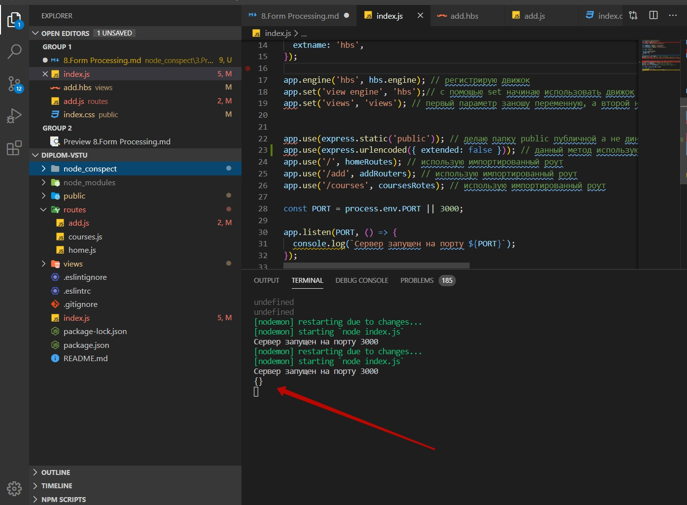

После отправки я получаю пустой объект.

Для этого перезапускаю приложение **Ctrl + C** и запускаю **npm run dev**.

И для того что бы приложение не зависало в файле **add.js** в теле функции **router.post** напишу функционал.
Если подумать. Когда мы добавляем курс нужно будет сделать **redirect**(перенаправить), на страницу всех курсов для того что бы посмотреть как он добавился.

И **redirect** я могу добавить очень просто с помощью объекта **res.** и далее вызываю у него метод **redirect()** где в параметрах прописываю на какую страницу я перенаправляю.

```add.js
/* eslint-disable linebreak-style */
/* eslint-disable indent */
const { Router } = require('express');

const router = Router();

router.get('/', (req, res) => {
    res.render('add', {
        title: 'Добавить курс',
        isAdd: true,
    })
});

router.post('/', (req, res) => {
    console.log(req.body);


    res.redirect('/courses');
});

module.exports = router;
```

Теперь нужно убедиться что все таки в объекте **req.body** есть какие - то данные.

Заполняю форму в браузере и отправляю.


После заполнения и отправки происходит **redirect**(перенаправление) на страницу курсов, однако в консоли все равно пустой объект.

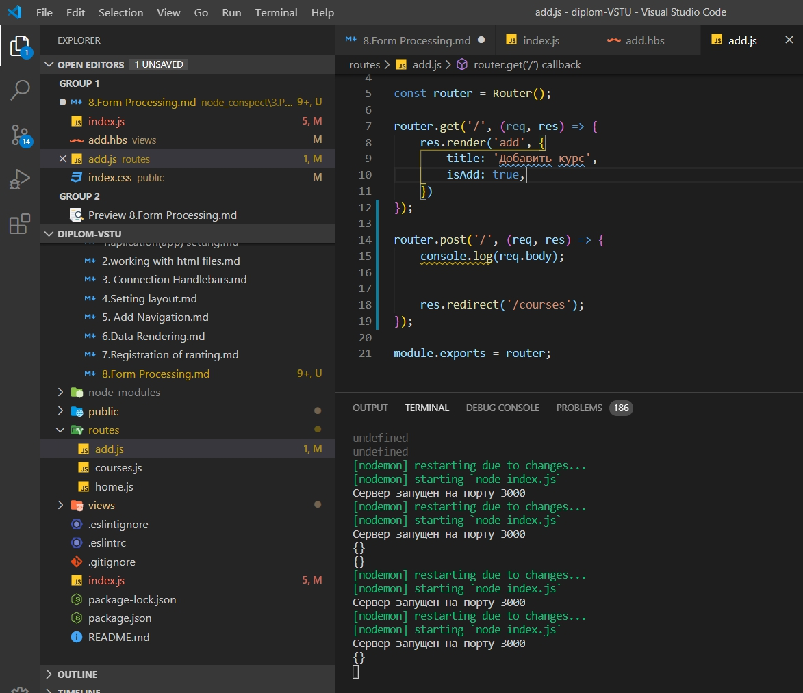

>Если взглянуть на файл **add.hbs** по внимательней, то можно обнаружить что нет имен тех полей которые мы передаем. Каждому **input** для того что бы он корректно работал нам необходимо добавить атрибут **name=""**.

```js
//add.hbs
<div class="row">
    <h1>Добавить новый курс</h1>

    <form class="form" action="/add" method="POST">

        <div class="input-field">
            <input id="title" name="title" type="text" class="validate" required>
            <label for="title">Название курса</label>
            <span class="helper-text" data-error="Введите название курса"></span>
        </div>

        <div class="input-field">
            <input id="price" name="price" type="number" class="validate" required min="1">
            <label for="price">Цена курса</label>
            <span class="helper-text" data-error="Введите цену"></span>
        </div>

        <div class="input-field">
            <input id="img" name="img" type="text" class="validate" required>
            <label for="img">URL картинки</label>
            <span class="helper-text" data-error="Введите url картинки"></span>
        </div>
        <button class="btn btn-primary">Добавить курс</button>
    </form>
</div>
```
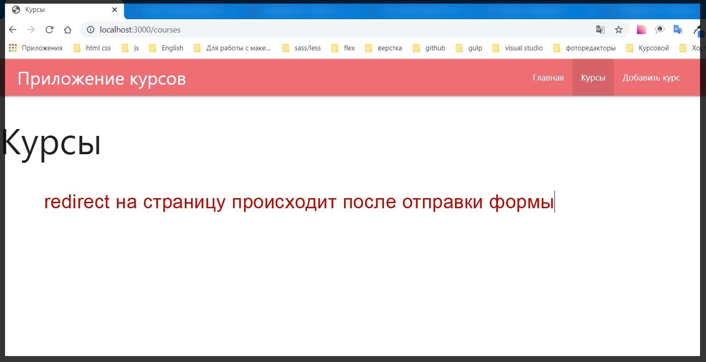

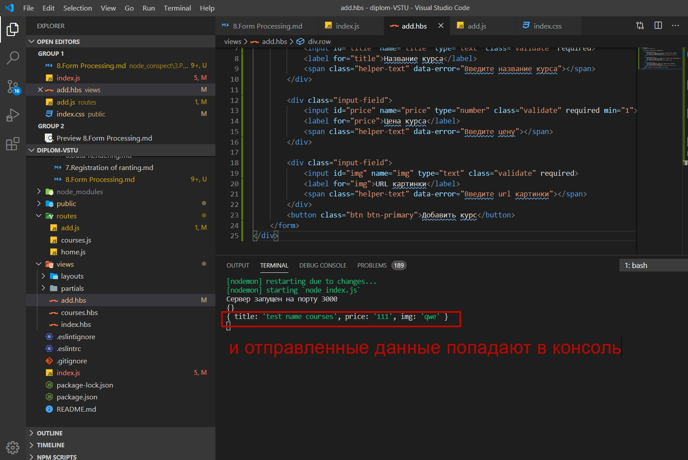

И теперь по сути я могу работать с отправляемыми данными т.е. сейчас в роутере **add.js** в объекте **req.boby** храняться все необходимые данные.

```js
//add.js
/* eslint-disable linebreak-style */
/* eslint-disable indent */
const { Router } = require('express');

const router = Router();

router.get('/', (req, res) => {
    res.render('add', {
        title: 'Добавить курс',
        isAdd: true,
    })
});

router.post('/', (req, res) => {
    console.log(req.body);  // здесь храняться все отправленные данные


    res.redirect('/courses');
});

module.exports = router;
```

Пока что я разберу как впринципе работает **express**, как можно взаимодействовать с различными файлами. И для храниения различных данный я буду использовать файлы. Поэтому для того что бы сохранить данные которые передаются из формы, необходимо создать какую - то модель которая будет работать с этими данными. Т.е. не напрямую в роутере сохранять эти значения **(console.log(req.body); // здесь храняться все отправленные данные**
), а сделаем модель которая за нас будет это все делать.