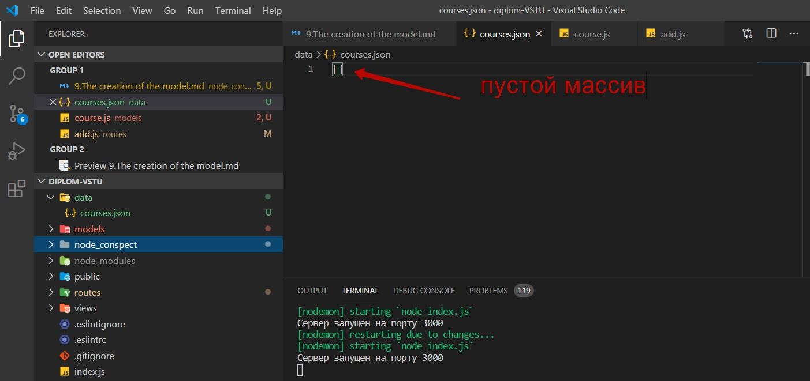
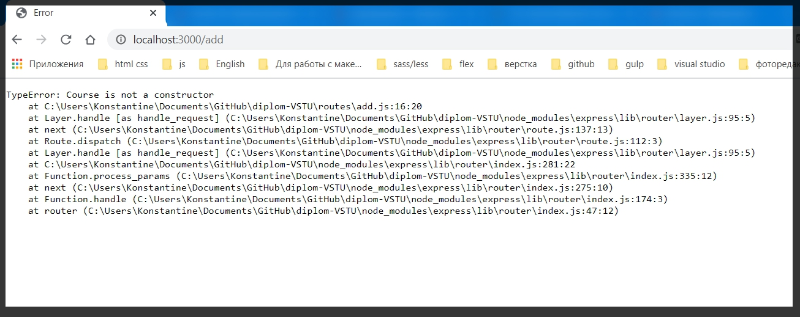
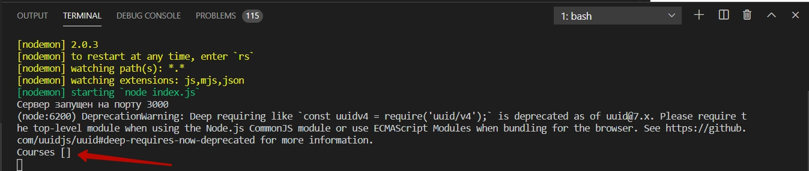
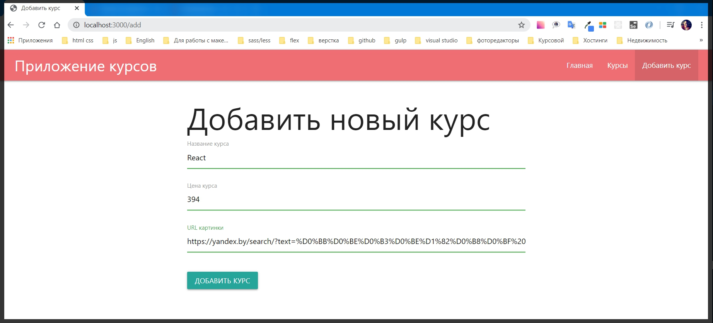
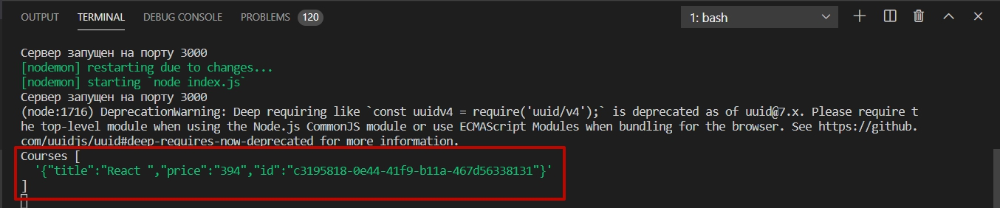
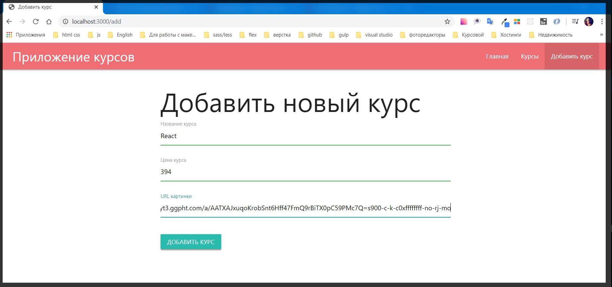
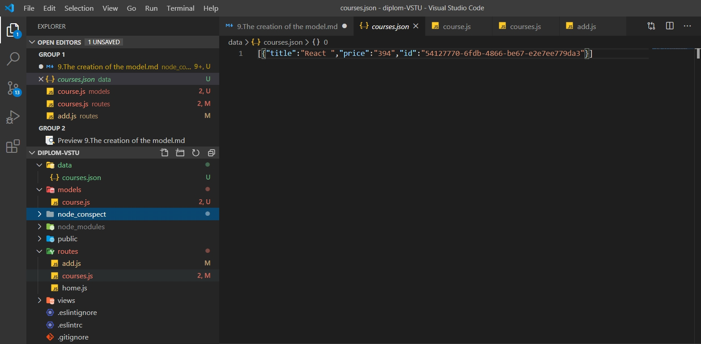

# Создание модели.

Создаю модель которая будет работать с курсами, которая будет сохранять их, получать их и т.д.

Для этого в корне проекта я создаю папку которую называю **models**.
И сейчас разберем как можно на низком уровне создавать подобные модели.
В папке создаю файл **course.js**.
Модель будет представлена ввиде класса. Использую **ES6** синтаксис,  **class Course{}**. Когда мы будем инициализировать данный класс мы будем создавать нужный курс.
Внутри тела **class Courses{}** реализовываю **constructor(){}**, где в условии первым параметром я буду принимать **title**, вторым **price**, и третьим **img**.
В теле конструктора заношу эти значения в приватные переменные.

```js
// models, course.js
class Course {
    constructor(title, price, img) {
        this.title = title,
            this.price = price,
            this.img = img
    }
}
```
Далее в этом же классе необходимо реализовать метод который будет сохранять все эти данные в файле. И поэтому создаю метод **save(){}** который пока что ничего не будет делать.

```js
class Course {
    constructor(title, price, img) {
        this.title = title,
            this.price = price,
            this.img = img
    }

    
    save(){}
}
```

Теперь в **routes** в файле **add.js** необходимо подключить данную модель **const Course = ('../models/courses.js');** После подключения в теле **router.post**, создаю константу **course** которая будет являться результатом конструктора **new Course()**, И параметры **Course** передаю те значения в том порядке в котором мы задали в файле **course.js** только мы их вытаскиваем из объекта **req.body т.е. req.body.title, req.body.price и req.body.img**.
После создания этого объекта мы все также в теле **router.post** обращаюсь к **сourse** и вызываю у него метод _save()_

```js
//add.js
const { Router } = require('express');

const Course = ('../models/course.js');
const router = Router();

router.get('/', (req, res) => {
    res.render('add', {
        title: 'Добавить курс',
        isAdd: true,
    })
});

router.post('/', (req, res) => {
    const course = new Course(req.body.title, req.body.price, req.body.img);
    course.save();
    res.redirect('/courses');
});

module.exports = router;
```


Но пока что метод **save** в файле _course.js_ в **class Course** ничего неделает. Поэтому реализую данный функционал.

В первую очередь необходимо создать **id** данного курса. В конструкторе задаю приватное поле **this.id** которое пока что равняется **null**.

```js
//course.js
class Course {
    constructor(title, price, img) {
        this.title = title,
            this.price = price,
            this.img = img,
            this.id = null
    }


    save() { }
}
```

После этого устанавливаю и подключаю дополнительную библиотеку

> npm i uuid

C помощью этой библиотеки я могу генерировать различные уникальные индификаторы для разных моделей.
И подключаю ее.

```js
//course.js
const uuid = require('uuid/v4');  // после слэша указываю версию библиотеки которую хочу подключить

class Course {
    constructor(title, price, img) {
        this.title = title,
            this.price = price,
            this.img = img,
            this.id = null
    }


    save() { }
}
```

После этого для того что бы в конструкторе задать **id**, я просто вызываю в **this.id** присваиваю вызов функции **uuid()**. И после этого будут доступны уникальные **id**.

```js
//course.js
const uuid = require('uuid/v4');  // после слэша указываю версию библиотеки которую хочу подключить

class Course {
    constructor(title, price, img) {
        this.title = title,
            this.price = price,
            this.img = img,
            this.id = uuid()
    }


    save() { }
}
```

После этого в методе **save** необходимо преобразовать полученные данные в формат **JSON**, и после этого сохранить их в отдельный файл.

Но для начало этот файл необходимо создать. Поэтому в корне приложения создаю новую папку в которой я буду хранить данные. Пока что это будет некая такая импровизированная база данных которая находится в отдельном **JSON** файле.

В корне создаю папку **data**(данные). И файл в ней будет называться **courses.json** где пока что будет лежать просто пустой массив



И теперь мы просто не можем взять и закинуть какой то объект в этот файл **courses.json**. Т.е. для начало необходимо получить все содержимое данного файла т.е. **сourses.json**.

И для этого мы можем написать отдельную функцию. Но будет более удобно задать некий статический метод для модели, для того что бы мы могли все данные использовать.

После функции **save(){}** в файле **сourse.js**, пишу ключевое слово **static** c помощью которого создаю метод **getAll(){}**

```js
//course.js
const uuid = require('uuid/v4');  // после слэша указываю версию библиотеки которую хочу подключить

class Course {
    constructor(title, price, img) {
        this.title = title,
            this.price = price,
            this.img = img,
            this.id = uuid()
    }


    save() {
        
     }

    static getAll(){

    }
}
```
Далее нам по сути нужно прочитать файл. Для этого я подключаю объект **fs** который у нас работает с файловой системой. И так же подключаю объект для работы с путями **path**.

```js
//course.js
const uuid = require('uuid/v4'); // после слэша указываю версию библиотеки которую хочу подключить
const fs = require('fs');
const path = require('path');


class Course {
    constructor(title, price, img) {
        this.title = title,
            this.price = price,
            this.img = img,
            this.id = uuid()
    }


    save() {

    }

    static getAll() {

    }
}
```

Теперь в теле метода **getAll** обращаюсь к модулю **fs** и нам не нужно пользоваться синхронными методами поэтому я воспользуюсь методом **readFile()** куда первым параметром мы передаем путь до того файла который нам необходимо подключить. Его я могу задать с помощью модуля **path**. вызываю метод **join()**, первым параметром я передаю **__dirname**, вторым параметром указываю в какую дирректорию я хочу выйти, третий параметр имя папки **data**, и червертым параметром имя файла.

Вторым параметром **path.join** необходимо прописать кодировку.

И третьим параметром **path.join** прописываю **callback** функцию которая будет выдавать определенные значения.

```js
//course.js
const uuid = require('uuid/v4'); // после слэша указываю версию библиотеки которую хочу подключить
const fs = require('fs');
const path = require('path');


class Course {
    constructor(title, price, img) {
        this.title = title,
            this.price = price,
            this.img = img,
            this.id = uuid()
    }


    save() {

    };

    static getAll() {
fs.readFile(
    path.join(__dirname, '..', 'data', 'courses.json'),
    'utf-8',
    ()=>{
        
    }
)
    }
};
```

Первым параметром колбека передаю **err** ошибку если она есть. А вторым параметром некоторый **content**.
В теле функцию пишу проверку на ошибки с помощью цикла **if else**. Если же есть ожибка то оператор **throw** подскажет нам об этом.

```js
//course.js
const uuid = require('uuid/v4'); // после слэша указываю версию библиотеки которую хочу подключить
const fs = require('fs');
const path = require('path');


class Course {
    constructor(title, price, img) {
        this.title = title,
            this.price = price,
            this.img = img,
            this.id = uuid()
    }


    save() {

    }

    static getAll() {
        fs.readFile(
            path.join(__dirname, '..', 'data', 'courses.json'),
            'utf-8',
            (err, content) => {
                if(err) throw err

            },
        )
    }
}
```

Но если же есть какой - то контент, то необходимо его передать его из этой функции. Т.е. что мы будем делать?

В теле метода **save** мы получим в объекте **сourses**  какой - то результат из метода **getAll** который я вызываю через класс **Course** и его метод называется **getAll()**

```js
//course.js

const uuid = require('uuid/v4'); // после слэша указываю версию библиотеки которую хочу подключить
const fs = require('fs');
const path = require('path');


class Course {
    constructor(title, price, img) {
        this.title = title,
            this.price = price,
            this.img = img,
            this.id = uuid()
    }


    save() {
        const courses = Courses.getAll()
    }

    static getAll() {
        fs.readFile(
            path.join(__dirname, '..', 'data', 'courses.json'),
            'utf-8',
            (err, content) => {
                if (err) throw err
            },
        )
    }
}
```

Т.е. данный метод **Courses.getAll()** должен возвращать некоторый результат, для того что бы это было удобно.

Но в функции **static getAll(){}** я работаю с **callback-ами**. И для того что бы сделать такой линейный вызов **const courses = Courses.getAll(),** мы можем обернуть это все в **promis**. **Promis** это нативная функция в **JS**. Поэтому в теле **static getAll** я возвращаю новый **Promise()** в конструктор котогого я передаю **callback** функцию.

```js
//course.js
const uuid = require('uuid/v4'); // после слэша указываю версию библиотеки которую хочу подключить
const fs = require('fs');
const path = require('path');


class Course {
    constructor(title, price, img) {
        this.title = title,
            this.price = price,
            this.img = img,
            this.id = uuid()
    }


    save() {
        const courses = Courses.getAll()
    }

    static getAll() {
        return new Promise(() => { })

        fs.readFile(
            path.join(__dirname, '..', 'data', 'courses.json'),
            'utf-8',
            (err, content) => {
                if (err) throw err
            },
        )
    }
}
```

Данный **callback** принимает в себя два параметра **resolve(разрешить)**, **reject(отклонить)**. И после этого я вырезаю весь асинхронный код, в моем случае

```js
   fs.readFile(
            path.join(__dirname, '..', 'data', 'courses.json'),
            'utf-8',
            (err, content) => {
                if (err) throw err
            },
        )
```

И просто вставляю его в **Promise**.

```js
//course.js
const uuid = require('uuid/v4'); // после слэша указываю версию библиотеки которую хочу подключить
const fs = require('fs');
const path = require('path');


class Course {
    constructor(title, price, img) {
        this.title = title,
            this.price = price,
            this.img = img,
            this.id = uuid()
    }


    save() {
        const courses = Courses.getAll()
    }

    static getAll() {
        return new Promise((resolve, reject) => {
            fs.readFile(
                path.join(__dirname, '..', 'data', 'courses.json'),
                'utf-8',
                (err, content) => {
                    if (err) throw err
                },
            )
        })
    }
}
```

И далее для того что бы обрабатывать ошибку таким образом  **if (err) throw err**, вместо **throw** вызываю метод **reject(err)** c ошибкой которая получилась

```js
//кусок кода
static getAll() {
        return new Promise((resolve, reject) => {
            fs.readFile(
                path.join(__dirname, '..', 'data', 'courses.json'),
                'utf-8',
                (err, content) => {
                    if (err) {
                        reject(err)
                    }
                },
            )
        })
    }
```

А иначе **else** если нет ни какой ошибки, то тогда мы будем вызывать метод **resolve()**. И дальше мы получаем весь контент в формате строки которую нужно распарсить. В параметр прописываю J**SON.parse(content).**

```js
 static getAll() {
        return new Promise((resolve, reject) => {
            fs.readFile(
                path.join(__dirname, '..', 'data', 'courses.json'),
                'utf-8',
                (err, content) => {
                    if (err) {
                        reject(err)
                    }else{
                        resolve(JSON.parse(content))
                    }
                },
            )
        })
    }
```

Теперь в функции **save** я могу работать с промисом. Но теперь данный метод **Courses.getAll()** возвращает **promis**. Поэтому у переменной я могу вызвать метод **then**, но это не очень удобно.

Более удобно сделать данный медод **save** асинхронным [async](https://learn.javascript.ru/search/?query=async+&type=article) и после этого воспользоваться оператором [await](https://learn.javascript.ru/search/?query=await&type=article)

```js
  async save() {
        const courses = await Courses.getAll()
    }
```

И теперь в объекте **courses** мы получим уже нужные нам данные.

Это мы можем проверить выводом в консоль.

```js
  async save() {
        const courses = await Courses.getAll()

        console.log('Courses', courses)
    }
```

Теперь на странице добавления курса ввожу какие - нибудь рандомные значения и добавляю их.



В ошибке написано **Course is not a constructor**.

Если мы посмотрим на наш код то увидим что мы забыли экспортировать класс **module.exports = Course**

```js 
// course.js

const uuid = require('uuid/v4'); // после слэша указываю версию библиотеки которую хочу подключить
const fs = require('fs');
const path = require('path');


class Course {
    constructor(title, price, img) {
        this.title = title,
            this.price = price,
            this.img = img,
            this.id = uuid()
    }


    async save() {
        const courses = await Courses.getAll()

        console.log('Courses', courses)
    }

    static getAll() {
        return new Promise((resolve, reject) => {
            fs.readFile(
                path.join(__dirname, '..', 'data', 'courses.json'),
                'utf-8',
                (err, content) => {
                    if (err) {
                        reject(err)
                    } else {
                        resolve(JSON.parse(content))
                    }
                },
            )
        })
    }
}
module.exports = Course
```

> Для того что бы все заработало откопался два дня!!! Выдавалась ошибка Course is not a constructor. Посмотрел в исходники, оказывается файл add.js должен быть вот таким

```js
const { Router } = require('express')
const Course = require('../models/course')

const router = Router()

router.get('/', (req, res) => {
    res.render('add', {
        title: 'Добавить курс',
        isAdd: true,
    })
});

router.post('/', async (req, res) => {
    const course = new Course(req.body.title, req.body.price, req.body.img);
    await course.save()
    res.redirect('/courses')
});

module.exports = router;
```

> вся загвоздка была в асинхронности **request** и **result**.Async функция всегда возвращает [promise](https://learn.javascript.ru/promise-basics). И в ключевом слове **await**, **await** заставит интерпретатор **JavaScript** ждать до тех пор, пока **promise** не выполнится.

После отправки формы в консоли получаю пустой объект



Объект является массивом. И при этом данный функционал работает корректно.

Теперь у меня есть **JS** массив куда я должен добавить данные курса. 

Для этого реализую [helper](https://learn.javascript.ru/templates) функцию которую называю **toJSON(){}**. 
В теле функции пишу возвражение результата работы глобального объекта **JSON** его метода [stringify()](https://developer.mozilla.org/ru/docs/Web/JavaScript/Reference/Global_Objects/JSON/stringify) и в параметры помещаю поля объекта в которых прописываю.

```js
// кусок этого кода
    toJSON() {
        return {
            title: this.title,
            price: this.price,
            img: this.img,
            id: this.id,
        }
    }
```

Полный код

```js
//course.js
const uuid = require('uuid/v4');
const fs = require('fs');
const path = require('path');

class Course {
    constructor(title, price, img) {
        this.title = title
        this.price = price
        this.img = img
        this.id = uuid()
    }

    toJSON() {
        return {
            title: this.title,
            price: this.price,
            img: this.img,
            id: this.id,
        }
    }

    async save() {
        const courses = await Course.getAll()
        console.log('Courses', courses)
    }

    static getAll() {
        return new Promise((resolve, reject) => {
            fs.readFile(
                path.join(__dirname, '..', 'data', 'courses.json'),
                'utf-8',
                (err, content) => {
                    if (err) {
                        reject(err)
                    } else {
                        resolve(JSON.parse(content))
                    }
                },
            )
        })
    }
}

module.exports = Course
```

После этого в тело ассинхронной функции **save** я вызываю массив **courses** его метода **push()**(толкать) в его параметр я с помощью [this](https://learn.javascript.ru/search/?query=this&type=article) указываю объект **toJSON()**. И теперь я могу посмотреть что находится в массиве курсов.

```js
// кусок
  async save() {
        const courses = await Course.getAll()
        courses.push(this.toJSON())
        console.log('Courses', courses)
    }
```
Полный

```js
const uuid = require('uuid/v4');
const fs = require('fs');
const path = require('path');

class Course {
    constructor(title, price, img) {
        this.title = title
        this.price = price
        this.img = img
        this.id = uuid()
    }

     toJSON() {
        return {
            title: this.title,
            price: this.price,
            img: this.img,
            id: this.id,
        }
    }

    async save() {
        const courses = await Course.getAll()
        courses.push(this.toJSON())
        console.log('Courses', courses)
    }

    static getAll() {
        return new Promise((resolve, reject) => {
            fs.readFile(
                path.join(__dirname, '..', 'data', 'courses.json'),
                'utf-8',
                (err, content) => {
                    if (err) {
                        reject(err)
                    } else {
                        resolve(JSON.parse(content))
                    }
                },
            )
        })
    }
}

module.exports = Course
```

Добавляю курс



И вот я получаю массив который в себе содержит за **stringify - ный JSON**.



> Вообще это не самы корректный способ помещать сразу же строку. Потому что мы будем работать с JS объектами.

```js
 async save() {
        const courses = await Course.getAll()
        courses.push(this.toJSON())
        console.log('Courses', courses)
    }
```

 И на самом деле лучше его удалим

 ```js
 toJSON() {
        return {
            title: this.title,
            price: this.price,
            img: this.img,
            id: this.id,
        }
    }
```

Полный код

```js
const uuid = require('uuid/v4');
const fs = require('fs');
const path = require('path');

class Course {
    constructor(title, price, img) {
        this.title = title
        this.price = price
        this.img = img
        this.id = uuid()
    }

    toJSON() {
        return {
            title: this.title,
            price: this.price,
            img: this.img,
            id: this.id,
        }
    }

    async save() {
        const courses = await Course.getAll()
        courses.push(this.toJSON())
        console.log('Courses', courses)
    }

    static getAll() {
        return new Promise((resolve, reject) => {
            fs.readFile(
                path.join(__dirname, '..', 'data', 'courses.json'),
                'utf-8',
                (err, content) => {
                    if (err) {
                        reject(err)
                    } else {
                        resolve(JSON.parse(content))
                    }
                },
            )
        })
    }
}

module.exports = Course
```
B теперь в консоль я вывожу именно объект, а **stringify()** я сделаю чуть позже. 

Далее получая обновленный список курсов, после того как что - то добавили, в теле функции **save** вызываю файловую систему **fs** его метод **writeFile()** В его параметрах обращаюсь к нужно директории **path.join(__dirname, '..', 'data', 'courses.json')**, Вторым параметром передаю **callback** которая содержит в себе ошибку.

```js
async save() {
        const courses = await Course.getAll()
        courses.push(this.toJSON())
        fs.writeFile(
            path.join(__dirname, '..', 'data', 'courses.json')
            (err) =>{
                
            }
        )
        console.log('Courses', courses)
    }
```

И так же по аналогии делаю **promise** для того что бы с ним было проще работать.

```js
return new Promise((resolve, reject) =>{

})
```

И в промис помещаю асинхронный код.

```js
return new Promise((resolve, reject) => {
            fs.writeFile(
                path.join(__dirname, '..', 'data', 'courses.json')
                    (err) => {

            }
            )
        })

```

И теперь в условии **callback** я пишу цикл **if else**. Усли есть какая - то ошибка **err**,  тогда вызываю метод **reject(err)** с этой ошибкой. А иначе вызываю пустой метод **resolve()**

```js
 async save() {
        const courses = await Course.getAll()
        courses.push(this.toJSON())

        return new Promise((resolve, reject) => {
            fs.writeFile(
                path.join(__dirname, '..', 'data', 'courses.json')
                    (err) => {
                if(err) {
                    reject(err)
                }else{
                    resolve()
                }
            }
            )
        })
    }
```

Однако сейчас мне необходимо добавить дату которую я хочу записать. Это надо для того что бы небыло ошибок и что бы все работало корректно. Добавляю **JSON.stringify(courses)**

```js
async save() {
        const courses = await Course.getAll()
        courses.push(this.toJSON())

        return new Promise((resolve, reject) => {
            fs.writeFile(
                path.join(__dirname, '..', 'data', 'courses.json'),
                JSON.stringify(courses),
                (err) => {
                    if (err) {
                        reject(err)
                    } else {
                        resolve()
                    }
                },
            )
        })
    }
```

И полный рабочий код файла **сourse.js**
```js
// сourse.js

const uuid = require('uuid/v4');
const fs = require('fs');
const path = require('path');

class Course {
    constructor(title, price, img) {
        this.title = title
        this.price = price
        this.img = img
        this.id = uuid()
    }

     toJSON() {
        return {
            title: this.title,
            price: this.price,
            img: this.img,
            id: this.id,
        }
    }

    async save() {
        const courses = await Course.getAll()
        courses.push(this.toJSON())

        return new Promise((resolve, reject) => {
            fs.writeFile(
                path.join(__dirname, '..', 'data', 'courses.json'),
                JSON.stringify(courses),
                (err) => {
                    if (err) {
                        reject(err)
                    } else {
                        resolve()
                    }
                },
            )
        })
    }

    static getAll() {
        return new Promise((resolve, reject) => {
            fs.readFile(
                path.join(__dirname, '..', 'data', 'courses.json'),
                'utf-8',
                (err, content) => {
                    if (err) {
                        reject(err)
                    } else {
                        resolve(JSON.parse(content))
                    }
                },
            )
        })
    }
}

module.exports = Course
```

Далее перехожу в роут файл **add.js**

```js
// add.js

const { Router } = require('express')
const Course = require('../models/course')

const router = Router()

router.get('/', (req, res) => {
    res.render('add', {
        title: 'Добавить курс',
        isAdd: true,
    })
});

router.post('/', async (req, res) => {
    const course = new Course(req.body.title, req.body.price, req.body.img);
    await course.save()
    res.redirect('/courses')
});

module.exports = router;
```

Добавляю **async** и говорю с помощью **await** что объект **course.save()**  нужно подождать.

Проверяю как это все работает.



И пока что я остаюсь на странице курсов где ничего нет. Проверяю в папке **data** файл **courses.json**


