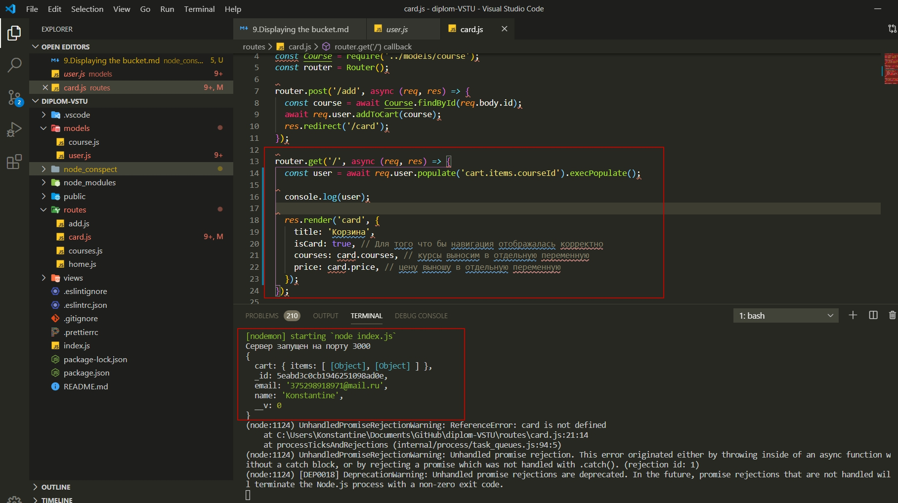
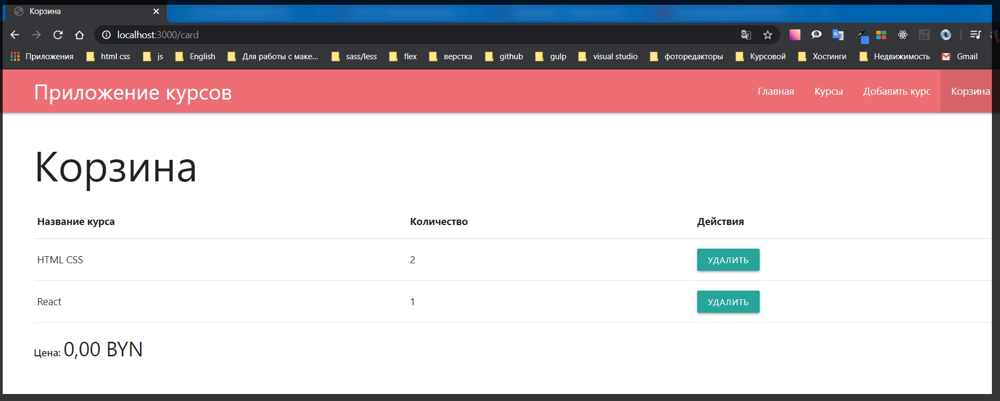
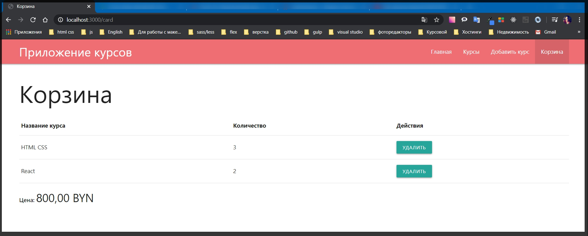

# Отображение корзины

Верну в работу страницу корзины. Для этого придеться убрать **json** и поправить отображение потому что формат у нас немного изменился.

Перехожу в **routes card.js**.

Раньше я формировал объект самой корзины непосредственно, возвращал **courses** и **price**.

```js
router.get('/', async (req, res) => {
  const card = await Card.fetch(); // здесь получаем всю корзину
  res.render('card', {
    title: 'Корзина',
    isCard: true, // Для того что бы навигация отображалась корректно
    courses: card.courses, // курсы выносим в отдельную переменную
    price: card.price, // цену выношу в отдельную переменную
  });
});
```

Теперь из - за того что немного другой формат и больше нет модели корзины я буду действовать иначе.

Создаю переменную **const user =** и его я буду получать из объекта **await req.user**. Временно я оставляю так

```js
router.get('/', async (req, res) => {
  const user = await req.user;
  res.render('card', {
    title: 'Корзина',
    isCard: true, // Для того что бы навигация отображалась корректно
    courses: card.courses, // курсы выносим в отдельную переменную
    price: card.price, // цену выношу в отдельную переменную
  });
});
```

Задача заключается в том что бы здесь **const user = await req.user** получить корзину, а корзина находится в модели пользователя **req.user**. Поэтому я обращаюсь к пользователю **await req.user** и получаю именно пользователя **const user**.

Дальше по сути мы можем получить корзину какую то у него. И мы получим там массив **items** где будет указано количество **count** и **courseId** из файла **user.js**

```js
cart: {
    items: [
      {
        count: {
          type: Number,
          required: true,
          default: 1,
        },
        courseId: {
          type: Schema.Types.ObjectId,
          ref: 'Course',
          required: true,
        },
      },
    ],
  },
```

Но **courseId** нам ничего не говорит т.е. его нужно **populate** что бы вместо **courseId** попало содержимое всего курса.

Поэтому в **card.js** обращаюсь к методу **.populate('')** и далее в строковом формате просто указываю путь до того поля которое необходимо запопулейтить. т.е. это конкретно **.populate('cart.items.courseId')**.
И для того что бы все работало вызываю метод **.exectPopulate**

```js
router.get('/', async (req, res) => {
  const user = await req.user.populate('cart.items.courseId').execPopulate();
  res.render('card', {
    title: 'Корзина',
    isCard: true, // Для того что бы навигация отображалась корректно
    courses: card.courses, // курсы выносим в отдельную переменную
    price: card.price, // цену выношу в отдельную переменную
  });
});
```

И дальше необходимо правильно сформировать массив курсов которые пользователь увидит в корзине.

Однако сейчас если в консоли посмотреть что же такое пользователь



Все нормально, но не так как я хочу. У нас есть пользователь и у него есть объект **card** у которого **items:** показаны в виде объектов.

Сейчас поспотрю массив **items console.log(user.cart.items)**

Теперь это выглядит вот так

```json
[
  {
    count: 2,
    _id: 5ead65f55cf51628806ac225,
    courseId: {
      _id: 5eabe2f3a7664909f0b0a694,
      title: 'HTML CSS',
      price: 200,
      img: 'https://i.ytimg.com/vi/STP46Ut7sd8/sddefault.jpg',
      userId: 5eabd3c0cb1946251098ad0e,
      __v: 0
    }
  },
  {
    count: 1,
    _id: 5ead66c1910aa32a7c59e9ba,
    courseId: {
      _id: 5eabe298a7664909f0b0a693,
      title: 'React',
      price: 100,
      img: 'https://yt3.ggpht.com/a/AATXAJxuqoKrobSnt6Hff47FmQ9rBiTX0pC59PMc7Q=s900-c-k-c0xffffffff-no-rj-mo',
      userId: 5eabd3c0cb1946251098ad0e,
      __v: 0
    }
  }
]
```

Странно у него более подробно выводит. У меня же нет.

Значение курса лежит в поле **courseId**.

И это необходимо привести в тот вид что бы **front - end** понимал как с этим работать. Потому что оперировать на **front - end courseId** не очень красиво. И еще нужно избавиться ото всей **metadata**.

В файле **card.js** я в **courses: card.courses** я передаю то значение курсов которое сейчас определяется как **card.courses**.Это удаляю

В **courses:** обращаюсь к модели **user**.

```js
res.render('card', {
    title: 'Корзина',
    isCard: true,
    courses: user,
    price: card.price,
  });
});
```

Полный

```js
// routes card.js

const { Router } = require('express');
const Course = require('../models/course');
const router = Router();

router.post('/add', async (req, res) => {
  const course = await Course.findById(req.body.id);
  await req.user.addToCart(course);
  res.redirect('/card');
});

router.get('/', async (req, res) => {
  const user = await req.user.populate('cart.items.courseId').execPopulate();

  console.log(user.cart.items);

  res.render('card', {
    title: 'Корзина',
    isCard: true,
    courses: user,
    price: card.price,
  });
});

router.delete('/remove/:id', async (req, res) => {
  const card = await Card.remove(req.params.id);
  res.status(200).json(card);
});

module.exports = router;
```

И далее я хочу замапить все курсы. Т.е. в этом же файле создаю переменную **const courses =** и здесь буду мапить т.е. **user.cart.items.map()**. И на фронт я передаю сформировавшийся массив **courses: courses**.

```js
// routes card.js

const { Router } = require('express');
const Course = require('../models/course');
const router = Router();

router.post('/add', async (req, res) => {
  const course = await Course.findById(req.body.id);
  await req.user.addToCart(course);
  res.redirect('/card');
});

router.get('/', async (req, res) => {
  const user = await req.user.populate('cart.items.courseId').execPopulate();

  const courses = user.cart.items.map();

  res.render('card', {
    title: 'Корзина',
    isCard: true,
    courses: courses,
    price: card.price,
  });
});

router.delete('/remove/:id', async (req, res) => {
  const card = await Card.remove(req.params.id);
  res.status(200).json(card);
});

module.exports = router;
```

Оператор map присутствует у встроенных массивов **JS**. По этому я могу его применить.

И сразу же сделаю следующее. Я создам функцию, где нибудь вверху файла, **function mapCartItems(){}**. В параметр заношу **cart**.

И тогда здесь **const courses = user.cart.items.map();** мы не будем писать много логики а просто **const courses =** вызываю метод **mapCartItems(user.cart)**

```js
// routes card.js

const { Router } = require('express');
const Course = require('../models/course');
const router = Router();

function mapCartItems(cart) {}

router.post('/add', async (req, res) => {
  const course = await Course.findById(req.body.id);
  await req.user.addToCart(course);
  res.redirect('/card');
});

router.get('/', async (req, res) => {
  const user = await req.user.populate('cart.items.courseId').execPopulate();

  const courses = mapCartItems(user.cart);

  res.render('card', {
    title: 'Корзина',
    isCard: true,
    courses: courses,
    price: card.price,
  });
});

router.delete('/remove/:id', async (req, res) => {
  const card = await Card.remove(req.params.id);
  res.status(200).json(card);
});

module.exports = router;
```

После этого будет сформирован массив курсов.

И в принцыпе можем им воспользоваться.

Что касается функции **function mapCartItems(cart) {}**, то в теле я буду возвращать новый массив **return cart.items.map(c =>{})** где на каждой итерации я буду получать некоторый объект с. И нужно вернуть объект который содержит нужные нам поля. Если фигурные скобки оберну круглыми то это будет объект.

```js
function mapCartItems(cart) {
  return cart.items.map((c) => ({}));
}
```

Все данные которые относятся к конкретному курсу они лежат в поле **c.courseId**. и что бы убрать эту всю метадату нужно обратиться к его полю **_doc**. И использую **ES6 ...c.userId._doc** для того что бы развернуть данный курс, и что касается счетчика просто указываю **count: c.count**.

```js
// routes card.js

const { Router } = require('express');
const Course = require('../models/course');
const router = Router();

function mapCartItems(cart) {
  return cart.items.map((c) => ({
    ...c.courseId._doc,
    count: c.count,
  }));
}

router.post('/add', async (req, res) => {
  const course = await Course.findById(req.body.id);
  await req.user.addToCart(course);
  res.redirect('/card');
});

router.get('/', async (req, res) => {
  const user = await req.user.populate('cart.items.courseId').execPopulate();

  const courses = mapCartItems(user.cart);

  res.render('card', {
    title: 'Корзина',
    isCard: true,
    courses: courses,
    price: card.price,
  });
});

router.delete('/remove/:id', async (req, res) => {
  const card = await Card.remove(req.params.id);
  res.status(200).json(card);
});

module.exports = router;
```

Проверяю работает ли корзина. И конечно же нет

```
UnhandledPromiseRejectionWarning: ReferenceError: card is not defined
    at C:\Users\Konstantine\Documents\GitHub\diplom-VSTU\routes\card.js:29:12
    at processTicksAndRejections (internal/process/task_queues.js:94:5)
(node:1476) UnhandledPromiseRejectionWarning: Unhandled promise rejection. This error originated either by throwing inside of an async function without a catch block, or by rejecting a promise which was not handled with .catch(). (rejection id: 1)
(node:1476) [DEP0018] DeprecationWarning: Unhandled promise rejections are deprecated. In the future, promise rejections that are not handled will terminate the Node.js process with a non-zero exit code.
```

Цена у нас не хранится в базе и поэтому мы будем сами ее высчитывать. А в **price: card.price**, временно пишу **price: 0**,

```js
res.render('card', {
    title: 'Корзина',
    isCard: true,
    courses: courses,
    price: 0,
  });
});
```



Для цены я создаю отдельную функию **function computePrice(){}**. В параметры она будет принимать массив **courses.** И в **price:** где я ставил принудительно ноль прописваю данную функцию **price: computePrice(courses)**

```js
// routes card.js

const { Router } = require('express');
const Course = require('../models/course');
const router = Router();

function mapCartItems(cart) {
  return cart.items.map((c) => ({
    ...c.courseId._doc,
    count: c.count,
  }));
}

function computePrice(courses) {}

router.post('/add', async (req, res) => {
  const course = await Course.findById(req.body.id);
  await req.user.addToCart(course);
  res.redirect('/card');
});

router.get('/', async (req, res) => {
  const user = await req.user.populate('cart.items.courseId').execPopulate();

  const courses = mapCartItems(user.cart);

  res.render('card', {
    title: 'Корзина',
    isCard: true,
    courses: courses,
    price: computePrice,
  });
});

router.delete('/remove/:id', async (req, res) => {
  const card = await Card.remove(req.params.id);
  res.status(200).json(card);
});

module.exports = router;
```

> Для реализации функции **computePrice**. Что у нас лежит в массиве **courses**? Там лежит информация по курсам и сколько этих элементов.Т.е. если по сути мы умножим цену на количество курсов и сложим это со всеми курсами которые есть в массиве то мы получим финальную цену.

Для этой задачи я должен использовать метод который называется **reduce** который есть у массивов, который как раз таки выполняет задачу в одну строчку.
По этому в теле функции **return courses.reduce()**.

Первым параметром в себя принимает **callback**. А вторым параметром он принимает в себя какое - то стартовое значение. Я здесь буду считать **int** значение и начинать я буду с ноля.

```js
function computePrice(courses) {
  return courses.reduce(() => {}, 0);
}
```

Полный

```js
// routes card.js

const { Router } = require('express');
const Course = require('../models/course');
const router = Router();

function mapCartItems(cart) {
  return cart.items.map((c) => ({
    ...c.courseId._doc,
    count: c.count,
  }));
}

function computePrice(courses) {
  return courses.reduce(() => {}, 0);
}

router.post('/add', async (req, res) => {
  const course = await Course.findById(req.body.id);
  await req.user.addToCart(course);
  res.redirect('/card');
});

router.get('/', async (req, res) => {
  const user = await req.user.populate('cart.items.courseId').execPopulate();

  const courses = mapCartItems(user.cart);

  res.render('card', {
    title: 'Корзина',
    isCard: true,
    courses: courses,
    price: computePrice,
  });
});

router.delete('/remove/:id', async (req, res) => {
  const card = await Card.remove(req.params.id);
  res.status(200).json(card);
});

module.exports = router;
```

В **callback** первым параметром принимаю объект **total** который на каждой итерации будет увеличиваться.
А вторым просто принимаю объект **course**.

```js
function computePrice(courses) {
  return courses.reduce((total, course) => {}, 0);
}
```

И в теле **callback** логика будет простая. Она будет просто возвращать переменную **return total +=** и будем ее увеличивать на значение ****course.price **\* course.count**.

```js
// routes card.js

const { Router } = require('express');
const Course = require('../models/course');
const router = Router();

function mapCartItems(cart) {
  return cart.items.map((c) => ({
    ...c.courseId._doc,
    count: c.count,
  }));
}

function computePrice(courses) {
  return courses.reduce((total, course) => {
    return (total += course.price * course.count);
  }, 0);
}

router.post('/add', async (req, res) => {
  const course = await Course.findById(req.body.id);
  await req.user.addToCart(course);
  res.redirect('/card');
});

router.get('/', async (req, res) => {
  const user = await req.user.populate('cart.items.courseId').execPopulate();

  const courses = mapCartItems(user.cart);

  res.render('card', {
    title: 'Корзина',
    isCard: true,
    courses: courses,
    price: computePrice,
  });
});

router.delete('/remove/:id', async (req, res) => {
  const card = await Card.remove(req.params.id);
  res.status(200).json(card);
});

module.exports = router;
```


