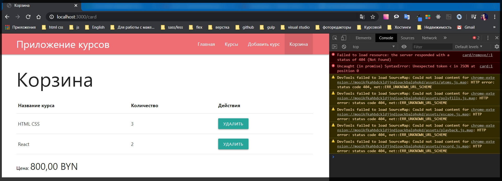
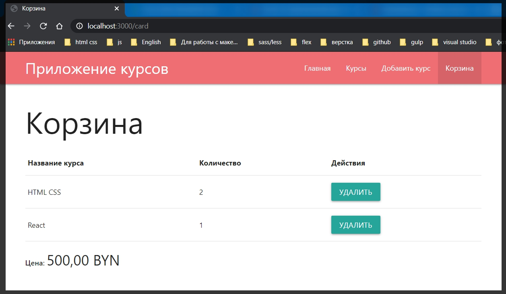

# Удаление из корзины

Находясь в **router card.js** я перехожу в метод **delete** где мне нужно исправить на самом деле все.

У нас нет болше модели Card. Ее я смело удаляю **const card = await Card.remove(req.params.id);**

Удаление их корзины будет асинхронным действием потому что сейчас у нас все лежит в БД.

Для этого я обращаюсь к оператору **await** и после этого я обращаюсь к **req.user.** у него я вызову метод который пока еще не сделан и который называется допустим **removeFromCart()** куда будем передавать **id** того курса который пользователю необходимо удалить т.е. **req.params.id**. params потому что я его беру из адресной строки **'/remove/:id'**.

```js
router.delete('/remove/:id', async (req, res) => {
  await req.user.removeFromCart(req.params.id)
  res.status(200).json(card);
});
```

После выполнения данного метода, который у нас еще не реализован  **await req.user.removeFromCart(req.params.id)**.
После этого на **front - end** необходимо вернуть объект **cart** корзины в том же формате в котором она была до этого. Для того что бы клиентский **JS** смог заново динамически отобразить страницу.

Метод removeFromCart() пока ничего не возвращает поэтому дальше делаю сво дело.

Опять создаю объект пользователя, как делал по аналогии со страницей просто. **const user = await** далее обобращаюсь к **req.user** вызываю метод **populate('')** в котором так же обращаюсь к **cart.items.courseId**, потому что из **id** его необходимо превратить в полноценный объект с курсами, и после этого вызываю метод **exectPopulate()**

```js
router.delete('/remove/:id', async (req, res) => {
  await req.user.removeFromCart(req.params.id);
  const user = await req.user.populate('cart.items.courseId').execPopulate();
  res.status(200).json(cart);
});
```

Теперь у меня есть пока что пустой объект **cart**, **res.status(200).json(card);** исправляю на **res.status(200).json(cart);**.
 
 Теперь создаю этот объект **const cart = {}**. Так же отдельно нужно создать переменную **const courses =** которую я буду получать из функции **mapCartItems(user.cart)** из **user.cart**.

 ```js
 router.delete('/remove/:id', async (req, res) => {
  await req.user.removeFromCart(req.params.id);
  const user = await req.user.populate('cart.items.courseId').execPopulate();
  const courses = mapCartItems(user.cart);
  const cart = {};
  res.status(200).json(cart);
});
```

И теперь эти курсы я могу передавать в объект **cart**. Ну а **price:** я получаю из функции **computePrice(course)** куда я передаю **course**.

```js
router.delete('/remove/:id', async (req, res) => {
  await req.user.removeFromCart(req.params.id);
  const user = await req.user.populate('cart.items.courseId').execPopulate();
  const courses = mapCartItems(user.cart);
  const cart = {
    courses,
    price: computePrice(courses),
  };
  res.status(200).json(cart);
});
```

Данный объект  **const cart = {courses,price: computePrice(courses),};** мы можем не писать а сразу же его перенести в метод **json**, сюда **res.status(200).json(cart);** Но я все оставлю так как есть.

Полный

```js
// routes card.js
const { Router } = require('express');
const Course = require('../models/course');
const router = Router();

function mapCartItems(cart) {
  return cart.items.map((c) => ({
    ...c.courseId._doc,
    count: c.count,
  }));
}

function computePrice(courses) {
  return courses.reduce((total, course) => {
    return (total += course.price * course.count);
  }, 0);
}

router.post('/add', async (req, res) => {
  const course = await Course.findById(req.body.id);
  await req.user.addToCart(course);
  res.redirect('/card');
});

router.delete('/remove/:id', async (req, res) => {
  await req.user.removeFromCart(req.params.id);
  const user = await req.user.populate('cart.items.courseId').execPopulate();
  const courses = mapCartItems(user.cart);
  const cart = {
    courses,
    price: computePrice(courses),
  };
  res.status(200).json(cart);
});

router.get('/', async (req, res) => {
  const user = await req.user.populate('cart.items.courseId').execPopulate();

  const courses = mapCartItems(user.cart);

  res.render('card', {
    title: 'Корзина',
    isCard: true,
    courses: courses,
    price: computePrice(courses),
  });
});

module.exports = router;
```

Теперь как реализовать метод **removeFromCart** куда я передаю **id** того курса, а именно **req.param.id**, который необходимо удалить.

Для этого я вызываю метод модели пользователя. Перехожу в **models user.js**.

И здесь, перед **module.exports** что в конце документа, удаляю коментарий, обращаюсь к **userSchema**. далее к полу **methods.** и определяю новый мотод который называется **removeFromCart =** и это так же функция которую обязательно определять через ключевое слово **function(){}**. Которая будет принимать в свой параметр какой - то **id** курса.

```js
// models user.js

const { Schema, model } = require('mongoose');

const userSchema = new Schema({
  email: {
    type: String,
    required: true,
  },
  name: {
    type: String,
    required: true,
  },
  cart: {
    items: [
      {
        count: {
          type: Number,
          required: true,
          default: 1,
        },
        courseId: {
          type: Schema.Types.ObjectId,
          ref: 'Course',
          required: true,
        },
      },
    ],
  },
});

userSchema.methods.addToCart = function (course) {
  const items = [...this.cart.items];
  const idx = items.findIndex((c) => {
    return c.courseId.toString() === course._id.toString();
  });

  if (idx >= 0) {
    items[idx].count = items[idx].count + 1;
  } else {
    items.push({
      courseId: course._id,
      count: 1,
    });
  }

  userSchema.methods.removeFromCart = function (id) {};

  this.cart = { items };
  return this.save();
};

module.exports = model('User', userSchema);
```

Далее описываю логику. По сути для начало здесь так же нужно склонировать массив **const items = [...this.cart.items]**, с помощью **spred** оператора обращаюсь к **this.cart.items**. 

И создам новый массив из нее для того что бы небыло потенциальных мутаций.

Далее я как обычно создаю переменную **const idx =** т.е. это потенциальный индекс того курса в массиве **items** который я должен найти. Но в методе **removeFromCart** этот индекс будет постоянно определяться потому что если нет элемента на **front - end**, его соответсвенно нет и в карточке. По этому здесь ошибка практически не возможна только если кто то специально будет отсылать не правильные **id** отдельными запросами. 
В **const idx =** я обращаюсь к **items**. методу **findIndex()** где на каждой итерации получаю объект **c =>{}**.

```js
  userSchema.methods.removeFromCart = function (id) {
    const items = [...this.cart.items];
    const idx = items.findIndex((c) => {});
  };
```
И далее необходимо вернуть **return** условие по которому я найду данный индекс т.е. по сути мне нужно сравнить **id**. **id** который сюда пришел **function (id)**, и **id** данного элемента **items.findIndex((c) => {});**. т.е. это **return c.courseId.** далее не забываем что его нужно привести к строке **toString()** иначе будет ошибка и элемент не будет находится. И после этого сравниваем **return c.courseId.toString() === id.toString().**

```js
userSchema.methods.removeFromCart = function (id) {
    const items = [...this.cart.items];
    const idx = items.findIndex((c) => {
      return courseId.toString() === id.toString();
    });
  };
```
Теперь необходимо проверить если **if** у массива **(items[idx].count === 1)** т.е. у нас один курс такой добавлен в корзину, тогда нам необходимо отсюда удалить. Ну а иначе **else** больше одного, он не может быть равен **0** он полуюбому больше, то тогда мы просто обратимся к **items[idx].count--**

И сразу же переопределяем **this.cart = {items}.** и не забываю сделать **return this.save()**.

```js
userSchema.methods.removeFromCart = function (id) {
    const items = [...this.cart.items];
    const idx = items.findIndex((c) => {
      return courseId.toString() === id.toString();
    });
  };
  if (items[idx].count === 1) {
  } else {
    items[idx].count--;
  }

  this.cart = { items };
  return this.save();
};
```
Что касается логики **if**, то здесь тоже все просто. Мы можем просто переопределить массив **items = items.filter(c => c.course.id.toString() !== id.toString())**. На самом деле я ни сделал ничего нового. Я просто удаляю с помощью метода **filter** элементы.

```js
userSchema.methods.removeFromCart = function (id) {
    const items = [...this.cart.items];
    const idx = items.findIndex((c) => {
      return courseId.toString() === id.toString();
    });
  };
  if (items[idx].count === 1) {
    items = items.filter((c) => c.courseId.toString() !== id.toString());
  } else {
    items[idx].count--;
  }

  this.cart = { items };
  return this.save();
};
```

т.е. существующий **id** в корзине **c.courseId.toString()** я сравниваю с **id.toString()** который поступил.

Единственная проблема в данной функции заключается в том что массив **items** определен яерез ключевое слово **const** вот  **const items = [...this.cart.items];** а здесь мы его переопределяем **items = items.filter((c) => c.courseId.toString() !== id.toString());**

Для того что бы было все в норме нужно **const** заменить на **let**.

```js
userSchema.methods.removeFromCart = function (id) {
    let items = [...this.cart.items];
    const idx = items.findIndex((c) => {
      return courseId.toString() === id.toString();
    });
  };
  if (items[idx].count === 1) {
    items = items.filter((c) => c.courseId.toString() !== id.toString());
  } else {
    items[idx].count--;
  }

  this.cart = { items };
  return this.save();
};
```

Полный файл

```js
// models userSchema.js
const { Schema, model } = require('mongoose');

const userSchema = new Schema({
  email: {
    type: String,
    required: true,
  },
  name: {
    type: String,
    required: true,
  },
  cart: {
    items: [
      {
        count: {
          type: Number,
          required: true,
          default: 1,
        },
        courseId: {
          type: Schema.Types.ObjectId,
          ref: 'Course',
          required: true,
        },
      },
    ],
  },
});

userSchema.methods.addToCart = function (course) {
  const items = [...this.cart.items];
  const idx = items.findIndex((c) => {
    return c.courseId.toString() === course._id.toString();
  });

  if (idx >= 0) {
    items[idx].count = items[idx].count + 1;
  } else {
    items.push({
      courseId: course._id,
      count: 1,
    });
  }

  this.cart = { items };
  return this.save();
};

userSchema.methods.removeFromCart = function (id) {
  let items = [...this.cart.items];
  const idx = items.findIndex((c) => c.courseId.toString() === id.toString());

  if (items[idx].count === 1) {
    items = items.filter((c) => c.courseId.toString() !== id.toString());
  } else {
    items[idx].count--;
  }

  this.cart = { items };
  return this.save();
};

module.exports = model('User', userSchema);
```

Тестирую. И ошибка всеже произошла.



По какой то причине мы не передаем ни какой **id**. Т.е. при нажатии на кнопку Удалить у нас не присутствует ни какой индификатор.

В **card.hbs** я должен передавать не **id** а **_id**.

```js
 <button class="btn btn-small js-remove" data-id="{{_id}}">Удалить</button>
 ```

 Удаление корректно работает

 

 Следующая проблема. Если посмотреть в **NetWork** то мы обнаружим что при клике сначало улетает **id**  а потом прилетает **undefined**. И связоно это стем что раньше я оперировал просто полем **id**. А сейчас есть операция с **_id**. И это проблема. Проблема потому что нужно во всем приложении исправлять **id** на **_id**. Но на самом деле есть один метод который позволит этого избежать. И пока возвращаю **id**.

 ```js
  <button class="btn btn-small js-remove" data-id="{{id}}">Удалить</button>
  ```

