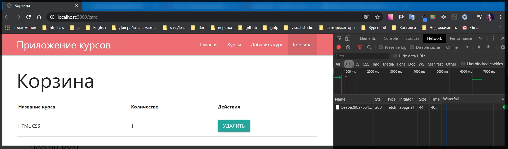
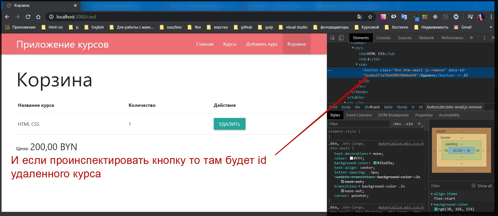

# Трансформация данных на клиенте

Для того что бы исправить такую ситуацию. Когда id не правильно определяется.

Перерехожу models course.js.

Первым делом я обращаюсь к объекту courseSchema. далее я вызову метод который назыается method(). И в его параметрах я могу описать тот метод который я хочу использовать. Первым параметром прописываю toClient т.е. это тот момент когда у нас будет трансформация данныых к клиенту.
Вторым параметром я передаю функцию через ключевое слово function(){}. И в теле функции создаю переменную const course = через ключевое слово this. а оно доступно если используется ключевое слово function, и далее вызываю метод toObject() для того что бы получить объект данного курса.
И по сути теперь необходимо сделать трансформацию. У объекта course.id = course.\_id. И далее для того что бы много трафика не летоло я удаляю лишнюю информацию delete course.\_id. Ну и после этого мне нужно просто вернуть этот курс.

```js
courseSchema.method('toClient', function () {
  const course = this.toObject;
  course.id = course._id;
  delete course._id;
  return course;
});
```

Полный

```js
// models course.js

const { Schema, model } = require('mongoose');

const course = new Schema({
  title: {
    type: String,
    required: true,
  },

  price: {
    type: Number,
    required: true,
  },

  img: String,
  userId: {
    type: Schema.Types.ObjectId,
    ref: 'User',
  },
});

courseSchema.method('toClient', function () {
  const course = this.toObject;
  course.id = course._id;
  delete course._id;
  return course;
});

module.exports = model('Course', course);
```

Это был первый этап.

Второй заключается в том что когда мы делаем populate. Это у нас происходит routes card.js

В этом блоке кода я вызываю mapCartItem

```js
router.delete('/remove/:id', async (req, res) => {
  await req.user.removeFromCart(req.params.id);
  const user = await req.user.populate('cart.items.courseId').execPopulate();
  const courses = mapCartItems(user.cart);
  const cart = {
    courses,
    price: computePrice(courses),
  };
  res.status(200).json(cart);
});
```

А здесь

```js
function mapCartItems(cart) {
  return cart.items.map((c) => ({
    ...c.courseId._doc,
    count: c.count,
  }));
}
```

...c.courseId.\_doc, трансформирую этот курс где использую в cart.

И дальше здесь нужно добавить поле id потому что здесь к сожалению при populate по умолчанию оно будет писаться через нижнее подчеркивание.

И для этого пишу id: c.courseId.id,

```js
function mapCartItems(cart) {
  return cart.items.map((c) => ({
    ...c.courseId._doc,
    id: c.courseId.id,
    count: c.count,
  }));
}
```

Полные файлы

```js
// models course.js

const { Schema, model } = require('mongoose');

const courseSchema = new Schema({
  title: {
    type: String,
    required: true,
  },
  price: {
    type: Number,
    required: true,
  },
  img: String,
  userId: {
    type: Schema.Types.ObjectId,
    ref: 'User',
  },
});

courseSchema.method('toClient', function () {
  const course = this.toObject();
  course.id = course._id;
  delete course._id;
  return course;
});

module.exports = model('Course', courseSchema);
```

```js
// routes card.js
const { Router } = require('express');
const Course = require('../models/course');
const router = Router();

function mapCartItems(cart) {
  return cart.items.map((c) => ({
    ...c.courseId._doc,
    id: c.courseId.id,
    count: c.count,
  }));
}

function computePrice(courses) {
  return courses.reduce((total, course) => {
    return (total += course.price * course.count);
  }, 0);
}

router.post('/add', async (req, res) => {
  const course = await Course.findById(req.body.id);
  await req.user.addToCart(course);
  res.redirect('/card');
});

router.delete('/remove/:id', async (req, res) => {
  await req.user.removeFromCart(req.params.id);
  const user = await req.user.populate('cart.items.courseId').execPopulate();
  const courses = mapCartItems(user.cart);
  const cart = {
    courses,
    price: computePrice(courses),
  };
  res.status(200).json(cart);
});

router.get('/', async (req, res) => {
  const user = await req.user.populate('cart.items.courseId').execPopulate();

  const courses = mapCartItems(user.cart);

  res.render('card', {
    title: 'Корзина',
    isCard: true,
    courses: courses,
    price: computePrice(courses),
  });
});

module.exports = router;
```

И все работает.




