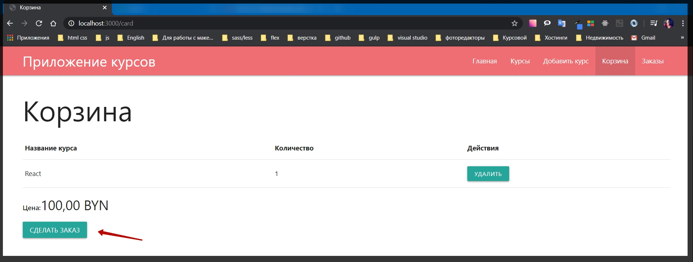
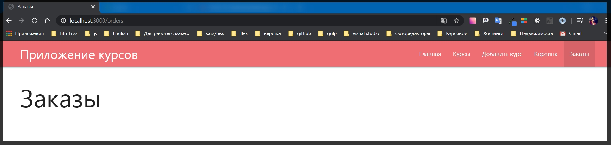
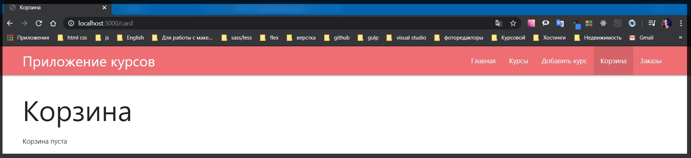
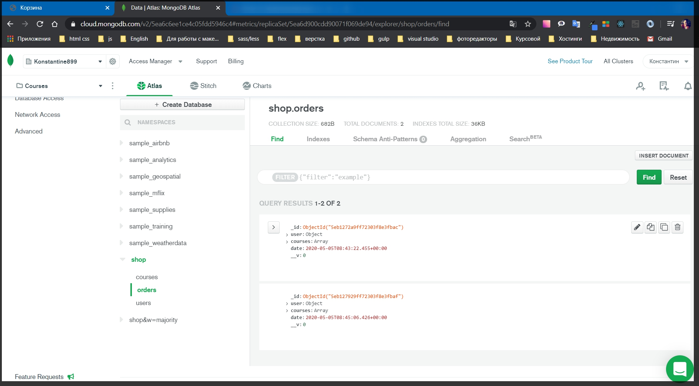
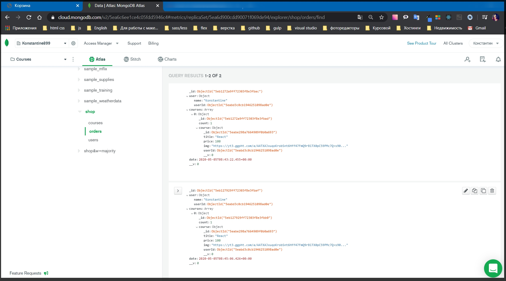
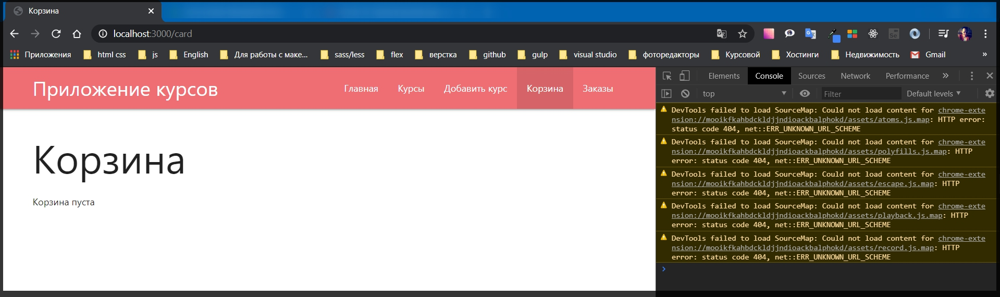

# Получение данных заказов.

Приступаю к обработке метода **POST**

```js
// routes order.js
const { Router } = require('express');
const Order = require('../models/order');
const router = Router();

router.get('/', async (req, res) => {
  res.render('orders', {
    isOrder: true,
    title: 'Заказы',
  });
});

router.post('/', async (req, res) => {
  res.redirect('/orders');
});

module.exports = router;
```

Пока что есть только **redirect** который ничего не делает.
Но безусловно здесь понадобится выполнять различные манипуляции с базой. И для начало при создании заказа необходимо получить все что есть в корзине.
Для этого создаю переменную **const user =** и получим мы ее из **await req.user** вызову метод **.populate()** для того что бы те **id** курсов мы превратили в объекты, поэтому в параметрах **.populate('cart.items.courseId')** и добавляю **execPopulate()**.

```js
// routes order.js
const { Router } = require('express');
const Order = require('../models/order');
const router = Router();

router.get('/', async (req, res) => {
  res.render('orders', {
    isOrder: true,
    title: 'Заказы',
  });
});

router.post('/', async (req, res) => {
  const user = await req.user.populate('cart.items.courseId').execPopulate();

  res.redirect('/orders');
});

module.exports = router;
```

И тем самым мы получаем наполненный объект пользователя где есть все объекты курсов. Но а конкретно меня интересует корзина где это все храниться.

Далее необходимо сделать метод **map** аналогично тому что я делал до этого.

Создаю объект **const courses =** и далее привожу к человеческому формату **user.cart.items.map()** в параметрах **map**, в **callback**, я на каждой итерации получаю **item** т.е. **i**. в теле **callback** возвращаю **return....** Но так как мы позвращаем объект, то я могу объект обернуть в круглые скобки **i => ({})** и теперь не обязаны прописывать **return**. И возвращаю **count: i.count**, а объект **course:{}** присваивает новый экземпляр **course:{...i.courseId._doc}**. Через **spred** разворачиваю объект.

```js
// routes order.js
const { Router } = require('express');
const Order = require('../models/order');
const router = Router();

router.get('/', async (req, res) => {
  res.render('orders', {
    isOrder: true,
    title: 'Заказы',
  });
});

router.post('/', async (req, res) => {
  const user = await req.user.populate('cart.items.courseId').execPopulate();
  const courses = user.cart.items.map((i) => ({
    count: i.count,
    course: { ...i.courseId._doc },
  }));

  res.redirect('/orders');
});

module.exports = router;
```

После получения читаемого формата курсов я создаю новый объект c**onst order = new Order({})**. Куда мы должны передать два обязательных параметра. Это **user{}** у которого есть поле **name: req.user.name** и поле **userId: req.user**

```js
// routes order.js
const { Router } = require('express');
const Order = require('../models/order');
const router = Router();

router.get('/', async (req, res) => {
  res.render('orders', {
    isOrder: true,
    title: 'Заказы',
  });
});

router.post('/', async (req, res) => {
  const user = await req.user.populate('cart.items.courseId').execPopulate();
  const courses = user.cart.items.map((i) => ({
    count: i.count,
    course: { ...i.courseId._doc },
  }));

  const order = new Order({
    user: {
      name: req.user.name,
      userId: req.user,
    },
  });

  res.redirect('/orders');
});

module.exports = router;
```
Сами курсы я могу передать как **courses: courses**, но так как значение и ключ совпадают можно написать **courses**. Однако я оставлю все в таком виде.

```js
const order = new Order({
    user: {
      name: req.user.name,
      userId: req.user,
    },
    courses: courses,
  });
```
И после этого необходимо подождать пока создасться новый заказ **await order.save()**. Но когда мы создадим заказ это означает что корзину необходимо почистить. Поэтому здесь так же вызовем метод **await req.user**. который будет называться к примеру **clearCart()**

```js
// routes order.js
const { Router } = require('express');
const Order = require('../models/order');
const router = Router();

router.get('/', async (req, res) => {
  res.render('orders', {
    isOrder: true,
    title: 'Заказы',
  });
});

router.post('/', async (req, res) => {
  const user = await req.user.populate('cart.items.courseId').execPopulate();
  const courses = user.cart.items.map((i) => ({
    count: i.count,
    course: { ...i.courseId._doc },
  }));

  const order = new Order({
    user: {
      name: req.user.name,
      userId: req.user,
    },
    courses: courses,
  });
  await order.save();
  await req.user.clearCart();

  res.redirect('/orders');
});

module.exports = router;
```

Данный метод **clearCart()** необходимо создать в моделях. Перехожу **models user.js**.

**userSchema.metods.clearCart = function(){}**

```js
// models userSchema.js
const { Schema, model } = require('mongoose');

const userSchema = new Schema({
  email: {
    type: String,
    required: true,
  },
  name: {
    type: String,
    required: true,
  },
  cart: {
    items: [
      {
        count: {
          type: Number,
          required: true,
          default: 1,
        },
        courseId: {
          type: Schema.Types.ObjectId,
          ref: 'Course',
          required: true,
        },
      },
    ],
  },
});

userSchema.methods.addToCart = function (course) {
  const items = [...this.cart.items];
  const idx = items.findIndex((c) => {
    return c.courseId.toString() === course._id.toString();
  });

  if (idx >= 0) {
    items[idx].count = items[idx].count + 1;
  } else {
    items.push({
      courseId: course._id,
      count: 1,
    });
  }

  this.cart = { items };
  return this.save();
};

userSchema.methods.removeFromCart = function (id) {
  let items = [...this.cart.items];
  const idx = items.findIndex((c) => c.courseId.toString() === id.toString());

  if (items[idx].count === 1) {
    items = items.filter((c) => c.courseId.toString() !== id.toString());
  } else {
    items[idx].count--;
  }

  this.cart = { items };
  return this.save();
};

userSchema.methods.clearCart = function () {};

module.exports = model('User', userSchema);
```

И внутри этой функции я просто почищу **this.cart = {items:[]}** скажу что **items** равняется пустому массиву. И после этого я верну метод **return this.save()**. Очень простой метод. Тем неменее он позволит польностью очистить карточку.

```js
// models userSchema.js
const { Schema, model } = require('mongoose');

const userSchema = new Schema({
  email: {
    type: String,
    required: true,
  },
  name: {
    type: String,
    required: true,
  },
  cart: {
    items: [
      {
        count: {
          type: Number,
          required: true,
          default: 1,
        },
        courseId: {
          type: Schema.Types.ObjectId,
          ref: 'Course',
          required: true,
        },
      },
    ],
  },
});

userSchema.methods.addToCart = function (course) {
  const items = [...this.cart.items];
  const idx = items.findIndex((c) => {
    return c.courseId.toString() === course._id.toString();
  });

  if (idx >= 0) {
    items[idx].count = items[idx].count + 1;
  } else {
    items.push({
      courseId: course._id,
      count: 1,
    });
  }

  this.cart = { items };
  return this.save();
};

userSchema.methods.removeFromCart = function (id) {
  let items = [...this.cart.items];
  const idx = items.findIndex((c) => c.courseId.toString() === id.toString());

  if (items[idx].count === 1) {
    items = items.filter((c) => c.courseId.toString() !== id.toString());
  } else {
    items[idx].count--;
  }

  this.cart = { items };
  return this.save();
};

userSchema.methods.clearCart = function () {
  this.cart = { items: [] };
  return this.save();
};

module.exports = model('User', userSchema);
```
И после успешной очистки произойдет **redirect** на страницу **orders**.

Здесь **order.js** у нас достаточно много работы с асинхронными запросами. Поэтому обернем все в **try catch**.

```js
// routes order.js
const { Router } = require('express');
const Order = require('../models/order');
const router = Router();

router.get('/', async (req, res) => {
  res.render('orders', {
    isOrder: true,
    title: 'Заказы',
  });
});

router.post('/', async (req, res) => {
  try {
    const user = await req.user.populate('cart.items.courseId').execPopulate();
    const courses = user.cart.items.map((i) => ({
      count: i.count,
      course: { ...i.courseId._doc },
    }));

    const order = new Order({
      user: {
        name: req.user.name,
        userId: req.user,
      },
      courses: courses,
    });
    await order.save();
    await req.user.clearCart();

    res.redirect('/orders');
  } catch (e) {
    console.log(e);
  }
});

module.exports = router;
```

И теперь проверяю.





И я попадаю на страницу заказов.Если перехожу в корзину.



На скриншоте я показал добавление одного курса. Хотя по файкту в заказы добавил два. Если вглянуть на БД то увижу новую коллекцию **orders** в которой находится два курса.



Здесь есть объект пользователя и так же присутствует полностью структура курсов.



Так же **date** сформировалась тоже корректно.

Теперь это нужно отобразить на странице **Заказы**. 

И для этого сформирую шаблон. Перехожу в **orders.hbs** переименовываю заголовок в **Мои заказы**. Все заказы относятся к какому -то определенному пользователю т.е. вы не можете посмотреть чужие заказы и это нормально. т.е. это как я реализовал все эти взаимосвязи.

Но перед этим необходимо реализовать метод **get** в **order.js**. Он у нас сейчас не готов и с какими данными мы будем реализовать страницу не понятно.

Сразу же в **router.get** все оберну в **try catch**.

```js
// routes order.js
const { Router } = require('express');
const Order = require('../models/order');
const router = Router();

router.get('/', async (req, res) => {
  try {
    res.render('orders', {
      isOrder: true,
      title: 'Заказы',
    });
  } catch (e) {
    console.log(e);
  }
});

router.post('/', async (req, res) => {
  try {
    const user = await req.user.populate('cart.items.courseId').execPopulate();
    const courses = user.cart.items.map((i) => ({
      count: i.count,
      course: { ...i.courseId._doc },
    }));

    const order = new Order({
      user: {
        name: req.user.name,
        userId: req.user,
      },
      courses: courses,
    });
    await order.save();
    await req.user.clearCart();

    res.redirect('/orders');
  } catch (e) {
    console.log(e);
  }
});

module.exports = router;
```
Далее мне нужно получить список всех **orders** которые относятся к нашему **id** т.е. **id** пользователя. **const orders =**  и здесь обращаюсь к модели **await Order**. и вызываю метод **find({})** где прописываю условие. Условие такое что если **'user. с полем user.Id': совпадает с req.user._id** то тогда это все наши заказы

```js
// routes order.js
const { Router } = require('express');
const Order = require('../models/order');
const router = Router();

router.get('/', async (req, res) => {
  try {
    const orders = await Order.find({
      'user.userId': req.user._id,
    });
    res.render('orders', {
      isOrder: true,
      title: 'Заказы',
    });
  } catch (e) {
    console.log(e);
  }
});

router.post('/', async (req, res) => {
  try {
    const user = await req.user.populate('cart.items.courseId').execPopulate();
    const courses = user.cart.items.map((i) => ({
      count: i.count,
      course: { ...i.courseId._doc },
    }));

    const order = new Order({
      user: {
        name: req.user.name,
        userId: req.user,
      },
      courses: courses,
    });
    await order.save();
    await req.user.clearCart();

    res.redirect('/orders');
  } catch (e) {
    console.log(e);
  }
});

module.exports = router;
```

На эту структуру **'user.userId'** в модели **order.js**

```js
 user: {
    name: String,
    userId: {
      type: Schema.Types.ObjectId,
      ref: 'User',
      required: true,
    },
  },
```
т.е. я просто указываю где мне искать индификатор пользователя. Ну а что касается **req.user._id**, то это наш текущий **id**. И дальше я еще могу сделать метод **.populate('')** где мне нужно запопулейтить **user.userId**

```js
// routes order.js
const { Router } = require('express');
const Order = require('../models/order');
const router = Router();

router.get('/', async (req, res) => {
  try {
    const orders = await Order.find({ 'user.userId': req.user._id }).populate('user.userId');
    res.render('orders', {
      isOrder: true,
      title: 'Заказы',
    });
  } catch (e) {
    console.log(e);
  }
});

router.post('/', async (req, res) => {
  try {
    const user = await req.user.populate('cart.items.courseId').execPopulate();
    const courses = user.cart.items.map((i) => ({
      count: i.count,
      course: { ...i.courseId._doc },
    }));

    const order = new Order({
      user: {
        name: req.user.name,
        userId: req.user,
      },
      courses: courses,
    });
    await order.save();
    await req.user.clearCart();

    res.redirect('/orders');
  } catch (e) {
    console.log(e);
  }
});

module.exports = router;
```
Далее обращаюсь к рендеру. И по сути мне дальше нужно сформировать ордеры. Для этого я в объекте второго параметра r**es.render** добавляю поле которое передается на **front -end** массив **orders:** а здесь я их буду трансформировать, указываю **orders.map()** где на каждой итерации я буду получать order т.е. **o =>{}** и в теле функции возвращаю **return {}** объект. Где по сути мы так же будем разворачивать каждый **...o._doc**, и дальше необходимо посчитать цену всего этого заказа **price: o.courses.redoce(() =>{})** reduce нам все посчитает.

```js
// routes order.js
const { Router } = require('express');
const Order = require('../models/order');
const router = Router();

router.get('/', async (req, res) => {
  try {
    const orders = await Order.find({ 'user.userId': req.user._id }).populate('user.userId');
    res.render('orders', {
      isOrder: true,
      title: 'Заказы',
      orders: orders.map(o =>{
        return {
          ...o._doc,
          price: o.course.reduce(() =>{},0)
        }
      })
    });
  } catch (e) {
    console.log(e);
  }
});

router.post('/', async (req, res) => {
  try {
    const user = await req.user.populate('cart.items.courseId').execPopulate();
    const courses = user.cart.items.map((i) => ({
      count: i.count,
      course: { ...i.courseId._doc },
    }));

    const order = new Order({
      user: {
        name: req.user.name,
        userId: req.user,
      },
      courses: courses,
    });
    await order.save();
    await req.user.clearCart();

    res.redirect('/orders');
  } catch (e) {
    console.log(e);
  }
});

module.exports = router;
```
**price: o.course.reduce(() => {}, 0)**, **callback** функция начинающаяся с ноля. В параметрах **callback** я получаю какое - то тотально е значение **total**, и какой - то конкретный курс **с**.

```js
router.get('/', async (req, res) => {
  try {
    const orders = await Order.find({ 'user.userId': req.user._id }).populate(
      'user.userId'
    );
    res.render('orders', {
      isOrder: true,
      title: 'Заказы',
      orders: orders.map((o) => {
        return {
          ...o._doc,
          price: o.course.reduce((total, c) => {}, 0),
        };
      }),
    });
  } catch (e) {
    console.log(e);
  }
});
```

Здесь единственно что немного отличается структура данных. **return total +=** теперь у объекта c есть поле **count**, **c.count** где храниться количество курсов которые мы купили умноженное * c. и дальше нужно перейти в объект **course.** и только после этого обратиться к полю **.price**

```js
router.get('/', async (req, res) => {
  try {
    const orders = await Order.find({ 'user.userId': req.user._id }).populate(
      'user.userId'
    );
    res.render('orders', {
      isOrder: true,
      title: 'Заказы',
      orders: orders.map((o) => {
        return {
          ...o._doc,
          price: o.course.reduce((total, c) => {
            return (total += c.count * c.course.price);
          }, 0),
        };
      }),
    });
  } catch (e) {
    console.log(e);
  }
});
```
Обновляю страницу Заказы. Ничего не выводится. Произошла пересборка проекта. Ошибок нет что уже хорошо.



_**Остальсь реализовать шаблон!!!**_

Рабочий

```js
// routes order.js
const { Router } = require('express');
const Order = require('../models/order');
const router = Router();

router.get('/', async (req, res) => {
  try {
    const orders = await Order.find({ 'user.userId': req.user._id }).populate(
      'user.userId'
    );

    res.render('orders', {
      isOrder: true,
      title: 'Заказы',
      orders: orders.map((o) => {
        return {
          ...o._doc,
          price: o.courses.reduce((total, c) => {
            return (total += c.count * c.course.price);
          }, 0),
        };
      }),
    });
  } catch (e) {
    console.log(e);
  }
});
router.post('/', async (req, res) => {
  try {
    const user = await req.user.populate('cart.items.courseId').execPopulate();
    const courses = user.cart.items.map((i) => ({
      count: i.count,
      course: { ...i.courseId._doc },
    }));

    const order = new Order({
      user: {
        name: req.user.name,
        userId: req.user,
      },
      courses: courses,
    });
    await order.save();
    await req.user.clearCart();

    res.redirect('/orders');
  } catch (e) {
    console.log(e);
  }
});

module.exports = router;
```