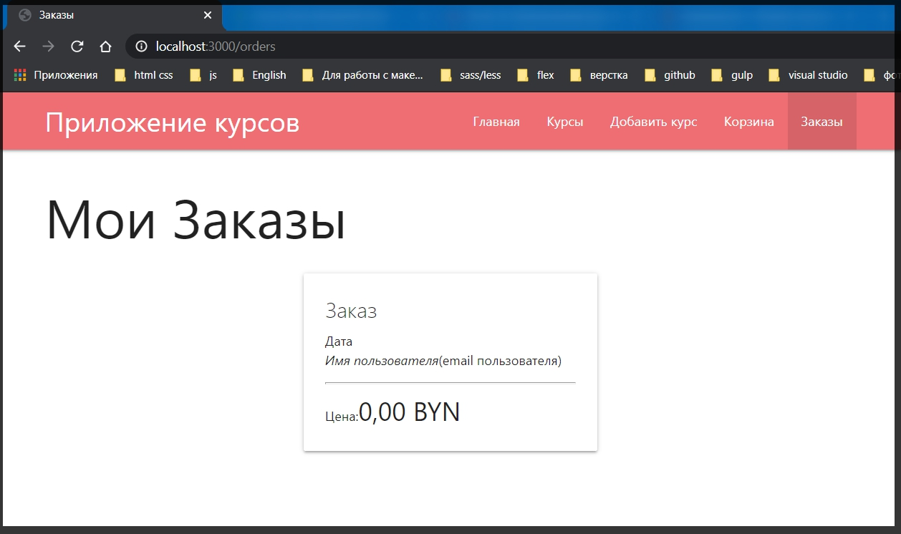
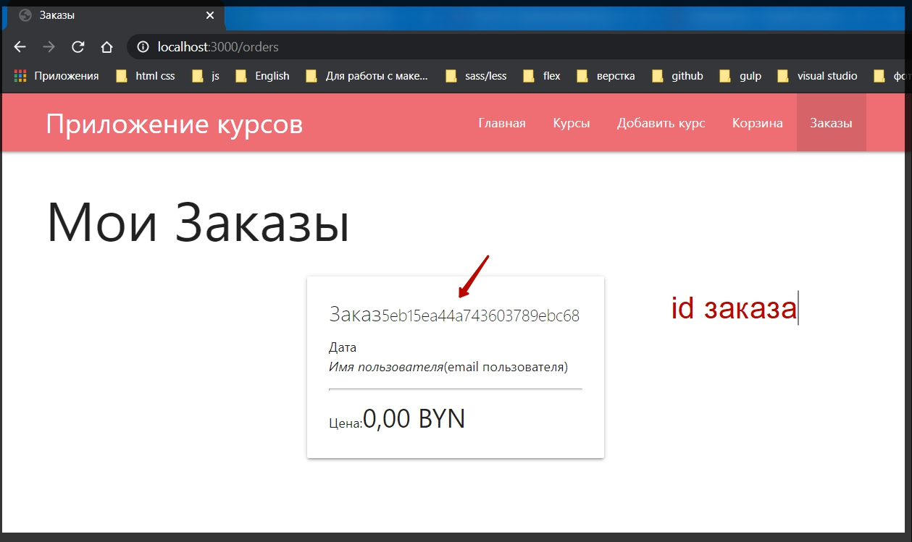
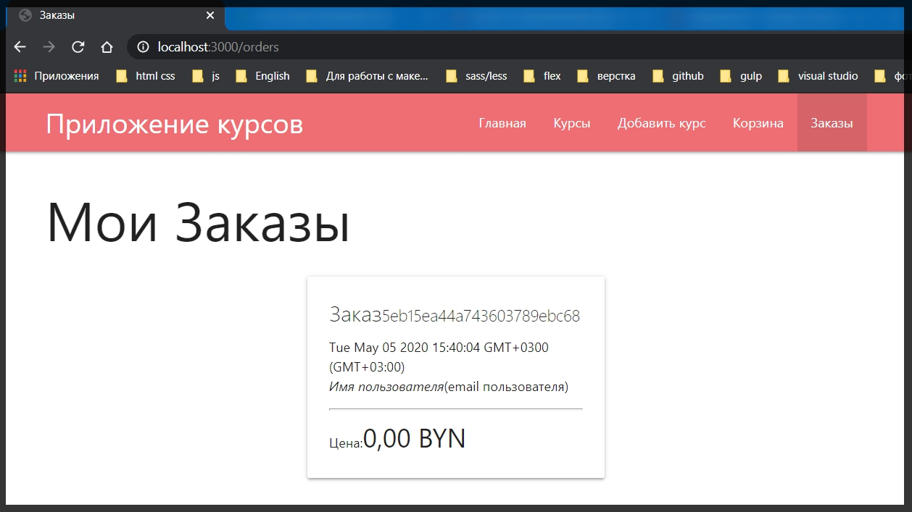
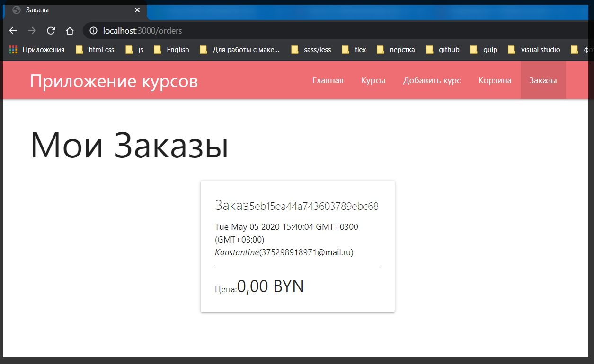
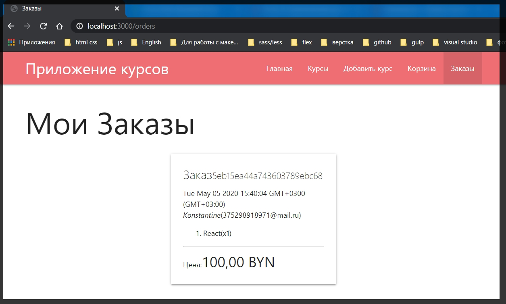
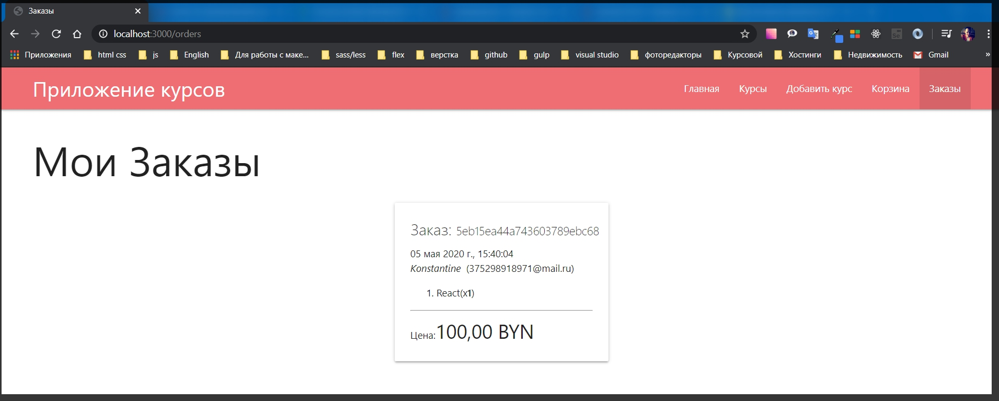
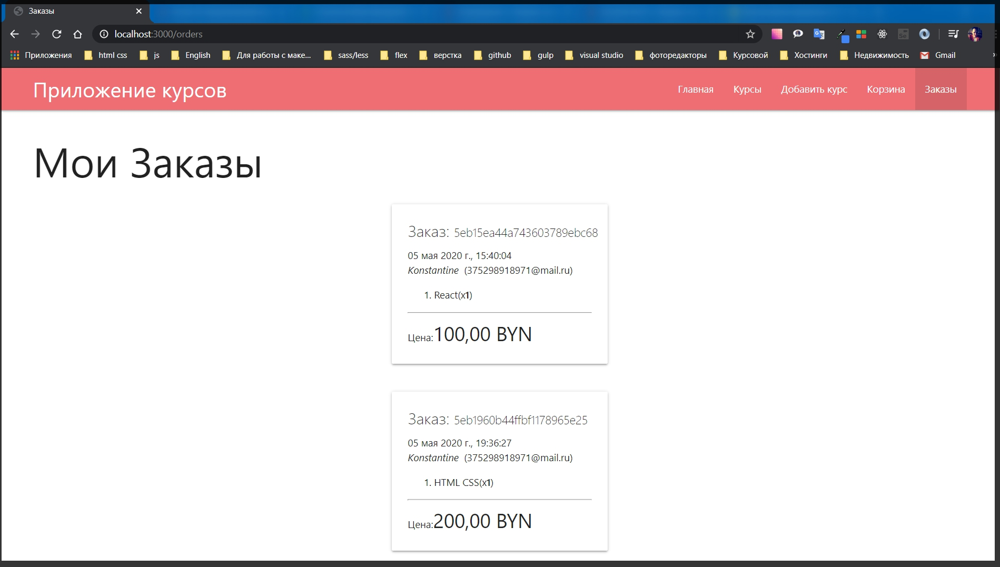

# Вывод заказов

Теперь необходимо реализовать страницу заказов для того что бы мы вывели все заказы которые относятся к каждому из пользователей.

И для начало, т.к. мы работаем в **handlebars** мы можем воспользоватся директивой **{{#if}}** что бы проверить **{{#if orders.lenght}}** что - то отличное от ноля, то тогда мы будем выводить этот контент. А иначе **else** выведем параграф **Заказов нет**.

```js
{{!-- orders.hbs --}}
<h1>Мои Заказы</h1>

{{#if order.length}}
{{else}}
<p>Заказов нет</p>
{{/if}}
```

Что касается контента относящегося к каждому заказу. Если заказы есть то я воспользуюсь циклом **{{#each}}** который позволяет итерировать внутри шаблона и будем пробегаться по массиву **orders**. **{{#each orders}}**

```js
{{!-- orders.hbs --}}
<h1>Мои Заказы</h1>
{{#each orders}}

{{/each}}
{{#if order.length}}
{{else}}
<p>Заказов нет</p>
{{/if}}
```

Каждый элемент заказа у нас будет представлен ввиде строки и допустим **cart** из **materialise**

```js
{{!-- orders.hbs --}}
<h1>Мои Заказы</h1>
{{#each orders}}

<div class="row">
    <div class="col s6 offset-s3">

    </div>
</div>

{{/each}}
{{#if order.length}}
{{else}}
<p>Заказов нет</p>
{{/if}}
```

Далее будет класс **card**

```js
{{!-- orders.hbs --}}
<h1>Мои Заказы</h1>
{{#each orders}}

<div class="row">
    <div class="col s6 offset-s3">
        <div class="card">

        </div>
    </div>
</div>

{{/each}}
{{#if order.length}}
{{else}}
<p>Заказов нет</p>
{{/if}}
```

После этого класс **card-content** внутри котороя я задам **span** с классом **title**.

```js
{{!-- orders.hbs --}}
<h1>Мои Заказы</h1>
{{#each orders}}

<div class="row">
    <div class="col s6 offset-s3">
        <div class="card">
            <div class="card-content">
                <span class="title"></span>
            </div>
        </div>
    </div>
</div>

{{/each}}
{{#if order.length}}
{{else}}
<p>Заказов нет</p>
{{/if}}
```

После **span** выведу параграф куда буду выводить какую - то дату. Кароче заполняю тестовыми данными.

```js
{{!-- orders.hbs --}}
<h1>Мои Заказы</h1>

{{#if orders.length}}
{{#each orders}}
<div class="row">
    <div class="col s6 offset-s3">
        <div class="card">
            <div class="card-content">
                <span class="card-title">Заказ</span>
                <p>Дата</p>
                <p><em>Имя пользователя</em>(email пользователя)</p>

                <ol>

                </ol>

                <hr>

                <p>Цена:<span class="price"></span></p>
            </div>
        </div>
    </div>
</div>
{{/each}}
{{else}}
<p>Заказов нет</p>
{{/if}}
```



Так выглядит карточка данного заказа. т.е. это базовая структура которую нужно получить.

А теперь самое время задуматься о том как вывести.

У нас есть массив **orders {{#if orders.length}}** и мы по нему бежим. Далее мне доступны различные переменные которые доступны внутри каждого элемента ордеров.

Т.е. например для заказа я буду указывать тег **small** и в нем указываю **{{_id}}**

```js
{{!-- orders.hbs --}}
<h1>Мои Заказы</h1>

{{#if orders.length}}
{{#each orders}}
<div class="row">
    <div class="col s6 offset-s3">
        <div class="card">
            <div class="card-content">
                <span class="card-title">Заказ<small>{{_id}}</small></span>
                <p>Дата</p>
                <p><em>Имя пользователя</em>(email пользователя)</p>

                <ol>

                </ol>

                <hr>

                <p>Цена:<span class="price"></span></p>
            </div>
        </div>
    </div>
</div>
{{/each}}
{{else}}
<p>Заказов нет</p>
{{/if}}
```



Дальше есть Дата ее я вывожу просто используя поле **{{date}}**

```js
{{!-- orders.hbs --}}
<h1>Мои Заказы</h1>

{{#if orders.length}}
{{#each orders}}
<div class="row">
    <div class="col s6 offset-s3">
        <div class="card">
            <div class="card-content">
                <span class="card-title">Заказ<small>{{_id}}</small></span>
                <p>{{date}}</p>
                <p><em>Имя пользователя</em>(email пользователя)</p>

                <ol>

                </ol>

                <hr>

                <p>Цена:<span class="price"></span></p>
            </div>
        </div>
    </div>
</div>
{{/each}}
{{else}}
<p>Заказов нет</p>
{{/if}}
```



Что касается пользователя то здесь с помощью интерполяции обращаюсь к **{{user.userId.name}}**, а в скобочках вывожу его **email** вот так **({{user.userId.email}})**. Из - за того что раньше я использовал **.populate** я здесь могу вытащить **email**.

```js
{{!-- orders.hbs --}}
<h1>Мои Заказы</h1>

{{#if orders.length}}
{{#each orders}}
<div class="row">
    <div class="col s6 offset-s3">
        <div class="card">
            <div class="card-content">
                <span class="card-title">Заказ<small>{{_id}}</small></span>
                <p>{{date}}</p>
                <p><em>{{user.userId.name}}</em>({{user.userId.email}})</p>

                <ol>

                </ol>

                <hr>

                <p>Цена:<span class="price"></span></p>
            </div>
        </div>
    </div>
</div>
{{/each}}
{{else}}
<p>Заказов нет</p>
{{/if}}
```



В **price** указываю **{{price}}**. И в нумерованном списке для каждого из заказов у нас есть внутренний массив который отвечает именно за курсы. Поэтому внутри списка еще раз вызываю цикл **{{#each courses}}** для массива **courses**. И на каждой итерации я буду выводить элемент **li** в котором я буду выводить **{{course.title}}** и в круглых скобках указываю сколько этих курсов мы купили

```
(x<strong>{{count}}</strong>)
```

```js
{{!-- orders.hbs --}}
<h1>Мои Заказы</h1>

{{#if orders.length}}
{{#each orders}}
<div class="row">
    <div class="col s6 offset-s3">
        <div class="card">
            <div class="card-content">
                <span class="card-title">Заказ<small>{{_id}}</small></span>
                <p>{{date}}</p>
                <p><em>{{user.userId.name}}</em>({{user.userId.email}})</p>

                <ol>
                  {{#each courses}}
                  <li>
                {{course.title}}(x<strong>{{count}}</strong>)
                  </li>
                  {{/each}}
                </ol>

                <hr>

                <p>Цена:<span class="price">{{price}}</span></p>
            </div>
        </div>
    </div>
</div>
{{/each}}
{{else}}
<p>Заказов нет</p>
{{/if}}
```



Мне ненравится то как показывается дата. Дату можно вывести намного более красивым образом.
По аналогии с ценой где мы постоянно форматируем ее с помощью клиентского **JS** буду задавать класс **date**.

```js
<p class="date">{{ date }}</p>
```

Теперь перехожу в папку **public app.js**. Где мне нужно сформировать функцию которую назову **toDate**. **const toDate = date =>{}**. И здесь мы будем с помощью такого же класса **Intl** как в функции

```js
const toCurrency = (price) => {
  return new Intl.NumberFormat('ru-RU', {
    currency: 'BYN',
    style: 'currency',
  }).format(price);
};
```

делать формат **date**. Т.е. в функции **const toDate = date =>{}** будем возвращать **return new Intl.DateTimeFormat('')** в параметрах указываю локаль **ru-RU**. Вторым параметром идет большой набор опций **return new Intl.DateTimeFormat('ru-RU',{})**. И после вызываю **format** в параметры которого передаю **(new Date(date))**

```js
// public app.js

const toCurrency = (price) => {
  return new Intl.NumberFormat('ru-RU', {
    currency: 'BYN',
    style: 'currency',
  }).format(price);
};

const toDate = (date) => {
  return new Intl.DateTimeFormat('ru-RU', {}).format(new Date(date));
};

document.querySelectorAll('.price').forEach((node) => {
  node.textContent = toCurrency(node.textContent);
});

const $card = document.querySelector('#card');

if ($card) {
  $card.addEventListener('click', (event) => {
    if (event.target.classList.contains('js-remove')) {
      const id = event.target.dataset.id;

      fetch('/card/remove/' + id, {
        method: 'delete',
      })
        .then((res) => res.json())
        .then((card) => {
          if (card.courses.length) {
            const html = card.courses
              .map((c) => {
                return `
                <tr>
                  <td>${c.title}</td>
                  <td>${c.count}</td>
                  <td>
                    <button class="btn btm-small js-remove" data-id="${c.id}">Удалить</button>
                  </td>
                </tr>
                `;
              })
              .join('');
            $card.querySelector('tbody').innerHTML = html;
            $card.querySelector('.price').textContent = toCurrency(card.price);
          } else {
            $card.innerHTML = '<p>Корзина пуста</p>';
          }
        });
    }
  });
}
```

Что касается опций, то здесь будет гораздо сложнее. Вбивай в поиск [Intl.DateTimeFormat](https://developer.mozilla.org/ru/docs/Web/JavaScript/Reference/Global_Objects/Intl/DateTimeFormat) и гугли используемы поля.

Буду прописывать подобранный мной определенный формат данных. Кусок

```js
const toDate = (date) => {
  return new Intl.DateTimeFormat('ru-RU', {
    day: '2-digit',
    month: 'long',
    year: 'numeric',
    hour: '2-digit',
    minute: '2-digit',
    second: '2-digit',
  }).format(new Date(date));
};
```

Полный

```js
// public app.js

const toCurrency = (price) => {
  return new Intl.NumberFormat('ru-RU', {
    currency: 'BYN',
    style: 'currency',
  }).format(price);
};

const toDate = (date) => {
  return new Intl.DateTimeFormat('ru-RU', {
    day: '2-digit',
    month: 'long',
    year: 'numeric',
    hour: '2-digit',
    minute: '2-digit',
    second: '2-digit',
  }).format(new Date(date));
};

document.querySelectorAll('.price').forEach((node) => {
  node.textContent = toCurrency(node.textContent);
});

const $card = document.querySelector('#card');

if ($card) {
  $card.addEventListener('click', (event) => {
    if (event.target.classList.contains('js-remove')) {
      const id = event.target.dataset.id;

      fetch('/card/remove/' + id, {
        method: 'delete',
      })
        .then((res) => res.json())
        .then((card) => {
          if (card.courses.length) {
            const html = card.courses
              .map((c) => {
                return `
                <tr>
                  <td>${c.title}</td>
                  <td>${c.count}</td>
                  <td>
                    <button class="btn btm-small js-remove" data-id="${c.id}">Удалить</button>
                  </td>
                </tr>
                `;
              })
              .join('');
            $card.querySelector('tbody').innerHTML = html;
            $card.querySelector('.price').textContent = toCurrency(card.price);
          } else {
            $card.innerHTML = '<p>Корзина пуста</p>';
          }
        });
    }
  });
}
```

Дальше я опращаюсь к **document.querySelectorAll** забираю класс **('.date')** и так же с помощью **.forEach( node =>{})** где просто заменю текстовый контент **node.textContent = toDate(node.textContent)**

```js
document.querySelectorAll('.date').forEach((node) => {
  node.textContent = toDate(node.textContent);
});
```

Полный файл

```js
// public app.js

const toCurrency = (price) => {
  return new Intl.NumberFormat('ru-RU', {
    currency: 'BYN',
    style: 'currency',
  }).format(price);
};

const toDate = (date) => {
  return new Intl.DateTimeFormat('ru-RU', {
    day: '2-digit',
    month: 'long',
    year: 'numeric',
    hour: '2-digit',
    minute: '2-digit',
    second: '2-digit',
  }).format(new Date(date));
};

document.querySelectorAll('.price').forEach((node) => {
  node.textContent = toCurrency(node.textContent);
});

document.querySelectorAll('.date').forEach((node) => {
  node.textContent = toDate(node.textContent);
});

const $card = document.querySelector('#card');

if ($card) {
  $card.addEventListener('click', (event) => {
    if (event.target.classList.contains('js-remove')) {
      const id = event.target.dataset.id;

      fetch('/card/remove/' + id, {
        method: 'delete',
      })
        .then((res) => res.json())
        .then((card) => {
          if (card.courses.length) {
            const html = card.courses
              .map((c) => {
                return `
                <tr>
                  <td>${c.title}</td>
                  <td>${c.count}</td>
                  <td>
                    <button class="btn btm-small js-remove" data-id="${c.id}">Удалить</button>
                  </td>
                </tr>
                `;
              })
              .join('');
            $card.querySelector('tbody').innerHTML = html;
            $card.querySelector('.price').textContent = toCurrency(card.price);
          } else {
            $card.innerHTML = '<p>Корзина пуста</p>';
          }
        });
    }
  });
}
```




