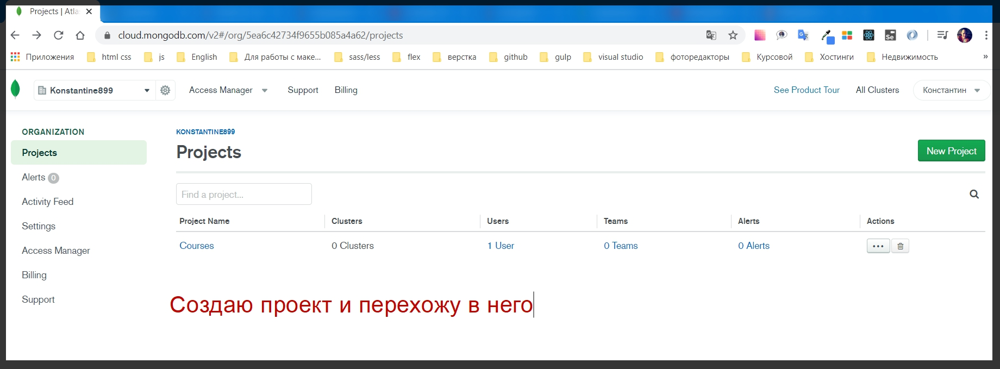
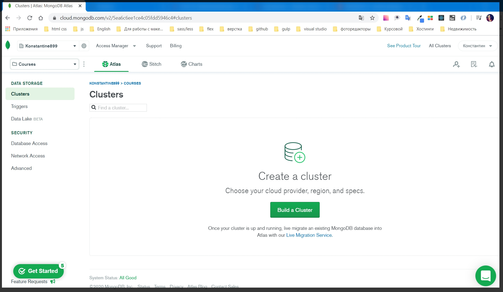
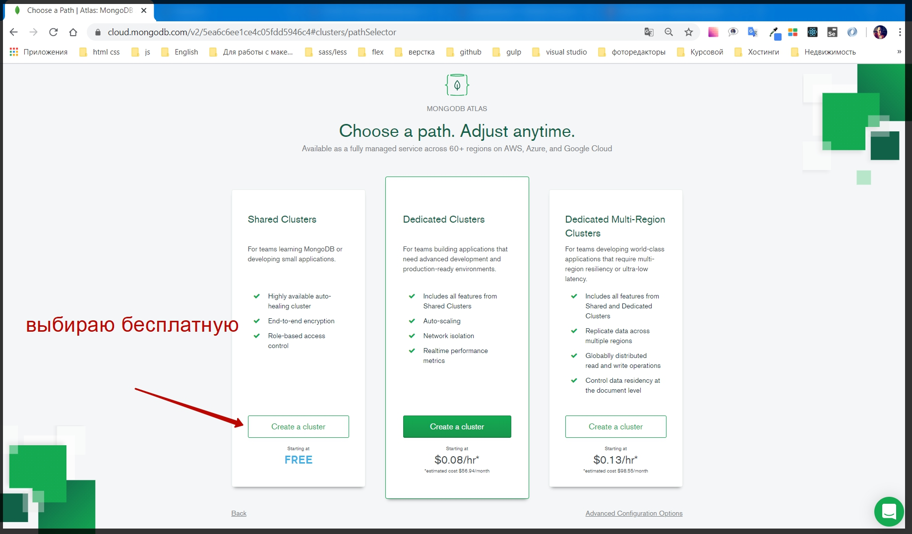
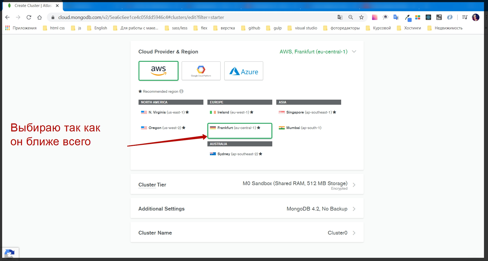
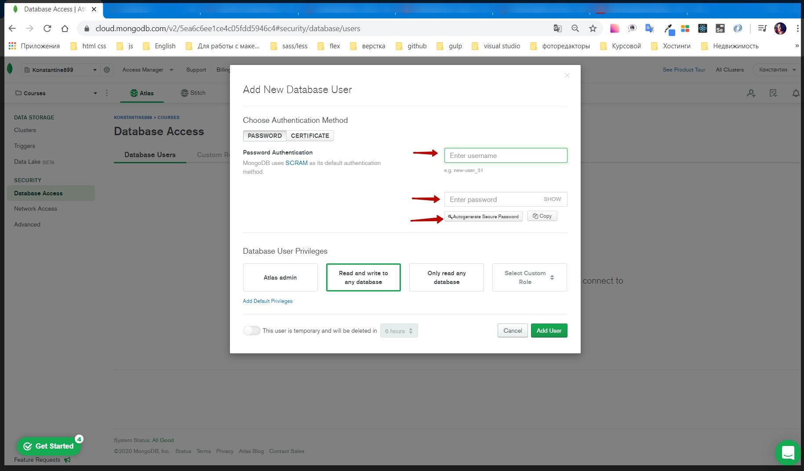
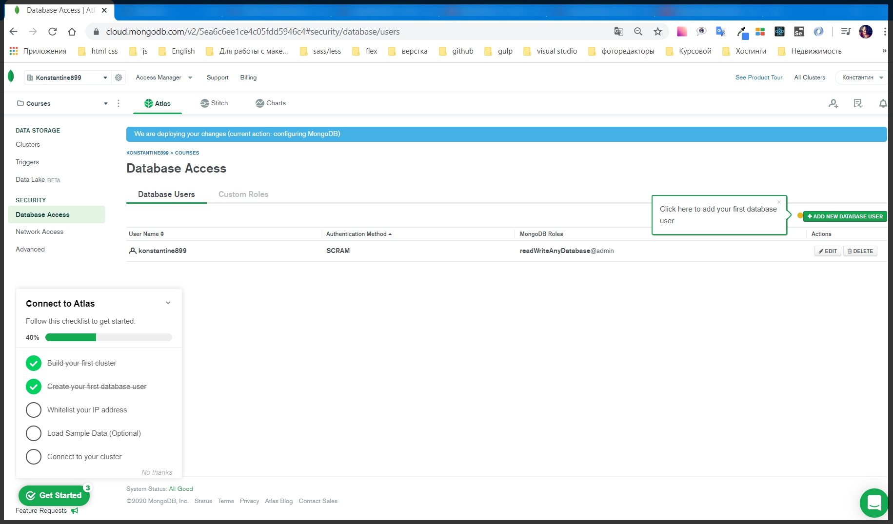
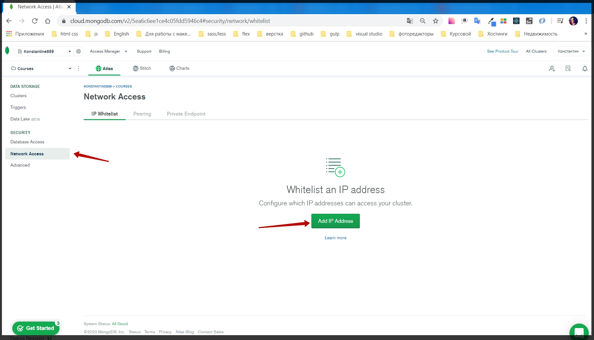
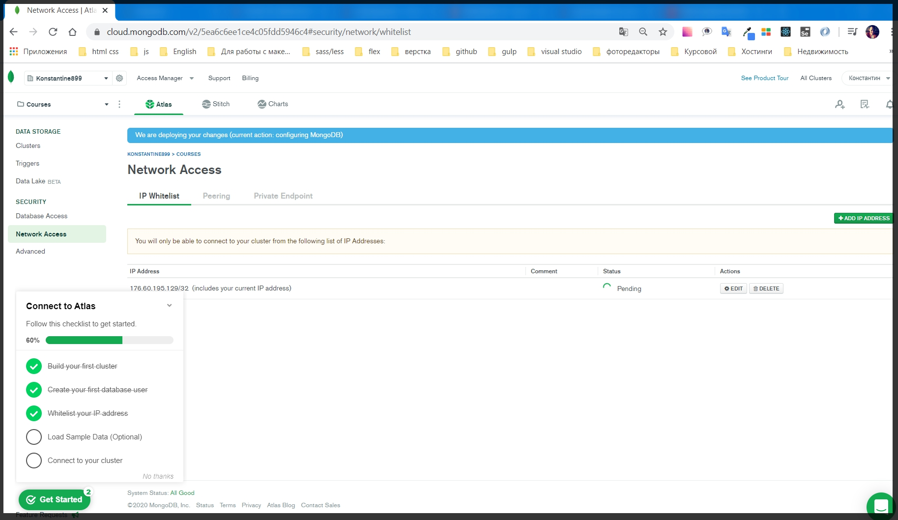
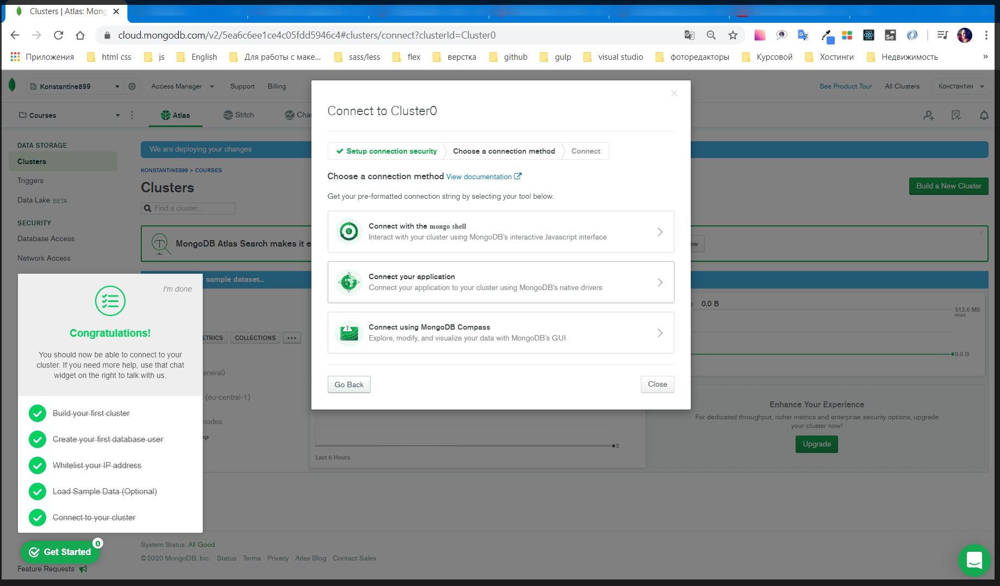
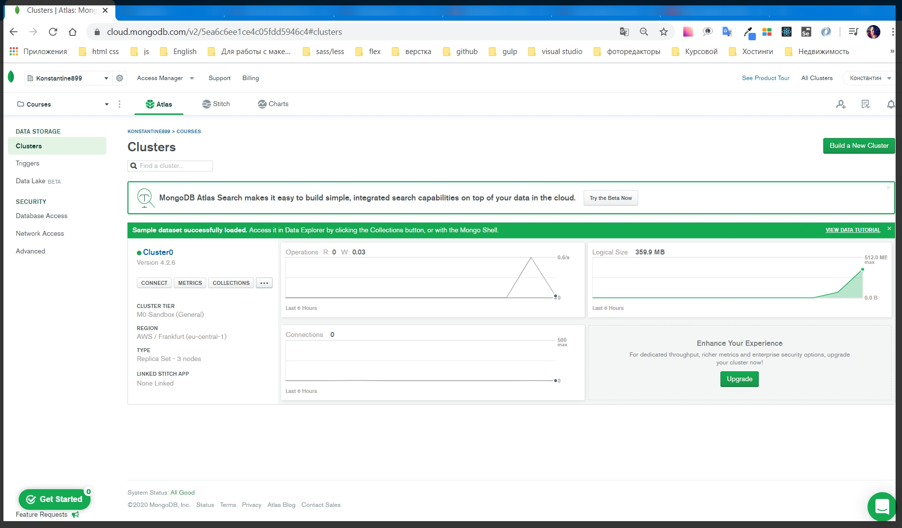

# Подключение MongoDB

Работая с файлами а не с БД мы получаем очень низкий perfomance(производительность). Особенно это станет заметно когда объем данных станет большим.

Второй момент это при использовании определенных баз данных мы можем настраивать различные взаимосвязи между сущностями, между разными таблицами, и соответственно более лаконично делать выжимку из различных наборов данных.

Т.е. например у нас будет какой - то пользователь у которого будут различные заказы, у которого будут различные товары, и это будут абсолютно разные таблицы. Например для пользователя, для товаров и т.д.
И что бы вручную не искать все эти взаимосвязи с помощью БД я буду настраивать я буду настраивать их взаимодействие и вытаскивать их.

Для начало настраиваем MongoDB.

Перехожу на официальный сайт [MongoDB](https://www.mongodb.com/). В старой версии сайта перехожу Products -> MongoDB Atlas.
Я же перехожу Cloud -> Atlas. Внизу Atlas написано Fully managet cloud database. Я буду использовать именно cloud версию MongoDB. Потому что у всех есть разные ОС. MongoDB настраивается везде по разному. Не везде это просто как например на Mac.
Хотя на production такие вещи тоже можно использовать, но лучше использовать платную версию для того что бы скорость была по выше.

Нажимаю Start Free. Регестрируюсь.

Создаю проект и перехожу в него.

Далее создаю cluster

Все остальное оставляю по умолчанию. Однако если есть желание можно пересмотреть, к примеру купить какой то тариф.

Create Claster.

Я поподаю в атлас где я управляю БД. Для начало необходимо подождать пока наш кластер создастся.

После создания кластера мне необходимо настроить его.

Для этого перехожу в поле Security. И для начало необходимо создать нового пользователя который будет иметь доступ к БД. Т.е. как видите. Сам Atlas подсказывает что делать

Я так и не нашел как добавлять нового пользователя...

Делаю по своему.

Пользователь пароль сам знаешь где посмотреть.

Теперь перехожу.... все не так как у ....

Добавляю новый IP адресс. Это делается в целях определенной защиты, потому что мы будем работать с БД. И логично ограничить количество компьютеров которые будут работать именно с базой. Потому что URL будет публичный и в принципе любой может его использовать. 
В дальнейшем я это все скрою.

Во всплывшем окне можно добавить доступ отовсюду, или же просто добавить текущий IP адресс. Нажимаю confirm

status обновляется и после его обновления я смогу сделать connect к базе.

Далее сделай сам Load sample data по подсказке.

После подключаюсь. Выбираю Connect Your Aplication.

 app.js пока url тут. В Строке есть password. Вместо него я могу подставить свой пароль.

 

 Все БД готова и я могу переносить свои данные.
