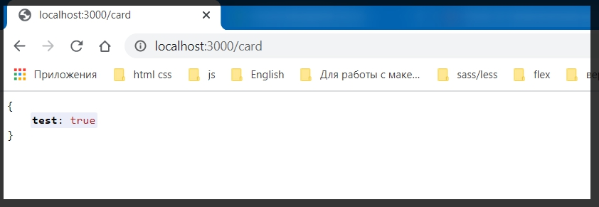
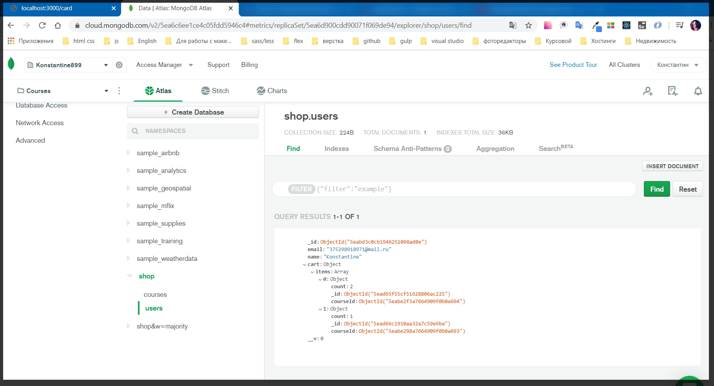

# Добавление товара в корзину

Теперь нужно понять, какие дальнейшие шаги нужно предпринять для того что бы приложение развивалось.

Сейчас займусь корзиной. До этого я использовал **data** модель где были файлы **card.json** и **courses.json**.
Удаляю папку **data**.

Захожу в папку **models** и в модель **card.js**. Здесь мы реализовывали собственную логику которая позволяет добавлять либо удалять элементы корзины. Пересчитывать стоимость. Но теперь это так же не нужно. Удаляю **card.js**.
И в проекте остается всего лишь две модели **course.js** и **user.js**.

Сейчас приложение работать не будет. Потому что в **routes card.js** я подключаю модель **Card** которой у меня пока что просто нет и на самом деле она не нужна. Удаляю это подключение. Должно осталться вот так.

```js
// routes card.js

const { Router } = require('express');
const Course = require('../models/course');
const router = Router();
```

Но при этом мне понадобится модель **Course** которую я использую для получения того или иного курса с которым я взаимодействую.

И теперь смотрю на первый метод

```js
router.post('/add', async (req, res) => {
  const course = await Course.getById(req.body.id);
  await Card.add(course);
  res.redirect('/card');
});
```

И думаю с чего нужно начать рефакторить этот код. Роут **'/add'** позволяет добавить новый курс в корзину. И раньше мы делали это просто. Мы просто добавляли в модель Card вызывал метод **add** и добавлял **(course)** т.е. все было просто.
Теперь такого нет. Но сейчас карта привязана к каждому пользователю т.е. она для всех пользователей уникальна. Для каждого своя. И логично предпольжить что мы будем работать с пользователем.
Удаляю строчку **await Card.add(course);**
И пользователя мы можем получить в объекте **req.user**. и теперь смотрим способ который предоставляет **mongoose** для того что бы более удобно выстраивать подобные логические цепочки.

Перехожу в **models user.js**. Уменя есть **userSchema** которую я могу расширить. В конце документа, перед экспортом модуля обращаюсь к **userSchema**. к его объекту **methods**. далее здесь я могу определить другой любой метод который вынесет логику прямо в объект пользователя. И называю этот метод **addToCart =** . **addToCard** это у нас метод который мы должны определить как функцию, но здесь есть один нюанс. Здесь обязательно использовать ключевое слово **function(){}**. Т.е. мы конечно можем задать функцию через стрелочную функцию. Но здесь важно использовать ключевое слово **function** потому что я буду здесь работать с ключевым словом **this.**
Когда мы создаем функцию через стрелочную функцию т.е. без ключевого слова **function**, котекста **this** у нас нет. По этому я не смогу с ним работать. По этому это критично важно.

И внутри этой функции я буду прописывать логику которая позволит добавлять элемент в корзину.
В параметр **function** я буду принимать объект **(course)**.

```js
// models user.js

const { Schema, model } = require('mongoose');

const userSchema = new Schema({
  email: {
    type: String,
    required: true,
  },
  name: {
    type: String,
    required: true,
  },
  cart: {
    items: [
      {
        count: {
          type: Number,
          required: true,
          default: 1,
        },
        courseId: {
          type: Schema.Types.ObjectId,
          ref: 'Course',
          required: true,
        },
      },
    ],
  },
});

userSchema.methods.addToCart = function (course) {
  this;
};

module.exports = model('User', userSchema);
```

Пока мы эту логику не пишем. Но теперь в **routes card.js**. И на самом деле это функция контройлера, я обращаюсь в ней к **user** а именно **req.user.addToCart(course)** куда передаю тот курс который создали.

```js
// routes card.js

const { Router } = require('express');
const Course = require('../models/course');
const router = Router();

router.post('/add', async (req, res) => {
  const course = await Course.getById(req.body.id);
  await req.user.addToCart(course);
  res.redirect('/card');
});

router.get('/', async (req, res) => {
  const card = await Card.fetch(); // здесь получаем всю корзину
  res.render('card', {
    title: 'Корзина',
    isCard: true, // Для того что бы навигация отображалась корректно
    courses: card.courses, // курсы выносим в отдельную переменную
    price: card.price, // цену выношу в отдельную переменную
  });
});

router.delete('/remove/:id', async (req, res) => {
  const card = await Card.remove(req.params.id);
  res.status(200).json(card);
});

module.exports = router;
```

Данный метод **req.user.addToCart(course);** является асинхронным, т.е. он будет что то сохранять в БД. Поэтому к нему также применяю оператор **await**. Для того что бы **NodeJS** подождал пока выполнится данный **req.user.addToCart(course)** запрос.

И вот теперь необходимо реализовать логику которая позволит добавить этот курс в корзину. И в случае если в корзине лежит такой курс, то тогда нужно просто увеличить количество, увеличить счетчик **count**.

перехожу в **models user.js** и продолжаю писать.

Для начало мне потребуется обратится к корзине **cart** и забрать у нее массив **items**. Именно в данном массиве лежат те элементы у которых есть свойство **count** и **courseId**

```js
// models user.js

const { Schema, model } = require('mongoose');

const userSchema = new Schema({
  email: {
    type: String,
    required: true,
  },
  name: {
    type: String,
    required: true,
  },
  cart: {
    items: [
      {
        count: {
          type: Number,
          required: true,
          default: 1,
        },
        courseId: {
          type: Schema.Types.ObjectId,
          ref: 'Course',
          required: true,
        },
      },
    ],
  },
});

userSchema.methods.addToCart = function (course) {
  this;
};

module.exports = model('User', userSchema);
```

И для того что бы в JS небыло мутаций в теле функции

```js
userSchema.methods.addToCart = function (course) {};
```

создаю массив **const items =** мы склонируем просто массив **items** у **cart**. Т.е. обращаюсь к **this.cart.items** это у нас массив, по этому есть два способа что бы его склонировать. Вызывать метод **concat()** без параметров и он вернет нам новый массив.
Но если же использовать **ES6** синтаксис то я могу создать новый массив **[this.cart.items]** и воспользоваться **spreed** оператором для того что бы развернуть данный массив.

```js
// models user.js

const { Schema, model } = require('mongoose');

const userSchema = new Schema({
  email: {
    type: String,
    required: true,
  },
  name: {
    type: String,
    required: true,
  },
  cart: {
    items: [
      {
        count: {
          type: Number,
          required: true,
          default: 1,
        },
        courseId: {
          type: Schema.Types.ObjectId,
          ref: 'Course',
          required: true,
        },
      },
    ],
  },
});

userSchema.methods.addToCart = function (course) {
  const items = [...this.cart.items];
};

module.exports = model('User', userSchema);
```

И тем самым я получаю копию массива.

После этого с массивом **items** который я склонировал. для логичности переименую.

```js
userSchema.methods.addToCart = function (course) {
  const clonedItems = [...this.cart.items];
};
```

Дальше нужно найти в данном массиве **clonedItems** тот курс с которым я работаю, а точнее найти его индекс **const idx =**. Далее я обращаюсь к **clonedItems**. и у этого массива я могу вызвать метод **findIndex()** для того что бы найти индекс того или иного элемента, я прописываю условие где на каждой итерации я получаю объект **findIndex(c =>{})**.

```js
userSchema.methods.addToCart = function (course) {
  const clonedItems = [...this.cart.items];
  const idx = clonedItems.findIndex((c) => {});
};
```

В **callback** мне нужно вернуть **return**, и проверить какое - то условие.

У каждого элемента есть поле **courseId** поэтому обращаюсь к **return c.courseId**. Но здесь стоит учитывать что это **courseId** объект вот такого вот типа **Schema.Types.ObjectId**. И для того что бы его сравнивать с другими строками например то необходимо вызывать метод **toString()**.

Это очень важный момент потому что с ним могут быть определенные проблемы. Если задаю у **courseId**, это я так назвал может быть просто **id**, как **type: Schema.Types.ObjectId**, то обязательно при сравнении со строками нужно использовать **toString()**.

И сравниваю **return c.courseId.toString() ===** с тем курсом который передали в параметры **function (course)**, т.е. **course._id**. и также привожу к строке.

```js
userSchema.methods.addToCart = function (course) {
  const clonedItems = [...this.cart.items];
  const idx = clonedItems.findIndex((c) => {
    return c.courseId.toString() === course._id.toString();
  });
};
```

И теперь у меня есть потенциальный **id**, позиция данного курса в массиве, которая есть в корзине. Т.е. если данный **idx** найдется т.е. **>= 0**, то значит мы уже несколько раз добавляли этот курс и по этому нужно увеличить количество.
А если же курс не нашелся то тогда его нужно добавить в корзину.

И для этого пишу следующую логику. В случае когда **idx** будет равняться **-1**, то тогда мы будем добавлять элемент. И условие можно прописать разными способами. Можно прописать и вне зависимости от **idx**.
Но лучше когда **idx >= 0**

```js
userSchema.methods.addToCart = function (course) {
  const clonedItems = [...this.cart.items];
  const idx = clonedItems.findIndex((c) => {
    return c.courseId.toString() === course._id.toString();
  });
  if (idx >= 0) {
  }
};
```

т.е. если **idx >= 0** это означает что в корзине уже есть такой курс и мы должны увеличить количество.
Внутри тела условия у **cloneItems[idx]**. обращаюсь по индексу с которым работаю, далее обращаюсь к его полю **count =** и в него я заношу новое значение которое я должен увеличить от предыдущего значения. Обращаюсь к **cloneItems[idx].count + 1**.

```js
userSchema.methods.addToCart = function (course) {
  const clonedItems = [...this.cart.items];
  const idx = clonedItems.findIndex((c) => {
    return c.courseId.toString() === course._id.toString();
  });
  if (idx >= 0) {
    clonedItems[idx].count = clonedItems[idx].count + 1;
  }
};
```

Иначе **else** если **idx** будет равняться **-1**, то тогда это означает что его нет в массиве, нет в корзине. обращаюсь к **clonedItems.** с помощью метода **push({})** добавляю новый элемент где по сути нужно описать два поля **count** и **courseId**.
**courseId:** будет равняться **idx** который сюда передавал т.е. **course._id**. Ну а количество у нас по умолчанию **count: 1**.

```js
userSchema.methods.addToCart = function (course) {
  const clonedItems = [...this.cart.items];
  const idx = clonedItems.findIndex((c) => {
    return c.courseId.toString() === course._id.toString();
  });
  if (idx >= 0) {
    clonedItems[idx].count = clonedItems[idx].count + 1;
  } else {
    clonedItems.push({
      courseId: course._id,
      count: 1,
    });
  }
};
```

После этого я создаю переменную **const newCart = {}** которая будет являться объектом, и у которого массив **items:** будет равняться **clonedItems**.

И после этого переменной **this.cart =** занести значение **newCart**.

```js
userSchema.methods.addToCart = function (course) {
  const clonedItems = [...this.cart.items];
  const idx = clonedItems.findIndex((c) => {
    return c.courseId.toString() === course._id.toString();
  });
  if (idx >= 0) {
    clonedItems[idx].count = clonedItems[idx].count + 1;
  } else {
    clonedItems.push({
      courseId: course._id,
      count: 1,
    });
  }
};

// const newCart = { items: clonedItems };
// this.cart = newCart;
```

Этот код написан для того что бы было понятно что происходит.

Но такие вещи можно существенно сократить. Коментирую

```js
userSchema.methods.addToCart = function (course) {
  const clonedItems = [...this.cart.items];
  const idx = clonedItems.findIndex((c) => {
    return c.courseId.toString() === course._id.toString();
  });
  if (idx >= 0) {
    clonedItems[idx].count = clonedItems[idx].count + 1;
  } else {
    clonedItems.push({
      courseId: course._id,
      count: 1,
    });
  }
};

// const newCart = { items: clonedItems };
// this.cart = newCart;
```

Далее я обращаюсь к **this.cart = {}** и в нее заношу значение **items: clonedItems**. Таким образом я избавляюсь от создания одной переменной. Но более того если бы мы назвали переменную **clonedItems** просто **items**, то тогда нам бы с этим былобы просто работать. Меняю все **clonedItems** на **items**

```js
// models user.js

const { Schema, model } = require('mongoose');

const userSchema = new Schema({
  email: {
    type: String,
    required: true,
  },
  name: {
    type: String,
    required: true,
  },
  cart: {
    items: [
      {
        count: {
          type: Number,
          required: true,
          default: 1,
        },
        courseId: {
          type: Schema.Types.ObjectId,
          ref: 'Course',
          required: true,
        },
      },
    ],
  },
});

userSchema.methods.addToCart = function (course) {
  const items = [...this.cart.items];
  const idx = items.findIndex((c) => {
    return c.courseId.toString() === course._id.toString();
  });

  if (idx >= 0) {
    items[idx].count = items[idx].count + 1;
  } else {
    items.push({
      courseId: course._id,
      count: 1,
    });
  }

  // const newCart = {items: clonedItems}
  // this.cart = newCart

  this.cart = { items };
  return this.save();
};

module.exports = model('User', userSchema);
```

И теперь когда ключ и значение совпадают t**his.cart = { items: items };** я могу просто написать **this.cart = { items };** т.е. просто опустить значение. И последнее что необходимо сделать в методе **addTocart** это вернуть **return this.save()** Обязательно вызываю данный метод.

Проверяю как это работает.

Страница корзины не работает.

Ошибки в консоли все подсказывают. При покупке курса возникает **Course.getById is not a function**.
Перехожу в **routes card.js** и в

```js
router.post('/add', async (req, res) => {
  const course = await Course.getById(req.body.id);
  await req.user.addToCart(course);
  res.redirect('/card');
});
```

Должен быть не метод **getById** который мы использовали когда работали с файловой БД, а метод **findById**.

```js
router.post('/add', async (req, res) => {
  const course = await Course.findById(req.body.id);
  await req.user.addToCart(course);
  res.redirect('/card');
});
```

Вторая ошибка. В файле **routes card.js**. Здесь я обращаюсь к методу **feth**. такого метода у меня в этом файле не присутствует да и переменной такой тоже нет. Поэтому сейчас страница не загрузится.

```js
router.get('/', async (req, res) => {
  const card = await Card.fetch(); // здесь получаем всю корзину
  res.render('card', {
    title: 'Корзина',
    isCard: true, // Для того что бы навигация отображалась корректно
    courses: card.courses, // курсы выносим в отдельную переменную
    price: card.price, // цену выношу в отдельную переменную
  });
});
```

Но меня интересует другое. Как это все отображается в БД. Пока что для того что бы небыло ошибок сделаю так

```js
router.get('/', async (req, res) => {
  // const card = await Card.fetch(); // здесь получаем всю корзину
  // res.render('card', {
  //   title: 'Корзина',
  //   isCard: true, // Для того что бы навигация отображалась корректно
  //   courses: card.courses, // курсы выносим в отдельную переменную
  //   price: card.price, // цену выношу в отдельную переменную
  // });
  res.json({ test: true });
});
```

На самом деле не имеет значение что мы тут написали. Просто временно избавляюсь от этих ошибок.

теперь при покупке курса появляется сообщение



Далее смотрю в базу. Покупательская корзина находится в пользователях. И два добавленых курса находяться в ней и счетчик тоже работает


