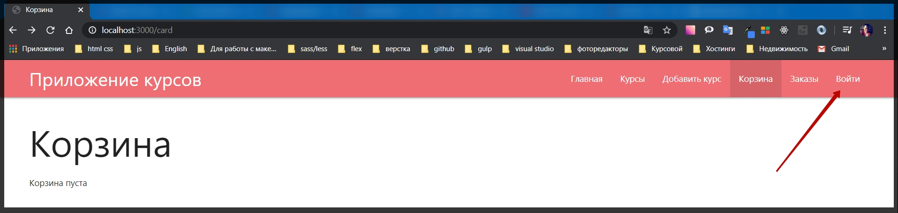
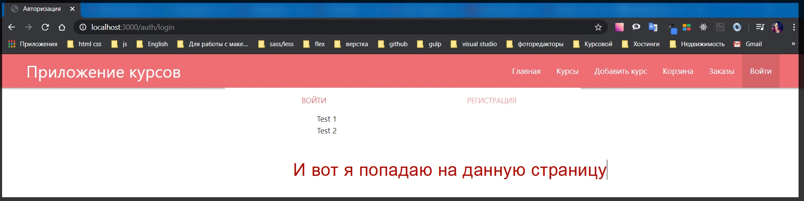
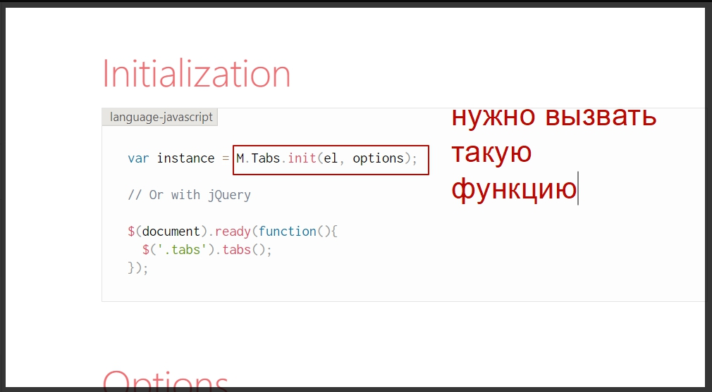
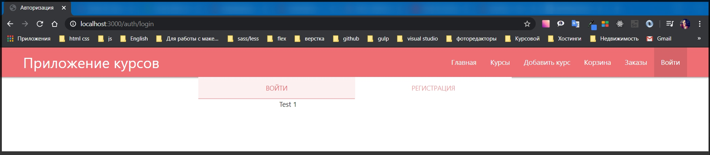
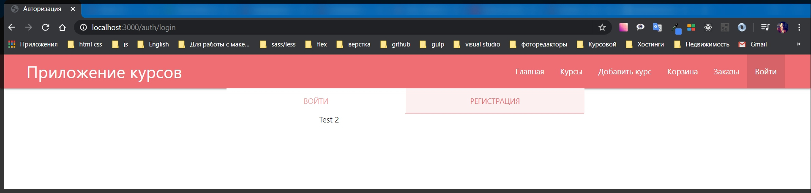
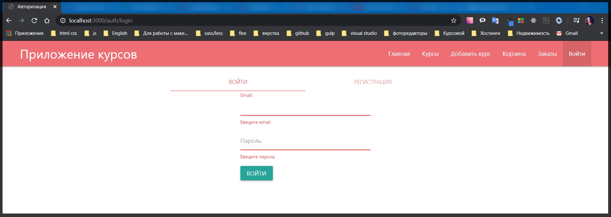
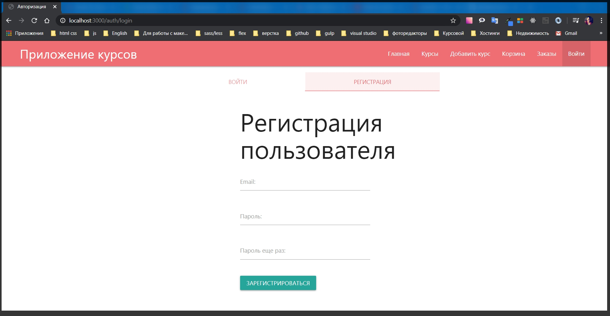

# Страница логина

Сейчас если мы посмотрим на наше приложение то мы увидим довольно красивый и мощный функционал где у нас есть различные страницы.
Но есть одна проблема. У нас всего лишь один пользователь который по умолчанию добавляется путем не хитрых манипуляций в **index.js**

```js
const candidate = await User.findOne(); // поиск пользлвателей
if (!candidate) {
  const user = new User({
    email: '375298918971@mail.ru',
    name: 'Konstantine',
    cart: { items: [] },
  });
  await user.save();
}
```

И данный пользователь может делать все что угодно. Заходить в заказы, добавлять курсы и т.д.

Было бы не плохо добавить способ авторизации в нашу систему т.е. способ регистрации, способ логина. И что бы все эти данные относились к конкретному пользователю который будет работать. Как раз таки для этого нам потребуются сессии. И мы разберем как работать с авторизацией через **MongoDB**.

Поэтому начну с реализации страницы с помощью которой я буду заходить в систему. И после этого буду добавлять различные защиты роутов и всякие другие защиты для приложения.

В папке **views** создаю новую папку, покажу как делать вложенные страницы, и назову ее **auth**. И в ней создаю файл **login.hbs**. И на данной странице я реализую определенную форму где мы будем иметь возможность и логинится в систему и регистрироваться в системе.
Для этого потребуется специальный плагин из **materialise** в поиске вбиваю [tabs](https://materializecss.com/tabs.html) и копирую весь код из test2.

```js
<div class="row">
  <div class="col s12">
    <ul class="tabs">
      <li class="tab col s3">
        <a href="#test1">Test 1</a>
      </li>
      <li class="tab col s3">
        <a class="active" href="#test2">
          Test 2
        </a>
      </li>
      <li class="tab col s3 disabled">
        <a href="#test3">Disabled Tab</a>
      </li>
      <li class="tab col s3">
        <a href="#test4">Test 4</a>
      </li>
    </ul>
  </div>
  <div id="test1" class="col s12">
    Test 1
  </div>
  <div id="test2" class="col s12">
    Test 2
  </div>
  <div id="test3" class="col s12">
    Test 3
  </div>
  <div id="test4" class="col s12">
    Test 4
  </div>
</div>
```

И теперь его

```js
<div class="row">
  <div class="col s12">
    <ul class="tabs">
      <li class="tab col s6">
        <a class="active" href="#login">
          Войти
        </a>
      </li>
      <li class="tab col s6">
        <a href="#register">Регистрация</a>
      </li>
    </ul>
  </div>
  <div id="login" class="col s6 offset-s3">
    Test 1
  </div>
  <div id="register" class="col s6 offset-s3">
    Test 2
  </div>
</div>
```

И протестим. Только для начало нам необходимо добавить ссылку в навигации и так же ниписать определенные роуты. Поэтому работы еще много.

Для этого перехожу в папку **routs** и я добавляю новый файл который назову **auth.js**. Здесь как обычно создаю объект роутера.

```js
// routes outh.js
const { Router } = require('express');
const router = Router();

module.exports = router;
```

Здесь будет одна сраница. Поэтому я обрабатываю **router.get('/login', async (req, res) => {});**

```js
// routes outh.js
const { Router } = require('express');
const router = Router();

router.get('/login', async (req, res) => {});

module.exports = router;
```

и в **res.render('auth/login', {});** куда мы передадим определенные параметры **title: 'Авторизация',** **isLogin: true**. Вместо **isAuth** я написал **isLOgin**. Сделал я это потому что мы будем использовать данное значение немножечко в другом контексте.

```js
// routes outh.js
const { Router } = require('express');
const router = Router();

router.get('/login', async (req, res) => {
  res.render('auth/login', {
    title: 'Авторизация',
    isLogin: true,
  });
});

module.exports = router;
```

Далее перехожу в **index.js**. Здесь необходимо импортировать роут **const authRoutes = require('./routes/auth');** и регестрирую данный роут **app.use('/auth', authRoutes);** Это первый этап.

Второй этап в **views** в папке **partials** перехожу в **navbar.hbs** и добавляю

```js
{{#if isLogin}}
<li class="active"><a href="/auth/login">Войти</a></li>
{{else}}
<li><a href="/auth/login">Войти</a></li>
{{/if}}
```





Но сейчас я вижу несколь ко проблем. Табы сильно прилегают к верхней панели. Плюс табы не активные.

Если перейти в **materialize** там где мы копировали код и посмотреть чуть ниже, то есть код который говорит как инициализировать табы.



Копирую и в папке **public** в файле **app.js** в самом низу просто инициализирую их. Второй параметр **option** не потребуется, а вместо первого **el** передаю значение **document.querySelectorAll('.tabs')** т.е. по классу **css**.

```js
M.Tabs.init(document.querySelectorAll('.tabs'));
```

Полный **app.js** смотри в конце

```js
// public app.js

const toCurrency = (price) => {
  return new Intl.NumberFormat('ru-RU', {
    currency: 'BYN',
    style: 'currency',
  }).format(price);
};

const toDate = (date) => {
  return new Intl.DateTimeFormat('ru-RU', {
    day: '2-digit',
    month: 'long',
    year: 'numeric',
    hour: '2-digit',
    minute: '2-digit',
    second: '2-digit',
  }).format(new Date(date));
};

document.querySelectorAll('.price').forEach((node) => {
  node.textContent = toCurrency(node.textContent);
});

document.querySelectorAll('.date').forEach((node) => {
  node.textContent = toDate(node.textContent);
});

const $card = document.querySelector('#card');

if ($card) {
  $card.addEventListener('click', (event) => {
    if (event.target.classList.contains('js-remove')) {
      const id = event.target.dataset.id;

      fetch('/card/remove/' + id, {
        method: 'delete',
      })
        .then((res) => res.json())
        .then((card) => {
          if (card.courses.length) {
            const html = card.courses
              .map((c) => {
                return `
                <tr>
                  <td>${c.title}</td>
                  <td>${c.count}</td>
                  <td>
                    <button class="btn btm-small js-remove" data-id="${c.id}">Удалить</button>
                  </td>
                </tr>
                `;
              })
              .join('');
            $card.querySelector('tbody').innerHTML = html;
            $card.querySelector('.price').textContent = toCurrency(card.price);
          } else {
            $card.innerHTML = '<p>Корзина пуста</p>';
          }
        });
    }
  });
}

M.Tabs.init(document.querySelectorAll('.tabs'));
```

Теперь если обновим страницу и нажмем кнопку. Получаю красивые табы при нажатии на которые я могу менять контент.





Далее добавляю отступы сверху. Все обарачиваю в **div** с классом **auth**.

```js
{{!-- view auth login.hbs --}}

<div class="auth">
    <div class="row">
    <div class="col s12">
      <ul class="tabs">
        <li class="tab col s6"><a class="active" href="#login">Войти</a></li>
        <li class="tab col s6"><a  href="#register">Регистрация</a></li>

      </ul>
    </div>
    <div id="login" class="col s6 offset-s3">Test 1</div>
    <div id="register" class="col s6 offset-s3">Test 2</div>
  </div>
</div>
```

```css
.auth {
  padding-top: 1rem;
}
```

И по умолчанию нужно сделать что бы загружалась страница логина. для этого в **href** добавляю еще **#login**

```js
 {{#if isLogin}}
<li class="active"><a href="/auth/login#login">Войти</a></li>
{{else}}
<li><a href="/auth/login#login">Войти</a></li>
{{/if}}
```

Это не обязательно потому что по умолчанию будет первый логин отрабатывать, но тем не менее.

Для того что бы данная страница работала необходимо добавить определенные формы. Перехожу в **login.hbs**. И там где **Test 1** и **Test 2**. Удаляю и добавляю две формы.



```js
{{!-- view auth login.hbs --}}

<div class="auth">
    <div class="row">
    <div class="col s12">
      <ul class="tabs">
        <li class="tab col s6"><a class="active" href="#login">Войти</a></li>
        <li class="tab col s6"><a  href="#register">Регистрация</a></li>

      </ul>
    </div>
    <div id="login" class="col s6 offset-s3">
        <h1>Войти в магазин</h1>
        <form class="form" action="/add" method="POST">
    <div class="input-field">
      <input id="email" name="email" type="email" class="validate" required />
      <label for="email">Email:</label>
      <span class="helper-text" data-error="Введите email"></span>
    </div>

    <div class="input-field"><input id="password" name="password" type="password" class="validate" required/>
      <label for="password">Пароль:</label>
      <span class="helper-text" data-error="Введите пароль"></span>
    </div>


    <button class="btn btn-primary" type="submit">Войти</button>
  </form>

    </div>
    <div id="register" class="col s6 offset-s3">
        <h1>Регистрация пользователя</h1>
        <form class="form" action="/add" method="POST">
    <div class="input-field">
      <input id="remail" name="email" type="email" class="validate" required /> {{!-- Для того что бы небыло конфликтов прописываю remail меняю только id и for --}}
      <label for="remail">Email:</label>
      <span class="helper-text" data-error="Введите email"></span>
    </div>

    <div class="input-field"><input id="rpassword" name="password" type="password" class="validate" required/>{{!-- меняю только id и for --}}
      <label for="rpassword">Пароль:</label>
      <span class="helper-text" data-error="Введите пароль"></span>
    </div>

     <div class="input-field"><input id="confirm" name="confirm" type="password" class="validate" required/>{{!-- меняю только id и for --}}
      <label for="confirm">Пароль еще раз:</label>
      <span class="helper-text" data-error="Введите пароль"></span>
    </div>


    <button class="btn btn-primary" type="submit">Зарегистрироваться</button>
  </form>
    </div>
  </div>
</div>
```


