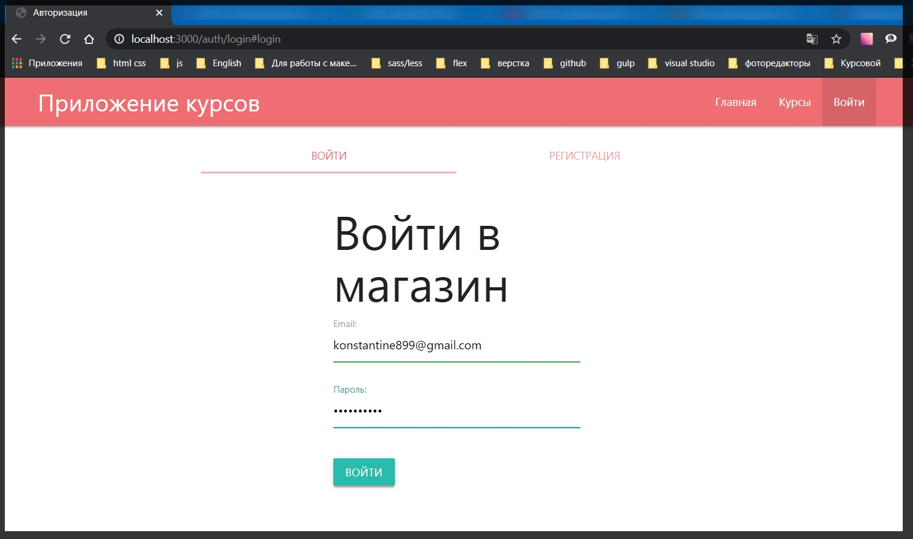
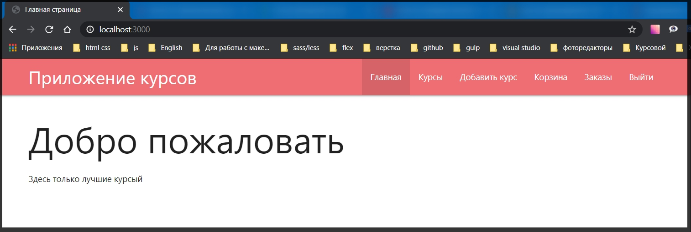
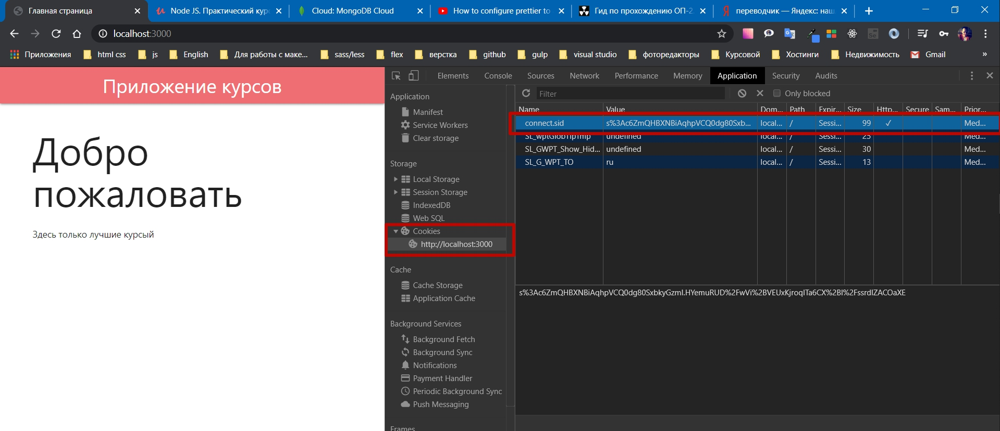

# Сохранение сессии

И оживим страницу логина пока что с временными данными.

Для этого если мы посмотрим в файл **index.js** то увидим что у нас есть **middleware** который мы добавили прямо внутри индексного файла.

```js
app.use(async (req, res, next) => {
  try {
    const user = await User.findById('5eabd3c0cb1946251098ad0e');
    req.user = user;
    next();
  } catch (e) {
    console.log(e);
  }
});
```

Где мы пока что по **id** получаем определенного пользователя. И теперь по сути этот **middleware** больше не нужен. Я его могу закоментировать.
Но я скопирую отсюда логику **const user = await User.findById('5eabd3c0cb1946251098ad0e');**

Далее перехожу в файл **auth.js** и там где мы делаем **login**

```js
router.post('/login', async (req, res) => {
  req.session.isAuthenticated = true;
  res.redirect('/');
});
```

Пока что мы временно будем ждать пока получим определенного пользователя

```js
router.post('/login', async (req, res) => {
  const user = await User.findById('5eabd3c0cb1946251098ad0e');
  req.session.isAuthenticated = true;
  res.redirect('/');
});
```

И после получения пользователя я буду обращаться к **req.session** и в поле **.user =** добавляю нужного пользователя **user**

```js
router.post('/login', async (req, res) => {
  const user = await User.findById('5eabd3c0cb1946251098ad0e');
  req.session.user = user;
  req.session.isAuthenticated = true;
  res.redirect('/');
});
```

Однако сейчас туту есть определенный нюанс. Данные операции могут быть выполнены после того как произойдет **redirect** т.е. они могут не успеть заполнить сессию. И из - за этого если мы сделаем **redirect** на страницу у нас могут быть определенные ошибки.

Поэтому в пакете **express-session** у нас определенный функционал который позволяет нам не получать подобные ошибки. Для этого я обращаюсь к объекту **req.session.save()** и его методу **save**, который в свою очередь принимает **callback** где есть потенциальная ошибка **err => {}**. И в теле **callback** прописываю **if else**. Если есть ошибка то через **throw err** я ее вывожу. А иначе мы будем делать **res.redirect('/').**

```js
router.post('/login', async (req, res) => {
  const user = await User.findById('5eabd3c0cb1946251098ad0e');
  req.session.user = user;
  req.session.isAuthenticated = true;
  req.session.save((err) => {
    if (err) {
      throw err;
    } else {
      res.redirect('/');
    }
  });
});
```

Здесь по аналогии с **distroy** мы так же ждем пока все завершится, и только после этого определяем какой - то функционал. В этом случае это **redirect** на главную страницу.

В index.js где мы создаем временного пользователя

```js
const candidate = await User.findOne(); // поиск пользлвателей
if (!candidate) {
  const user = new User({
    email: '375298918971@mail.ru',
    name: 'Konstantine',
    cart: { items: [] },
  });
  await user.save();
}
```

Коментирую этот код. И тестим.



Ну и конечно же получаю ошибки

```
UnhandledPromiseRejectionWarning: ReferenceError: User is not defined
    at C:\Users\Konstantine\Documents\GitHub\diplom-VSTU\routes\auth.js:19:16
    at Layer.handle [as handle_request] (C:\Users\Konstantine\Documents\GitHub\diplom-VSTU\node_modules\express\lib\router\layer.js:95:5)
    at next (C:\Users\Konstantine\Documents\GitHub\diplom-VSTU\node_modules\express\lib\router\route.js:137:13)
    at Route.dispatch (C:\Users\Konstantine\Documents\GitHub\diplom-VSTU\node_modules\express\lib\router\route.js:112:3)
    at Layer.handle [as handle_request] (C:\Users\Konstantine\Documents\GitHub\diplom-VSTU\node_modules\express\lib\router\layer.js:95:5)
    at C:\Users\Konstantine\Documents\GitHub\diplom-VSTU\node_modules\express\lib\router\index.js:281:22
    at Function.process_params (C:\Users\Konstantine\Documents\GitHub\diplom-VSTU\node_modules\express\lib\router\index.js:335:12)
    at next (C:\Users\Konstantine\Documents\GitHub\diplom-VSTU\node_modules\express\lib\router\index.js:275:10)
    at Function.handle (C:\Users\Konstantine\Documents\GitHub\diplom-VSTU\node_modules\express\lib\router\index.js:174:3)
    at router (C:\Users\Konstantine\Documents\GitHub\diplom-VSTU\node_modules\express\lib\router\index.js:47:12)
    at Layer.handle [as handle_request] (C:\Users\Konstantine\Documents\GitHub\diplom-VSTU\node_modules\express\lib\router\layer.js:95:5)
    at trim_prefix (C:\Users\Konstantine\Documents\GitHub\diplom-VSTU\node_modules\express\lib\router\index.js:317:13)
    at C:\Users\Konstantine\Documents\GitHub\diplom-VSTU\node_modules\express\lib\router\index.js:284:7
    at Function.process_params (C:\Users\Konstantine\Documents\GitHub\diplom-VSTU\node_modules\express\lib\router\index.js:335:12)
    at next (C:\Users\Konstantine\Documents\GitHub\diplom-VSTU\node_modules\express\lib\router\index.js:275:10)
    at C:\Users\Konstantine\Documents\GitHub\diplom-VSTU\node_modules\express\lib\router\index.js:635:15
(node:284) UnhandledPromiseRejectionWarning: Unhandled promise rejection. This error originated either by throwing inside of an async function without a catch block, or by rejecting a promise which was not handled with .catch(). (rejection id: 1)
(node:284) [DEP0018] DeprecationWarning: Unhandled promise rejections are deprecated. In the future, promise rejections that are not handled will terminate the Node.js process with a non-zero exit code.
```

Я в файле **auth.js** не импортировал модель **const User = require('../models/user');**

```js
// routes outh.js
const { Router } = require('express');
const User = require('../models/user');
const router = Router();

router.get('/login', async (req, res) => {
  res.render('auth/login', {
    title: 'Авторизация',
    isLogin: true,
  });
});

router.get('/logout', async (req, res) => {
  req.session.destroy(() => {
    res.redirect('/auth/login#login');
  });
});

router.post('/login', async (req, res) => {
  const user = await User.findById('5eabd3c0cb1946251098ad0e');
  req.session.user = user;
  req.session.isAuthenticated = true;
  req.session.save((err) => {
    if (err) {
      throw err;
    } else {
      res.redirect('/');
    }
  });
});

module.exports = router;
```

Еще раз ввожу данные и получаю **redirect** на главную страницу



Если зайти в инструменты разработчика во вкладку **Application** в поле **Cookies** то увидим интересную строку которая отвечает за сессию.



она действительно зашифрована на основе того секретного ключа который мы передали. Но при этом означает что пакет работает за нас и все делает корректно. Если я обновляю страницу авторизация не спадает и я все еще нахожусь в системе.

Для того что бы приложение работало более корректно. У нас есть **MongoDB** для данного проекта. Необходимо что бы сесси мы хранили в БД. Это повышает защищенность проекта. Злоумышленники могут вломать локальный сайт, но при этом они не могут попасть в БД. Поэтому сессии обычно храняться в БД в том числе для того что бы сохранить определенное количество памяти. Потому что если мы будем хранить все локально, то нам не хватит памяти для приложения. Например если у нас будет не один пользователь как сейчас, а например 100 тыс.