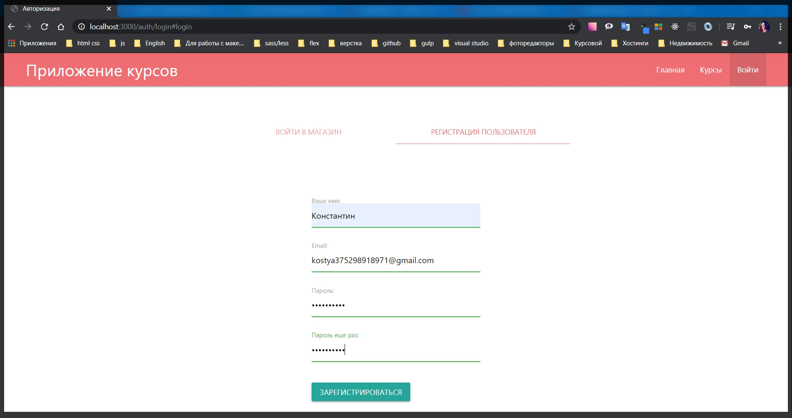
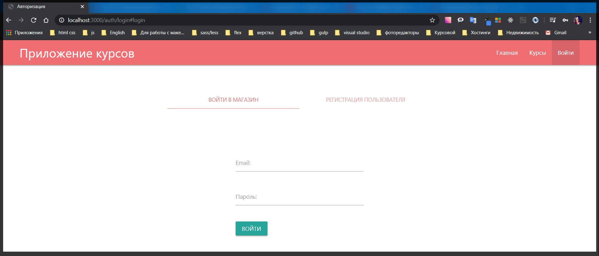

# Регистрация пользователей

Теперь в приложении почти все готово. Настало время реализовывать роуты по авторизации.

И сейчас необходимо реализовать регистрацию для того что бы создавать новых пользователей. Перехожу в **routes auth.js** и создаю **router.post('/register', async (req, res) => {});** это будет асинхронная функция которую мы будем обрабатывать.
Оборачиваю все в блок **try catch** т.е. у нас будет работа с асинхронными методами и поэтому неплохо былобы обработать ошибки.

```js
router.post('/register', async (req, res) => {
  try {
  } catch (e) {
    console.log(e);
  }
});
```
Теперь в **try** необходимо создать нового пользователя на основе тех данных которые мы передаем из формы. 
Все это находится у нас в объекте **req.body**. И отсюда заберем конкретные поля **const { email, possword, repead } = req.body;** Поле **repead** пока что обрабатывать не будем. 

Далее необходимо проверить есть ли у нас такой пользователь с таким **email**. 

Но для этого сначала перейдем в модель пользователя **models user.js** и посмотрим действительно ли мы ему добавляли такое поле.

```js
// models userSchema.js
const { Schema, model } = require('mongoose');

const userSchema = new Schema({
  email: {
    type: String,
    required: true,
  },
  name: {
    type: String,
    required: true,
  },
  cart: {
    items: [
      {
        count: {
          type: Number,
          required: true,
          default: 1,
        },
        courseId: {
          type: Schema.Types.ObjectId,
          ref: 'Course',
          required: true,
        },
      },
    ],
  },
});

userSchema.methods.addToCart = function (course) {
  const items = [...this.cart.items];
  const idx = items.findIndex((c) => {
    return c.courseId.toString() === course._id.toString();
  });

  if (idx >= 0) {
    items[idx].count = items[idx].count + 1;
  } else {
    items.push({
      courseId: course._id,
      count: 1,
    });
  }

  this.cart = { items };
  return this.save();
};

userSchema.methods.removeFromCart = function (id) {
  let items = [...this.cart.items];
  const idx = items.findIndex((c) => c.courseId.toString() === id.toString());

  if (items[idx].count === 1) {
    items = items.filter((c) => c.courseId.toString() !== id.toString());
  } else {
    items[idx].count--;
  }

  this.cart = { items };
  return this.save();
};

userSchema.methods.clearCart = function () {
  this.cart = { items: [] };
  return this.save();
};

module.exports = model('User', userSchema);
```

У него есть поле **email**, name но у него нет поля **password**. Добавляю поле **password**, А поле name делаю просто классом **String**.

```js
// models userSchema.js
const { Schema, model } = require('mongoose');

const userSchema = new Schema({
  email: {
    type: String,
    required: true,
  },
  name: String,
  password: {
    type: String,
    required: true,
  },
  cart: {
    items: [
      {
        count: {
          type: Number,
          required: true,
          default: 1,
        },
        courseId: {
          type: Schema.Types.ObjectId,
          ref: 'Course',
          required: true,
        },
      },
    ],
  },
});

userSchema.methods.addToCart = function (course) {
  const items = [...this.cart.items];
  const idx = items.findIndex((c) => {
    return c.courseId.toString() === course._id.toString();
  });

  if (idx >= 0) {
    items[idx].count = items[idx].count + 1;
  } else {
    items.push({
      courseId: course._id,
      count: 1,
    });
  }

  this.cart = { items };
  return this.save();
};

userSchema.methods.removeFromCart = function (id) {
  let items = [...this.cart.items];
  const idx = items.findIndex((c) => c.courseId.toString() === id.toString());

  if (items[idx].count === 1) {
    items = items.filter((c) => c.courseId.toString() !== id.toString());
  } else {
    items[idx].count--;
  }

  this.cart = { items };
  return this.save();
};

userSchema.methods.clearCart = function () {
  this.cart = { items: [] };
  return this.save();
};

module.exports = model('User', userSchema);
```

Т.к. у нас появилось еще одно поле имени в файле **views auth login.hbs** добавим еще одно поле для Имени.

```js
<div class="input-field"><input id="name" name="name" type="text" class="validate"required />
                    <label for="name">Ваше имя:</label>
                    <span class="helper-text" data-error="Введите имя"></span>
                </div>
```

Полный

```js
{{!-- view auth login.hbs --}}

<div class="auth">
    <div class="row">
        <div class="col s12">
            <ul class="tabs">
                <li class="tab col s6"><a class="active" href="#login">Войти в магазин</a></li>
                <li class="tab col s6"><a href="#register">Регистрация пользователя</a></li>

            </ul>
        </div>
        <div id="login" class="col s6 offset-s3">
            {{!-- <h1>Войти в магазин</h1> --}}
            <form class="form" action="/auth/login" method="POST">
                <div class="input-field">
                    <input id="email" name="email" type="email" class="validate" required />
                    <label for="email">Email:</label>
                    <span class="helper-text" data-error="Введите email"></span>
                </div>

                <div class="input-field"><input id="password" name="password" type="password" class="validate"
                        required />
                    <label for="password">Пароль:</label>
                    <span class="helper-text" data-error="Введите пароль"></span>
                </div>

                <button class="btn btn-primary" type="submit">Войти</button>
            </form>

        </div>
        <div id="register" class="col s6 offset-s3">
            {{!-- <h1>Регистрация пользователя</h1> --}}
            <form class="form" action="/auth/register" method="POST">

                <div class="input-field"><input id="name" name="name" type="text" class="validate" required />
                    <label for="name">Ваше имя:</label>
                    <span class="helper-text" data-error="Введите имя"></span>
                </div>

                <div class="input-field">
                    <input id="remail" name="email" type="email" class="validate" required />
                    {{!-- Для того что бы небыло конфликтов прописываю remail меняю только id и for --}}
                    <label for="remail">Email:</label>
                    <span class="helper-text" data-error="Введите email"></span>
                </div>

                <div class="input-field"><input id="rpassword" name="password" type="password" class="validate"
                        required />{{!-- меняю только id и for --}}
                    <label for="rpassword">Пароль:</label>
                    <span class="helper-text" data-error="Введите пароль"></span>
                </div>

                <div class="input-field"><input id="confirm" name="confirm" type="password" class="validate"
                        required />{{!-- меняю только id и for --}}
                    <label for="confirm">Пароль еще раз:</label>
                    <span class="helper-text" data-error="Введите пароль"></span>
                </div>


                <button class="btn btn-primary" type="submit">Зарегистрироваться</button>
            </form>
        </div>
    </div>
</div>
```
Соответственно в методе **post** мы так же будем получать определенное имя

```js
router.post('/register', async (req, res) => {
  try {
    const { email, possword, repead, name } = req.body;
  } catch (e) {
    console.log(e);
  }
});
```

Посути мы добавили только поле **password** для модели пользователя.

Теперь следует проверить сущестрвует ли такой пользователь с **email** который мы ввели, и если существует то тогда нам надо выдать ошибку о том что такой **email** уже зарегистрирован. Потому что у нас может быть уникальный только **email**.

Для этого я создаю переменную **candidate = await** обращаюсь к модели пользователя **User** вызываю метод который называется **findOne({})** потому что у нас может быть найден только один пользователь. В качестве объекта которого передаю **email**.

```js
router.post('/register', async (req, res) => {
  try {
    const { email, possword, repead, name } = req.body;
    const candidate = await User.findOne({ email });
  } catch (e) {
    console.log(e);
  }
});
```

И дальше пишу проверку. Если **if** у нас есть переменная **(candidate)** то тогда нам нужно выдать ошибку. И пока я буду делать редирект на ту же страницу.

```js
router.post('/register', async (req, res) => {
  try {
    const { email, possword, repead, name } = req.body;
    const candidate = await User.findOne({ email });
    if (candidate) {
      res.redirect('/auth/login#register');
    }
  } catch (e) {
    console.log(e);
  }
});
```

Чуть позде по данному блоку я добавлю возможность добавлять какие - то ошибки которые будут говорить пользователю что происходит.

И в **else** если кондидата у нас нет, такого пользователя мы не нашли в БД то в таком случае нам необходимо его создать. Т.е. по сути сделать регистрацию. Для этого создаю переменную **const user =** которую создам через класс new **User({})** Куда передаю необходимые поля **email, name, password** ключи и значения совпадают по этому я могу оставить в таком виде.

После этого нужно подождать пока пользователь сохранится **await.user.save()**. И когда пользователь будет создан мы можем сделать **res.redirect('/auth/login#login')**.

```js
router.post('/register', async (req, res) => {
  try {
    const { email, possword, repead, name } = req.body;
    const candidate = await User.findOne({ email });
    if (candidate) {
      res.redirect('/auth/login#register');
    } else {
      const user = new User({
        email,
        name,
        password,
      });
      await user.save();
      res.redirect('/auth/login#login');
    }
  } catch (e) {
    console.log(e);
  }
});
```

Проверяю будет ли создан новый пользователь. В **MongoDB** удаляю всех пользователей потому что у нас во первых не полные поля.

Единственное что я забыл сделать это то что нужно добавить корзину по умолчанию которая будет являться объектом **items** который будет принимать пустой массив **cart: { items: [] },**

```js
router.post('/register', async (req, res) => {
  try {
    const { email, possword, repead, name } = req.body;
    const candidate = await User.findOne({ email });
    if (candidate) {
      res.redirect('/auth/login#register');
    } else {
      const user = new User({
        email,
        name,
        password,
        cart: { items: [] },
      });
      await user.save();
      res.redirect('/auth/login#login');
    }
  } catch (e) {
    console.log(e);
  }
});
```

Полный

```js
// routes outh.js
const { Router } = require('express');
const User = require('../models/user');
const router = Router();

router.get('/login', async (req, res) => {
  res.render('auth/login', {
    title: 'Авторизация',
    isLogin: true,
  });
});

router.get('/logout', async (req, res) => {
  req.session.destroy(() => {
    res.redirect('/auth/login#login');
  });
});

router.post('/login', async (req, res) => {
  const user = await User.findById('5eabd3c0cb1946251098ad0e');
  req.session.user = user;
  req.session.isAuthenticated = true;
  req.session.save((err) => {
    if (err) {
      throw err;
    } else {
      res.redirect('/');
    }
  });
});

router.post('/register', async (req, res) => {
  try {
    const { email, password, repead, name } = req.body;
    const candidate = await User.findOne({ email });
    if (candidate) {
      res.redirect('/auth/login#register');
    } else {
      const user = new User({
        email,
        name,
        password,
        cart: { items: [] },
      });
      await user.save();
      res.redirect('/auth/login#login');
    }
  } catch (e) {
    console.log(e);
  }
});

module.exports = router;

```





Сразу обращу внимание что пароль храниться в не ашифрованом виде и такое вообще не допустимо. Потому что любой пользователь сможет увидить ваш пароль и по сути воспользоваться этим акаунтом. Безусловно мы это будем фиксить, шифровать пароль причем без возрата шифрования т.е. однонаправленное шифрование. Но переж этим необходимо реализовать функционал страницы **login** потому что там мы так же будем обращаться к шифрованию пароля.
