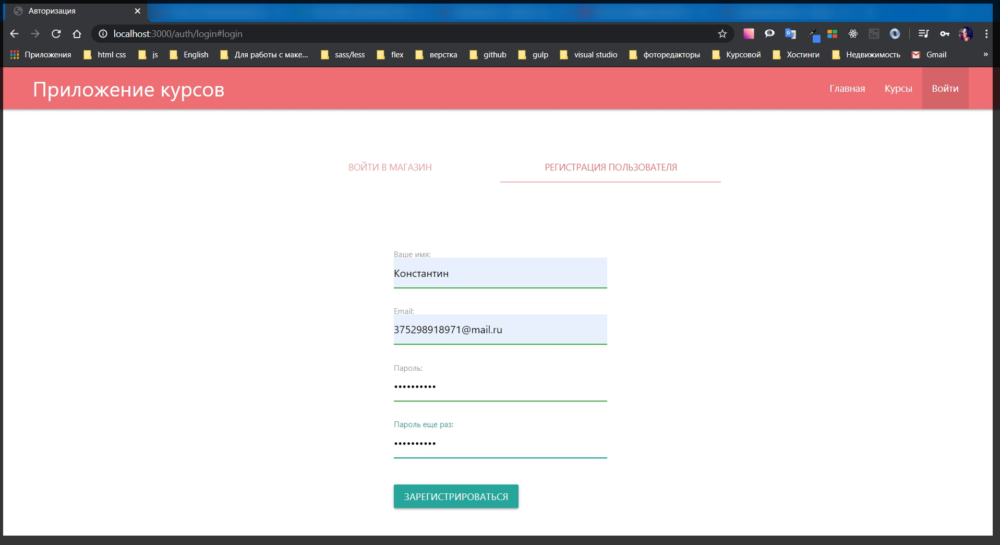

# Шифрование пароля

Для этого нужно установить новый пакет который будет это делать

```
npm install bcryptjs
```

Теперь в файле **auth.js** подключаю его. **const bcrypt = require('bcryptjs');**

В первую очередь пароль необходимо шифровать когда мы создаем нового пользователя. И делается это в методе **register**.

```js
router.post('/register', async (req, res) => {
  try {
    const { email, password, repead, name } = req.body;
    const candidate = await User.findOne({ email });
    if (candidate) {
      res.redirect('/auth/login#register');
    } else {
      const user = new User({
        email,
        name,
        password,
        cart: { items: [] },
      });
      await user.save();
      res.redirect('/auth/login#login');
    }
  } catch (e) {
    console.log(e);
  }
});
```

И здесь где мы создаем нового пользователя мы будем пердавать не объект **password** а тот пароль который мы получим путем шифрования.

для этого создаю новую переменную **const hashPassword =** и далее обращусь к библиотеке **bcrypt** и вызову его метод который называется **hash()**, В принципе мы могли использовать **hashSync()**, однако лучше использовать асинхронный метод для того что бы была возможность возвращать промисы. И первым параметром передаю объект **const hashPassword = bcrypt.hash(password, );** вторым параметром передаю некоторый объект **salt** и он может быть либо строкой, либо каким то числом т.е. это дополнительная строка рандомная которая позволяет более сложно зашифровать пароль. И чем больше будет данная строка тем сложнее будет взломать этот пароль. Но стоит учитывать что чем больше символов мы впишем тем соответственно дольше будет происходить шифрование. Оптимально выбирать **10** или **12**. **const hashPassword = bcrypt.hash(password, 10);** И метод **hash** возвращает промис поэтому нужно подождать **const hashPassword = await bcrypt.hash(password, 10);**

И сейчас в качестве пароля я буду передавать именно **password: hashPassword**,

```js
router.post('/register', async (req, res) => {
  try {
    const { email, password, repead, name } = req.body;
    const candidate = await User.findOne({ email });
    if (candidate) {
      res.redirect('/auth/login#register');
    } else {
      const hashPassword = await bcrypt.hash(password, 10);
      const user = new User({
        email,
        name,
        password: hashPassword,
        cart: { items: [] },
      });
      await user.save();
      res.redirect('/auth/login#login');
    }
  } catch (e) {
    console.log(e);
  }
});
```

я что бы каждый раз не придумывать нового пользователя удаляю одного и того же с БД. Тестим.



Еще одно из важнейших условий. Если я сейчас зарегистрирую пользователя и попробую войти под его **email** и паролем, то ничего не получится. Для того что бы войти придеться вводить зашифрованый пароль из БД. Что естественно не приемлемо. 

Для того что бы пользователь вводил тот пароль что указывал при регистрации в методе логина где у нас определяется метод **areSame** т.е.  **const areSame = password === candidate.password;**

```js
const { Router } = require('express');
const bcrypt = require('bcryptjs');
const User = require('../models/user');
const router = Router();

router.get('/login', async (req, res) => {
  res.render('auth/login', {
    title: 'Авторизация',
    isLogin: true,
  });
});

router.get('/logout', async (req, res) => {
  req.session.destroy(() => {
    res.redirect('/auth/login#login');
  });
});

router.post('/login', async (req, res) => {
  try {
    const { email, password } = req.body;
    const candidate = await User.findOne({ email });

    if (candidate) {
      const areSame = password === candidate.password;

      if (areSame) {
        req.session.user = candidate;
        req.session.isAuthenticated = true;
        req.session.save((err) => {
          if (err) {
            throw err;
          }
          res.redirect('/');
        });
      } else {
        res.redirect('/auth/login#login');
      }
    } else {
      res.redirect('/auth/login#login');
    }
  } catch (e) {
    console.log(e);
  }
});

router.post('/register', async (req, res) => {
  try {
    const { email, password, repeat, name } = req.body;
    const candidate = await User.findOne({ email });

    if (candidate) {
      res.redirect('/auth/login#register');
    } else {
      const hashPassword = await bcrypt.hash(password, 10);
      const user = new User({
        email,
        name,
        password: hashPassword,
        cart: { items: [] },
      });
      await user.save();
      res.redirect('/auth/login#login');
    }
  } catch (e) {
    console.log(e);
  }
});

module.exports = router;
```

Здесь **const areSame = password === candidate.password;** вместо того что бы сравнивать две строки в простом формате **password === candidate.password;** удаляю это. Далее так же обращаюсь к библиотеке **bcrypt** и вызову метод  который называется **.compare()** он так же является асинхронным по этому не забываю прописывать **await**. **const areSame = await bcrypt.compare();** Где первым параметром я передаю **password**, и вторым параметром передаю пароль который у нас сохранен в БД т.е. **candidate.password**. **const areSame = await bcrypt.compare(password, candidate.password);**

```js
const { Router } = require('express');
const bcrypt = require('bcryptjs');
const User = require('../models/user');
const router = Router();

router.get('/login', async (req, res) => {
  res.render('auth/login', {
    title: 'Авторизация',
    isLogin: true,
  });
});

router.get('/logout', async (req, res) => {
  req.session.destroy(() => {
    res.redirect('/auth/login#login');
  });
});

router.post('/login', async (req, res) => {
  try {
    const { email, password } = req.body;
    const candidate = await User.findOne({ email });

    if (candidate) {
      const areSame = await bcrypt.compare(password, candidate.password);

      if (areSame) {
        req.session.user = candidate;
        req.session.isAuthenticated = true;
        req.session.save((err) => {
          if (err) {
            throw err;
          }
          res.redirect('/');
        });
      } else {
        res.redirect('/auth/login#login');
      }
    } else {
      res.redirect('/auth/login#login');
    }
  } catch (e) {
    console.log(e);
  }
});

router.post('/register', async (req, res) => {
  try {
    const { email, password, repeat, name } = req.body;
    const candidate = await User.findOne({ email });

    if (candidate) {
      res.redirect('/auth/login#register');
    } else {
      const hashPassword = await bcrypt.hash(password, 10);
      const user = new User({
        email,
        name,
        password: hashPassword,
        cart: { items: [] },
      });
      await user.save();
      res.redirect('/auth/login#login');
    }
  } catch (e) {
    console.log(e);
  }
});

module.exports = router;
```

И теперь при входе в систему если я напишу какой - то рандомный пароль, то страница логина обновляется. Если я ввожу пароль который указал при регистрации то успешно вхожу в систему.

Сейчас в приложении есть определенные проблемы связанные с уязвимостями. Т.е. безусловно мы сейчас храним сессии в БД. Однако у злоумышленников есть определенные методы. Например ссылки из **email** которые позволяют перехватывать подобныее сессии.
И для этого есть отдельный инструмент который я могу так же подключить к нашему приложению который позволит сделать уникальным наше приложение
