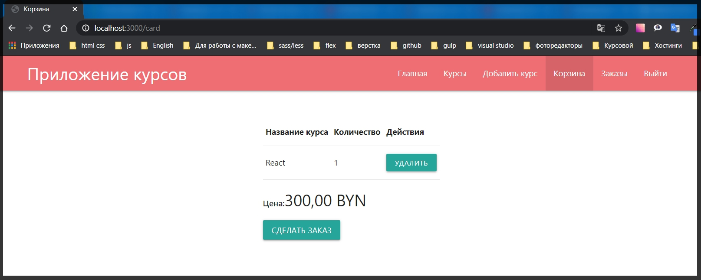
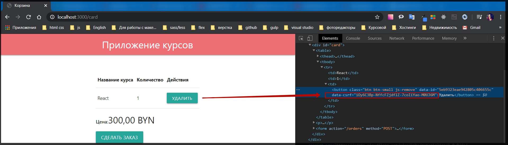
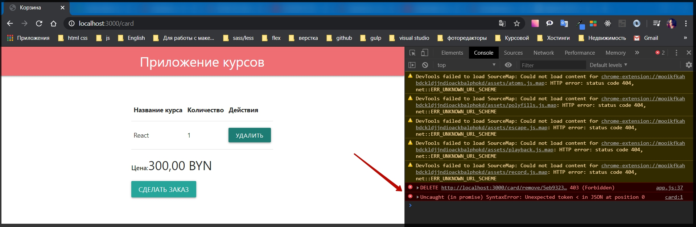
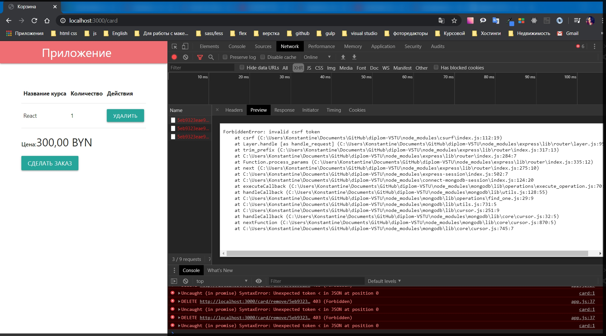
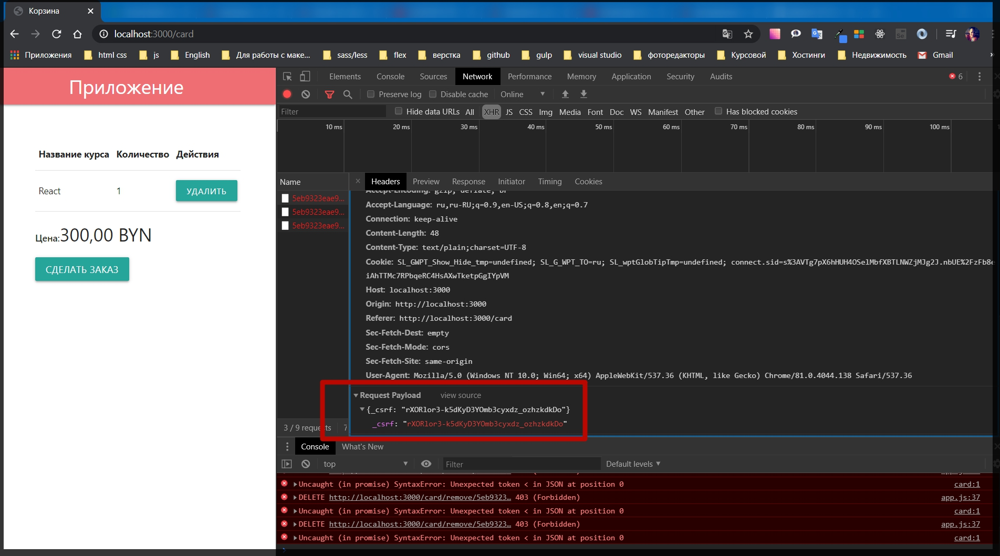
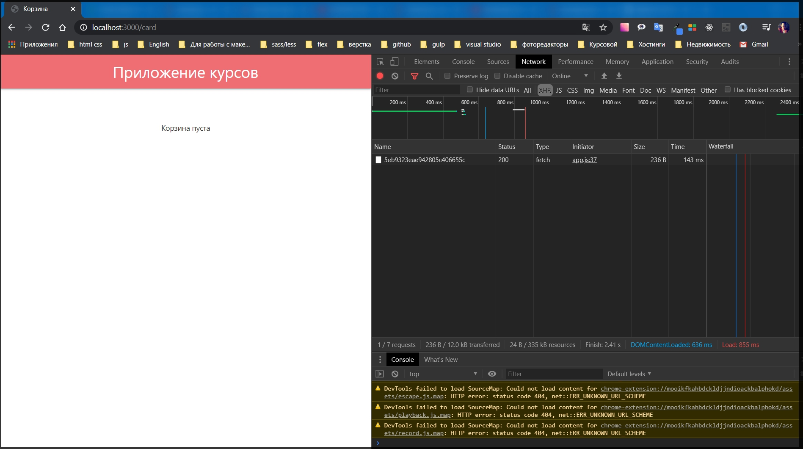

# Добавление CSRF-защиты

Установливаю пакет

```
npm install csurf
```

Данный пакет у нас будет защищать весь **front - end** и сравнивать с определенной переменной. Но для этого придеться немного отрефакторить все формы которые присутствуют у нас в приложении.

Для начало перехожу в **index.js** и подключаю данный пакет **const csrf = require('csurf');** она возвращает функцию. Поэтому ее мы должны добавить как **middleware** для нашего приложения сразуже после того как мы добавили функционал сессии т.е. после этого блока кода. Но для начало должна идти именно сессия.

```js
app.use(
  session({
    secret: 'some secret value',
    resave: false,
    saveUninitialized: false,
    store,
  })
);
```

Добавляю **app.use(csrf());** и в принципе этого достаточно.

```js
app.use(csrf()); // подключаю к middleware но только после того как отработает сессия
app.use(warMiddleware);
app.use(userMiddleware);
```

Если я сейчас попробую к примеру отредактировать курс то в браузере появится ошибка **ForbiddenError: invalid csrf token**. И действительно он сейчас не валидный потому что у нас добавлен новый **middleware** который проверяет наличие данного токена, но при этом его у нас еще нигде нет.

И для этого необходимо обработать все наши формы в приложении.

По сути вся идея сводится к тому что бы мы добавляли к каждой форме новый определенный **input** типа **hidden** куда мы будем добавлять специальное название переменной которая будет проверять **middleware**. И в качестве значения мы будем передавать сгенерированный токен. И для того что бы создать такие **input** - ты нам необходимо передавать на клиента эти данные.

Для этого в папке **middleware variables.js** и здесь также добавляю к объекту **res.locals** переменную которую могу называть как угодно, допустим я назову ее **csrf =** и ее я получаю их объекта **req.** у которого сейчас появился новый метод который называется **csrfToken().**

```js
// middleware variables.js
module.exports = function (req, res, next) {
  res.locals.isAuth = req.session.isAuthenticated;
  res.locals.csrf = req.csrfToken();
  next();
};
```

Теперь данную переменную **csrf** необходимо добавлять к формам. Перехожу в папку **views** в **login.hbs** и добавляю

```js
<input type="hidden" name="_csrf" value="{{csrf}}">

**name**- даю специальное название. Именно на данное название будет смотреть middleware и автоматически делать все за нас

**value** - передаю переменную
```

И теперь данный input нужно добавить ко всем формам которые обрабатывают post запрос.

```js
{{!-- view auth login.hbs --}}

<div class="auth">
    <div class="row">
        <div class="col s12">
            <ul class="tabs">
                <li class="tab col s6"><a class="active" href="#login">Войти в магазин</a></li>
                <li class="tab col s6"><a href="#register">Регистрация пользователя</a></li>

            </ul>
        </div>
        <div id="login" class="col s6 offset-s3">
            {{!-- <h1>Войти в магазин</h1> --}}
            <form class="form" action="/auth/login" method="POST">
                <div class="input-field">
                    <input id="email" name="email" type="email" class="validate" required />
                    <label for="email">Email:</label>
                    <span class="helper-text" data-error="Введите email"></span>
                </div>

                <div class="input-field"><input id="password" name="password" type="password" class="validate"
                        required />
                    <label for="password">Пароль:</label>
                    <span class="helper-text" data-error="Введите пароль"></span>
                </div>

                <input type="hidden" name="_csrf" value="{{csrf}}">

                <button class="btn btn-primary" type="submit">Войти</button>
            </form>

        </div>
        <div id="register" class="col s6 offset-s3">
            {{!-- <h1>Регистрация пользователя</h1> --}}
            <form class="form" action="/auth/register" method="POST">

                <div class="input-field"><input id="name" name="name" type="text" class="validate" required />
                    <label for="name">Ваше имя:</label>
                    <span class="helper-text" data-error="Введите имя"></span>
                </div>


                <div class="input-field">
                    <input id="remail" name="email" type="email" class="validate" required />
                    {{!-- Для того что бы небыло конфликтов прописываю remail меняю только id и for --}}
                    <label for="remail">Email:</label>
                    <span class="helper-text" data-error="Введите email"></span>
                </div>

                <div class="input-field"><input id="rpassword" name="password" type="password" class="validate"
                        required />{{!-- меняю только id и for --}}
                    <label for="rpassword">Пароль:</label>
                    <span class="helper-text" data-error="Введите пароль"></span>
                </div>

                <div class="input-field"><input id="confirm" name="confirm" type="password" class="validate"
                        required />{{!-- меняю только id и for --}}
                    <label for="confirm">Пароль еще раз:</label>
                    <span class="helper-text" data-error="Введите пароль"></span>
                </div>

                <input type="hidden" name="_csrf" value="{{csrf}}">

                <button class="btn btn-primary" type="submit">Зарегистрироваться</button>
            </form>
        </div>
    </div>
</div>
```

```js
<div class="row">
  <h1>
    Добавить новый курс
  </h1>
  <form class="form" action="/add" method="POST">
    <div class="input-field">
      <input id="title" name="title" type="text" class="validate" required />
      <label for="title">
        Название курса
      </label>
      <span class="helper-text" data-error="Введите название курса"></span>
    </div>
    <div class="input-field">
      <input id="price" name="price" type="number" class="validate" required min="1" />
      <label for="price">
        Цена курса
      </label>
      <span class="helper-text" data-error="Введите цену"></span>
    </div>
    <div class="input-field">
      <input id="img" name="img" type="text" class="validate" required />
      <label for="img">
        URL картинки
      </label>
      <span class="helper-text" data-error="Введите url картинки"></span>
    </div>

    <input type="hidden" name="_csrf" value="{{csrf}}">

    <button class="btn btn-primary">
      Добавить курс
    </button>
  </form>
</div>
```

```js
{{!  views card.hbs }}
<h1>Корзина</h1>
<div id="card">
  {{#if courses.length}}
  <table>
    <thead>
      <tr>
        <th>
          Название курса
        </th>
        <th>
          Количество
        </th>
        <th>
          Действия
        </th>
      </tr>
    </thead>

    <body>
      {{#each courses}}
      <tr>
        <td>
          {{title}}
        </td>
        <td>
          {{count}}
        </td>
        <td>
          <button class="btn btn-small js-remove" data-id="{{id}}">Удалить</button>
        </td>
      </tr>
      {{/each}}
    </body>
  </table>
  <p>
    <strong>Цена:</strong><span class="price">{{price}}</span>
  </p>

  <form action="/orders" method="POST">
  <input type="hidden" name="_csrf" value="{{csrf}}">
    <button type="submit" class="btn">Сделать заказ</button>
  </form>

  {{else}}
  <p>Корзина пуста</p>
  {{/if}}
</div>
```

```js
{{! courses-edit.hbs  }}
<div class="row">
  <h1>Редактировать{{course.title}}</h1>
  <form action="/courses/edit" method="POST" class="course-form">
    <div class="input-field">
      <input id="title" name="title" type="text" class="validate" required value="{{course.title}}" />
      <label for="title">Название курса</label>
      <span class="helper-text" data-error="Введите название курса"></span>
    </div>
    <div class="input-field">
      <input id="price" name="price" type="number" class="validate" required min="1" value="{{course.price}}" />
      <label for="price">Цена курса</label>
      <span class="helper-text" data-error="Введите цену"></span>
    </div>
    <div class="input-field">
      <input id="img" name="img" type="text" class="validate" required value="{{course.img}}" />
      <label for="img">URL картинки</label>
      <span class="helper-text" data-error="Введите url картинки"></span>
    </div>
    <input type="hidden" name="id" value="{{course.id}}" />
    <input type="hidden" name="_csrf" value="{{csrf}}">
    <button type="submit" class="btn btn-primary">Редактировать курс</button>
  </form>
  <form action="/courses/remove" method="POST">
    <input type="hidden" name="id" value="{{course.id}}" />
    <input type="hidden" name="_csrf" value="{{csrf}}">
    <button class="btn red">Удалить курс</button>
  </form>
</div>
```

Но если добавить данный **input** в **courses.hbs** то при попытке купить у меня происходила ошибка. Все дело в том что в этом файле мы делаем итерацию в цикле **each** и поэтому **handlebars** смотрит именно на объекты массива. Поэтому в **value** к переменной необходимо обратиться через **@root.csrf**. Как я делал это с авторизацией **{{#if @root.isAuth}}**

```js
{{! courses.hbs }}

{{#if courses.length}}
{{#each courses}}
<div class="row">
  <div class="col s12 m7">
    <div class="card">

      <div class="card-image">
        
      </div>

      <div class="card-content">
        <span class="card-title">{{title}}</span>
        <p class="price">{{price}}</p>
      </div>

      <div class="card-action actions">
        <a href="/courses/{{id}}" target="_blank" target="_blank">Открыть курс</a>
        {{#if @root.isAuth}}
        <a href="/courses/{{id}}/edit?allow=true">Редактировать</a>
        <form action="/card/add" method="POST">
          <input type="hidden" name="_csrf" value="{{@root.csrf}}">
          <input type="hidden" name="id" value="{{id}}" />
          <button type="submit" class="btn btn-primary">Купить</button>
        </form>
        {{/if}}
      </div>

    </div>
  </div>
</div>
{{/each}}
{{else}}
<p>Курсы пока не добавлены</p>
{{/if}}
```

Теперь все должно работать корректно.



Но при удалении курса опять ошибка

```
ForbiddenError: invalid csrf token
at csrf (C:\Users\Konstantine\Documents\GitHub\diplom-VSTU\node_modules\csurf\index.js:112:19)
at Layer.handle [as handle_request] (C:\Users\Konstantine\Documents\GitHub\diplom-VSTU\node_modules\express\lib\router\layer.js:95:5)
```

Удаление я происходит через **AJAX**. Поэтому перехожу в **app.js**. И вот здесь я делаю асинхронный запрос. **fetch('/card/remove/' + id, {method: 'delete',})**

```js
fetch('/card/remove/' + id, {
  method: 'delete',
})
  .then((res) => res.json())
  .then((card) => {
    if (card.courses.length) {
      const html = card.courses
        .map((c) => {
          return `
                <tr>
                  <td>${c.title}</td>
                  <td>${c.count}</td>
                  <td>
                    <button class="btn btm-small js-remove" data-id="${c.id}">Удалить</button>
                  </td>
                </tr>
                `;
        })
        .join('');
      $card.querySelector('tbody').innerHTML = html;
      $card.querySelector('.price').textContent = toCurrency(card.price);
    } else {
      $card.innerHTML = '<p>Корзина пуста</p>';
    }
  });
```

И добавлю хдесь объект **body:** и с помощью метода **JSON.stringify({})** застрингифаеть объект. Он у нас называется **\_csrf:**.

```js
fetch('/card/remove/' + id, {
  method: 'delete',
  body: JSON.stringify({
    _csrf: '',
  }),
});
```

И в качестве значения мы должны передать данный секретный токен. Для этого необходимо исправить шаблон.

Перехожу **views card.hbs** и в кнопке удалить в качестве атрибута понадобится еще одно поле **data-csrf="{{@root.csrf}}"** которую получим из переменной **csrf** которую в свою очередь забираю у объекта **@root**

```js
{{!  views card.hbs }}
<div id="card">
  {{#if courses.length}}
  <table>
    <thead>
      <tr>
        <th>Название курса</th>
        <th>Количество</th>
        <th>Действия</th>
      </tr>
    </thead>

    <body>
      {{#each courses}}
      <tr>
        <td>{{title}}</td>
        <td>{{count}}</td>
        <td>
          <button class="btn btn-small js-remove" data-id="{{id}}" data-csrf="{{@root.csrf}}">Удалить</button>
        </td>
      </tr>
      {{/each}}
    </body>
  </table>
  <p>
    <strong>Цена:</strong><span class="price">{{price}}</span>
  </p>

  <form action="/orders" method="POST">
  <input type="hidden" name="_csrf" value="{{csrf}}">
    <button type="submit" class="btn">Сделать заказ</button>
  </form>

  {{else}}
  <p>Корзина пуста</p>
  {{/if}}
</div>
```

Теперь убеждаюсь в том что он доступен. Проинспектирую кнопку.



Теперь данный объект **data-csrf="iOy6C3Bp-NffcFZjdflZ-7coIiYao-M0UJ6M"** необходимо забрать из шаблона.

Для этого в **app.js** создаю переменную **const csrf =** из поля **event.target.dataset.csrf**. **const csrf = event.target.dataset.csrf;**
и передаю в качестве значения **_csrf: csrf**,

```js
// public app.js

const toCurrency = (price) => {
  return new Intl.NumberFormat('ru-RU', {
    currency: 'BYN',
    style: 'currency',
  }).format(price);
};

const toDate = (date) => {
  return new Intl.DateTimeFormat('ru-RU', {
    day: '2-digit',
    month: 'long',
    year: 'numeric',
    hour: '2-digit',
    minute: '2-digit',
    second: '2-digit',
  }).format(new Date(date));
};

document.querySelectorAll('.price').forEach((node) => {
  node.textContent = toCurrency(node.textContent);
});

document.querySelectorAll('.date').forEach((node) => {
  node.textContent = toDate(node.textContent);
});

const $card = document.querySelector('#card');

if ($card) {
  $card.addEventListener('click', (event) => {
    if (event.target.classList.contains('js-remove')) {
      const id = event.target.dataset.id;
      const csrf = event.target.dataset.csrf;

      fetch('/card/remove/' + id, {
        method: 'delete',
        body: JSON.stringify({
          _csrf: csrf,
        }),
      })
        .then((res) => res.json())
        .then((card) => {
          if (card.courses.length) {
            const html = card.courses
              .map((c) => {
                return `
                <tr>
                  <td>${c.title}</td>
                  <td>${c.count}</td>
                  <td>
                    <button class="btn btm-small js-remove" data-id="${c.id}">Удалить</button>
                  </td>
                </tr>
                `;
              })
              .join('');
            $card.querySelector('tbody').innerHTML = html;
            $card.querySelector('.price').textContent = toCurrency(card.price);
          } else {
            $card.innerHTML = '<p>Корзина пуста</p>';
          }
        });
    }
  });
}

M.Tabs.init(document.querySelectorAll('.tabs'));
```

Теперь при удалении получаю сообщение об ошибке



Причем их две ошибки. Если посмотреть в **Network** то к нам прилетает не **JSON** а какой - то текст.



Если посмотреть в **Request Payload** то мы действительно передаем данный токен.



Тогда нужно попробовать другой вариант.

Для этого в **app.js** удаляю ранее написанный код **body: JSON.stringify({ _csrf: csrf,}),**

```js
fetch('/card/remove/' + id, {
  method: 'delete',
  // body: JSON.stringify({ этот код удаляю
  //   _csrf: csrf,
  // }),
});
```

И вместо него добавлю хедеры, т.е. можно по разному это передавать. **headers:{}**. В качестве хедера передаю **'X-XSRF-TOKEN':** и в качестве значения **csrf**

```js
fetch('/card/remove/' + id, {
  method: 'delete',
  headers: {
    'X-XSRF-TOKEN': csrf,
  },
});
```
```js
// public app.js

const toCurrency = (price) => {
  return new Intl.NumberFormat('ru-RU', {
    currency: 'BYN',
    style: 'currency',
  }).format(price);
};

const toDate = (date) => {
  return new Intl.DateTimeFormat('ru-RU', {
    day: '2-digit',
    month: 'long',
    year: 'numeric',
    hour: '2-digit',
    minute: '2-digit',
    second: '2-digit',
  }).format(new Date(date));
};

document.querySelectorAll('.price').forEach((node) => {
  node.textContent = toCurrency(node.textContent);
});

document.querySelectorAll('.date').forEach((node) => {
  node.textContent = toDate(node.textContent);
});

const $card = document.querySelector('#card');

if ($card) {
  $card.addEventListener('click', (event) => {
    if (event.target.classList.contains('js-remove')) {
      const id = event.target.dataset.id;
      const csrf = event.target.dataset.csrf;

      fetch('/card/remove/' + id, {
        method: 'delete',
        headers: {
          'X-XSRF-TOKEN': csrf,
        },
      })
        .then((res) => res.json())
        .then((card) => {
          if (card.courses.length) {
            const html = card.courses
              .map((c) => {
                return `
                <tr>
                  <td>${c.title}</td>
                  <td>${c.count}</td>
                  <td>
                    <button class="btn btm-small js-remove" data-id="${c.id}">Удалить</button>
                  </td>
                </tr>
                `;
              })
              .join('');
            $card.querySelector('tbody').innerHTML = html;
            $card.querySelector('.price').textContent = toCurrency(card.price);
          } else {
            $card.innerHTML = '<p>Корзина пуста</p>';
          }
        });
    }
  });
}

M.Tabs.init(document.querySelectorAll('.tabs'));
```


Теперь данное приложение является полностью защищенным.
