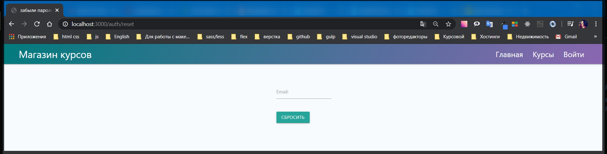

# Восстановление пароля.

Хорошей практикой является добавление кнопки забыли пароль. Здесь логика не совсем стандартная.

В папке **auth** создаю новый файл **reset.hbs** контент данной страницы будет похож со страницей логина.

```js
{{!-- view auth reset.hbs --}}

< class="auth">


    <div class="col s6 offset-s3">

        {{#if error}}
        <p class="alert">{{error}}</p>
        {{/if}}

        <form class="form" action="/auth/reset" method="POST">
            <div class="input-field">
                <input id="email" name="email" type="email" class="validate" required />
                <label for="email">Email:</label>
                <span class="helper-text" data-error="Введите email"></span>
            </div>

            <input type="hidden" name="_csrf" value="{{csrf}}">

            <button class="btn btn-primary" type="submit">Сбросить</button>
        </form>
    </div>
```

Далее перехожу в **routes auth.js**. В самом низу документа я обращаюсь к **router.get('/reset', (req, res) => {});**
В теле **callback** делаю **res.render('auth/reset', {});** И в объекте как обычно укажу определенные параметры. **title: 'забыли пароль?'** и следующее поле ошибки **error:** которое достаю из **req.flash('error')**.

```js
router.get('/reset', (req, res) => {
  res.render('auth/reset', {
    title: 'забыли пароль?',
    error: req.flash('error'),
  });
});

module.exports = router;
```

Далее реализую **post** запрос. **router.post('/reset', (req, res) => {});**

Теперь можно посмотреть как это работает. Единственное что нужно добавить ссылку на страницу логина. **views auth login.js**

```js
{{!-- view auth login.hbs --}}

<div class="auth">
    <div class="row">
        <div class="col s12">
            <ul class="tabs">
                <li class="tab col s6"><a class="active" href="#login">Войти в магазин</a></li>
                <li class="tab col s6"><a href="#register">Регистрация пользователя</a></li>

            </ul>
        </div>
        <div id="login" class="col s6 offset-s3">

            {{#if loginError}}
            <p class="alert">{{loginError}}</p>
            {{/if}}

            {{!-- <h1>Войти в магазин</h1> --}}
            <form class="form" action="/auth/login" method="POST">
                <div class="input-field">
                    <input id="email" name="email" type="email" class="validate" required />
                    <label for="email">Email:</label>
                    <span class="helper-text" data-error="Введите email"></span>
                </div>

                <div class="input-field"><input id="password" name="password" type="password" class="validate"
                        required />
                    <label for="password">Пароль:</label>
                    <span class="helper-text" data-error="Введите пароль"></span>
                </div>

                <input type="hidden" name="_csrf" value="{{csrf}}">

                <p><a href="/auth/reset">Забыли пароль?</a></p>

                <button class="btn btn-primary" type="submit">Войти</button>
            </form>
        </div>

        <div id="register" class="col s6 offset-s3">

            {{#if registerError}}
            <p class="alert">{{registerError}}</p>
            {{/if}}

            {{!-- <h1>Регистрация пользователя</h1> --}}
            <form class="form" action="/auth/register" method="POST">

                <div class="input-field"><input id="name" name="name" type="text" class="validate" required />
                    <label for="name">Ваше имя:</label>
                    <span class="helper-text" data-error="Введите имя"></span>
                </div>


                <div class="input-field">
                    <input id="remail" name="email" type="email" class="validate" required />
                    {{!-- Для того что бы небыло конфликтов прописываю remail меняю только id и for --}}
                    <label for="remail">Email:</label>
                    <span class="helper-text" data-error="Введите email"></span>
                </div>

                <div class="input-field"><input id="rpassword" name="password" type="password" class="validate"
                        required />{{!-- меняю только id и for --}}
                    <label for="rpassword">Пароль:</label>
                    <span class="helper-text" data-error="Введите пароль"></span>
                </div>

                <div class="input-field"><input id="confirm" name="confirm" type="password" class="validate"
                        required />{{!-- меняю только id и for --}}
                    <label for="confirm">Пароль еще раз:</label>
                    <span class="helper-text" data-error="Введите пароль"></span>
                </div>

                <input type="hidden" name="_csrf" value="{{csrf}}">

                <button class="btn btn-primary" type="submit">Зарегистрироваться</button>
            </form>
        </div>
    </div>
</div>
```

Т.е. ссылка у нас отрабатывает **get** запрос на получение страницы.



Но безусловно эта логика пока что не готова. И что бы ее реализовать нужно написать большое количество кода. Приступим.

В **callback** **post** запроса **router.post('/reset', (req, res) => {});** прописываю **try catch**

```js
router.post('/reset', (req, res) => {
  try {
  } catch (e) {
    console.log(e);
  }
});
```

В чем вообще заключается идея восстановления пароля?
Посути мы будем генерировать какой - то рандомный ключ который запишем пользователью в БД. После этого мы отправим письмо этому пользователю содержащее данный ключ. Человек переходит по ссылке содержащий данный ключ и если он будет совпадать с тем ключем который у него записан в БД и плюс жизнь данного **token** - на не истечет, то тогда мы дадим ему возможность изменить пароль. Но для этого нужно синхронезировать **token** который лежит в базе, **token** который мы передаем **email**, время жизни, **id** пользователя, **email** пользователя, и изменение пароля. Т.е. логики здесь будет достаточно много.

И поэтому начну с самого простого. Первое что потребуется сделать это сгенерировать какой - то рандомный ключ. Для этого подключаю встроенную в **NodeJS** библиотеку которая называется **crypto**. **const crypto = require('crypto');** Ее не нужно устанавливать. мы просто подключаем ее.
Для того что бы сгенерировать какой - то рандомный ключ, в блоке **try** обращаюсь к бибилиотеке **crypto** и ее методу **.randomBytes()**. Первым параметром указываю сколько символов в байтах нам вообще нужно, допустим **32**. Вторым параметром опиываю **callback** тогда когда данный ключ будет сгенерирован

```js
router.post('/reset', (req, res) => {
  try {
    crypto.randomBytes(32, () => {});
  } catch (e) {
    console.log(e);
  }
});
```

В **callback** первым параметром как обычно принимаем ошибку, т.е. это **convention** в **NodeJS**. Вторым параметром мы принимаем некоторый **buffer**

```js
router.post('/reset', (req, res) => {
  try {
    crypto.randomBytes(32, (err, buffer) => {});
  } catch (e) {
    console.log(e);
  }
});
```

Пишу условие что если **if** есть какая то **(err)**, то безусловно мы ее будем обрабатывать. В теле пишу **res.redirect('/auth/reset')**. С помощью **flash** какое - то сообщание и после этого возвращаю **return res.redirect('/auth/reset')**. Т.е. всегда лучше выводить какое - то сообщение пользователю.

```js
router.post('/reset', (req, res) => {
  try {
    crypto.randomBytes(32, (err, buffer) => {
      if (error) {
        req.flash('error', 'Что-то пошло не так, повторите попытку');
        return res.redirect('/auth/reset');
      }
    });
  } catch (e) {
    console.log(e);
  }
});
```

Вывожу ошибку в том случае если мы не смогли сгенерировать какой - то ключ.

Если **return** выполнился то функция дальше продолжаться не будет и наш **NodeJS** процесс будет работать успешно.

После этого нужно получить тот **token** который мы создали **const token =** обращаюсь к **buffer**, буфер это не строка поэтому его необходимо привести к строке **.toString('hex')** куда передаю формат **hex**. И после этого здесь мы получим какое - то сгенерированный **token**.

```js
router.post('/reset', (req, res) => {
  try {
    crypto.randomBytes(32, (err, buffer) => {
      if (error) {
        req.flash('error', 'Что-то пошло не так, повторите попытку');
        return res.redirect('/auth/reset');
      }
      const token = buffer.toString('hex');
    });
  } catch (e) {
    console.log(e);
  }
});
```

Дальше нужно убедится что тот **email** который мы отправили с клиента, он вообще соответствует какому - либо пользователю в БД. Т.е. создаю поле **const candidate =** где я буду у модели **User** cпрашивать есть ли такой пользователь вообще в системе вызвав метод **.findOne({})** где пропишу условие **email: req.body.email**

```js
router.post('/reset', (req, res) => {
  try {
    crypto.randomBytes(32, (err, buffer) => {
      if (error) {
        req.flash('error', 'Что-то пошло не так, повторите попытку');
        return res.redirect('/auth/reset');
      }
      const token = buffer.toString('hex');
      const candidate = await User.findOne({ email: req.body.email });
    });
  } catch (e) {
    console.log(e);
  }
});
```

Данная конструкция является асинхронной по этому дописываю **await User.findOne({ email: req.body.email });** Если присмотрется то мы находимся в **callback** у модуля **crypto** и поэтому дописывать **async** именно у нее.

```js
router.post('/reset', (req, res) => {
  try {
    crypto.randomBytes(32, async (err, buffer) => {
      if (error) {
        req.flash('error', 'Что-то пошло не так, повторите попытку');
        return res.redirect('/auth/reset');
      }
      const token = buffer.toString('hex');
      const candidate = await User.findOne({ email: req.body.email });
    });
  } catch (e) {
    console.log(e);
  }
});
```

Теперь у нас есть два **case** по сути.

Первый заключается в том что если такой человек найден то тогда мы с этим можем работать, а иначе будем делать другую логику.

```js
router.post('/reset', (req, res) => {
  try {
    crypto.randomBytes(32, async (err, buffer) => {
      if (error) {
        req.flash('error', 'Что-то пошло не так, повторите попытку');
        return res.redirect('/auth/reset');
      }
      const token = buffer.toString('hex');
      const candidate = await User.findOne({ email: req.body.email });

      if () {

      } else { }

    });
  } catch (e) {
    console.log(e);
  }
});
```

Т.е. если **if** мы нашли нашего **(candidate)**, то мы отправим ему письмо. А иначе, если такого человека нет то тогда мы **req.flash('error', 'Данный email не найден')** и после этого сделаем **res.redirect('/auth/reset')**

```js
router.post('/reset', (req, res) => {
  try {
    crypto.randomBytes(32, async (err, buffer) => {
      if (error) {
        req.flash('error', 'Что-то пошло не так, повторите попытку');
        return res.redirect('/auth/reset');
      }
      const token = buffer.toString('hex');
      const candidate = await User.findOne({ email: req.body.email });

      if (candidate) {
      } else {
        req.flash('error', 'Данный email не найден');
        res.redirect('/auth/reset');
      }
    });
  } catch (e) {
    console.log(e);
  }
});
```

Теперь что касается того случая когда у нас есть такой человек, и он действительно хочет восстановить свой пароль. Для этого по сути нам нужно задать в базу данных ему два значения. Тот **reset token** который мы сейчас создали **const token = buffer.toString('hex');** и время жизни этого **token**.

Для этого перехожу **models user.js** и добавим ему два новых поля **resetToken: String,** и второй **resetTokenExp:** т.е. **Expiration** и в значение передаю **Date**. Обрати внимание что я не прописываю **required** потому что данные поля могу присутствовать у пользователя но будут тотально **option**.

```js
// models userSchema.js
const { Schema, model } = require('mongoose');

const userSchema = new Schema({
  email: {
    type: String,
    required: true,
  },
  name: String,
  password: {
    type: String,
    required: true,
  },
  resetToken: String,
  resetTokenExp: Date,
  cart: {
    items: [
      {
        count: {
          type: Number,
          required: true,
          default: 1,
        },
        courseId: {
          type: Schema.Types.ObjectId,
          ref: 'Course',
          required: true,
        },
      },
    ],
  },
});

userSchema.methods.addToCart = function (course) {
  const items = [...this.cart.items];
  const idx = items.findIndex((c) => {
    return c.courseId.toString() === course._id.toString();
  });

  if (idx >= 0) {
    items[idx].count = items[idx].count + 1;
  } else {
    items.push({
      courseId: course._id,
      count: 1,
    });
  }

  this.cart = { items };
  return this.save();
};

userSchema.methods.removeFromCart = function (id) {
  let items = [...this.cart.items];
  const idx = items.findIndex((c) => c.courseId.toString() === id.toString());

  if (items[idx].count === 1) {
    items = items.filter((c) => c.courseId.toString() !== id.toString());
  } else {
    items[idx].count--;
  }

  this.cart = { items };
  return this.save();
};

userSchema.methods.clearCart = function () {
  this.cart = { items: [] };
  return this.save();
};

module.exports = model('User', userSchema);
```

После этого в файле **auth.js** я могу обратиться к нашему **candidate** который на самом деле является пользователем, и задать ему поле **.resetToken =** и просто заношу значение **token. resToken** это я так назвал имя поля.
И так же необходимо обратиться к **resetTokenExp =** и задать ему какое - то значение в Дате. Обращаюсь к текущему моменту **Date.now() + 60 _ 60 _ 1000;**

```js
router.post('/reset', (req, res) => {
  try {
    crypto.randomBytes(32, async (err, buffer) => {
      if (error) {
        req.flash('error', 'Что-то пошло не так, повторите попытку');
        return res.redirect('/auth/reset');
      }
      const token = buffer.toString('hex');
      const candidate = await User.findOne({ email: req.body.email });

      if (candidate) {
        candidate.resetToken = token;
        candidate.resetTokenExp = Date.now() + 60 * 60 * 1000;
      } else {
        req.flash('error', 'Данный email не найден');
        res.redirect('/auth/reset');
      }
    });
  } catch (e) {
    console.log(e);
  }
});
```

После этого нам нужно подождать **await** пока **candidate** будет сохранен **.save()**, так как необходимо занести эти данные в БД.
И после этого нужно отправить новое письмо **await transporter.sendMail()** куда нужно передать какой - то **email** который необходимо создать.

```js
router.post('/reset', (req, res) => {
  try {
    crypto.randomBytes(32, async (err, buffer) => {
      if (error) {
        req.flash('error', 'Что-то пошло не так, повторите попытку');
        return res.redirect('/auth/reset');
      }
      const token = buffer.toString('hex');
      const candidate = await User.findOne({ email: req.body.email });

      if (candidate) {
        candidate.resetToken = token;
        candidate.resetTokenExp = Date.now() + 60 * 60 * 1000;
        await candidate.save();
        await transporter.sendMail();
      } else {
        req.flash('error', 'Данный email не найден');
        res.redirect('/auth/reset');
      }
    });
  } catch (e) {
    console.log(e);
  }
});
```

Для этого в папке **emails** я создам новый файл **reset.js** и из модуля я буду экспортировать функцию **module.exports = function (email) {};** В теле будет генероровать новый объект

```js
//emails reset.js
const keys = require('../keys');

module.exports = function (email) {
  return {
    to: email,
    from: keys.EMAIL_FROM,
    subject: 'Восстановление доступа',
    html: `<h1>Вы забыли пароль?</h1>
        <p>Если нет, то проигнорируйте данное письмо</p>
        <p>Иначе передите по ссылке</p>
        <p><a href="">Восстановление доступа</a></p>
        <hr />
        <a href="${keys.BASE_URL}">Магазин курсов</a>
        `,
  };
};
```

**url** для восстановления пароля необходимо сгенерировать на основе двух параметров. Здесь необходимо указать **BASE_URL** т.е. необходимо указать **\${keys.BASE_URL}**

```js
//emails reset.js
const keys = require('../keys');

module.exports = function (email) {
  return {
    to: email,
    from: keys.EMAIL_FROM,
    subject: 'Восстановление доступа',
    html: `<h1>Вы забыли пароль?</h1>
        <p>Если нет, то проигнорируйте данное письмо</p>
        <p>Иначе передите по ссылке</p>
        <p><a href="${keys.BASE_URL}">Восстановление доступа</a></p>
        <hr />
        <a href="${keys.BASE_URL}">Магазин курсов</a>
        `,
  };
};
```

Дальше необходимо придумать тот путь который позволит на восстановить этот доступ. после продолжаю писать

```
 href="${keys.BASE_URL}/auth/password"

```

и дальше необходимо передать тот **token** в **get** параметре который мы сгенерировали. Для этого в **function** прописываю **token** вторым параметром и просто его вывожу

```
href="${keys.BASE_URL}/auth/password\${token}"
```

```js
//emails reset.js
const keys = require('../keys');

module.exports = function (email, token) {
  return {
    to: email,
    from: keys.EMAIL_FROM,
    subject: 'Восстановление доступа',
    html: `<h1>Вы забыли пароль?</h1>
        <p>Если нет, то проигнорируйте данное письмо</p>
        <p>Иначе передите по ссылке</p>
        <p><a href="${keys.BASE_URL}/auth/password/${token}">Восстановление доступа</a></p>
        <hr />
        <a href="${keys.BASE_URL}">Магазин курсов</a>
        `,
  };
};
```

Теперь в файле **auth.js** подключим данное письмо **const resetEmail = require('../emails/reset');** И теперь эту r**esetEmail** функцию необходимо вызвать в **transporter, await transporter.sendMail(resetEmail(candidate.email, token));**
Куда в параметр передаю **candidate.email** того человека которого мы восстановливаем доступ и вторым параметром передаю **token**. И после отправки письма мы делаем **res.redirect('/auth/login')**

```js
router.post('/reset', (req, res) => {
  try {
    crypto.randomBytes(32, async (err, buffer) => {
      if (error) {
        req.flash('error', 'Что-то пошло не так, повторите попытку');
        return res.redirect('/auth/reset');
      }
      const token = buffer.toString('hex');
      const candidate = await User.findOne({ email: req.body.email });

      if (candidate) {
        candidate.resetToken = token;
        candidate.resetTokenExp = Date.now() + 60 * 60 * 1000;
        await candidate.save();
        await transporter.sendMail(resetEmail(candidate.email, token));
        res.redirect('/auth/login');
      } else {
        req.flash('error', 'Данный email не найден');
        res.redirect('/auth/reset');
      }
    });
  } catch (e) {
    console.log(e);
  }
});
```

Весь файл

```js
// routes auth.js
const { Router } = require('express');
const bcrypt = require('bcryptjs');
const crypto = require('crypto');
const nodemailer = require('nodemailer');
const sendgrid = require('nodemailer-sendgrid-transport');
const User = require('../models/user');
const keys = require('../keys');
const regEmail = require('../emails/registration');
const resetEmail = require('../emails/reset');
const router = Router();

const transporter = nodemailer.createTransport(
  sendgrid({
    auth: { api_key: keys.SENDGRID_API_KEY },
  })
);

router.get('/login', async (req, res) => {
  res.render('auth/login', {
    title: 'Авторизация',
    isLogin: true,
    loginError: req.flash('loginError'),
    registerError: req.flash('registerError'),
  });
});

router.get('/logout', async (req, res) => {
  req.session.destroy(() => {
    res.redirect('/auth/login#login');
  });
});

router.post('/login', async (req, res) => {
  try {
    const { email, password } = req.body;
    const candidate = await User.findOne({ email });

    if (candidate) {
      const areSame = await bcrypt.compare(password, candidate.password);

      if (areSame) {
        req.session.user = candidate;
        req.session.isAuthenticated = true;
        req.session.save((err) => {
          if (err) {
            throw err;
          }
          res.redirect('/');
        });
      } else {
        req.flash('loginError', 'Введите верный пароль');
        res.redirect('/auth/login#login');
      }
    } else {
      req.flash('loginError', 'Такого пользователя не существует');
      res.redirect('/auth/login#login');
    }
  } catch (e) {
    console.log(e);
  }
});

router.post('/register', async (req, res) => {
  try {
    const { email, password, repeat, name } = req.body;
    const candidate = await User.findOne({ email });

    if (candidate) {
      req.flash('registerError', 'Пользователь с данным email уже существует');
      res.redirect('/auth/login#register');
    } else {
      const hashPassword = await bcrypt.hash(password, 10);
      const user = new User({
        email,
        name,
        password: hashPassword,
        cart: { items: [] },
      });
      await user.save();
      res.redirect('/auth/login#login');
      await transporter.sendMail(regEmail(email));
    }
  } catch (e) {
    console.log(e);
  }
});

router.get('/reset', (req, res) => {
  res.render('auth/reset', {
    title: 'забыли пароль?',
    error: req.flash('error'),
  });
});

router.post('/reset', (req, res) => {
  try {
    crypto.randomBytes(32, async (err, buffer) => {
      if (error) {
        req.flash('error', 'Что-то пошло не так, повторите попытку');
        return res.redirect('/auth/reset');
      }
      const token = buffer.toString('hex');
      const candidate = await User.findOne({ email: req.body.email });

      if (candidate) {
        candidate.resetToken = token;
        candidate.resetTokenExp = Date.now() + 60 * 60 * 1000;
        await candidate.save();
        await transporter.sendMail(resetEmail(candidate.email, token));
        res.redirect('/auth/login');
      } else {
        req.flash('error', 'Данный email не найден');
        res.redirect('/auth/reset');
      }
    });
  } catch (e) {
    console.log(e);
  }
});

module.exports = router;
```
