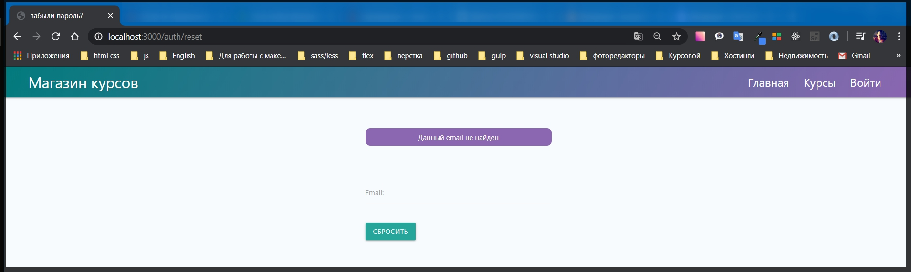
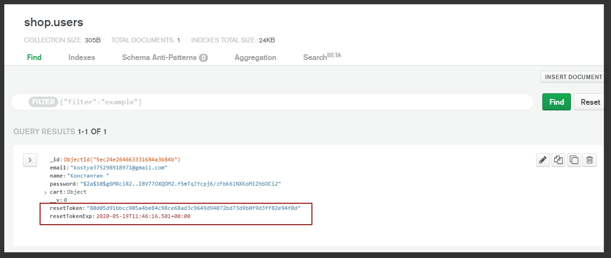
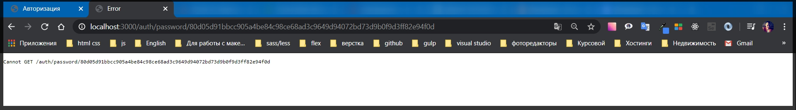

# Страница нового пароля

Сначало тестирую. Ввожу не правильный **email**



После ввожу **email** пользователя существующего в БД. Происходит **redirect**


Письмо мне не приходит так как я не могу войти в **SendGrid**. Пока служба технической поддержки не может или не хочет востановить доступ. Ну да ладно.

Если посмотреть в БД



Строка **resetToken** сейчас ханиться в **email**. Если в письме нажать восстановить доступ, то мы должны оказаться на **localhost** и в адресной строке должен присутствовать **token**.

Так как письма нет пробую вручную

```
 http://localhost:3000/auth/password/80d05d91bbcc905a4be84c98ce68ad3c9649d94072bd73d9b0f9d3ff82e94f0d
```

И в адресной строке должен присутствовать токен который должен совпадать с токеном на странице



Токен адресной строки совпадает с токеном из БД.

Теперь необходимо создать **rout** который позволит обработать данный **get** запрос, получить токен и показать форму которая позволит ввести новый пароль.

В **views auth** создаю новый файл **password.hbs**.

```js
{{!-- view auth password.hbs --}}

   <div class="row">
    <div class="col s6 offset-s3">

        {{#if error}}
        <p class="alert">{{error}}</p>
        {{/if}}

        <form class="form" action="/auth/password" method="POST">
            <div class="input-field">
                <input id="password" name="password" type="password" class="validate" required />
                <label for="password">Новый пароль:</label>
                <span class="helper-text" data-error="Введите новый пароль"></span>
            </div>

            <input type="hidden" name="_csrf" value="{{csrf}}">

            <button class="btn btn-primary" type="submit">Обновить пароль</button>
        </form>
    </div>
</div>
```

С этой страницей я не закончил. Сейчас попробую ее вывести. Для этого в **routes auth.js** задаю новый **get** обработчик. **router.get('/password/:token', async (req, res) => {}** в обрабатываемый путь добавляю **:token** для того что бы обрабатывался наш токен. Делаю функцию асинхронной. В тело функции я буду передавать определенные данные для еще большей защиты. Потому что подобные страницы можно потделать. И я сделаю так что бы максимально сложно было подстроить какие - то параметры.

Во - первых я спрашиваю у объекта **request**. Если **if** в объекте **(!req.params.token)** нет параметра **token**, то тогда такую страницу не будем допускать к открытию **return res.redirect('/auth/login')**

```js
router.get('/password/:token', async (req, res) => {
  if (!req.params.token) {
    res.redirect('/auth/login');
  }
});
```

т.е. мы не будем допускать пользователей без токена на данную страницу.

После этого нужно найти какого - то пользователя у которого есть **token** из БД. Для этого создаю переменную **const user = await User.findOne({});** В моделю **User** мне нужно найти пользователя со следующими параметрами. Во - первых у него **resetToken:** должен совпадать с тем **token** который находиться в объекте **req.params.token**. И дальше помимо этого нам нужно убедится в том что он еще валидный т.е. у нас есть поле **resetTokenExp:{}** и если сюда передаем объет, то в нем мы описываем определенные условия где я указываю параметр **grayter** т.е **$gt:** и он должен быть больше чем текущая дата **Date.now()**. Т.е. если данное условие не выполнится то данный user не будет найден и все это работать не будет. Теперь так как мы работаем с асинхронными событиями обернем все в **try catch**

```js
router.get('/password/:token', async (req, res) => {
  if (!req.params.token) {
    res.redirect('/auth/login');
  }
  try {
    const user = await User.findOne({
      resetToken: req.params.token,
      resetTokenExp: { $gt: Date.now() },
    });
  } catch (e) {
    console.log(e);
  }
});
```

Дальше если **if** у нас нет такого пользователя **(!user)**, то тогда мы сделаем **return res.redirect('/auth/login/')**

```js
router.get('/password/:token', async (req, res) => {
  if (!req.params.token) {
    res.redirect('/auth/login');
  }
  try {
    const user = await User.findOne({
      resetToken: req.params.token,
      resetTokenExp: { $gt: Date.now() },
    });
    if (!user) {
      return res.redirect('/auth/login');
    }
  } catch (e) {
    console.log(e);
  }
});
```

т.е. если у нас например **resetTokenExp: { \$gt: Date.now() },** истек, то тогда мы просто сделаем **return res.redirect('/auth/login');**
А иначе else если пользователь найден то тогда мы будем рендерить страницу **password**

```js
router.get('/password/:token', async (req, res) => {
  if (!req.params.token) {
    res.redirect('/auth/login');
  }
  try {
    const user = await User.findOne({
      resetToken: req.params.token,
      resetTokenExp: { $gt: Date.now() },
    });
    if (!user) {
      return res.redirect('/auth/login');
    } else {
      res.render('/auth/password', {
        title: 'Восстановить доступ',
        error: req.flash('error'),
      });
    }
  } catch (e) {
    console.log(e);
  }
});
```

Однако кроме двух параметров **title: 'Восстановить доступ', error: req.flash('error'),** необходимо передать еще несколько параметров. Во - первых для лишней защиты **userId: user._id.toString(),** и так же передадим **token: req.params.token**.

```js
router.get('/password/:token', async (req, res) => {
  if (!req.params.token) {
    res.redirect('/auth/login');
  }
  try {
    const user = await User.findOne({
      resetToken: req.params.token,
      resetTokenExp: { $gt: Date.now() },
    });
    if (!user) {
      return res.redirect('/auth/login');
    } else {
      res.render('/auth/password', {
        title: 'Восстановить доступ',
        error: req.flash('error'),
        userId: user._id.toString(),
        token: req.params.token,
      });
    }
  } catch (e) {
    console.log(e);
  }
});
```

Весь файл

```js
// routes auth.js
const { Router } = require('express');
const bcrypt = require('bcryptjs');
const crypto = require('crypto');
const nodemailer = require('nodemailer');
const sendgrid = require('nodemailer-sendgrid-transport');
const User = require('../models/user');
const keys = require('../keys');
const regEmail = require('../emails/registration');
const resetEmail = require('../emails/reset');
const router = Router();

const transporter = nodemailer.createTransport(
  sendgrid({
    auth: { api_key: keys.SENDGRID_API_KEY },
  })
);

router.get('/login', async (req, res) => {
  res.render('auth/login', {
    title: 'Авторизация',
    isLogin: true,
    loginError: req.flash('loginError'),
    registerError: req.flash('registerError'),
  });
});

router.get('/logout', async (req, res) => {
  req.session.destroy(() => {
    res.redirect('/auth/login#login');
  });
});

router.post('/login', async (req, res) => {
  try {
    const { email, password } = req.body;
    const candidate = await User.findOne({ email });

    if (candidate) {
      const areSame = await bcrypt.compare(password, candidate.password);

      if (areSame) {
        req.session.user = candidate;
        req.session.isAuthenticated = true;
        req.session.save((err) => {
          if (err) {
            throw err;
          }
          res.redirect('/');
        });
      } else {
        req.flash('loginError', 'Введите верный пароль');
        res.redirect('/auth/login#login');
      }
    } else {
      req.flash('loginError', 'Такого пользователя не существует');
      res.redirect('/auth/login#login');
    }
  } catch (e) {
    console.log(e);
  }
});

router.post('/register', async (req, res) => {
  try {
    const { email, password, repeat, name } = req.body;
    const candidate = await User.findOne({ email });

    if (candidate) {
      req.flash('registerError', 'Пользователь с данным email уже существует');
      res.redirect('/auth/login#register');
    } else {
      const hashPassword = await bcrypt.hash(password, 10);
      const user = new User({
        email,
        name,
        password: hashPassword,
        cart: { items: [] },
      });
      await user.save();
      res.redirect('/auth/login#login');
      await transporter.sendMail(regEmail(email));
    }
  } catch (e) {
    console.log(e);
  }
});

router.get('/reset', (req, res) => {
  res.render('auth/reset', {
    title: 'забыли пароль?',
    error: req.flash('error'),
  });
});

router.get('/password/:token', async (req, res) => {
  if (!req.params.token) {
    res.redirect('/auth/login');
  }
  try {
    const user = await User.findOne({
      resetToken: req.params.token,
      resetTokenExp: { $gt: Date.now() },
    });
    if (!user) {
      return res.redirect('/auth/login');
    } else {
      res.render('/auth/password', {
        title: 'Восстановить доступ',
        error: req.flash('error'),
        userId: user._id.toString(),
        token: req.params.token,
      });
    }
  } catch (e) {
    console.log(e);
  }
});

router.post('/reset', (req, res) => {
  try {
    crypto.randomBytes(32, async (error, buffer) => {
      if (error) {
        req.flash('error', 'Что-то пошло не так, повторите попытку');
        return res.redirect('/auth/reset');
      }
      const token = buffer.toString('hex');
      const candidate = await User.findOne({ email: req.body.email });

      if (candidate) {
        candidate.resetToken = token;
        candidate.resetTokenExp = Date.now() + 60 * 60 * 1000;
        await candidate.save();
        await transporter.sendMail(resetEmail(candidate.email, token));
        res.redirect('/auth/login');
      } else {
        req.flash('error', 'Данный email не найден');
        res.redirect('/auth/reset');
      }
    });
  } catch (e) {
    console.log(e);
  }
});

module.exports = router;
```

У нас теперь есть два лишних поля **userId** и **token** которые нам необходимо обработать на странице **password.hbs**. Для этого добавляю два **input**. Это нам потребуется что бы никто не смог потделать

```js
<input type="hidden" name="_csrf" value="{{csrf}}">
<input type="hidden" name="userId" value="{{userId}}">
<input type="hidden" name="token" value="{{token}}">
```

Весь файл

```js
{{!-- view auth password.hbs --}}

   <div class="row">
    <div class="col s6 offset-s3">

        {{#if error}}
        <p class="alert">{{error}}</p>
        {{/if}}

        <form class="form" action="/auth/password" method="POST">
            <div class="input-field">
                <input id="password" name="password" type="password" class="validate" required />
                <label for="password">Новый пароль:</label>
                <span class="helper-text" data-error="Введите новый пароль"></span>
            </div>

            <input type="hidden" name="_csrf" value="{{csrf}}">
            <input type="hidden" name="userId" value="{{userId}}">
            <input type="hidden" name="token" value="{{token}}">

            <button class="btn btn-primary" type="submit">Обновить пароль</button>
        </form>
    </div>
</div>
```
Теперь необходимо обработать post запрос. Смотри далее.
