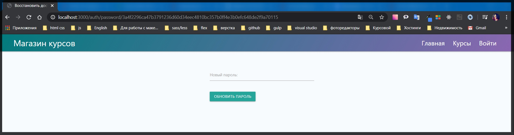
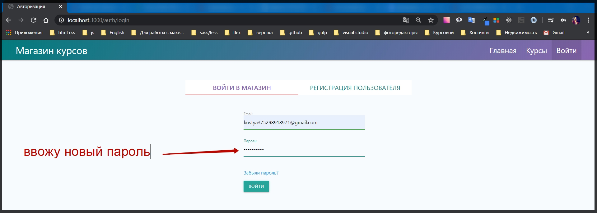
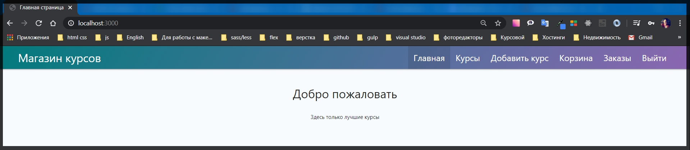
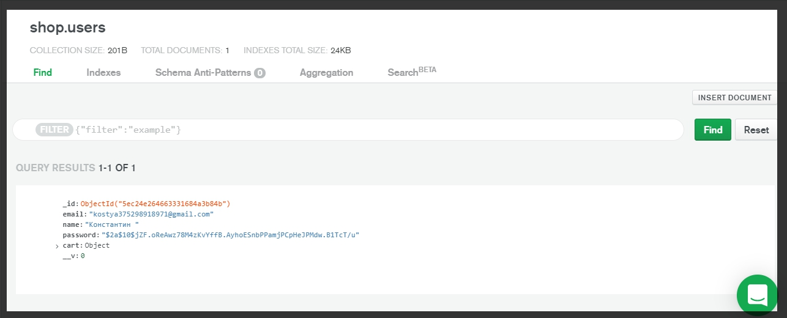

# Изменение пароля

Осталось пройти последний шаг для того что бы закончить логику по восстановлению пароля. У нас есть страница отправляющая запрос на action="/auth/password" методом post и нам необходимо обработать данный параметр

```js
<input type="hidden" name="userId" value="{{userId}}">
<input type="hidden" name="token" value="{{token}}">
```

В routes auth.js задаю новый роут router.post('/password', async (req, res) => {});
Сразу добавляю try catch.

```js
router.post('/password', async (req, res) => {
  try {
  } catch (e) {
    console.log(e);
  }
});
```

Это будут ошибки которые есть в NodeJS или какие - нибудь из БД.

Дальше по сути мы обрабатываем формц с новым паролем. У нас есть name="password" который в body будет отправлен.

Но для начало необходимо проверить наличие такого пользователя с такими данными

```js
<input type="hidden" name="_csrf" value="{{csrf}}">
<input type="hidden" name="userId" value="{{userId}}">
<input type="hidden" name="token" value="{{token}}">
```

Создаю переменную const user = await User.findOne({}); cнова пытаемся найти пользователя с такими условиями. Где \_id: req.body.userId, и так же нужно проверить валидецию токена resetToken: req.body.token, и resetTokenExp: должен быть больше чем { \$gt: Date.now() }. Иначе он потерял время жизни и поэтому пользователь будет не найден.

```js
router.post('/password', async (req, res) => {
  try {
    const user = await User.findOne({
      _id: req.body.userId,
      resetToken: req.body.token,
      resetTokenExp: { $gt: Date.now() },
    });
  } catch (e) {
    console.log(e);
  }
});
```

Теперь как обычно проверяем что если if (user), то тогда мы зададим ему новый пароль. А иначе сделаем res.redirect('/auth/login')

```js
router.post('/password', async (req, res) => {
  try {
    const user = await User.findOne({
      _id: req.body.userId,
      resetToken: req.body.token,
      resetTokenExp: { $gt: Date.now() },
    });
    if (user) {
    } else {
      req.flash('loginError', 'Время жизни токена истекло');
      res.redirect('/auth/login');
    }
  } catch (e) {
    console.log(e);
  }
});
```

Теперь если пользователь найден и все валидно. В таком случае я обращаюсь к user.password = и дальше мы снова должны зашифровать уже новый пароль который поступил в форму. Для этого обращаюсь к библиотеке await bcrypt. и с помощью функции hash() передаю параметр req.body.password, 10 количество символов.
После этого необходимо удалить все данные которые отнасятся к токену восстановления т.е. user.resetToken = indefined и user.resetTokenExp = undefined; После этого мы должны подождать пока пользователь сохраниться с новыми данными await user.save(); И уже после этого необходимо сделать res.redirect('/auth/login');

```js
router.post('/password', async (req, res) => {
  try {
    const user = await User.findOne({
      _id: req.body.userId,
      resetToken: req.body.token,
      resetTokenExp: { $gt: Date.now() },
    });
    if (user) {
      user.password = await bcrypt.hash(req.body.password, 10);
      user.resetToken = undefined;
      user.resetTokenExp = undefined;
    } else {
      req.flash('loginError', 'Время жизни токена истекло');
      res.redirect('/auth/login');
      await user.save();
      res.redirect('/auth/login');
    }
  } catch (e) {
    console.log(e);
  }
});
```

была ошибка вот полный рабочий файл

```js
// routes auth.js
const { Router } = require('express');
const bcrypt = require('bcryptjs');
const crypto = require('crypto');
const nodemailer = require('nodemailer');
const sendgrid = require('nodemailer-sendgrid-transport');
const User = require('../models/user');
const keys = require('../keys');
const regEmail = require('../emails/registration');
const resetEmail = require('../emails/reset');
const router = Router();

const transporter = nodemailer.createTransport(
  sendgrid({
    auth: { api_key: keys.SENDGRID_API_KEY },
  })
);

router.get('/login', async (req, res) => {
  res.render('auth/login', {
    title: 'Авторизация',
    isLogin: true,
    loginError: req.flash('loginError'),
    registerError: req.flash('registerError'),
  });
});

router.get('/logout', async (req, res) => {
  req.session.destroy(() => {
    res.redirect('/auth/login#login');
  });
});

router.post('/login', async (req, res) => {
  try {
    const { email, password } = req.body;
    const candidate = await User.findOne({ email });

    if (candidate) {
      const areSame = await bcrypt.compare(password, candidate.password);

      if (areSame) {
        req.session.user = candidate;
        req.session.isAuthenticated = true;
        req.session.save((err) => {
          if (err) {
            throw err;
          }
          res.redirect('/');
        });
      } else {
        req.flash('loginError', 'Неверный пароль');
        res.redirect('/auth/login#login');
      }
    } else {
      req.flash('loginError', 'Такого пользователя не существует');
      res.redirect('/auth/login#login');
    }
  } catch (e) {
    console.log(e);
  }
});

router.post('/register', async (req, res) => {
  try {
    const { email, password, repeat, name } = req.body;
    const candidate = await User.findOne({ email });

    if (candidate) {
      req.flash('registerError', 'Пользователь с таким email уже существует');
      res.redirect('/auth/login#register');
    } else {
      const hashPassword = await bcrypt.hash(password, 10);
      const user = new User({
        email,
        name,
        password: hashPassword,
        cart: { items: [] },
      });
      await user.save();
      await transporter.sendMail(regEmail(email));
      res.redirect('/auth/login#login');
    }
  } catch (e) {
    console.log(e);
  }
});

router.get('/reset', (req, res) => {
  res.render('auth/reset', {
    title: 'Забыли пароль?',
    error: req.flash('error'),
  });
});

router.get('/password/:token', async (req, res) => {
  if (!req.params.token) {
    return res.redirect('/auth/login');
  }

  try {
    const user = await User.findOne({
      resetToken: req.params.token,
      resetTokenExp: { $gt: Date.now() },
    });

    if (!user) {
      return res.redirect('/auth/login');
    } else {
      res.render('auth/password', {
        title: 'Восстановить доступ',
        error: req.flash('error'),
        userId: user._id.toString(),
        token: req.params.token,
      });
    }
  } catch (e) {
    console.log(e);
  }
});

router.post('/reset', (req, res) => {
  try {
    crypto.randomBytes(32, async (err, buffer) => {
      if (err) {
        req.flash('error', 'Что-то пошло не так, повторите попытку позже');
        return res.redirect('/auth/reset');
      }

      const token = buffer.toString('hex');
      const candidate = await User.findOne({ email: req.body.email });

      if (candidate) {
        candidate.resetToken = token;
        candidate.resetTokenExp = Date.now() + 60 * 60 * 1000;
        await candidate.save();
        await transporter.sendMail(resetEmail(candidate.email, token));
        res.redirect('/auth/login');
      } else {
        req.flash('error', 'Такого email нет');
        res.redirect('/auth/reset');
      }
    });
  } catch (e) {
    console.log(e);
  }
});

router.post('/password', async (req, res) => {
  try {
    const user = await User.findOne({
      _id: req.body.userId,
      resetToken: req.body.token,
      resetTokenExp: { $gt: Date.now() },
    });

    if (user) {
      user.password = await bcrypt.hash(req.body.password, 10);
      user.resetToken = undefined;
      user.resetTokenExp = undefined;
      await user.save();
      res.redirect('/auth/login');
    } else {
      req.flash('loginError', 'Время жизни токена истекло');
      res.redirect('/auth/login');
    }
  } catch (e) {
    console.log(e);
  }
});

module.exports = router;
```
Имитирую переход по ссылке из письма



Ввожу новый пароль и все отрабатывает корректно.



И прекрасно прохожу авторизацию



и если посмотреть в БД то  токен исчез после удачного обновления и шифрования пароля



