# Рефакторинг по правам доступа

Я хочу сделать так что бы пользователь мог удалять и редактировать только те курсы которые од сделал сам т.е. это касается только кнопки Редактирования.
Есть две задачи на текущий урок.

1. Убрать кнопку редактировать для тех пользователей кто не создавал данный курс.
2. Защитить редактирование на строне **back-end** т.е. в нашем **router-е**

Начинаю с того что удаляю ранее добавленные курсы.

Добавляю двух разных пользователей которые добавили по одному курсу.

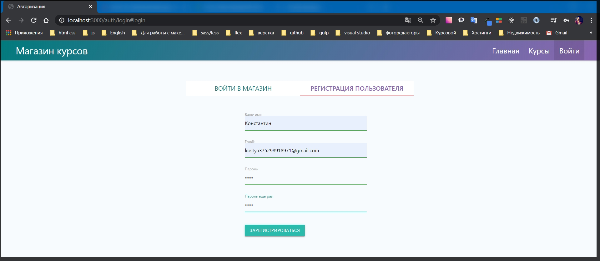

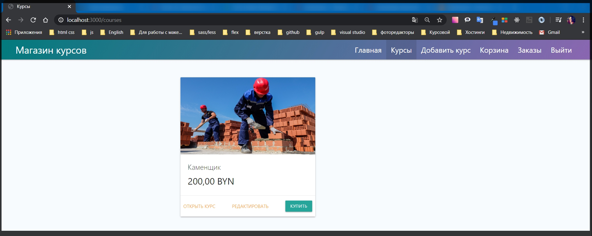

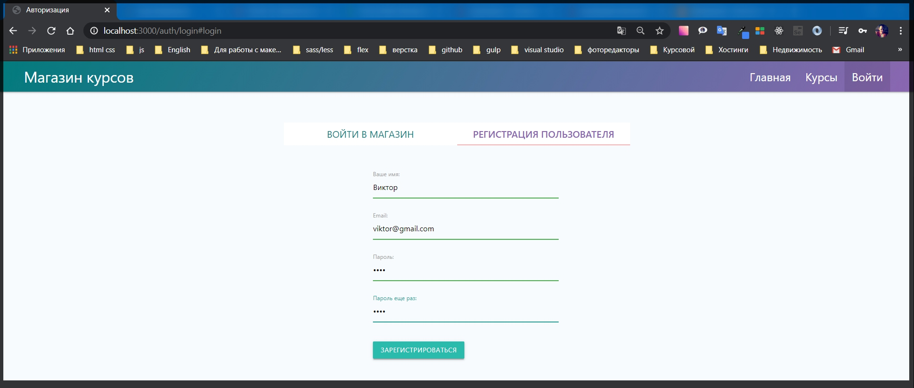

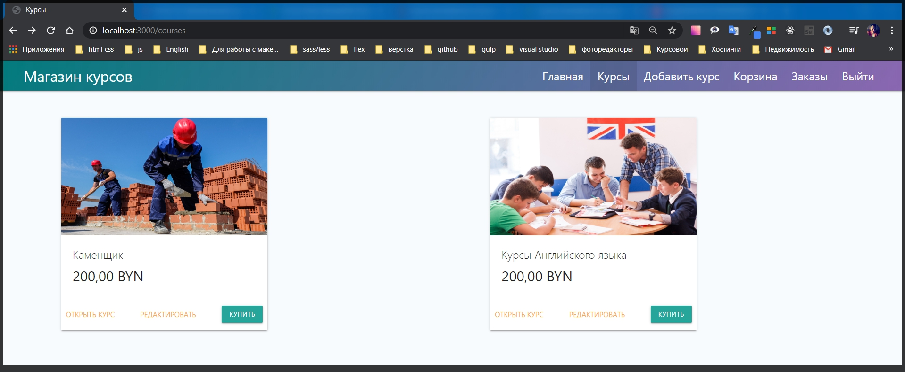

И вот эти два курса добавлены от разных пользователей.

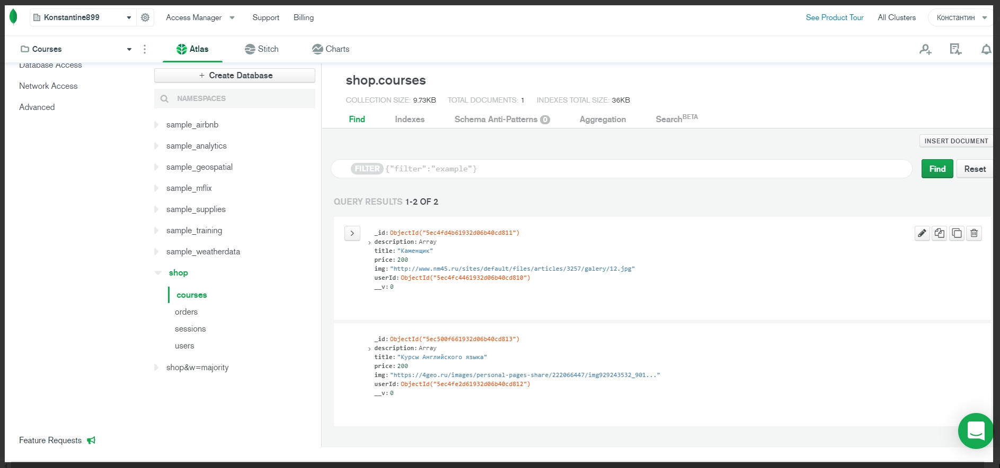

Дальше нужно начать с первой задачи убрать кнопку Редактировать. Делается это достаточно просто. Перехожу в **routes courses.js** и там где мы рендерим страницу курсов, которую было бы не плохо взять в блок **try catch**.

Почему - то в этом блоке у меня был написан не весь код. хотя я помню что писал.

Вот так должен выглядет.

```js
router.get('/', async (req, res) => {
  try {
    const courses = await Course.find()
      .populate('userId', 'email name')
      .select('price title img');

    res.render('courses', {
      title: 'Курсы',
      isCourses: true,
      courses,
    });
  } catch (e) {
    console.log(e);
  }
});
```

Здесь нам по сути нужно передать **userId** того пользователя который сейчас активен в сессии. т.е. **userId:** Пользователь хранится в объекте **req.user**, но его может там не быть, потому что мы можем быть не авторизованы, при этом страница курсов у нас загружается поэтому здесь нужно проверить если **? req.user** есть то тогда я буду передавать параметр **req.user.\_id.toString()** а иначе **:** мы ничего не будем передавать **null**.

```js
router.get('/', async (req, res) => {
  try {
    const courses = await Course.find()
      .populate('userId', 'email name')
      .select('price title img');

    res.render('courses', {
      title: 'Курсы',
      isCourses: true,
      userId: req.user ? req.user._id.toString() : null,
      courses,
    });
  } catch (e) {
    console.log(e);
  }
});
```

И впринцыпе все. Теперь нам этих данных хватит потому что дальше курсы у нас выводяться мы делаем .**populate userId** и получаем его **email** и **name**. В том числе у него еще есть **\_id**.

Полный файл

```js
// courses.js

const { Router } = require('express');
const Course = require('../models/course');
const auth = require('../middleware/auth');
const router = Router();

router.get('/', async (req, res) => {
  try {
    const courses = await Course.find()
      .populate('userId', 'email name')
      .select('price title img');

    res.render('courses', {
      title: 'Курсы',
      isCourses: true,
      userId: req.user ? req.user._id.toString() : null,
      courses,
    });
  } catch (e) {
    console.log(e);
  }
});

router.get('/:id/edit', auth, async (req, res) => {
  if (!req.query.allow) {
    return res.redirect('/');
  }

  const course = await Course.findById(req.params.id);

  res.render('course-edit', {
    title: `Редактировать ${course.title}`,
    course,
  });
});

router.post('/edit', auth, async (req, res) => {
  const { id } = req.body;
  delete req.body.id;
  await Course.findByIdAndUpdate(id, req.body);
  res.redirect('/courses');
});

router.post('/remove', auth, async (req, res) => {
  try {
    await Course.deleteOne({ _id: req.body.id });
    res.redirect('/courses');
  } catch (e) {
    console.log(e);
  }
});

router.get('/:id', async (req, res) => {
  const course = await Course.findById(req.params.id);
  res.render('course', {
    layout: 'empty',
    title: `Курс ${course.title}`,
    course,
  });
});

module.exports = router;
```

Но теперь у нас есть одна небольшая проблема, если мы перейдем в **courses.hbs** и посмотрим на блок кнопки Редактировать.

```handlebars
{{! courses.hbs }}

{{#if courses.length}}
{{#each courses}}
<div class="row">
  {{!-- <div class="col s12 m7"> --}}
  <div class="row__column">
    <div class="card">

      <div class="card-image">
        
      </div>

      <div class="card-content">
        <span class="card-title">{{title}}</span>
        <p class="price">{{price}}</p>
      </div>

      <div class="card-action actions">
        <a href="/courses/{{id}}" target="_blank" target="_blank">Открыть курс</a>
        {{#if @root.isAuth}}
        <a href="/courses/{{id}}/edit?allow=true">Редактировать</a>
        <form action="/card/add" method="POST">
          <input type="hidden" name="_csrf" value="{{@root.csrf}}">
          <input type="hidden" name="id" value="{{id}}" />
          <button type="submit" class="btn btn-primary">Купить</button>
        </form>
        {{/if}}
      </div>

    </div>
  </div>
</div>
{{/each}}
{{else}}
<p>Курсы пока не добавлены</p>
{{/if}}
```

Посути нам нужно скрывать эту кнопку если **userId** не совпадают.

Проблема заключается в том что в **handlebars** эти встроенные директивы **if** не могут проверять на равенство.

```handlebars
{{#if userId._id === @root.userId}}
{{! _id пишу так потому что mongoose по другому не понимает}}
```

_**такой конструкции в handlebarse нет!!!**_

Выход только один. Необходимо создать свой собственный шаблон, т.е. директиву в **handlebarse** которую мы сможем использовать.

Для этого в файле **index.js** я обращаюсь к функции **const hbs = exphbs.create** и здесь я могу передать еще один параметр который называется **helpers:** и сюда я буду импортировать **helper** который сейчас создам.

```js
const hbs = exphbs.create({
  defaultLayout: 'main',
  extname: 'hbs',
  helpers: require(''),
  handlebars: allowInsecurePrototypeAccess(Handlebars),
});
```

В корне приложения я создам папку **utils** где я буду хранить различные утилиты. Создаю файл **hbs-helpers.js**.

что такое **helper** в **handlebarse**? По сути здесь мы можем задавать какие - то новые определенные функции которые будут доступны нам в шаблоне и которые мы сможем использовать.

По сути это должен быть объект. Поэтому я буду экспортировать объект **module.exports = {};**
И далее я задаю название того **helper** который буду использовать. Допустим я его назову **ifeq(){**} это будет функция которая в параметр принимает **(a, b, options)** опции которые мы в дальнейшем будем использовать.

```js
module.exports = {
  ifeq(a, b, options) {},
};
```

В **index.js** подключаю данный файл **helpers: require('./utils/hbs-helpers')**,

```js
const hbs = exphbs.create({
  defaultLayout: 'main',
  extname: 'hbs',
  helpers: require('./utils/hbs-helpers'),
  handlebars: allowInsecurePrototypeAccess(Handlebars),
});
```

Весь **index.js**

```js
// index.js

const express = require('express');
const Handlebars = require('handlebars');
const path = require('path');
const csrf = require('csurf');
const flash = require('connect-flash');
const mongoose = require('mongoose');
const exphbs = require('express-handlebars');
const {
  allowInsecurePrototypeAccess,
} = require('@handlebars/allow-prototype-access');
const session = require('express-session');
const MongoStore = require('connect-mongodb-session')(session);

const homeRoutes = require('./routes/home');
const cardRoutes = require('./routes/card');
const addRouters = require('./routes/add');
const ordersRoutes = require('./routes/orders');
const coursesRotes = require('./routes/courses');
const authRoutes = require('./routes/auth');
const warMiddleware = require('./middleware/variables');
const userMiddleware = require('./middleware/user');
const keys = require('./keys');

const app = express();

const hbs = exphbs.create({
  defaultLayout: 'main',
  extname: 'hbs',
  helpers: require('./utils/hbs-helpers'),
  handlebars: allowInsecurePrototypeAccess(Handlebars),
});

const store = new MongoStore({
  collection: 'sessions',
  uri: keys.MONGODB_URI,
});

app.engine('hbs', hbs.engine); // регистрирую движок
app.set('view engine', 'hbs'); // с помощью set начинаю использовать движок
app.set('views', 'views'); // первый параметр заношу переменную, а второй название папки в которой веду разработку. Название может быть любым

app.use(express.static(path.join(__dirname, 'public'))); // делаю папку public публичной а не динамической для того что бы express ее не обрабатывал
app.use(express.urlencoded({ extended: true })); // данный метод использую при обработке POST запроса формы добавления курса
app.use(
  session({
    secret: keys.SESSION_SECRET,
    resave: false,
    saveUninitialized: false,
    store,
  })
);
app.use(csrf());
app.use(flash());
app.use(warMiddleware);
app.use(userMiddleware);

app.use('/', homeRoutes); // использую импортированный роут
app.use('/add', addRouters); // использую импортированный роут
app.use('/courses', coursesRotes); // использую импортированный роут
app.use('/card', cardRoutes); // регистрирую корзину
app.use('/orders', ordersRoutes);
app.use('/auth', authRoutes);

const PORT = process.env.PORT || 3000;

async function start() {
  try {
    await mongoose.connect(keys.MONGODB_URI, {
      useNewUrlParser: true,
      useUnifiedTopology: true,
      useFindAndModify: false,
    }); // это было подключение к БД

    app.listen(PORT, () => {
      console.log(`Сервер запущен на порту ${PORT}`);
    });
  } catch (e) {
    console.log(e);
  }
}
start();
```

Теперь как будет работать непосредственно сам **helper**. По сути два параметра **a** и **b** это и есть **{{#if userId._id === @root.userId}}**

```handlebars
{{#if userId._id === @root.userId}}
{{! _id пишу так потому что mongoose по другому не понимает}}
```

которые мы передаем в параметр **a** и **b**.

Далее в **hbs-helpers.js** прописываю логику. Если **if (a === b)** то тогда мы должны вызвать объект **return options** c методом **.fn()** куда передаю контекст **this.**
А иначе если эти вещи не эквивалентны друг другу, то тогда мы должны вызвать метод **return options.invers(this)** так же с контекстом **this.**

```js
// utils hbs-helpers.js
module.exports = {
  ifeq(a, b, options) {
    if (a === b) {
      return options.fn(this);
    }
    return options.inverse(this);
  },
};
```

Теперь мы можем его использовать. Но как мы его используем. Не в том виде что мы написали

```handlebars
{{#if userId._id === @root.userId}}
{{! _id пишу так потому что mongoose по другому не понимает}}
```

Во - первых мы должны воспользоватся директивой не **if** а **ifeq** и закрывать ее так же, и далее мы не ставим ни какого равенства, мы просто передаем набор параметров в данную директиву.

```handlebars
{{! courses.hbs }}

{{#if courses.length}}
{{#each courses}}
<div class="row">
  {{!-- <div class="col s12 m7"> --}}
  <div class="row__column">
    <div class="card">

      <div class="card-image">
        
      </div>

      <div class="card-content">
        <span class="card-title">{{title}}</span>
        <p class="price">{{price}}</p>
      </div>

      <div class="card-action actions">
        <a href="/courses/{{id}}" target="_blank" target="_blank">Открыть курс</a>

        {{#if @root.isAuth}}
        {{#ifeq userId._id @root.userId}}
        <a href="/courses/{{id}}/edit?allow=true">Редактировать</a>
        {{/ifeq}}


        <form action="/card/add" method="POST">
          <input type="hidden" name="_csrf" value="{{@root.csrf}}">
          <input type="hidden" name="id" value="{{id}}" />
          <button type="submit" class="btn btn-primary">Купить</button>
        </form>
        {{/if}}
      </div>

    </div>
  </div>
</div>
{{/each}}
{{else}}
<p>Курсы пока не добавлены</p>
{{/if}}
```

И теперь оба курса я редактировать не могу.

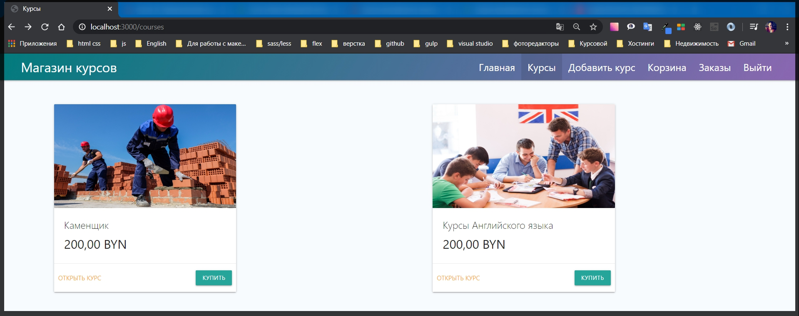

Значит что - то пошло не так.

И немного подебажим.

```handlebars
<pre>{{userId._id}}{{@root.userId}}</pre>
```

Полный

```handlebars
{{! courses.hbs }}

{{#if courses.length}}
{{#each courses}}
<div class="row">
  {{!-- <div class="col s12 m7"> --}}
  <div class="row__column">
    <div class="card">

      <div class="card-image">
        
      </div>

      <div class="card-content">
        <span class="card-title">{{title}}</span>
        <p class="price">{{price}}</p>

        <pre>{{userId._id}} {{@root.userId}}</pre>
      </div>

      <div class="card-action actions">
        <a href="/courses/{{id}}" target="_blank" target="_blank">Открыть курс</a>

        {{#if @root.isAuth}}
        {{#ifeq userId._id @root.userId}}
        <a href="/courses/{{id}}/edit?allow=true">Редактировать</a>
        {{/ifeq}}


        <form action="/card/add" method="POST">
          <input type="hidden" name="_csrf" value="{{@root.csrf}}">
          <input type="hidden" name="id" value="{{id}}" />
          <button type="submit" class="btn btn-primary">Купить</button>
        </form>
        {{/if}}
      </div>

    </div>
  </div>
</div>
{{/each}}
{{else}}
<p>Курсы пока не добавлены</p>
{{/if}}
```

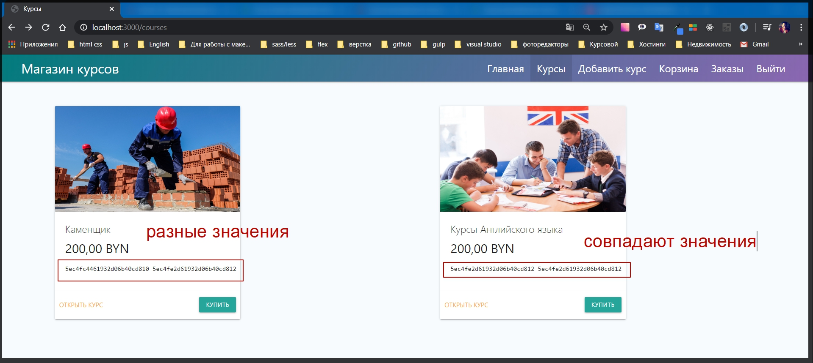

эти данные мы передаем корректно. Это означает что что - то не так рабоает в **handlebarse**.

Проблема кроется в **utils hbs-helpers.js**. Так как мы производим проверку на эквивалентность а не на равенство. Исправляю.

```handlebars
// utils hbs-helpers.js
module.exports = {
  ifeq(a, b, options) {
    if (a == b) {
      return options.fn(this);
    }
    return options.inverse(this);
  },
};
```

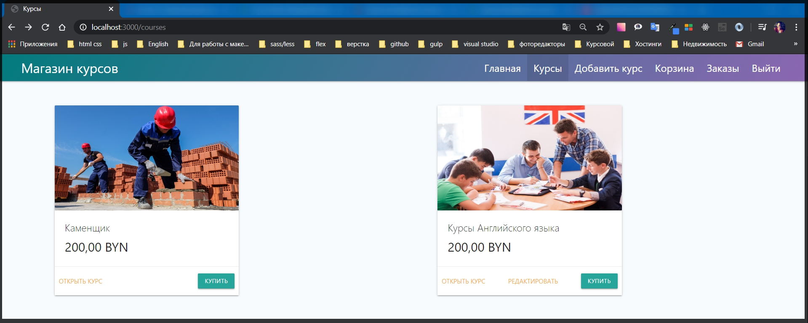

И теперь пользователь Виктор может редактировать свой курс Английского. Но курс Каменщик пользователя Константин он редактировать не может.
Однако если я сейчас пропишу адрес редактирования курса Каменщик пользователя Константина, то я попаду на страницу редактирования его курса и смогу изменить его курс.
Что бы закрыть доступ к курсам пользователям которые их не создавали, необходимо программно это защитить.

Нахожу роуты которые относятся к курсам. **routes courses.js** и где я пишу логику редактирования курсов от пользователя т.е. **get** запрос

```js
router.get('/:id/edit', auth, async (req, res) => {
  if (!req.query.allow) {
    return res.redirect('/');
  }

  const course = await Course.findById(req.params.id);

  res.render('course-edit', {
    title: `Редактировать ${course.title}`,
    course,
  });
});
```

На этом этапе я могу запретить заходить на страницу в случае если **id** не совпадают. Так же все обарачиваю в блок **try catch**.

```js
router.get('/:id/edit', auth, async (req, res) => {
  if (!req.query.allow) {
    return res.redirect('/');
  }
  try {
    const course = await Course.findById(req.params.id);

    res.render('course-edit', {
      title: `Редактировать ${course.title}`,
      course,
    });
  } catch (e) {
    console.log(e);
  }
});
```

И здесь я могу написать проверку. У нас есть **course** который мы нашли по **id.** И у параметра курсов есть параметр **userId**. Т.е. дальше я могу просто проверить. Если **if (course.userId)** привожу к строке **(course.userId.toString() !== req.user.\_id.toString())** то в таком случае нам нужно запретить заходить на данную страницу т.е. **return res.redirect('/courses')** то есть вернет на страницу курсов.

```js
router.get('/:id/edit', auth, async (req, res) => {
  if (!req.query.allow) {
    return res.redirect('/');
  }
  try {
    const course = await Course.findById(req.params.id);
    if (course.userId.toString() !== req.user._id.toString()) {
      return res.redirect('/courses');
    }

    res.render('course-edit', {
      title: `Редактировать ${course.title}`,
      course,
    });
  } catch (e) {
    console.log(e);
  }
});
```

Ну а если этот **if** не сработает то тогда все будет хорошо. Теперь если я в адресную строку вобью **id** другого пользователя то у меня сработает переход на страницу всех курсов.

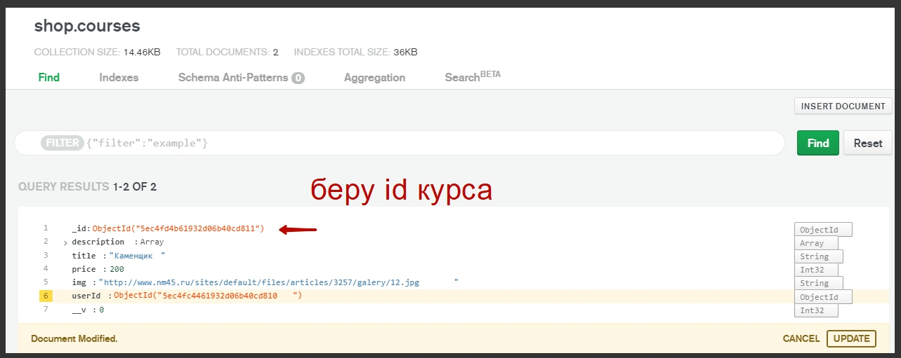

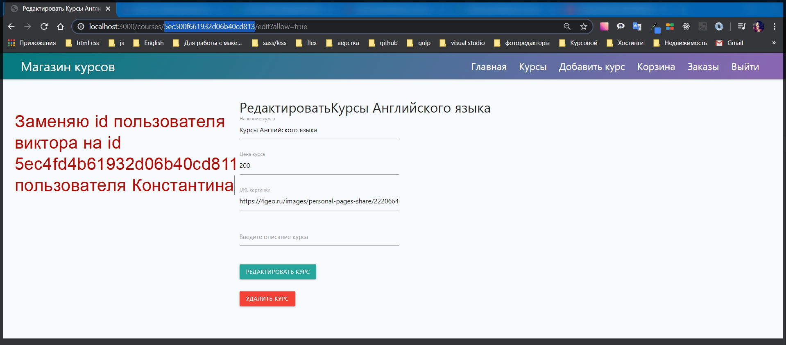

И происходит **redirect** на страницу курсов потому что мы не можем его редактировать.

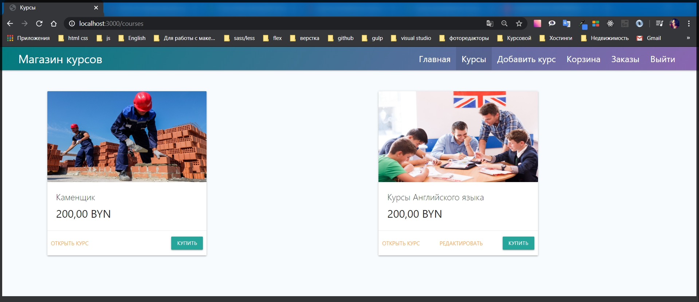

Это был первый этап.
Второй этап. Необходимо защитить так же **post** параметры. я копирую данную проверку. Кстати будет являться хорошей практикой если вынести данную проверку в отдельную функци.

Создаю функцию **function isOwner(){}**, _**isOwner переводится как владелец**_, которая будет принимать в себя **course и req**. И в теле функции я буду просто возвращать проверку **reurn course.userId.toString() !== req.user.\_id.toString()**

```js
function isOwner(course, req) {
  course.userId.toString() !== req.user._id.toString();
}
```

И в условии проверки пишу **if(!isOwner(course, req))**

```js
router.get('/:id/edit', auth, async (req, res) => {
  if (!req.query.allow) {
    return res.redirect('/');
  }
  try {
    const course = await Course.findById(req.params.id);
    if (!isOwner(course, req)) {
      return res.redirect('/courses');
    }

    res.render('course-edit', {
      title: `Редактировать ${course.title}`,
      course,
    });
  } catch (e) {
    console.log(e);
  }
});
```

Тоже самое касается метода **post**. Во - первых оборачиваю все в **try catch**. И сделать тоже самое т.е. если у нас не является влядельцем **!isOwner**, тот человек который редактирует данный курс, то мы тогда не будем ему позволять это делать. Если **if(!isOwner())** и сюда мы должны передать **id** курса. Для этого нужно получить доступ дял курса **const course = await Course.findById(id)**. И далее дописываю логику Если **if(!isOwner(course, req))** то тогда **return res.redirect('/courses')**.
Теперь нужно заменить строчку **await Course.findByIdAndUpdate(id, req.body);** с помощью **Object.assing(course, req.body);** и сохраняю **await course.save()**

```js
router.post('/edit', auth, async (req, res) => {
  try {
    const { id } = req.body;
    delete req.body.id;
    const course = await Course.findById(id);
    if (!isOwner(course, req)) {
      return res.redirect('courses');
    }
    Object.assign(course, req.body);
    await course.save();
    res.redirect('/courses');
  } catch (e) {
    console.log(e);
  }
});
```

Весь файл

```js
// courses.js

const { Router } = require('express');
const Course = require('../models/course');
const auth = require('../middleware/auth');
const router = Router();

function isOwner(course, req) {
  course.userId.toString() !== req.user._id.toString();
}

router.get('/', async (req, res) => {
  try {
    const courses = await Course.find()
      .populate('userId', 'email name')
      .select('price title img');

    res.render('courses', {
      title: 'Курсы',
      isCourses: true,
      userId: req.user ? req.user._id.toString() : null,
      courses,
    });
  } catch (e) {
    console.log(e);
  }
});

router.get('/:id/edit', auth, async (req, res) => {
  if (!req.query.allow) {
    return res.redirect('/');
  }
  try {
    const course = await Course.findById(req.params.id);
    if (!isOwner(course, req)) {
      return res.redirect('/courses');
    }

    res.render('course-edit', {
      title: `Редактировать ${course.title}`,
      course,
    });
  } catch (e) {
    console.log(e);
  }
});

router.post('/edit', auth, async (req, res) => {
  try {
    const { id } = req.body;
    delete req.body.id;
    const course = await Course.findById(id);
    if (!isOwner(course, req)) {
      return res.redirect('courses');
    }
    Object.assign(course, req.body);
    await course.save();
    res.redirect('/courses');
  } catch (e) {
    console.log(e);
  }
});

router.post('/remove', auth, async (req, res) => {
  try {
    await Course.deleteOne({ _id: req.body.id });
    res.redirect('/courses');
  } catch (e) {
    console.log(e);
  }
});

router.get('/:id', async (req, res) => {
  const course = await Course.findById(req.params.id);
  res.render('course', {
    layout: 'empty',
    title: `Курс ${course.title}`,
    course,
  });
});

module.exports = router;
```

И все равно здесь есть определенные проблемы смотри их далее.
