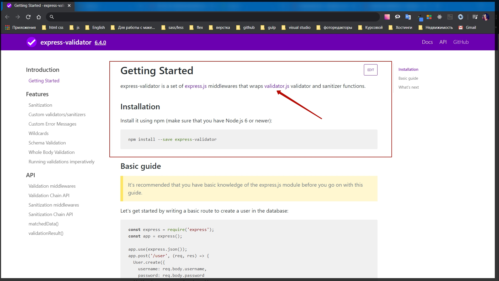
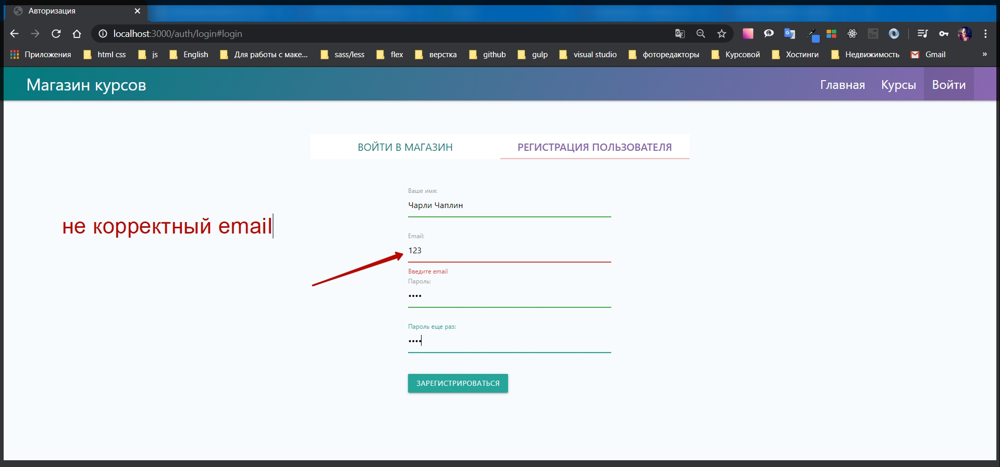
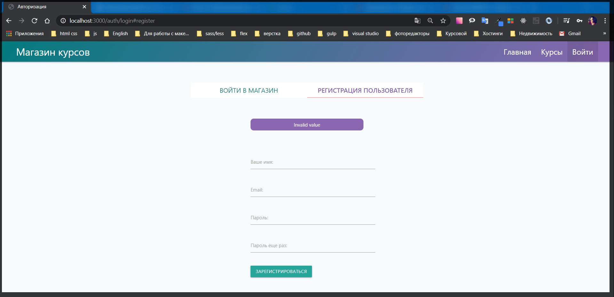

# Базовая валидация

В приложении есть определенные формы которые нужно отвалидировать. Например страница регистрации где мы вводим **email** вводим пароль, повторить пароль еще раз и ввести имя.

Нужно отвалидировать то что мы ввели являлось **email**. И что бы пароли совпадали. И если данные поля не будут совпадать, то тогда нужно вывести сообщение об ошибке.
Пока что мы это валидируем только на **front-end** используя обычные **html** формы

```handlebars
{{!-- view auth login.hbs --}}

<div class="auth">
    <div class="row">
        <div class="col s12">
            <ul class="tabs">
                <li class="tab col s6"><a class="active" href="#login">Войти в магазин</a></li>
                <li class="tab col s6"><a href="#register">Регистрация пользователя</a></li>

            </ul>
        </div>
        <div id="login" class="col s6 offset-s3">

            {{#if loginError}}
            <p class="alert">{{loginError}}</p>
            {{/if}}

            {{!-- <h1>Войти в магазин</h1> --}}
            <form class="form" action="/auth/login" method="POST">
                <div class="input-field">
                    <input id="email" name="email" type="email" class="validate" required />
                    <label for="email">Email:</label>
                    <span class="helper-text" data-error="Введите email"></span>
                </div>

                <div class="input-field"><input id="password" name="password" type="password" class="validate"
                        required />
                    <label for="password">Пароль:</label>
                    <span class="helper-text" data-error="Введите пароль"></span>
                </div>

                <input type="hidden" name="_csrf" value="{{csrf}}">

                <p><a href="/auth/reset">Забыли пароль?</a></p>

                <button class="btn btn-primary" type="submit">Войти</button>
            </form>
        </div>

        <div id="register" class="col s6 offset-s3">

            {{#if registerError}}
            <p class="alert">{{registerError}}</p>
            {{/if}}

            {{!-- <h1>Регистрация пользователя</h1> --}}
            <form class="form" action="/auth/register" method="POST">

                <div class="input-field"><input id="name" name="name" type="text" class="validate" required />
                    <label for="name">Ваше имя:</label>
                    <span class="helper-text" data-error="Введите имя"></span>
                </div>


                <div class="input-field">
                    <input id="remail" name="email" type="email" class="validate" required />
                    {{!-- Для того что бы небыло конфликтов прописываю remail меняю только id и for --}}
                    <label for="remail">Email:</label>
                    <span class="helper-text" data-error="Введите email"></span>
                </div>

                <div class="input-field"><input id="rpassword" name="password" type="password" class="validate"
                        required />{{!-- меняю только id и for --}}
                    <label for="rpassword">Пароль:</label>
                    <span class="helper-text" data-error="Введите пароль"></span>
                </div>

                <div class="input-field"><input id="confirm" name="confirm" type="password" class="validate"
                        required />{{!-- меняю только id и for --}}
                    <label for="confirm">Пароль еще раз:</label>
                    <span class="helper-text" data-error="Введите пароль"></span>
                </div>

                <input type="hidden" name="_csrf" value="{{csrf}}">

                <button class="btn btn-primary" type="submit">Зарегистрироваться</button>
            </form>
        </div>
    </div>
</div>
```

Но безусловно все это можно обойти. Мы обязаны валидировать все эти данные на сервере потому что с **front-end** мы можем отправлять какие угодно данные и сервер их примет потому что **front - end** мы можем редактировать.
Сервер же мы не можем ни как изменять и поэтому все валидации, перед тем как поступить в БД мы должны проверить.

Перехожу на официальный сайт библиотеки [express-validator](https://express-validator.github.io/docs/)

Установка библиотеки

```
npm install --save express-validator
```

Однако здесь написано что это нейкая абстракция над библиотекой [validator.js](https://github.com/validatorjs/validator.js)



Если я перейду то увижу ту истинную библиотеку которая отвечает непосредственно за саму валидацию. И она у нас может быть использована на **front-end** на **back-end** еще где угодно т.е. это универсальная бибилиотека которая служит именно для проверки. Устанавливаю данный пакет

```
npm i express-validator
```

Как и любые другие пакеты в **express** он нам предлагает использовать **midleware** который мы можем использовать для определенных полей которые мы хотим отвалидировать.
Перехожу в папку **routes** на страницу **auth.js** и сворачиваю все обработчики. Нахожу **post** запрос на регистрацию

```js
router.post('/register', async (req, res) => {
  try {
    const { email, password, repeat, name } = req.body;
    const candidate = await User.findOne({ email });

    if (candidate) {
      req.flash('registerError', 'Пользователь с таким email уже существует');
      res.redirect('/auth/login#register');
    } else {
      const hashPassword = await bcrypt.hash(password, 10);
      const user = new User({
        email,
        name,
        password: hashPassword,
        cart: { items: [] },
      });
      await user.save();
      await transporter.sendMail(regEmail(email));
      res.redirect('/auth/login#login');
    }
  } catch (e) {
    console.log(e);
  }
});
```

Здесь внутри мы делаем различные проверки. Пока что мы не проверяем поле **repead. const { email, password, repeat, name } = req.body;** Кстати данное поле в **login.hbs** называется **confirm**. Поэтому в **auth.js** объект **repead** меняю на **confirm**.
Однако мы в любом случае пока его ни как не проверяем. И как раз валидация нам в этом поможет. Теперь там где я подключаю библиотеки прописываю **const {} =** т.е. я буду забирать определенные объекты у библиотеки. **const {} = require('express-validator');** У этой библиотеки есть большое количество полей. Конкретно меня будут интересовать поле **check**. т.е. здесь прописывается вот такой вот импорт **const {} = require('express-validator/check');**
И далее я могу доставать какие - то функции которые мы будем использовать. Т.е. например если я хочу проверить какие - то параметры из **req.body** то мы должны подключить функцию **const {body} = require('express-validator/check');** если мы хотим проверить **query** параметр мы подключаем пакет **const {query} = require('express-validator/check');** либо если мы хотим проверять все данные то мы можем подключить функцию **const {check} = require('express-validator/check');**
Это различные функции, они впринципе делают одно и тоже, просто отвечают за разные уровни. Но конкретно мы будем валидировать **body**.
Предположим вначале будем валидировать **email.** После того как обозначаем путь данного **router.post('/register',** далее через пробел можем указывать бесконечное количество различных валидаторов, точнее даже **midleware** которые могут являться валидаторами, ну и в конце указываем последний **midleware async (req, res) => {}** который является обработчиком.

И здесь использую функцию **body** которую вызываю **()**

```js
router.post('/register', body(), async (req, res) => {
  try {
    const { email, password, confirm, name } = req.body;
    const candidate = await User.findOne({ email });

    if (candidate) {
      req.flash('registerError', 'Пользователь с таким email уже существует');
      res.redirect('/auth/login#register');
    } else {
      const hashPassword = await bcrypt.hash(password, 10);
      const user = new User({
        email,
        name,
        password: hashPassword,
        cart: { items: [] },
      });
      await user.save();
      await transporter.sendMail(regEmail(email));
      res.redirect('/auth/login#login');
    }
  } catch (e) {
    console.log(e);
  }
});
```

Внутри функции **body** я указываю название того поля которое подлежит валидации например поле **('email').** и дальше я могу вызывать большое количество валидаторов которые присутствуют в пакете.
На гите [validator.js](https://github.com/validatorjs/validator.js) можно посмотреть какие функции у него есть [validators](https://github.com/validatorjs/validator.js#validators)

И есть функция **isEmail()**

```js
router.post('/register', body('email').isEmail(), async (req, res) => {
  try {
    const { email, password, confirm, name } = req.body;
    const candidate = await User.findOne({ email });

    if (candidate) {
      req.flash('registerError', 'Пользователь с таким email уже существует');
      res.redirect('/auth/login#register');
    } else {
      const hashPassword = await bcrypt.hash(password, 10);
      const user = new User({
        email,
        name,
        password: hashPassword,
        cart: { items: [] },
      });
      await user.save();
      await transporter.sendMail(regEmail(email));
      res.redirect('/auth/login#login');
    }
  } catch (e) {
    console.log(e);
  }
});
```

Первый валидатор готов. И дальше нам необходимо его проверить. Для этого из бибилиотеки я подключу еще одну функцию которая называется **validationResult**. И кстати в консоли мне выдает что **/check** в пути устарел. Поэтому использую такое подключение **const {body, validationResult} = require('express-validator');** С помощью данной функции мы будем получать ошибки если они какие - то присутствуют.
В блоке **try** я создаю переменную **const errors =** которая будет являться результатом работы **validationResult(req)** от объекта **request**.

И теперь в **errors** есть все необходимые данные которые мы будем проверять. Если **if** у объекта **(errors.isEmpry())** присутствует метод **isEmpty(),** т.е. если этот метод выдает значение **true**, то это означает что ни каких ошибок у нас нет. Поэтому ставим оператор **not** что бы проверить на наличие ошибок **(!errors.isEmpry())** т.е. если что то в ошибках есть, то в данном случае мы должны показать сообщение человеку. Для этого в теле функции воспользуюсь **req.flash('registerError', errors.array()[0].msg)**. Разберем подробнее. Т.к. мы находимся в регистрации то первым параметром указываю ключ **'registerError'**. Во втором параметре сообщения которые есть об ошибках я могу достать прямо из валидатора. Достается оно таким образом **errors.** его метод **array()** который приводит его к массиву, и далее я забираю нулевой индекс **[0]**, т.е. он 100% у нас будет потому что ошибки не пустые. И сообщение находится в объекте **.msg**.
После этого нужно прекратить выполнение данной функции **return res.** и далее задаю статус для ответа **status(422)** т.е. это тот статус который говорит что у нас есть какие - то ошибки в валидации. Это обычный **http** статус который за это и отвекчает. И дальше я делаю **redirect('/auth/login#register')**

```js
router.post('/register', body('email').isEmail(), async (req, res) => {
  try {
    const { email, password, confirm, name } = req.body;
    const candidate = await User.findOne({ email });

    const errors = validationResult(req);
    if (!errors.isEmpty()) {
      req.flash('registerError', errors.array()[0].msg);
      return res.status(422).redirect('/auth/login#register');
    }

    if (candidate) {
      req.flash('registerError', 'Пользователь с таким email уже существует');
      res.redirect('/auth/login#register');
    } else {
      const hashPassword = await bcrypt.hash(password, 10);
      const user = new User({
        email,
        name,
        password: hashPassword,
        cart: { items: [] },
      });
      await user.save();
      await transporter.sendMail(regEmail(email));
      res.redirect('/auth/login#login');
    }
  } catch (e) {
    console.log(e);
  }
});
```

Весь файл

```js
// routes auth.js
const { Router } = require('express');
const bcrypt = require('bcryptjs');
const crypto = require('crypto');
const { body, validationResult } = require('express-validator');
const nodemailer = require('nodemailer');
const sendgrid = require('nodemailer-sendgrid-transport');
const User = require('../models/user');
const keys = require('../keys');
const regEmail = require('../emails/registration');
const resetEmail = require('../emails/reset');
const router = Router();

const transporter = nodemailer.createTransport(
  sendgrid({
    auth: { api_key: keys.SENDGRID_API_KEY },
  })
);

router.get('/login', async (req, res) => {
  res.render('auth/login', {
    title: 'Авторизация',
    isLogin: true,
    loginError: req.flash('loginError'),
    registerError: req.flash('registerError'),
  });
});

router.get('/logout', async (req, res) => {
  req.session.destroy(() => {
    res.redirect('/auth/login#login');
  });
});

router.post('/login', async (req, res) => {
  try {
    const { email, password } = req.body;
    const candidate = await User.findOne({ email });

    if (candidate) {
      const areSame = await bcrypt.compare(password, candidate.password);

      if (areSame) {
        req.session.user = candidate;
        req.session.isAuthenticated = true;
        req.session.save((err) => {
          if (err) {
            throw err;
          }
          res.redirect('/');
        });
      } else {
        req.flash('loginError', 'Неверный пароль');
        res.redirect('/auth/login#login');
      }
    } else {
      req.flash('loginError', 'Такого пользователя не существует');
      res.redirect('/auth/login#login');
    }
  } catch (e) {
    console.log(e);
  }
});

router.post('/register', body('email').isEmail(), async (req, res) => {
  try {
    const { email, password, confirm, name } = req.body;
    const candidate = await User.findOne({ email });

    const errors = validationResult(req);
    if (!errors.isEmpty()) {
      req.flash('registerError', errors.array()[0].msg);
      return res.status(422).redirect('/auth/login#register');
    }

    if (candidate) {
      req.flash('registerError', 'Пользователь с таким email уже существует');
      res.redirect('/auth/login#register');
    } else {
      const hashPassword = await bcrypt.hash(password, 10);
      const user = new User({
        email,
        name,
        password: hashPassword,
        cart: { items: [] },
      });
      await user.save();
      await transporter.sendMail(regEmail(email));
      res.redirect('/auth/login#login');
    }
  } catch (e) {
    console.log(e);
  }
});

router.get('/reset', (req, res) => {
  res.render('auth/reset', {
    title: 'Забыли пароль?',
    error: req.flash('error'),
  });
});

router.get('/password/:token', async (req, res) => {
  if (!req.params.token) {
    return res.redirect('/auth/login');
  }

  try {
    const user = await User.findOne({
      resetToken: req.params.token,
      resetTokenExp: { $gt: Date.now() },
    });

    if (!user) {
      return res.redirect('/auth/login');
    } else {
      res.render('auth/password', {
        title: 'Восстановить доступ',
        error: req.flash('error'),
        userId: user._id.toString(),
        token: req.params.token,
      });
    }
  } catch (e) {
    console.log(e);
  }
});

router.post('/reset', (req, res) => {
  try {
    crypto.randomBytes(32, async (err, buffer) => {
      if (err) {
        req.flash('error', 'Что-то пошло не так, повторите попытку позже');
        return res.redirect('/auth/reset');
      }

      const token = buffer.toString('hex');
      const candidate = await User.findOne({ email: req.body.email });

      if (candidate) {
        candidate.resetToken = token;
        candidate.resetTokenExp = Date.now() + 60 * 60 * 1000;
        await candidate.save();
        await transporter.sendMail(resetEmail(candidate.email, token));
        res.redirect('/auth/login');
      } else {
        req.flash('error', 'Такого email нет');
        res.redirect('/auth/reset');
      }
    });
  } catch (e) {
    console.log(e);
  }
});

router.post('/password', async (req, res) => {
  try {
    const user = await User.findOne({
      _id: req.body.userId,
      resetToken: req.body.token,
      resetTokenExp: { $gt: Date.now() },
    });

    if (user) {
      user.password = await bcrypt.hash(req.body.password, 10);
      user.resetToken = undefined;
      user.resetTokenExp = undefined;
      await user.save();
      res.redirect('/auth/login');
    } else {
      req.flash('loginError', 'Время жизни токена истекло');
      res.redirect('/auth/login');
    }
  } catch (e) {
    console.log(e);
  }
});

module.exports = router;
```

Проверяю. Для того что бы валидация не происходила на стороне **front - end** я временно прописываю атрибут **novalidate** для формы

```handlebars
{{!-- view auth login.hbs --}}

<div class="auth">
    <div class="row">
        <div class="col s12">
            <ul class="tabs">
                <li class="tab col s6"><a class="active" href="#login">Войти в магазин</a></li>
                <li class="tab col s6"><a href="#register">Регистрация пользователя</a></li>

            </ul>
        </div>
        <div id="login" class="col s6 offset-s3">

            {{#if loginError}}
            <p class="alert">{{loginError}}</p>
            {{/if}}

            {{!-- <h1>Войти в магазин</h1> --}}
            <form class="form" action="/auth/login" method="POST">
                <div class="input-field">
                    <input id="email" name="email" type="email" class="validate" required />
                    <label for="email">Email:</label>
                    <span class="helper-text" data-error="Введите email"></span>
                </div>

                <div class="input-field"><input id="password" name="password" type="password" class="validate"
                        required />
                    <label for="password">Пароль:</label>
                    <span class="helper-text" data-error="Введите пароль"></span>
                </div>

                <input type="hidden" name="_csrf" value="{{csrf}}">

                <p><a href="/auth/reset">Забыли пароль?</a></p>

                <button class="btn btn-primary" type="submit">Войти</button>
            </form>
        </div>

        <div id="register" class="col s6 offset-s3">

            {{#if registerError}}
            <p class="alert">{{registerError}}</p>
            {{/if}}

            {{!-- <h1>Регистрация пользователя</h1> --}}
            <form class="form" action="/auth/register" method="POST" novalidate>

                <div class="input-field"><input id="name" name="name" type="text" class="validate" required />
                    <label for="name">Ваше имя:</label>
                    <span class="helper-text" data-error="Введите имя"></span>
                </div>


                <div class="input-field">
                    <input id="remail" name="email" type="email" class="validate" required />
                    {{!-- Для того что бы небыло конфликтов прописываю remail меняю только id и for --}}
                    <label for="remail">Email:</label>
                    <span class="helper-text" data-error="Введите email"></span>
                </div>

                <div class="input-field"><input id="rpassword" name="password" type="password" class="validate"
                        required />{{!-- меняю только id и for --}}
                    <label for="rpassword">Пароль:</label>
                    <span class="helper-text" data-error="Введите пароль"></span>
                </div>

                <div class="input-field"><input id="confirm" name="confirm" type="password" class="validate"
                        required />{{!-- меняю только id и for --}}
                    <label for="confirm">Пароль еще раз:</label>
                    <span class="helper-text" data-error="Введите пароль"></span>
                </div>

                <input type="hidden" name="_csrf" value="{{csrf}}">

                <button class="btn btn-primary" type="submit">Зарегистрироваться</button>
            </form>
        </div>
    </div>
</div>
```




Сообщение **invalid value** говорит о том что валидация работает успешно. Можно исправить сообщение об ошибке. Добавить валидаторы для других полей.
