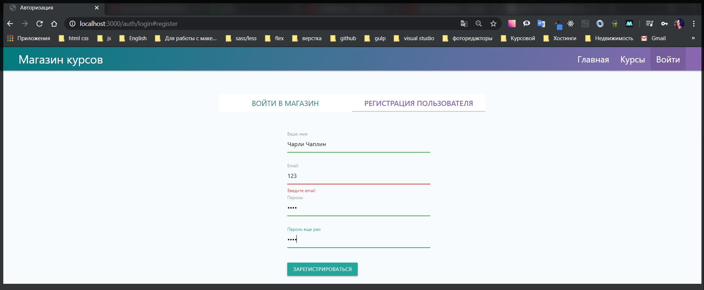
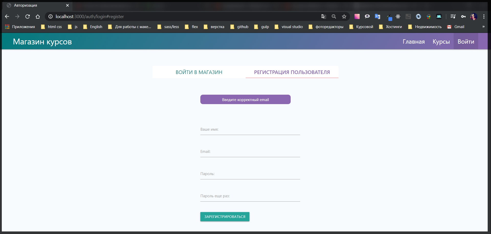
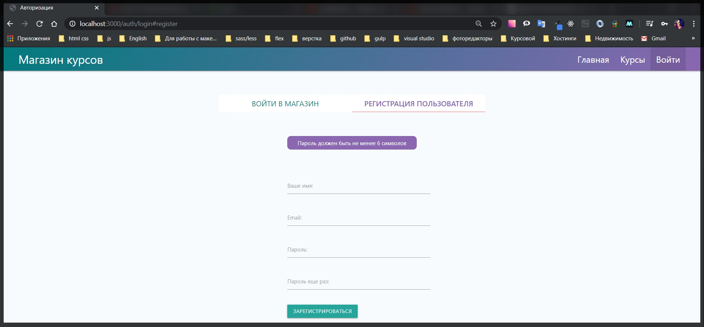
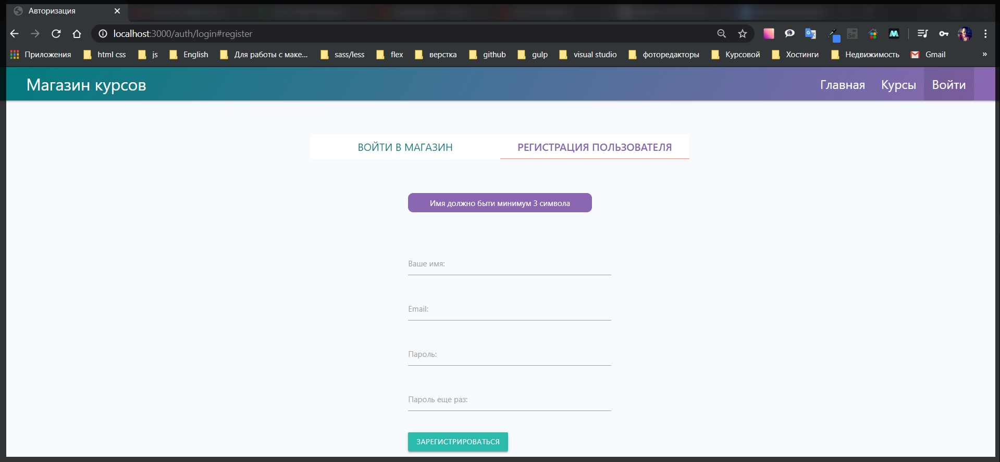
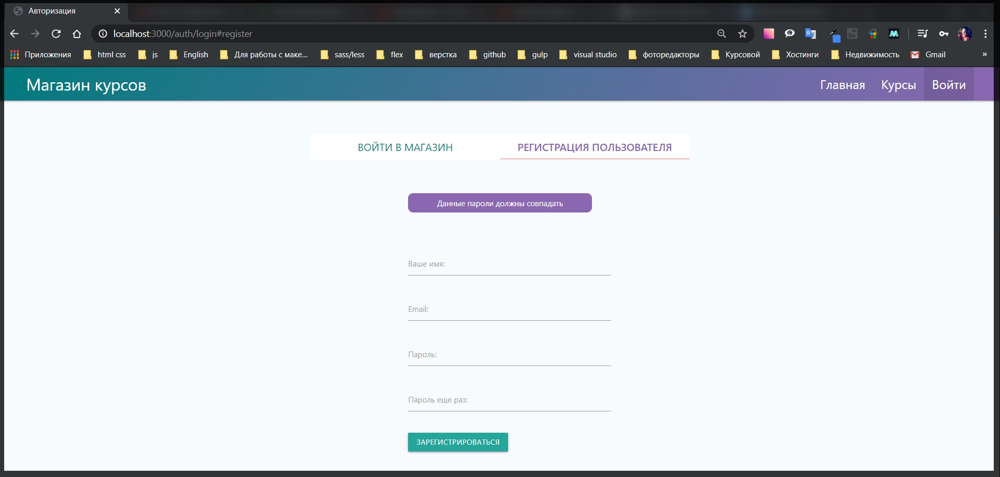
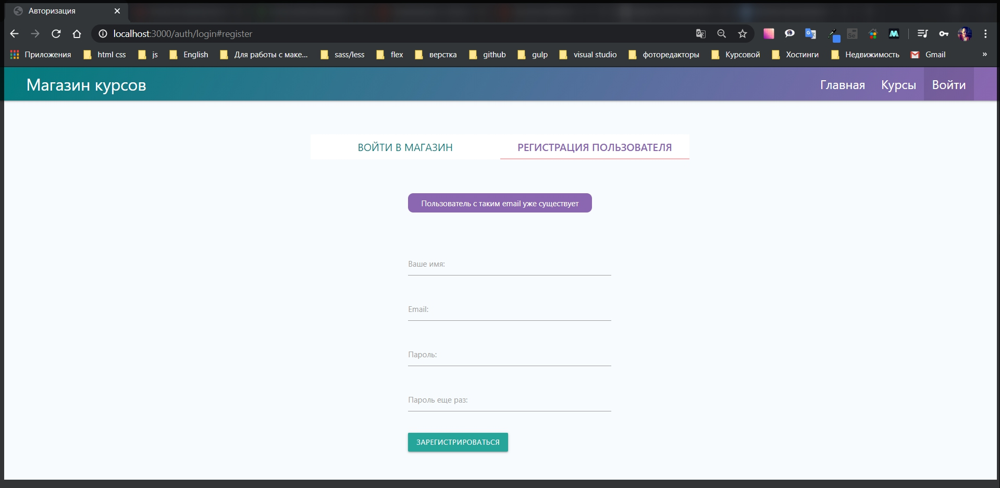

# Валидация регистрации

Если сейчас для каждых из полей такие **body('email').isEmail()** валидаторы, то все это будет очень сложно читаемо.
Поэтому лучшим решением будет вынесение таких валидаторов в отдельный файл. Для этого в папке **utils** я создам новый файл **validators.js**
И здесь так же импотрирую **const { body } = require('express-validator');**
и после этого я воспользуюсь полем **exporst** куда я буду экспортировать именованые объекты. И допустим для страницы регистрации объект будет называться **registerValidators =**. Полей у нас там достаточно много, поэтому я опишу данный объект как массив

```js
// utils validators.js

const { body } = require('express-validator');

exports.registerValidators = [];
```

И пока что сюда задам тот валидатор который я писал ранее.

```js
// utils validators.js

const { body } = require('express-validator');

exports.registerValidators = [body('email').isEmail()];
```

Валидаторы так же читаемы в массиве. **express** это понимает, и поэтому я этим пользуюсь.
В **auth.js** меняю **const { body, validationResult } = require('express-validator');** на **const { validationResult } = require('express-validator');** и для работоспособности прописываю путь до файла валидаторов **const { registerValidators } = require('../utils/validators');** и добавляю его как **midleware** в форму регистрации.

```js
// routes auth.js
const { Router } = require('express');
const bcrypt = require('bcryptjs');
const crypto = require('crypto');
const { validationResult } = require('express-validator');
const nodemailer = require('nodemailer');
const sendgrid = require('nodemailer-sendgrid-transport');
const User = require('../models/user');
const keys = require('../keys');
const regEmail = require('../emails/registration');
const resetEmail = require('../emails/reset');
const { registerValidators } = require('../utils/validators');
const router = Router();

const transporter = nodemailer.createTransport(
  sendgrid({
    auth: { api_key: keys.SENDGRID_API_KEY },
  })
);

router.get('/login', async (req, res) => {
  res.render('auth/login', {
    title: 'Авторизация',
    isLogin: true,
    loginError: req.flash('loginError'),
    registerError: req.flash('registerError'),
  });
});

router.get('/logout', async (req, res) => {
  req.session.destroy(() => {
    res.redirect('/auth/login#login');
  });
});

router.post('/login', async (req, res) => {
  try {
    const { email, password } = req.body;
    const candidate = await User.findOne({ email });

    if (candidate) {
      const areSame = await bcrypt.compare(password, candidate.password);

      if (areSame) {
        req.session.user = candidate;
        req.session.isAuthenticated = true;
        req.session.save((err) => {
          if (err) {
            throw err;
          }
          res.redirect('/');
        });
      } else {
        req.flash('loginError', 'Неверный пароль');
        res.redirect('/auth/login#login');
      }
    } else {
      req.flash('loginError', 'Такого пользователя не существует');
      res.redirect('/auth/login#login');
    }
  } catch (e) {
    console.log(e);
  }
});

router.post('/register', registerValidators, async (req, res) => {
  try {
    const { email, password, confirm, name } = req.body;
    const candidate = await User.findOne({ email });

    const errors = validationResult(req);
    if (!errors.isEmpty()) {
      req.flash('registerError', errors.array()[0].msg);
      return res.status(422).redirect('/auth/login#register');
    }

    if (candidate) {
      req.flash('registerError', 'Пользователь с таким email уже существует');
      res.redirect('/auth/login#register');
    } else {
      const hashPassword = await bcrypt.hash(password, 10);
      const user = new User({
        email,
        name,
        password: hashPassword,
        cart: { items: [] },
      });
      await user.save();
      await transporter.sendMail(regEmail(email));
      res.redirect('/auth/login#login');
    }
  } catch (e) {
    console.log(e);
  }
});

router.get('/reset', (req, res) => {
  res.render('auth/reset', {
    title: 'Забыли пароль?',
    error: req.flash('error'),
  });
});

router.get('/password/:token', async (req, res) => {
  if (!req.params.token) {
    return res.redirect('/auth/login');
  }

  try {
    const user = await User.findOne({
      resetToken: req.params.token,
      resetTokenExp: { $gt: Date.now() },
    });

    if (!user) {
      return res.redirect('/auth/login');
    } else {
      res.render('auth/password', {
        title: 'Восстановить доступ',
        error: req.flash('error'),
        userId: user._id.toString(),
        token: req.params.token,
      });
    }
  } catch (e) {
    console.log(e);
  }
});

router.post('/reset', (req, res) => {
  try {
    crypto.randomBytes(32, async (err, buffer) => {
      if (err) {
        req.flash('error', 'Что-то пошло не так, повторите попытку позже');
        return res.redirect('/auth/reset');
      }

      const token = buffer.toString('hex');
      const candidate = await User.findOne({ email: req.body.email });

      if (candidate) {
        candidate.resetToken = token;
        candidate.resetTokenExp = Date.now() + 60 * 60 * 1000;
        await candidate.save();
        await transporter.sendMail(resetEmail(candidate.email, token));
        res.redirect('/auth/login');
      } else {
        req.flash('error', 'Такого email нет');
        res.redirect('/auth/reset');
      }
    });
  } catch (e) {
    console.log(e);
  }
});

router.post('/password', async (req, res) => {
  try {
    const user = await User.findOne({
      _id: req.body.userId,
      resetToken: req.body.token,
      resetTokenExp: { $gt: Date.now() },
    });

    if (user) {
      user.password = await bcrypt.hash(req.body.password, 10);
      user.resetToken = undefined;
      user.resetTokenExp = undefined;
      await user.save();
      res.redirect('/auth/login');
    } else {
      req.flash('loginError', 'Время жизни токена истекло');
      res.redirect('/auth/login');
    }
  } catch (e) {
    console.log(e);
  }
});

module.exports = router;
```

Сейчас здесь **router.post('/register', registerValidators, async (req, res)** ничего добавлять не буду. При этом все валидаторы будут храниться в отдельном файле что очень удобно. Потому что я отдельно смогу следить за логикой их выполнения.

```js
// utils validators.js

const { body } = require('express-validator');

exports.registerValidators = [body('email').isEmail()];
```

Пришло время разобраться с сообщением которое выводится. Сейчас есть **invalid value** что впринцыпе не очень понятно пользователю.
Для того что бы задать сообщение есть по сути два варианта.
Первый вариант это вызвать метод **withMassage('Введите корректный email')**

```js
// utils validators.js

const { body } = require('express-validator');

exports.registerValidators = [
  body('email').isEmail().withMessage('Введите корректный email'),
];
```





И вот мы получаем красивое сообщение об ошибке которое четко дает понять пользователю что произошло.

Теперь добавим остальные валидаторы для других полей.
**body('password')** пароль должен быть минимальной длинны. Для этого я использую функцию **isLangth({})** в качестве объекта указываю **min: 6, max: 66**. Помимо этого я могу добавить валидатор **.isAlphanameric()** потомучто мы требуем пароль написанный латиницей и состоящий из цифр и букв.

```js
// utils validators.js

const { body } = require('express-validator');

exports.registerValidators = [
  body('email').isEmail().withMessage('Введите корректный email'),
  body('password').isLength({ min: 6, max: 70 }).isAlphanumeric(),
];
```

И вот второй способ вывода сообщения об ошибке, просто добавив второй параметр в **body**.



Что касается поля которое повторяет пароль. **body('confirm').** как нам проверить что бы данное поле совпадало с тем значением которое есть в пароле. Для этого я воспользуюсь кастомным валидатором который напишу самостоятельно. И вызывается он через функцию **.custom()** в данную функцию я передаю **callback** где буду писать логику данного валидатора. Данная функция принимает **(value)** которое написано в поле **confirm** И вторым параметром принимаем объект у которого есть поле **{req}**

```js
// utils validators.js

const { body } = require('express-validator');

exports.registerValidators = [
  body('email').isEmail().withMessage('Введите корректный email'),
  body('password', 'Пароль должен быть не менее 6 символов')
    .isLength({ min: 6, max: 70 })
    .isAlphanumeric(),

  body('confirm').custom((value, { req }) => {}),
];
```

И здесь что бы проверить валидатор просто добавляю проверку **if (value !== req.body.password)** если не совпадает то в таком случае я буду делать **thow new Error('Данные пароли не совпадают')**. А если пароли совпадают то возвращаю истину.

```js
// utils validators.js

const { body } = require('express-validator');

exports.registerValidators = [
  body('email').isEmail().withMessage('Введите корректный email'),
  body('password', 'Пароль должен быть не менее 6 символов')
    .isLength({ min: 6, max: 70 })
    .isAlphanumeric(),

  body('confirm').custom((value, { req }) => {
    if (value !== req.body.password) {
      throw new Error('Данные пароли должны совпадать');
    }
    return true;
  }),
];
```

Еще добавлю валидатор для имени.

```js
// utils validators.js

const { body } = require('express-validator');

exports.registerValidators = [
  body('email').isEmail().withMessage('Введите корректный email'),
  body('password', 'Пароль должен быть не менее 6 символов')
    .isLength({ min: 6, max: 70 })
    .isAlphanumeric(),

  body('confirm').custom((value, { req }) => {
    if (value !== req.body.password) {
      throw new Error('Данные пароли должны совпадать');
    }
    return true;
  }),
  body('name')
    .isLength({ min: 3 })
    .withMessage('Имя должно быти минимум 3 символа'),
];
```






