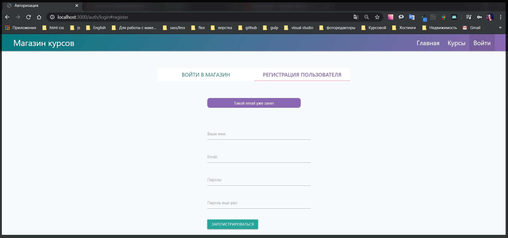

# Асинхронные вылидаторы

Сейчас задача сводится к тому что бы асинхронно валидировать какие - либо поля. И для этого, в библиотеке которую я использую присутствует подобный функционал.

Для этого в **utils validators.js** там где идет проверка **body('email').isEmail().withMessage('Введите корректный email')**, могу еще добавить кастомный валидатор **.custom((value, { req }) => {})**. В теле функции прописываю **try catch**, потому что работаю с асинхронными операциями, и саму **callback** делаю асинхронной для того что бы воспользоваться оператором **await** и проверить есть ли у нас такой пользователь в БД. И для начало я импортирую модель пользователя **const User = require('../models/user');**

```js
// utils validators.js

const { body } = require('express-validator');
const User = require('../models/user');

exports.registerValidators = [
  body('email')
    .isEmail()
    .withMessage('Введите корректный email')
    .custom(async (value, { req }) => {
      try {
      } catch (e) {
        console.log(e);
      }
    }),
  body('password', 'Пароль должен быть не менее 6 символов')
    .isLength({ min: 6, max: 70 })
    .isAlphanumeric(),

  body('confirm').custom((value, { req }) => {
    if (value !== req.body.password) {
      throw new Error('Пароли должны совпадать');
    }
    return true;
  }),
  body('name')
    .isLength({ min: 3 })
    .withMessage('Имя должно быти минимум 3 символа'),
];
```

И дальше по сути все очень просто. Мы создаем переменную **const user =** или может быть переменную **candidate**, и как обычно с помощью оператора **await** проверяю **User.findOne({email: req.body.email}),** но на самом деле лучше использовать не **req.body.email** оно конечно сработает. Но лучше использовать значение **value** которое я получаю в кастомном валидаторе. И дальше в этой функции мы должны вернуть промис потому что здесь операция асинхронная, она требует некоторого количества времени и поэтому здесь я проверяю. Если **if** есть какой - то пользователь **(user)** то это означает что человек уже не может зарегистрироваться, и поэтому я должен вернуть **return**, и так как мне нужно вернуть только ошибку промися я обращаюсь к глобальному классу **Promise** и вызывать у него метод который называется **reject('Такой email уже занят')**. И после этого валидаторы будут ждать когда **promise** завершиться и только после этого выдаст нам какой - то результат.

```js
// utils validators.js

const { body } = require('express-validator');
const User = require('../models/user');

exports.registerValidators = [
  body('email')
    .isEmail()
    .withMessage('Введите корректный email')
    .custom(async (value, { req }) => {
      try {
        const user = await User.findOne({ email: value });
        if (user) {
          return Promise.reject('Такой email уже занят');
        }
      } catch (e) {
        console.log(e);
      }
    }),
  body('password', 'Пароль должен быть не менее 6 символов')
    .isLength({ min: 6, max: 70 })
    .isAlphanumeric(),

  body('confirm').custom((value, { req }) => {
    if (value !== req.body.password) {
      throw new Error('Пароли должны совпадать');
    }
    return true;
  }),
  body('name')
    .isLength({ min: 3 })
    .withMessage('Имя должно быти минимум 3 символа'),
];
```

И теперь нам нужно упростить код в **routes auth.js в router.post('/register'.** Удаляю **const candidate = await User.findOne({ email });** потому что я его проверяю отдельно, в условии не нужно поле **confirm**.
Проверку

```js
if (candidate) {
      req.flash('registerError', 'Пользователь с таким email уже существует');
      res.redirect('/auth/login#register');
    } else {
```

таккже могу убрать. Оставляю код из блока **else**

```js
// routes auth.js
const { Router } = require('express');
const bcrypt = require('bcryptjs');
const crypto = require('crypto');
const { validationResult } = require('express-validator');
const nodemailer = require('nodemailer');
const sendgrid = require('nodemailer-sendgrid-transport');
const User = require('../models/user');
const keys = require('../keys');
const regEmail = require('../emails/registration');
const resetEmail = require('../emails/reset');
const { registerValidators } = require('../utils/validators');
const router = Router();

const transporter = nodemailer.createTransport(
  sendgrid({
    auth: { api_key: keys.SENDGRID_API_KEY },
  })
);

router.get('/login', async (req, res) => {
  res.render('auth/login', {
    title: 'Авторизация',
    isLogin: true,
    loginError: req.flash('loginError'),
    registerError: req.flash('registerError'),
  });
});

router.get('/logout', async (req, res) => {
  req.session.destroy(() => {
    res.redirect('/auth/login#login');
  });
});

router.post('/login', async (req, res) => {
  try {
    const { email, password } = req.body;
    const candidate = await User.findOne({ email });

    if (candidate) {
      const areSame = await bcrypt.compare(password, candidate.password);

      if (areSame) {
        req.session.user = candidate;
        req.session.isAuthenticated = true;
        req.session.save((err) => {
          if (err) {
            throw err;
          }
          res.redirect('/');
        });
      } else {
        req.flash('loginError', 'Неверный пароль');
        res.redirect('/auth/login#login');
      }
    } else {
      req.flash('loginError', 'Такого пользователя не существует');
      res.redirect('/auth/login#login');
    }
  } catch (e) {
    console.log(e);
  }
});

router.post('/register', registerValidators, async (req, res) => {
  try {
    const { email, password, name } = req.body;

    const errors = validationResult(req);
    if (!errors.isEmpty()) {
      req.flash('registerError', errors.array()[0].msg);
      return res.status(422).redirect('/auth/login#register');
    }

    const hashPassword = await bcrypt.hash(password, 10);
    const user = new User({
      email,
      name,
      password: hashPassword,
      cart: { items: [] },
    });
    await user.save();
    await transporter.sendMail(regEmail(email));
    res.redirect('/auth/login#login');
  } catch (e) {
    console.log(e);
  }
});

router.get('/reset', (req, res) => {
  res.render('auth/reset', {
    title: 'Забыли пароль?',
    error: req.flash('error'),
  });
});

router.get('/password/:token', async (req, res) => {
  if (!req.params.token) {
    return res.redirect('/auth/login');
  }

  try {
    const user = await User.findOne({
      resetToken: req.params.token,
      resetTokenExp: { $gt: Date.now() },
    });

    if (!user) {
      return res.redirect('/auth/login');
    } else {
      res.render('auth/password', {
        title: 'Восстановить доступ',
        error: req.flash('error'),
        userId: user._id.toString(),
        token: req.params.token,
      });
    }
  } catch (e) {
    console.log(e);
  }
});

router.post('/reset', (req, res) => {
  try {
    crypto.randomBytes(32, async (err, buffer) => {
      if (err) {
        req.flash('error', 'Что-то пошло не так, повторите попытку позже');
        return res.redirect('/auth/reset');
      }

      const token = buffer.toString('hex');
      const candidate = await User.findOne({ email: req.body.email });

      if (candidate) {
        candidate.resetToken = token;
        candidate.resetTokenExp = Date.now() + 60 * 60 * 1000;
        await candidate.save();
        await transporter.sendMail(resetEmail(candidate.email, token));
        res.redirect('/auth/login');
      } else {
        req.flash('error', 'Такого email нет');
        res.redirect('/auth/reset');
      }
    });
  } catch (e) {
    console.log(e);
  }
});

router.post('/password', async (req, res) => {
  try {
    const user = await User.findOne({
      _id: req.body.userId,
      resetToken: req.body.token,
      resetTokenExp: { $gt: Date.now() },
    });

    if (user) {
      user.password = await bcrypt.hash(req.body.password, 10);
      user.resetToken = undefined;
      user.resetTokenExp = undefined;
      await user.save();
      res.redirect('/auth/login');
    } else {
      req.flash('loginError', 'Время жизни токена истекло');
      res.redirect('/auth/login');
    }
  } catch (e) {
    console.log(e);
  }
});

module.exports = router;
```

Проверяю работоспособность.


