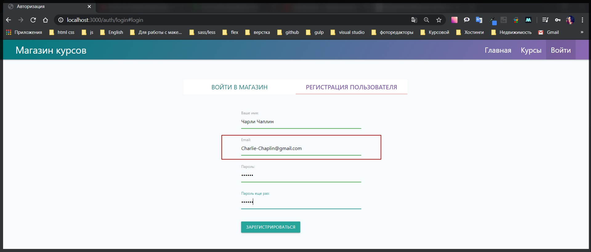
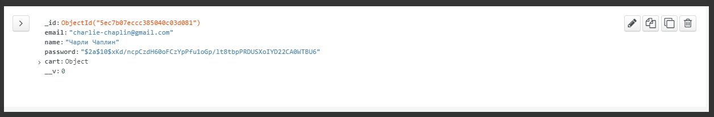

# Улучшение данных

Еще в библиотеке валидаторов присутствуют дополнительные функции которые позволяют улучшать данные перед тем как они поступят в БД. Опять же на сайте **github** то мы увидим поле [Senitizers](https://github.com/validatorjs/validator.js#sanitizers). **Senitizer** служит для того что бы чистить данные, защищать данные и т.д. Если например я буду использовать **escape(input)** или **unescape(input)**, то мы сможем защитить БД от каких нибудь злоумышленников.

И так где мы описываем валидаторы

```js
// utils validators.js

const { body } = require('express-validator');
const User = require('../models/user');

exports.registerValidators = [
  body('email')
    .isEmail()
    .withMessage('Введите корректный email')
    .custom(async (value, { req }) => {
      try {
        const user = await User.findOne({ email: value });
        if (user) {
          return Promise.reject('Такой email уже занят');
        }
      } catch (e) {
        console.log(e);
      }
    }),
  body('password', 'Пароль должен быть не менее 6 символов')
    .isLength({ min: 6, max: 70 })
    .isAlphanumeric(),

  body('confirm').custom((value, { req }) => {
    if (value !== req.body.password) {
      throw new Error('Пароли должны совпадать');
    }
    return true;
  }),
  body('name')
    .isLength({ min: 3 })
    .withMessage('Имя должно быти минимум 3 символа'),
];
```

После описания кастомного валидатора добавляю **.normalizeEmail()**

```js
// utils validators.js

const { body } = require('express-validator');
const User = require('../models/user');

exports.registerValidators = [
  body('email')
    .isEmail()
    .withMessage('Введите корректный email')
    .custom(async (value, { req }) => {
      try {
        const user = await User.findOne({ email: value });
        if (user) {
          return Promise.reject('Такой email уже занят');
        }
      } catch (e) {
        console.log(e);
      }
    })
    .normalizeEmail(),
  body('password', 'Пароль должен быть не менее 6 символов')
    .isLength({ min: 6, max: 70 })
    .isAlphanumeric(),

  body('confirm').custom((value, { req }) => {
    if (value !== req.body.password) {
      throw new Error('Пароли должны совпадать');
    }
    return true;
  }),
  body('name')
    .isLength({ min: 3 })
    .withMessage('Имя должно быти минимум 3 символа'),
];
```

И теперь если мы будем вписывать какой - нибудь кривой **email**, то данная функция исправит это за нас.

Что касается пароля я могу добавить **senitiser .trim()** который убирает лишние пробелы. Таже его можно добавить для поля проверки соответсвия пароля **confirm** и для поля **name**.

```js
// utils validators.js

const { body } = require('express-validator');
const User = require('../models/user');

exports.registerValidators = [
  body('email')
    .isEmail()
    .withMessage('Введите корректный email')
    .custom(async (value, { req }) => {
      try {
        const user = await User.findOne({ email: value });
        if (user) {
          return Promise.reject('Такой email уже занят');
        }
      } catch (e) {
        console.log(e);
      }
    })
    .normalizeEmail(),
  body('password', 'Пароль должен быть не менее 6 символов')
    .isLength({ min: 6, max: 70 })
    .isAlphanumeric()
    .trim(),

  body('confirm')
    .custom((value, { req }) => {
      if (value !== req.body.password) {
        throw new Error('Пароли должны совпадать');
      }
      return true;
    })
    .trim(),
  body('name')
    .isLength({ min: 3 })
    .withMessage('Имя должно быти минимум 3 символа')
    .trim(),
];
```


Если посмотреть в БД то можно увидеть что все отрабатывает корректно



Все перевелось в нижний регистр и нет лишних пробелов.