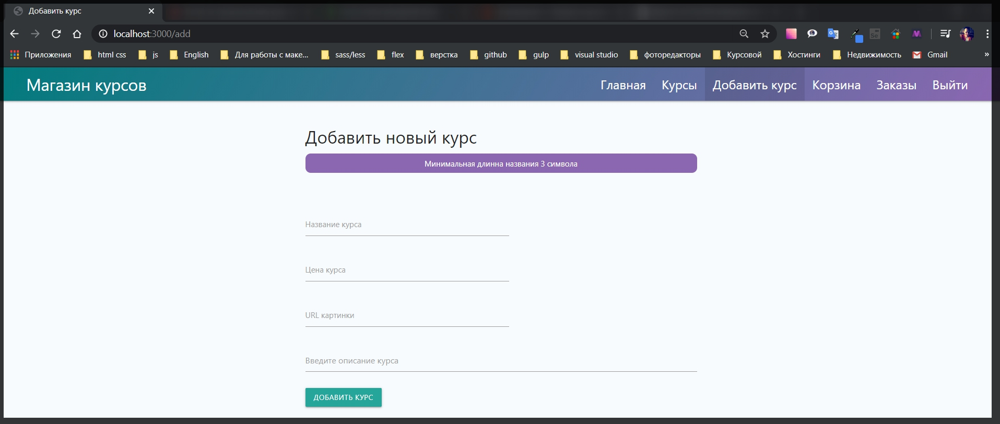
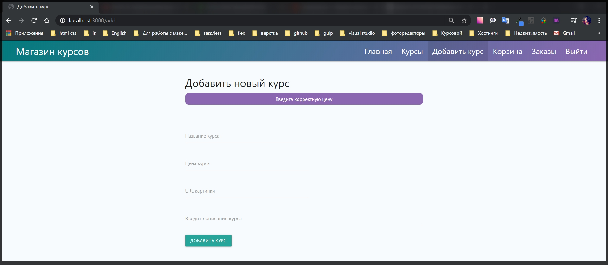
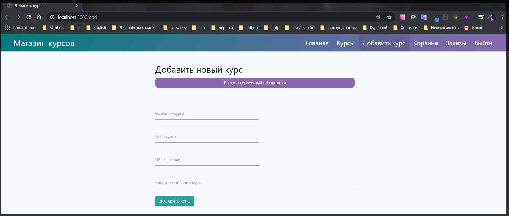
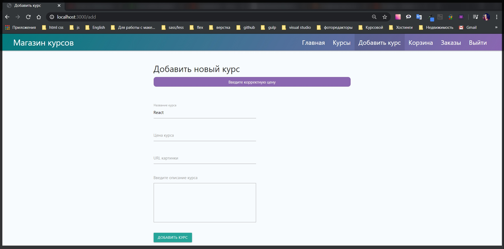
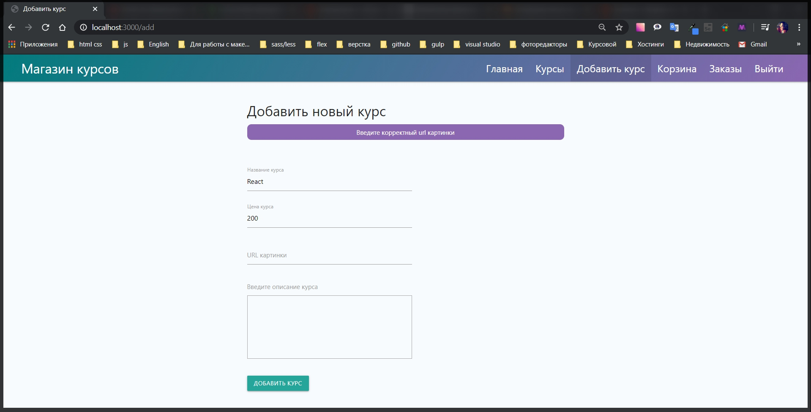
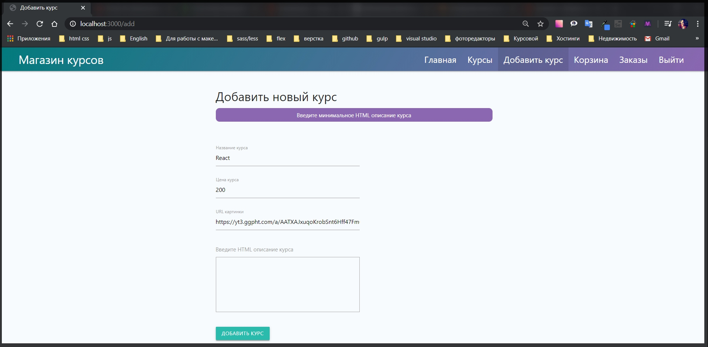

# Валидация курсов

У нас есть страница логина где нам так же необходимо добавить валидации. Но учитывая что здесь такие же поля. Однако пока я этого делать не буду т.к. если имя или пароль не совпадают он все равно не пустит. А предупреждение о минимальных вводимых символах я считаю излишним и что пароль должен быть не менее 6 - ти символов тожи лишним.

Я же сейчас попробую сделать немного продвинутую валидацию для формы добавления курсов.

Перехожу в **utils validators.js** и экспортирую новый валидатор **exports.courseValidators = [];** и здесь я буду описывать все валидаторы для формы **add.js**

```js
// utils validators.js

const { body } = require('express-validator');
const User = require('../models/user');

exports.registerValidators = [
  body('email')
    .isEmail()
    .withMessage('Введите корректный email')
    .custom(async (value, { req }) => {
      try {
        const user = await User.findOne({ email: value });
        if (user) {
          return Promise.reject('Такой email уже занят');
        }
      } catch (e) {
        console.log(e);
      }
    })
    .normalizeEmail(),
  body('password', 'Пароль должен быть не менее 6 символов')
    .isLength({ min: 6, max: 70 })
    .isAlphanumeric()
    .trim(),

  body('confirm')
    .custom((value, { req }) => {
      if (value !== req.body.password) {
        throw new Error('Пароли должны совпадать');
      }
      return true;
    })
    .trim(),
  body('name')
    .isLength({ min: 3 })
    .withMessage('Имя должно быти минимум 3 символа')
    .trim(),
];

exports.courseValidators = [];
```

Далее перехожу в **routes add.js** и подключаю данный валидатор **const { courseValidators } = require('../utils/validators');** Далее добавляю их для формы после **midleware auth**

```js
// routes add.js

const { Router } = require('express');

const Course = require('../models/course');
const auth = require('../middleware/auth');
const { courseValidators } = require('../utils/validators');

const router = Router();

router.get('/', auth, (req, res) => {
  res.render('add', {
    title: 'Добавить курс',
    isAdd: true,
  });
});

router.post('/', auth, courseValidators, async (req, res) => {
  const course = new Course({
    title: req.body.title,
    price: req.body.price,
    img: req.body.img,
    description: req.body.description,
    userId: req.user,
  });

  try {
    await course.save();
    res.redirect('/courses');
  } catch (e) {
    console.log(e);
  }
});

module.exports = router;
```

И здесь так же создание курса придется перенести ниже пока мы не проверим на ошибки. Для проверки неоюходимо импортировать функцию **const { validationResult } = require('express-validator');**

Далее создаю переменную **const errors = validationResult(req);**

И далее как обычно проверяем если **if** ничего нет в **(!errors.isEmpry())** если она вернет значение **false**, то в таком случае я буду делать **return** далее буду обращаться к объекту **res.status(422)** и далее вместо того что бы делать **redirect** я вызываю метод **.render('add'{})** мы будем рендерить страницу **add** и в **{}** передаю параметры. Добавляю из **router.get** параметры которые буду рендерить **title: 'Добавить курс',isAdd: true,** и третьим параметром укажу ошибку если она есть

```js
// routes add.js

const { Router } = require('express');
const { validationResult } = require('express-validator');
const Course = require('../models/course');
const auth = require('../middleware/auth');
const { courseValidators } = require('../utils/validators');

const router = Router();

router.get('/', auth, (req, res) => {
  res.render('add', {
    title: 'Добавить курс',
    isAdd: true,
  });
});

router.post('/', auth, courseValidators, async (req, res) => {
  const errors = validationResult(req);
  if (!errors.isEmpty()) {
    return res.status(422).render('add', {
      title: 'Добавить курс',
      isAdd: true,
      error: errors.array()[0].msg,
    });
  }

  const course = new Course({
    title: req.body.title,
    price: req.body.price,
    img: req.body.img,
    description: req.body.description,
    userId: req.user,
  });

  try {
    await course.save();
    res.redirect('/courses');
  } catch (e) {
    console.log(e);
  }
});

module.exports = router;
```

Теперь в **add.hbs** добавляю

```
 <p class="alert">{{error}}</p>
```

и так же с помощью **handlebars** проверю если есть такой объект, если нет то ничего мы делать не будем.

```handlebars
<div class="row">
  <h1>Добавить новый курс</h1>

  {{#if error}}
  <p class="alert">{{error}}</p>
  {{/if}}

  <form class="form" action="/add" method="POST">
    <div class="input-field">
      <input id="title" name="title" type="text" class="validate" required />
      <label for="title">
        Название курса
      </label>
      <span class="helper-text" data-error="Введите название курса"></span>
    </div>
    <div class="input-field">
      <input id="price" name="price" type="number" class="validate" required min="1" />
      <label for="price">
        Цена курса
      </label>
      <span class="helper-text" data-error="Введите цену"></span>
    </div>
    <div class="input-field">
      <input id="img" name="img" type="text" class="validate" required />
      <label for="img">
        URL картинки
      </label>
      <span class="helper-text" data-error="Введите url картинки"></span>
    </div>

    <class class="input-field">
      <textarea id="description" name="description" class="materialize-textarea">Введите описание курса</textarea>
      <label for="description"></label>
      <span class="helper-text" data-error="Введите описание курса"></span>
    </class>

    <input type="hidden" name="_csrf" value="{{csrf}}">

    <button class="btn btn-primary">Добавить курс</button>
  </form>
</div>
```

Теперь нужно дописать **courseValidators**. Во - первых у нас есть поля **title price** и **img**.

```js
// utils validators.js

const { body } = require('express-validator');
const User = require('../models/user');

exports.registerValidators = [
  body('email')
    .isEmail()
    .withMessage('Введите корректный email')
    .custom(async (value, { req }) => {
      try {
        const user = await User.findOne({ email: value });
        if (user) {
          return Promise.reject('Такой email уже занят');
        }
      } catch (e) {
        console.log(e);
      }
    })
    .normalizeEmail(),
  body('password', 'Пароль должен быть не менее 6 символов')
    .isLength({ min: 6, max: 70 })
    .isAlphanumeric()
    .trim(),

  body('confirm')
    .custom((value, { req }) => {
      if (value !== req.body.password) {
        throw new Error('Пароли должны совпадать');
      }
      return true;
    })
    .trim(),
  body('name')
    .isLength({ min: 3 })
    .withMessage('Имя должно быти минимум 3 символа')
    .trim(),
];

exports.courseValidators = [
  body('title')
    .isLength({ min: 3 })
    .withMessage('Минимальная длинна названия 3 символа')
    .trim(),
  body('price').isNumeric().withMessage('Введите корректную цену'),
  body('img', 'Введите корректный url картинки').isURL(),
  body('description')
    .isLength({ min: 10 })
    .withMessage('Введите минимальное описание курса'),
];
```





Но сейчас есть определенная проблема с этой формой. Если я введу все данные кроме адреса картинки и нажму добавить курс У меня все форма стирается при этом сообщение остается.



Идея заключается в том что каждый раз когда у нас есть какие - нибудь ошибки все данные формы у нас уходят. Мы теряем много времени при написании таких форм.
Есть один метод который позволит данной ошибки избежать. Перехожу в **routes add.js** и здесь где мы заново рендерим эту страницу

```js
 if (!errors.isEmpty()) {
    return res.status(422).render('add', {
      title: 'Добавить курс',
      isAdd: true,
      error: errors.array()[0].msg,
    });
```

И помимо передачи ошибки я могу передать объект **data:{}** и в этот объект я передаю все те объекты которые сейчас отправлял на сервер

```js
router.post('/', auth, courseValidators, async (req, res) => {
  const errors = validationResult(req);
  if (!errors.isEmpty()) {
    return res.status(422).render('add', {
      title: 'Добавить курс',
      isAdd: true,
      error: errors.array()[0].msg,
      data: {
        title: req.body.title,
        price: req.body.price,
        img: req.body.img,
        description: req.body.description,
      },
    });
  }
```

Теперь в **views add.hbs** я могу воспользоватся данными полями. В **input - ах** прописать атрибут **value="{{data.title}}"** и такой атрибут пропишем каждому из **input**.

```js
<div class="row">
  <h1>Добавить новый курс</h1>

  {{#if error}}
  <p class="alert">{{error}}</p>
  {{/if}}

  <form class="form" action="/add" method="POST" novalidate>
    <div class="input-field">
      <input id="title" name="title" type="text" class="validate" required  value="{{data.title}}"/>
      <label for="title">
        Название курса
      </label>
      <span class="helper-text" data-error="Введите название курса"></span>
    </div>
    <div class="input-field">
      <input id="price" name="price" type="number" class="validate" required min="1" value="{{data.price}}"/>
      <label for="price">
        Цена курса
      </label>
      <span class="helper-text" data-error="Введите цену"></span>
    </div>
    <div class="input-field">
      <input id="img" name="img" type="text" class="validate" required value="{{data.img}}"/>
      <label for="img">
        URL картинки
      </label>
      <span class="helper-text" data-error="Введите url картинки"></span>
    </div>

    <div class="description">
      <label for="description" class="description-textarea-label">Введите описание курса</label>
      <textarea class="description-textarea" name="description"  value="{{{data.description}}}" required></textarea>

      <span class="helper-text" data-error="Введите описание курса"></span>
    </div>

    <input type="hidden" name="_csrf" value="{{csrf}}">

    <button class="btn btn-primary">Добавить курс</button>
  </form>
</div>
```

т.е. если таких полей **value="{{data...}}** у нас не будет, то и **handlebars** ничего выводить не будет.








Что еще здорово так это то что у нас готов курс валидаторов что у нас готов **courseValidators**. Мы так жи их можем использовать и для редактирования курса.

**routes courses.js** подключаю валидатор **const {courseValidators} = require('../utils/validators');**и теперь я его могу использовать там где происходит редактирование. После **auth** добавляю **courseValidators**. Ну и так же нужно добавить сообщение об ошибке.
Для этого импортирую **const { validationResult } = require('express-validator');** и логику немного меняю

```js
const errors = validationResult(req);
const { id } = req.body;
if (!errors.isEmpty()) {
  return res.status(422).redirect(`/courses/${id}/edit?allow=true`);
}
```

Весь файл

```js
// courses.js

const { Router } = require('express');
const { validationResult } = require('express-validator');
const Course = require('../models/course');
const auth = require('../middleware/auth');
const { courseValidators } = require('../utils/validators');
const router = Router();

function isOwner(course, req) {
  return course.userId.toString() === req.user._id.toString();
}

router.get('/', async (req, res) => {
  try {
    const courses = await Course.find()
      .populate('userId', 'email name')
      .select('price title img');

    res.render('courses', {
      title: 'Курсы',
      isCourses: true,
      userId: req.user ? req.user._id.toString() : null,
      courses,
    });
  } catch (e) {
    console.log(e);
  }
});

router.get('/:id/edit', auth, async (req, res) => {
  if (!req.query.allow) {
    return res.redirect('/');
  }

  try {
    const course = await Course.findById(req.params.id);
    if (!isOwner(course, req)) {
      return res.redirect('/courses');
    }

    res.render('course-edit', {
      title: `Редактировать ${course.title}`,
      course,
    });
  } catch (e) {
    console.log(e);
  }
});

router.post('/edit', auth, courseValidators, async (req, res) => {
  const errors = validationResult(req);
  const { id } = req.body;
  if (!errors.isEmpty()) {
    return res.status(422).redirect(`/courses/${id}/edit?allow=true`);
  }
  try {
    delete req.body.id;
    const course = await Course.findById(id);
    if (!isOwner(course, req)) {
      return res.redirect('/courses');
    }
    Object.assign(course, req.body);
    await course.save();
    res.redirect('/courses');
  } catch (e) {
    console.log(e);
  }
});

router.post('/remove', auth, async (req, res) => {
  try {
    await Course.deleteOne({
      _id: req.body.id,
      userId: req.user._id,
    });
    res.redirect('/courses');
  } catch (e) {
    console.log(e);
  }
});

router.get('/:id', async (req, res) => {
  try {
    const course = await Course.findById(req.params.id);
    res.render('course', {
      layout: 'empty',
      title: `Курс ${course.title}`,
      course,
    });
  } catch (e) {
    console.log(e);
  }
});

module.exports = router;
```

Теперь после этого в редактировании ошибки выводится не будут. Однако при не заполнении одной из форм курс добавляться не будет. Страница будет перезагружаться и оставлять те поля которые были заполнены.
